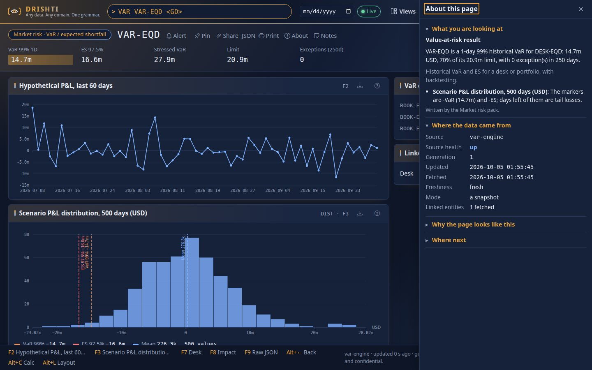
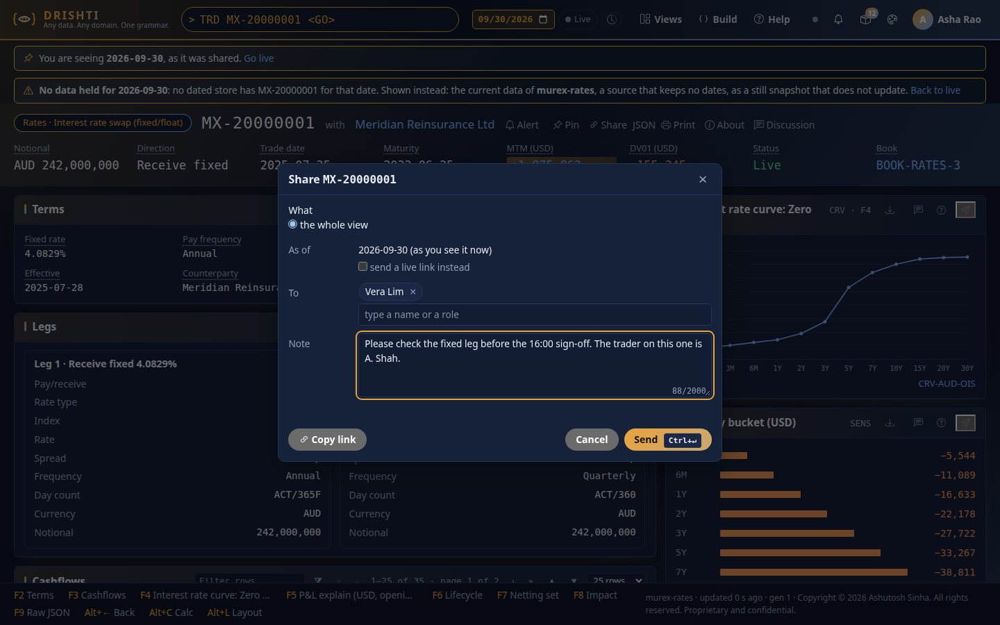
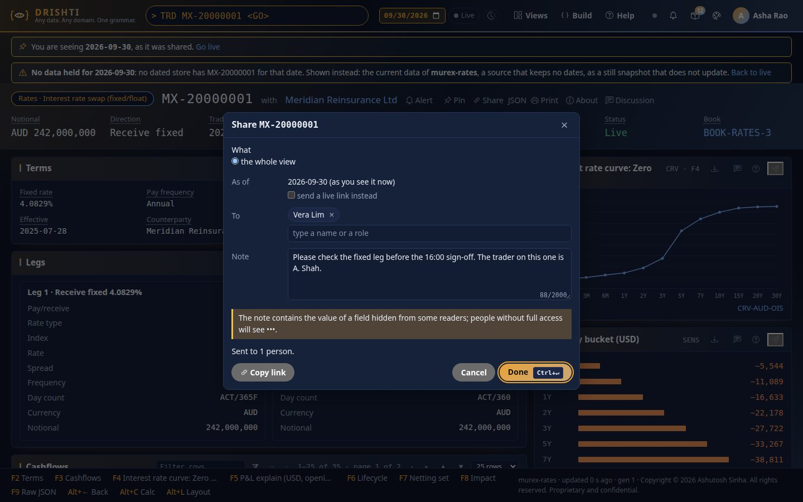
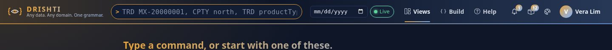
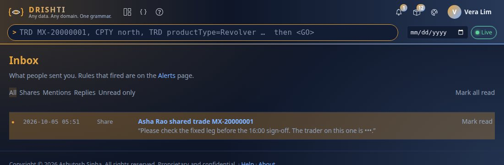
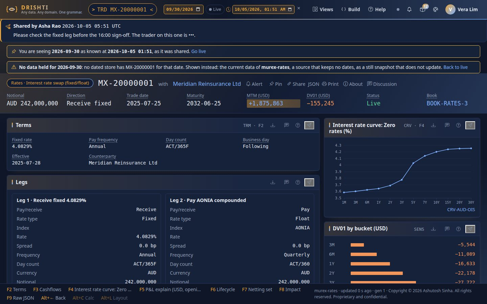
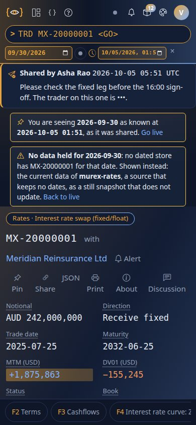
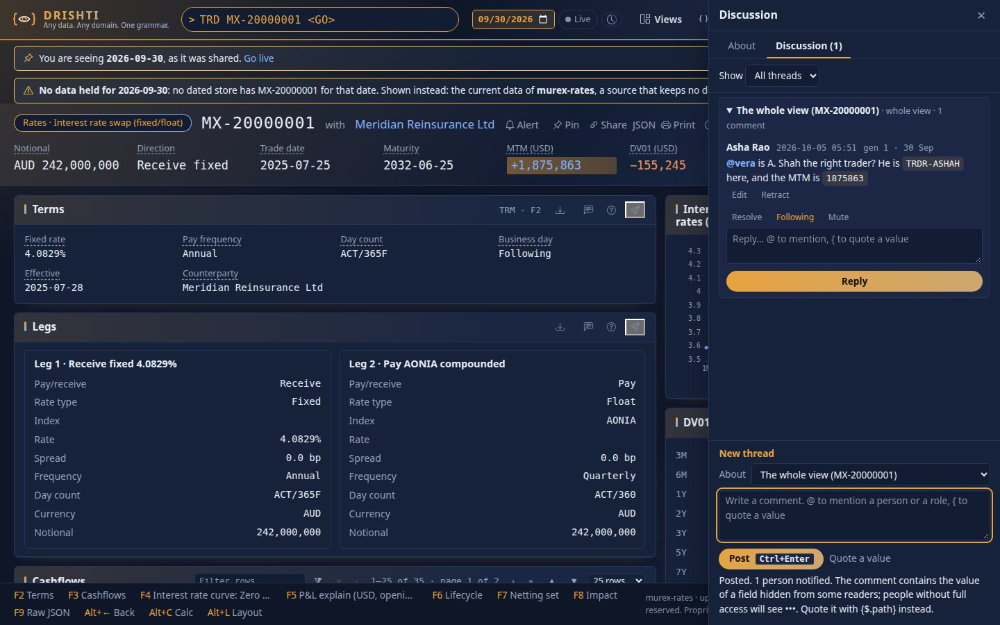
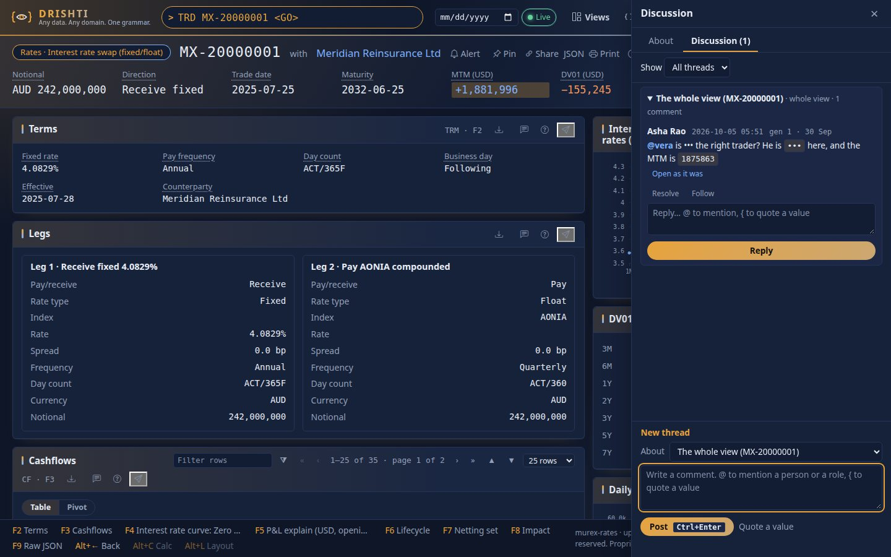
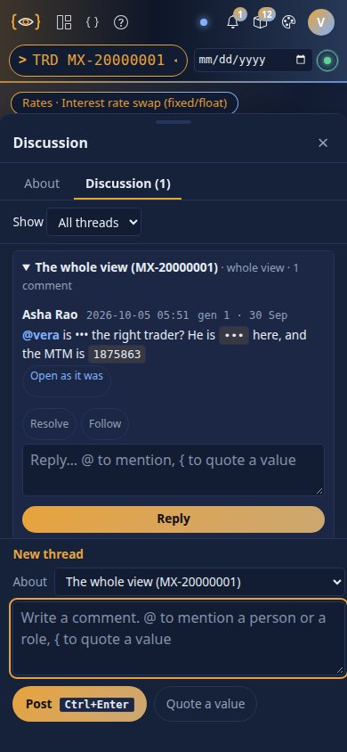

<!--
  Project Drishti · Any data. Any domain. One grammar.

  Copyright (c) 2026 Ashutosh Sinha <ajsinha@gmail.com>.
  All rights reserved.

  PROPRIETARY AND CONFIDENTIAL.

  This file is the confidential and proprietary property of Ashutosh Sinha.
  Unauthorised copying, use, modification, distribution or disclosure of this
  file, via any medium, is strictly prohibited except with the express prior
  written permission of the copyright holder.

  See the LICENSE file in the root of this repository for the full terms.
-->
# How Drishti fits together

*For someone new to Drishti who wants the whole working in one read: how a data store, a pack and a Sutra relate, and
what happens between typing `TRD MX-20000001` and a live screen.* Every path, key, endpoint and output below is real:
the files are in this repository and the outputs were captured from a server started with the QUICKSTART packs
(`market-risk`, `counterparty-risk`, `liquidity-risk`, `climate-risk`, `operational-risk`, `retail-banking`,
`genomics`, `politics-society`, `economics`) on `http://localhost:18480`. Values that tick (MTM, generation) will
differ when you try it.

## Contents

1. [The one-page picture](#1-the-one-page-picture)
2. [The pieces and how they refer to each other](#2-the-pieces-and-how-they-refer-to-each-other)
3. [Worked example A: a trade, end to end](#3-worked-example-a-a-trade-end-to-end) (3.9: [About this page, end to end](#39-about-this-page-end-to-end); 3.10: [Share and Discussion, end to end](#310-share-and-discussion-end-to-end))
4. [Worked example B: a gene variant, another domain](#4-worked-example-b-a-gene-variant-another-domain)
5. [What happens without a Sutra](#5-what-happens-without-a-sutra)
6. [How a new screen gets made today](#6-how-a-new-screen-gets-made-today)
7. [Where to change what](#7-where-to-change-what)
8. [Glossary and further reading](#8-glossary-and-further-reading)

---

## 1. The one-page picture

Drishti draws a screen for any record. The record comes from a **store** (through a **connector**), is matched to a
**Sutra** (a layout), and is bound into a **ViewModel**: plain JSON that the browser draws. Nothing is coded per
product. Packs and Sutras are configuration read when the server starts (Sutras are re-read when a file changes).

```
 BROWSER   typing "TRD MX-20000001 <GO>"; draws panels; receives live patches
    |  HTML pages + one SSE channel per browser
    v
 CONSOLE   drishti-console/  (Python, FastAPI + Jinja2, port 17480)
    |      drishti-console/routes/terminal_routes.py (/go, /v/...), drishti-console/core/backend.py (a thin client)
    |      drishti-console/web/templates (_macros/panels.html) + drishti-console/web/static/js (command.js, live.js, ...)
    |  REST + SSE under /api/v1, ViewModel JSON
    v
 SERVER    drishti-server/  (Java 21+, Spring Boot, port 18480)
    |      controllers: CommandController, ViewController, ExplainController, StreamController, DesignController, ...
    |                   ShareController, InboxController, ThreadController (collaboration: below)
    v
 ENGINE    drishti-engine/ ViewPipeline            (and ExplainService: the same pipeline asked "why", for About this page)
    |       command -> fetch -> match -> fingerprint -> layout -> link -> bind
    |          |         |        |                        |                |
    |          |         |        |                        |                +-- Binder (drishti-engine)
    |          |         |        |                        +-- LayoutMerger + InferenceEngine (drishti-inference)
    |          |         |        +-- SutraMatcher + SutraRegistry (drishti-rachana)
    |          |         +-- SourceRouter (drishti-engine)
    |          +-- CommandParser (mnemonics, id patterns)
    |                    |
    |                    v
    |   CONNECTORS  plugins/drishti-plugin-*  (SourcePlugin interface in drishti-api)
    |     demo (pack samples, ticking) | delta | jdbc | kafka | file | s3 | rest | redis | ...
    |                    |
    |                    v
    |   STORES   Delta Lake folders under data/delta/<domain>/<kind>/business_date=...,
    |            databases, queues, files, services
    |
    +-- CONFIGURATION loaded at start
    |     packs/<name>/pack.yaml   kinds, mnemonics, links, connectors, routes, roles
    |     packs/<name>/sutras/**   the layouts      packs/<name>/samples/**   example documents
    |     packs/<name>/config/about.yaml   what each kind and field means (About this page)
    |     drishti-server/src/main/resources/application.yaml   drishti.sources, drishti.rachana, ...
    |
 COLLAB    people talking about a view: drishti-server/.../collab  ShareService, ThreadService, InboxService, Audience, NoteText,
           CommentRenderer, Notifier (InAppNotifier, EmailNotifier -> OutboxDispatcher), CollabPurge, ExportService; the
           records are in drishti-identity/.../collab (ShareStore, InboxStore, OutboxStore, ThreadStore, HoldStore, HashChain),
           in the identity database. The console draws the Share dialog, the bell and inbox, and the Discussion tab.
 BUILD     the Build workbench (console /build, server DesignController / GovernanceController)
           makes new Sutras and proposes them; an approved Sutra is saved into the registry
           (SutraRegistry) and the next view uses it.
```

**Collaboration** sits beside the pipeline, not in it: a share or a comment stores a person's words and a *pin* (which data they were looking at),
and everything a reader is shown is computed for that reader, when they look, by the same `Entitlements` and the same view pipeline. Section 3.10 follows
one share and one comment end to end.

The Maven modules: `drishti-api` (the plugin interface and shared types), `drishti-engine` (pipeline, router, binder),
`drishti-rachana` (the grammar, parser, matcher, registry), `drishti-inference` (layouts from the shape of data),
`drishti-packs` (pack loading), `drishti-server` (HTTP, security, governance), `plugins/*` (one connector each).
The UI is the separate Python project in `drishti-console/`. The full module list is in
[ARCHITECTURE.md §13](ARCHITECTURE.md#13-module-layout-java).

---

## 2. The pieces and how they refer to each other

| Piece | What it is | Where it lives |
|---|---|---|
| **Kind** | A type of record: `trade`, `netting-set`, `variant`. | Named in `pack.yaml` `kinds:` |
| **Entity id** | The name of one record of a kind: `MX-20000001`. An entity is `(kind, id)`. | In the data; recognised by `graph.id-patterns` |
| **Mnemonic** | The short command for a kind: `TRD` for `trade`. | `pack.yaml` `mnemonics:` |
| **Pack** | A folder `packs/<name>/` that adds a domain: kinds, mnemonics, links, connectors, Sutras, samples, roles. | `packs/<name>/pack.yaml` |
| **Connector** | A named instance of a source plugin: which plugin, its settings, which kinds it serves. | `pack.yaml` `connectors:` or `drishti.sources.connectors` |
| **Source plugin** | The code that reads one kind of store (`delta`, `kafka`, `jdbc`, `demo`, ...). | `plugins/drishti-plugin-*` |
| **Sutra** | One layout, written in the Rachana grammar: which records it fits, a title, a strip, panels, keys. | `packs/<name>/sutras/**.sutra.yaml` |
| **Link** | A field that names another entity, so it opens that entity's own view. | `graph.fields` in `pack.yaml`; `link(...)` in a Sutra |
| **Role / mask** | Who may open which kinds, and which fields read `•••`. | `pack.yaml` `roles:`; `drishti.security.redact` |
| **About text** | The pack's own words for a kind (one sentence about this entity) and for its fields (term, meaning, unit, sign), shown in the About drawer. | `packs/<name>/config/about.yaml` (`pack.yaml` key `about:`) |
| **Share** | A person's note about a view or a panel, sent to people and roles, with a pin. Not a copy of data: a link plus words. | `drishti_share`, `ShareService`; opened at `/share/sh_…` |
| **Pin** | Which data a share or comment was about: business date, "known at", generation, source. Evidence, never an address; the view opens at the date and "known at" as request parameters. | `Pin`; the link's `asOf`, `knownAt`, `gen` |
| **Notice** | One row in a person's inbox (share, mention, reply), pushed to the bell. Titles and excerpts are rendered for the reader each time. | `InboxStore`, `InboxService`, `InboxHub`, SSE event `notice` |
| **Thread, comment** | A conversation anchored to a view, a panel or a field; each edit is a hash-chained revision. | `CommentThread`, `Comment`, `Revision`, `ThreadService`, `HashChain` |
| **Hold** | A legal hold: a scope (entity, kind, user, thread, all) that retention may not purge. | `Hold`, `HoldService`, `CollabPurge` |

How they point at each other:

| From | To | By what key |
|---|---|---|
| Typed command `TRD MX-20000001` | a kind | the mnemonic `TRD` (`mnemonics:` of any enabled pack) |
| An id typed alone (`MX-20000001`) | a kind | `graph.id-patterns` (`^(MX\|CLY\|END\|IMG\|BBG\|WSS)-\d+$` is `trade`) |
| A pack | other packs | `extends:` (`market-risk` extends `market-data` and `trading`, so a server running `market-risk` also serves `trade`) |
| A kind | the connector that holds it | the connector's `kinds:` list, and `routes:` (kind to connector name; becomes `drishti.sources.routes.<kind>`) |
| A connector | its plugin and store | `plugin:` (`delta`) and `settings:` (`root`, `domain`) |
| A document | its Sutra | the Sutra's `match: { kind: ..., where: ..., priority: ... }`; the highest priority whose `where` holds wins |
| A Sutra panel | the document's values | `$.path` expressions (`bind: $.terms.fixedRate`) with `fmt:` formats; inside a row list `@.field` |
| A Sutra | another entity | `link($.counterparty.id, 'counterparty', ...)` and `keys: { F7: "link($.nettingSet, 'netting-set')" }`: the second argument is a kind |
| A document field | another entity | `graph.fields` (a field named `tradeIds` holds ids of kind `trade`) |
| A chart panel | another entity's data | `source: "link($.discountCurve, 'ir-curve')"` fetches that entity and plots its rows |
| A caller | what they may see | `roles:` (`kinds:`, `raw:`) and `drishti.security.redact` (field names) |
| A kind | the words that explain it | `kinds.<kind>` of an `about.yaml` in the pack or a pack it `extends:` (most specific wins); the glossary is keyed by field path |
| A share or a comment | the data it is about | its `Pin`: `asOf`, `knownAt`, generation (opened as request parameters, never the reader's saved date) |
| A recipient or reader | what they are shown of it | `Entitlements.mayReach` at delivery, the reader's masks at every read (`NoteText.render`, `CommentRenderer`), `maskedValues` at write |
| A Sutra | its pack | the folder (`sutras: sutras` in `pack.yaml`); extra site Sutras in `drishti.rachana.dirs` |

Two rules hold the whole thing together. A **kind** is the only thing a store, a Sutra and a command have in common:
the connector says "I hold kind X", the Sutra says "I draw kind X", the mnemonic says "this word means kind X". And a
Sutra never says where data comes from; a connector never says how data looks.

---

## 3. Worked example A: a trade, end to end

### 3.1 The pack declares the kind and the mnemonic

`packs/trading/pack.yaml` (the `trading` pack is pulled in by `market-risk` through `extends:`):

```yaml
pack: trading
code: TRDS
kinds:
- trade
- desk-pnl
sutras: sutras
mnemonics:
  TRD:
    kind: trade
    label: Trade
graph:
  id-patterns:
  - pattern: ^(MX|CLY|END|IMG|BBG|WSS)-\d+$
    kind: trade
```

So `TRD` means `trade`, and `MX-20000001` alone is recognised as a trade.

### 3.2 The connector serves the kind

In the same file:

```yaml
connectors:
  trading-store:
    plugin: delta
    enabled: ${DRISHTI_LAKE_ENABLED:true}
    kinds:
    - trade
    settings:
      root: ${DRISHTI_DELTA_ROOT:./data/delta}
      domain: trading
```

`trading-store` is the `delta` plugin reading Delta Lake tables under `./data/delta/trading/trade/business_date=...`
(four dated folders on this machine, from 2026-09-28). `GET /api/v1/sources` confirms it: `"name":"trading-store",
"kinds":["trade"],"live":false`. The pack also declares `trading-stream` (a Kafka connector for live ticks), which is
off unless `DRISHTI_STREAM_TRADING=true`.

A second source also serves trades. `drishti.sources.default-route: demo` in `application.yaml` names the **demo**
plugin, which serves the sample documents in every enabled pack's `samples/` folder
(`packs/trading/samples/trade/MX-20000001.json` is one) and makes their numbers tick. Together:

| You ask for | Answered by | Evidence in the view's `provenance` |
|---|---|---|
| Today's trade (the default) | `demo`, because a live source is asked first (`SourceRouter.liveFirst`) | `"source":"murex-rates","live":true,"businessDate":null` (`murex-rates` is the originating system recorded in the sample's `_meta`) |
| A past business date (`?asOf=2026-09-30`) | `trading-store`, the dated Delta table | `"source":"trading-store","live":false,"businessDate":"2026-09-30"` |

In production you would turn the demo plugin off (`DRISHTI_DEMO_ENABLED=false`) and `trading-store` (and the Kafka
stream) would answer for today too. The order in which sources are asked is decided in
`drishti-engine/src/main/java/com/ash/drishti/engine/source/SourceRouter.java`: `candidates()` (the kind's route, then
the default route, then any plugin that serves the kind), `readOrder()` and `liveFirst()`, and `readFirst()` (the first
source that holds the entity answers; one that fails stops the read, so another store's data is never shown in its
place).

### 3.3 The Sutra that draws it

125 Sutras in `packs/trading/sutras/` match kind `trade`, one per product, all at priority 10, each with a `where`
that picks its product. The one for `MX-20000001` is `packs/trading/sutras/rates/irs-fixfloat.v1.sutra.yaml`:

```yaml
rachana: 1
sutra: irs-fixfloat
version: 1
match: { kind: trade, where: "$.productType == 'IRS_FIXFLOAT'", priority: 10 }
title: { pill: Rates · Interest rate swap (fixed/float), id: $.tradeId, with: "link($.counterparty.id, 'counterparty', $.counterparty.name)" }
strip:
  - { label: Notional, bind: "$.currency + ' ' + fmt($.notional, 'amount0')" }
  - { label: MTM (USD), bind: $.mtm, fmt: signed0, tone: sign, emphasis: true }
  ...
panels:
  - id: terms
    kind: kv
    title: Terms
    code: TRM
    key: F2
    columns:
      - { label: Fixed rate, bind: $.terms.fixedRate, fmt: pct4 }
      ...
  - id: sensitivities
    kind: hbar
    area: right
    rows: $.sensitivities
    label: bucket
    value: dv01
keys: { F7: "link($.nettingSet, 'netting-set')", F8: impact, F9: raw }
```

**Why this Sutra and no other.** `SutraRegistry.forKind("trade")` lists the Sutras of the kind, highest `priority`
first and then by name. `SutraMatcher.match()` walks that list and returns the first whose `where` is true for the
document. This document has `"productType":"IRS_FIXFLOAT"`, so only `irs-fixfloat` is true. A Sutra with no `where`
matches every document of its kind, which is how you write a catch-all (give it a lower priority).

### 3.4 The document

`GET /api/v1/entities/trade/MX-20000001/raw`, trimmed:

```json
{"ref":{"kind":"trade","id":"MX-20000001"},
 "provenance":{"source":"murex-rates","generation":1,"live":true,"businessDate":null},
 "data":{"tradeId":"MX-20000001","productType":"IRS_FIXFLOAT","assetClass":"Rates","status":"Live",
  "direction":"Receive fixed","tradeDate":"2025-07-25","maturityDate":"2032-06-25","currency":"AUD",
  "notional":2.42E8,"mtm":1875863,"pnl1d":126986,
  "counterparty":{"id":"CP-MERIDIAN-RE","name":"Meridian Reinsurance Ltd"},
  "nettingSet":"NS-MERIDIAN-RE-NY","book":"BOOK-RATES-3","discountCurve":"CRV-AUD-OIS",
  "terms":{"fixedRate":0.040829,"payFrequency":"Annual","dayCount":"ACT/365F"},
  "risk":{"dv01":-155245},
  "sensitivities":[{"bucket":"3M","dv01":-5544},{"bucket":"6M","dv01":-11089}, ...],
  "legs":[{"leg":1,"label":"Receive fixed 4.0829%","cashflows":[ ... ]}, ...]}}
```

The envelope (`ref`, `provenance`) is Drishti's; `data` is the source's document, untouched. Every `$.path` in the Sutra
is a path into `data`.

### 3.5 The runtime sequence for `TRD MX-20000001`

```
 browser              console (FastAPI)                     server (Spring)                  engine
 -------              -----------------                     ---------------                  ------
 1 type + Enter --> 2 GET /go?q=TRD MX-20000001
                      terminal_routes.go()
                      backend.command() -------------> 3 POST /api/v1/command
                                                          CommandController.command()
                                                          CommandParser.parse()  (TRD -> trade)
                      <-- {"ref":{"kind":"trade","id":"MX-20000001"},"mnemonic":"TRD"}
                    4 303 redirect to /v/trade/MX-20000001
 5 GET /v/trade/..  terminal_routes.view()
                      backend.view() ----------------> 6 GET /api/v1/views/trade/MX-20000001
                                                          ViewController.view()
                                                          ViewPipeline.view() ------------> 7 SourceRouter.fetch()  -> document
                                                                                            8 SutraMatcher.match()
                                                                                            9 LayoutMerger.merge()
                                                                                           10 SourceRouter.fetchAll()  (linked)
                                                                                           11 Binder.bind() per panel
                      <-- ViewModel JSON <------------------------------------------------ ViewModel
                   12 Jinja renders the panels
 13 live.js opens the view's live channel; frames of patches arrive and change the page in place
```

Step by step, with the code to open:

| # | What happens | Where |
|---|---|---|
| 1 | The command box submits the line to the console. | `drishti-console/web/static/js/command.js` |
| 2 | A line that is a search (`TRD where ...`) goes to `/s`; otherwise the console asks the server what the line means. | `drishti-console/routes/terminal_routes.py:go` |
| 3 | The server splits mnemonic and id, finds the kind, checks the caller may open it, and checks the entity exists. Answer: `{"ref":{"kind":"trade","id":"MX-20000001"},"mnemonic":"TRD","list":null,"matched":null,"pack":null}`. | `drishti-server/.../api/CommandController.java:command`, `resolve`; `drishti-engine/.../command/CommandParser.java:parse` |
| 4 | The console redirects to the view URL. | `terminal_routes.py:go` |
| 5 | The view page asks the server for the ViewModel. | `terminal_routes.py:view`, `drishti-console/core/backend.py:view` |
| 6 | The server applies the caller's roles and field masks and calls the pipeline. | `drishti-server/.../api/ViewController.java:view` |
| 7 | **Fetch.** The router picks the store (section 3.2) and returns the document with its provenance. | `SourceRouter.java:fetch`, `readFirst` |
| 8 | **Match.** The first Sutra of kind `trade` whose `where` is true: `irs-fixfloat v1`. If none, inference alone builds the layout (section 5). | `drishti-rachana/.../SutraMatcher.java:match` |
| 9 | **Layout.** The document's shape is fingerprinted (keys and types, not values). The layout is the Sutra's panels plus inference for what the Sutra left out ("Sutra irs-fixfloat v1 + inference"). It is cached per `(Sutra version, kind, fingerprint)`, so this runs once per shape. | `drishti-engine/.../ViewPipeline.java:build` (the `layouts` cache), `drishti-inference/.../LayoutMerger.java:merge`, `InferenceEngine.java:infer` |
| 10 | **Links.** Entities the layout refers to (a panel's `source:`, the badges of linked entities) are fetched in parallel within a time budget (`drishti.graph.link-budget`, 40 ms). One that is slower shows as pending. | `ViewPipeline.java:build` calling `SourceRouter.fetchAll` |
| 11 | **Bind.** Each panel evaluates its `$.paths` against the document, applies the format (`fmt: pct4` turns `0.040829` into `4.0829%`) and produces cells, rows and series. Panels bind in parallel. A field the document lacks shows a dash, not an error. | `drishti-engine/.../bind/Binder.java:bind`, `cell`; expressions in `drishti-rachana/.../el/` |
| 12 | The console draws each panel with a Jinja macro. | `drishti-console/web/templates/terminal/view.html`, `drishti-console/web/templates/_macros/panels.html:panel` |
| 13 | Live updates (section 3.7). | `drishti-console/web/static/js/live.js`, `StreamController.java` |

### 3.6 The ViewModel (what the server answers)

`GET /api/v1/views/trade/MX-20000001`, trimmed. This is all the browser needs; the text is already formatted:

```json
{"ref":{"kind":"trade","id":"MX-20000001"},"mnemonic":"TRD",
 "title":{"pill":"Rates · Interest rate swap (fixed/float)","id":"MX-20000001",
          "with":{"text":"Meridian Reinsurance Ltd","link":{"kind":"counterparty","id":"CP-MERIDIAN-RE","mnemonic":"CPTY"}}},
 "strip":[{"label":"Notional","text":"AUD 242,000,000","path":"$.currency"}, ...,
          {"label":"MTM (USD)","text":"+1,875,863","tone":"pos","emphasis":true,"path":"$.mtm"}, ...],
 "panels":[
  {"id":"terms","kind":"kv","title":"Terms","code":"TRM","key":"F2","area":"main","inferred":false,
   "data":{"fields":[{"label":"Fixed rate","text":"4.0829%","path":"$.terms.fixedRate"}, ...]}},
  {"id":"sensitivities","kind":"hbar","title":"DV01 by bucket (USD)","area":"right",
   "data":{"bars":[{"label":"3M","value":-5544.0,"text":"−5,544","tone":"neg"}, ...]}}, ...],
 "keys":[{"key":"F2","label":"Terms","action":"panel","panel":"terms"}, ...,
         {"key":"F7","label":"Netting set","action":"link","link":{"kind":"netting-set","id":"NS-MERIDIAN-RE-NY","mnemonic":"NSET"}}],
 "provenance":{"layout":"Sutra irs-fixfloat v1 + inference","source":"murex-rates","generation":1,"live":true,"sutra":"irs-fixfloat"},
 "timings":{"fetch":0.16,"layout":0.73,"links":2.45,"bind":1.27,"total":4.61}}
```

How the Sutra became this: `title.with` is the `link(...)` of the Sutra's title; each `strip` cell is a Sutra `strip`
entry (`path` remembers the source path, which is what makes a cell patchable and noteable); `terms` is the Sutra's `kv`
panel with `fmt: pct4` applied; `keys` are the panels' `key:` fields plus the Sutra's `keys:`. The view has ten panels:
`terms`, `legs`, `schedule`, `explain`, `lifecycle`, `built` in the main area; `marketData`, `sensitivities`, `pnl`,
`refs` on the right. `timings` are milliseconds.

### 3.7 How the UI is bound: panels and live updates

The console does not know what a trade is. It knows panel kinds (`kv`, `table`, `ladder`, `tabs`, `line`, `hbar`,
`waterfall`, `timeline`, `links`, ...; the full list is in [PANEL_KINDS.md](../guides/PANEL_KINDS.md)).
`_macros/panels.html:panel` picks the macro by `p.kind`; the same macro draws an `hbar` for a trade's DV01 and for
anything else. This is why a new product needs a Sutra but no UI work.

Live: after the page loads, `live.js` subscribes the page to `view:trade/MX-20000001` on the browser's one live channel
(`/api/channel`, `drishti-console/routes/api_routes.py`). The server side is `StreamController.java`
(`GET /api/v1/views/{kind}/{id}/stream`): `ViewStream` rebuilds the view when the source pushes a new document, and
`PatchDiffer` sends only the difference. The first message is the whole view, then frames follow. Real output
(`curl -N -H 'Accept: text/event-stream' http://localhost:18480/api/v1/views/trade/MX-20000001/stream`, cut):

```
event:view
id:0
data:{"ref":{"kind":"trade","id":"MX-20000001"},"mnemonic":"TRD", ... "provenance":{... "generation":1,"live":true}}

event:frame
id:1
data:{"seq":1,"generation":2,"patches":[{"op":"strip","index":4,"cell":{"label":"MTM (USD)","text":"+1,883,736",
      "tone":"pos","emphasis":true,"path":"$.mtm"}},{"op":"panel","panel":{"id":"built","kind":"provenance", ...}}, ...]}
```

Patch `op`s are `strip` (one header cell), `panel` (a whole panel), `provenance`, and `deleted` / `restored`. The console
turns each panel patch into ready HTML (`api_routes.py:_view_event`) and `live.js:onFrame` swaps it in. A view of a past
business date never ticks: the source is the dated Delta table and the status shows Static. Details in [LIVE.md](LIVE.md).

### 3.8 Links and F-keys open another kind, with its own Sutra

The counterparty name in the title, the netting set on **F7**, and the **Linked entities** panel are all links. A link is
`{kind, id, mnemonic}`; clicking it is the same as typing `NSET NS-MERIDIAN-RE-NY`. Section 3.5 then runs again for
kind `netting-set`, and this time:

| | Trade | Netting set |
|---|---|---|
| Pack | `trading` (through `market-risk`) | `counterparty-risk` |
| Connector | `trading-store` (`delta`, domain `trading`) | `credit-store` (`delta`, domain `credit`) |
| Sutra | `irs-fixfloat v1`, chosen by `where: $.productType == 'IRS_FIXFLOAT'` | `netting-set v1` in `packs/counterparty-risk/sutras/exposure-and-capital/netting-set.v1.sutra.yaml`, `match: { kind: netting-set, priority: 10 }` (no `where`: one layout for the kind) |
| Strip | Notional, MTM, DV01, ... | Trades, Net MTM, Collateral, PFE 95 peak, Utilisation, ... |
| Real `provenance.layout` | `Sutra irs-fixfloat v1 + inference` | `Sutra netting-set v1 + inference` |

Different pack, different store, different Sutra, same pipeline. The two views know about each other only through the
value `"nettingSet":"NS-MERIDIAN-RE-NY"` in the trade and the Sutra key `F7: "link($.nettingSet, 'netting-set')"`.

### 3.9 About this page, end to end

Everything so far answers "show me `MX-20000001`". The About drawer answers the next questions: *what am I looking at,
can I trust it, and why does it look like this?* It adds no second pipeline: it asks the first one again, for the same
caller, and writes down what that run decided. Press `?` on the trade view and follow the request.

| # | What happens | Where | Code |
|---|---|---|---|
| 1 | `?` (focus not in a text field) or `F1` opens the drawer; the first time, it fetches its content | browser | `static/js/about.js` asks the console for `GET /v/trade/MX-20000001/about?generation=1` (the generation of the page you see) |
| 2 | The console asks the server for the explanation as you, and renders the drawer partial | console | `terminal_routes.py` `about()`, `BackendClient.explain`, `terminal/_about.html` over `_macros/about.html` |
| 3 | The server checks you may open kind `trade` (`DRS-5002` if not), then explains | server | `ExplainController`: `GET /api/v1/views/trade/MX-20000001/explain` |
| 4 | **The view is re-run for you.** The explanation is built by the same code and with the same masks as the page, so it can say nothing your page does not | engine | `ExplainService.explain` calls `ViewPipeline.built(doc, asOf, redact, mayOpen)`, the method the view itself uses: fetch, redact, match, layout, link, bind |
| 5 | **Why this Sutra.** Every Sutra of the kind is tried, in priority order | rachana | `SutraMatcher.explain(kind, doc, seen)` returns a `MatchTrace`: a verdict per Sutra (`true`, `false`, `error`, `masked`) with its `where` text and priority. The chosen one is the one the view used |
| 6 | **Why a panel is empty.** A panel with nothing to draw is named with the reason | engine | `EmptinessReason`: `missing`, `null`, `empty list`, `masked`, `no values` or `no data`, with the document path it looked at |
| 7 | **Provenance and health.** Source, generation, business date, fetch and update times, freshness, and one word of health | engine | `ViewModel.Provenance`, the `SourceRouter` freshness, `SourceHealth` (`up`, `degraded`, `down`: the same reduction `HealthController` uses) |
| 8 | **The pack's words.** The `about.yaml` entry for the kind is found and its template rendered over the document **after** your redaction | rachana | `AboutCatalog.forKind("trade")`, `AboutText.render` (`Template.renderLenient`: a failing `${...}` reads `—` and counts in `drishti.explain.template-errors`) |
| 9 | **The glossary.** The entries for exactly the fields on the page: the "What each number means" layer and the hover hints. A field's entry is the kind's `glossary` by path, else a pack `vocabulary` entry by name, else a derived kind's own formula, else the core vocabulary | rachana, engine | `GlossaryResolver`, `GlossaryBuilder` (step 4 of [CONTEXT_HELP.md](CONTEXT_HELP.md)); the answer's `glossary` block |
| 10 | The answer is a `PageContext`, cached 60 s per (user, entity, business date, generation, locale, about revision) | engine | `PageContext`, `drishti.explain.*` |
| 11 | The console turns it into the drawer, one `<details>` per layer, and moves focus to its heading | console | `_about.html`, `about.js`, `about.css` |

**The request and the answer.** The real answer for `MX-20000001`, from a server started with the QUICKSTART packs
(the long lists are cut with `…`; times and the generation differ when you try it):

```
GET /api/v1/views/trade/MX-20000001/explain
{ "ref": {"kind":"trade","id":"MX-20000001"}, "mnemonic": "TRD", "locale": "en", "generation": 1,
  "about":  { "pack": {"name":"trading","title":"Trading"}, "kindTitle": "Trade",
              "text": "MX-20000001: Interest rate swap (fixed/float) (Rates) with Meridian Reinsurance Ltd, booked as \"Receive fixed\": 242.0m AUD notional, maturing 2032-06-25. It is marked at +1,875,863 USD and its status is Live.",
              "sutraDescription": "Exchanges fixed for floating RFR-compounded payments." },
  "glossary": [ {"key":"mtm","label":"MTM (USD)","shownIn":["strip"],"term":"Mark to market","unit":"USD","sign":"Positive is an asset of the bank.",
                 "means":"The trade's current fair value, from the bank's side. A positive number is an amount the bank is owed; a negative one is an amount it owes.",
                 "origin":"trading:glossary.mtm"},
                {"key":"terms.fixedRate","label":"Fixed rate","shownIn":["terms"],"term":"Fixed rate","unit":"% a year",
                 "means":"The interest rate fixed in the contract, paid on its day-count basis.","origin":"trading:vocabulary.fixedRate"}, … 18 more ],
  "data":   { "source": "murex-rates", "generation": 1, "fetchedAt": "2026-10-05T01:56:58Z", "current": true, "live": true,
              "updatedAt": "2026-10-05T01:56:58Z", "stale": false, "health": "up",
              "linked": {"fetched": 9, "pending": 0, "denied": 0, "budgetMs": 40} },
  "layout": { "label": "Sutra irs-fixfloat v1 + inference", "fingerprint": "b597…7cd1", "inferred": true,
              "sutra": {"name":"irs-fixfloat","version":1,"pack":"trading","priority":10,
                        "where":"$.productType == 'IRS_FIXFLOAT'", "description":"…"},
              "candidates": [ {"name":"abs","priority":10,"where":"$.productType == 'ABS'","result":"false"}, … ] },
  "next":   { "keys": [ {"key":"F2","label":"Terms","action":"panel","panel":"terms"}, …,
                        {"key":"F7","label":"Netting set","action":"link","link":{"kind":"netting-set","id":"NS-MERIDIAN-RE-NY"}}, … ],
              "panelKinds": ["kv","tabs","ladder","waterfall","timeline","provenance","line","hbar","links"] },
  "timings": {"view": 30.19, "explain": 1.5} }
```

Read it against the earlier sections. `layout.sutra` is section 3.3's choice (`irs-fixfloat v1`, found by its `where`);
`candidates` are the other Sutras of the kind with what each `where` gave (here `false` for all 124); `data` is the
provenance panel of 3.7 plus health; `next.keys` are the Sutra's F-keys of 3.8, with links already restricted to what
you may open. Blocks that would be empty are left out: this page has no `noData`, `errors`, `masked` or `noAccess`
block because nothing on it is empty, hidden or denied. (`layout.inferred` is true because the pipeline's inference
completes the Sutra, as `layout` in 3.6 says: "Sutra irs-fixfloat v1 + inference".)

**The pack's words (steps 8 and 9), and `extends`.** The `about` and `glossary` blocks above are the `trading` pack's: writing
them is one file in the lowest pack that owns the kind, and it reaches `market-risk` and `counterparty-risk` through
`extends`. This is the real file, shortened (it is generated, from `tools/packgen/banking/about/trading.yaml`; the
vocabulary has about 190 terms, one per product field, and the `trade` entry the page-specific ones):

```yaml
# packs/trading/config/about.yaml
about: 1
vocabulary:                        # a word defined once, reused by every kind and every pack that extends trading
  fixedRate:
    term: Fixed rate
    means: The interest rate fixed in the contract, paid on its day-count basis.
    unit: "% a year"
  dayCount:
    term: Day-count convention
    means: How the days of a period are counted to turn an annual rate into an amount, for example Actual/360 or 30/360.
kinds:
  trade:
    title: Trade
    about: >-
      ${$.tradeId}: ${$.productName} (${$.assetClass}) with ${coalesce($.counterparty.name, 'no named counterparty')}, booked as "${$.direction}":
      ${fmt($.notional, 'compact')} ${$.currency} notional, maturing ${$.maturityDate}. It is marked at ${fmt($.mtm, 'signed0')} ${$.mtmCurrency}
      and its status is ${$.status}.
    guide: trading
    glossary:
      mtm:
        term: Mark to market
        means: The trade's current fair value, from the bank's side. A positive number is an amount the bank is owed; a negative one is an amount it owes.
        unit: USD
        sign: Positive is an asset of the bank.
      risk.dv01:
        term: DV01
        means: The change in value of the trade for a one basis point (0.01%) rise in interest rates.
        unit: USD per bp
        sign: Negative loses when rates rise.
```

The page text above is that template rendered over the trade: no number is written in the file, only `${...}` over the
document, so it cannot go stale. A trade's table columns are keyed by their path (`schedule.pv`, `terms.fixedRate`);
the ones that are plain field names and mean the same everywhere are vocabulary entries, found by the field's last name.

`AboutCatalog` is built from every loaded pack's file, most specific pack first, using the lineage `PackLineage`
computes for `extends` (child first, parents right to left: the order `semantics.yaml` already uses). A child pack may
replace any entry by its key; it cannot delete one. `AboutParser` is strict (`DRS-2040` to `DRS-2044`: unknown key, a
kind outside the lineage, a template that does not compile, a `use:` naming no vocabulary entry, text over the cap); a
broken entry is left out and listed with the Sutra problems (`GET /api/v1/sutras/problems`, keyed `<pack>/<file>`), and
never fails the view. **Redaction comes first.** The template is rendered over the document your redactor produced, so
for a viewer whose role may not see `mtm` (if it were named in `drishti.security.redact`) the sentence above would read
"…It is marked at ••• USD…", and the glossary never sees a value at all. That is the one rule of the whole feature: *the explanation is derived from your view, never from
the stored document.* The text that ships today is the VaR page (`packs/market-risk/config/about.yaml`, kind `var`):

```
VAR-EQD is a 1-day 99% historical VaR for DESK-EQD: 14.7m USD, 70% of its 20.9m limit, with 0 exception(s) in 250 days.
```

and, with `limit` masked for the asker, "…14.7m USD, ••• of its ••• limit…". (`limit` is masked only in the screenshot
demo of the [user guide](../guides/USER_GUIDE.md#about-this-page); no shipped configuration masks it.)

**The drawer.** The partial lays the answer out as layers: what you are looking at (the pack's sentence, the Sutra
description, panel notes, "Written by the <pack> pack"), where the data came from (layer 3), why the page looks like
this (layer 4: "Layout: Sutra irs-fixfloat v1, the one that applies to this kind, priority 10", "1 field hidden for
your role: Limit", panels with no data and why) and where next (the F-keys, one link per panel kind on the page). `F1`
again, or *The full guide to this screen*, goes to the guide as it always did. When a live frame brings a newer
generation, `about.js` asks again, passing the generation it shows; the server marks a still newer one `newer`.



**The same for the gene variant (example B).** `VRNT VRNT-BRAF-V600E` takes the same eleven steps with other inputs:
the pack is `genomics` (no `extends`), the Sutra `variant v1` (no `where`, so there are no rejected candidates), the
source `reference-genome`, and the pack's `kinds.variant.about` yields, under the title *Sequence variant*,
"VRNT-BRAF-V600E is a missense change in BRAF (p.Val600Glu, c.1799T>A); it is classified "Pathogenic (somatic)" for
Melanoma, colorectal and thyroid cancer." Nothing in the code names `variant` or `genomics`: the words are in
`packs/genomics/config/about.yaml`, which the generator `tools/packgen/genomics/make.py` writes from its own about
source.

| | Trade (A) | Variant (B) |
|---|---|---|
| About file | `packs/trading/config/about.yaml`, `kinds.trade` | `packs/genomics/config/about.yaml`, `kinds.variant` |
| Candidates in the `MatchTrace` | 124 other Sutras of kind `trade` | none |
| Source and health | `murex-rates`, `up` | `reference-genome`, `up` |
| **Unchanged** | `ExplainController`, `ExplainService`, `PageContext`, the drawer and its keys | the same |

Where each part is changed is section 7; the design, the open decisions and the build plan are in
[CONTEXT_HELP.md](CONTEXT_HELP.md); how to write the text is in the
[pack developer guide](../guides/PACK_DEVELOPER_GUIDE.md#about-text-and-glossary).

### 3.10 Share and Discussion, end to end

*Two people, one trade.* `asha` (role `author`, sees every field) is looking at `TRD MX-20000001` on the business date 2026-09-30 and wants `vera`
(role `viewer`, no `raw`: the trader and counterparty fields read `•••` for her) to check something. Then they talk about it in the open. The code
lives in `drishti-server/.../collab` (services and controllers), `drishti-identity/.../collab` (records and stores) and the console
(`routes/collab_routes.py`, `routes/thread_routes.py`, `core/collab.py`, `core/threads.py`, `share.js`, `discussion*.js`, `inbox.js`, `alerts.js`).
The design and its reasons are in [COLLABORATION.md](COLLABORATION.md) and [ADR-020](adr/020-collaboration-records-live-in-the-identity-database.md); the
pictures below are made by `tools/docs/shots/collab.py` on a server started with the QUICKSTART packs and sign-in on.

**The rule that explains every step:** what a person receives is **computed for that person, when they look, from what they may see now**. A share
or a comment stores the author's words and a *pin* (which data they were looking at), never a copy of the data. So there is nothing to leak
later, and nothing to update when someone's role changes.

#### Part 1: Asha shares the view



Asha presses `Alt+S` (`share.js`), picks `Vera Lim` from the people picker and writes the note: *"Please check the fixed leg before the 16:00 sign-off.
The trader on this one is A. Shah."* The yellow warning is the server's answer to the second sentence, explained in step 6.

| # | What happens | Where | Code |
|---|---|---|---|
| 1 | The picker asks for people and roles: only users who share a pack with Asha, from two letters, rate limited; a role shows its size, never its members | console to server | `people.js`, `GET /api/directory` then `GET /api/v1/directory`, `DirectoryController`, `DirectoryService` (`drishti.collab.directory.*`) |
| 2 | The dialog posts the page's own `asOf` and `knownAt` in the body (a pinned link sets no cookie); the console turns them into the as-of headers of that one call | console | `collab_routes.py` `share`, `BackendClient` (`X-Drishti-As-Of`, `X-Drishti-Known-At`) |
| 3 | Asha must hold the `collaborate` power, the kind's pack must allow sharing (`drishti.collab.packs.<pack>.share-enabled`, else `403 DRS-7004`), and she must herself be able to open `trade` | server | `ShareService.share`, `requireCollaborate`, `requirePackSharing`, `Entitlements.requireOpen` |
| 4 | **Recipients are resolved.** Names and roles become people: a role expands to its members (at most `max-group-size`; `admin` and `service` are never addressable); each person must be in Asha's directory scope. Each is then checked **at delivery**: their role opens `trade` *and* the pack that owns `trade` is assigned to them (`Entitlements.mayReach`; a pack they switched off still delivers, and the page offers *Switch on*). The result per person is a state: `notified`, `no-access`, `no-pack`, `disabled` or `over-limit` | server | `ShareService.resolve`, `DirectoryService`, `Principals` (a principal for any user, cached a minute), `Entitlements.mayReach`, `reachState`, `Recipient` |
| 5 | The document is read **as Asha saw it** (`asOf`, `knownAt`), only to pin the share: its generation must not exceed what the server holds (`422 DRS-7011`) | server | `SourceRouter.fetch`, `Pin` |
| 6 | **The note is scanned for masked values.** `Entitlements.maskedValues(doc)` lists the values of every field in `drishti.security.redact` (here the trader, `A. Shah`); `NoteText.spans` records where they occur in the note. The stored text is untouched: the *spans* are stored, and every reader without `raw` is shown `•••` there. Asha gets the warning (`text.on-masked-copy: warn`; `reject` refuses with `DRS-7011`) | server | `NoteText.spans`, `NoteText.render`, `Share.Span`, `drishti.collab.text.*` |
| 7 | Rate limits (shares a minute, a day) are applied last, so a refused share costs nothing | server | `RateLimits`, `ShareStore.countSentSince` |
| 8 | **One transaction** writes the share (with a SHA-256 of its fields, `Share.signed()`), one row per recipient, the in-app notices (inbox rows), the email rows if email is on, and the access-log row `share` (written synchronously, never queued) | server, identity | `CollabTx`, `ShareStore`, `InboxStore`, `OutboxStore`, `Notifier` beans (`InAppNotifier`, `EmailNotifier`), `AccessLog.recordNow` |
| 9 | After the commit each notice is pushed: `InboxHub` sends it to the recipient's open stream as a `notice` event, and polls the shared table every `inbox.poll` while a stream is open, so a notice written on another server arrives too | server | `InboxHub.publish`, `listen`; the event rides `GET /api/v1/me/alerts/stream` (`AlertController`) |
| 10 | The answer to Asha: the id, the link, the pin, how many were notified, who was skipped and why (by name only for people in her directory scope), and the warnings | server | `ShareService.Result`: `{"id":"sh_…","link":"https://…/share/sh_…","delivered":1,"skipped":[],"warnings":["The note contains the value of a field hidden from some readers; people without full access will see •••."]}` |



#### Part 2: the notice and the email

Vera is on another page. Within a second `alerts.js` receives the `notice` event, raises the bell's count and shows a toast (the count at page load
comes from `GET /api/v1/me/inbox/count`). The bell is the inbox's door:





The row is not stored as text. `InboxStore` keeps who, what kind, which share; `InboxService.render` builds the **title and the excerpt for the
reader each time the inbox is read**: Vera sees *"Asha Rao shared trade MX-20000001"* and the note with `A. Shah` replaced by `•••`. Had her role lost
`trade` since, she would see *"(no access) Asha Rao shared a trade view"* and no excerpt. A notice carries no data value.

If email is on (`drishti.collab.email.enabled`, `spring.mail.host`, `console-url`, sign-in on) and Vera has an address and has not switched share mail
off (`notify.email.share`), `EmailNotifier` wrote one more row in step 8, in the same transaction. Mail is **not** sent in the request:

| # | What happens | Code |
|---|---|---|
| 1 | The `OutboxDispatcher` on any server claims due rows under a lease, so two servers never send one twice | `OutboxStore.claim`, `drishti.collab.outbox.*` |
| 2 | **The message is rendered now, for Vera's current rights**: if she can no longer reach the kind the row is *cancelled*; otherwise `ShareItemRenderer` scrubs the note and `MailContentPolicy` decides what else goes in (`comment`: the kind and id, the panel, the date, the note; `link-only`, for a pack whose ids are sensitive: just "Asha Rao shared a view with you") | `ShareItemRenderer`, `MailRenderer`, `MailTemplates`, `MailContentPolicy` (`packs.<pack>.email.content`) |
| 3 | Send through Spring's mail client. A failure retries with doubling backoff; a permanent refusal or the last attempt makes a **dead letter**, visible and retryable in the admin API. A mail-server outage needs no action: rows wait | `MailTransport`, `OutboxAdminController`; metrics `drishti.collab.mail`, `drishti.collab.outbox` |

Email never carries a figure: the id and the note are all that leaves the firm's controls, and mail already sent cannot be recalled, which is why
it holds nothing worth recalling. [OPERATIONS.md](../admin/OPERATIONS.md#9a-2-collaboration-email-and-the-outbox) is the runbook.

#### Part 3: Vera opens `/share/sh_…` with her own rights

Vera clicks the row (or the link in the mail). The link is the console's, never the API's.

| # | What happens | Where | Code |
|---|---|---|---|
| 1 | `/share/{id}` asks the server for the share **as Vera**. A stranger, or an id that does not exist, gets the same `404` page (it does not say a share exists); the sender, a notified recipient and `compliance` may read it | console, server | `collab_routes.py` `open_share`, `ShareController`, `ShareService.open` (`DRS-7001`) |
| 2 | If Vera may not open the view now (role, pack) the answer is `access:false` with a reason, and the console draws a plain page with the sender and the date and nothing about the entity: no id, title, note or pin | console | `terminal/share_denied.html`, `Entitlements.reachState` |
| 3 | Otherwise the console redirects (`303`) to the view with the pin as **request parameters**: `/v/trade/MX-20000001?asOf=2026-09-30&knownAt=…Z&gen=1&share=sh_…`. Her own saved date and her other tabs are untouched | console | `core/collab.py` `link_for` |
| 4 | The view is built for Vera: the console sends the as-of headers taken from the parameters and `X-Drishti-Share: sh_…` on every call of that page; the server applies **Vera's** roles and masks exactly as for any view | server | `ViewController`, `Entitlements.redactor`, `AccessRecorder` (`SHARE_HEADER`) |
| 5 | The access log gets the `view` row with `detail = share:sh_…`, and Vera's `opened_at` on the share is set: that is how "who opened which share" is answered | server | `AccessRecorder`, `ShareService.opened` |
| 6 | The page shows the banner *Shared by Asha Rao*, the note **rendered for Vera** (`A. Shah` is `•••`) and the usual *Pinned* banner: *"You are seeing 2026-09-30 as known at …, as it was shared"* with **Go live** | console | `terminal/view.html` (`share-banner`, `pin-banner`) |



What "as it was" means depends on the source (the pin is evidence, never an address): a Delta Lake or Iceberg source returns the data as it was;
a dated store without versions returns the latest for that date (`DRS-1007`; the banner says so); an undated or live source returns today's data and the
banner says that, with a link to *What changed*. In the picture the demo trade's source (`murex-rates`) keeps no dates, so the second banner says
the page shows the current data; the share, the pin and the rights work the same. On a phone the page is the same page:



A reply to the share itself (`POST /api/v1/shares/{id}/replies`, `ShareService.reply`) is a comment in a *private* thread between the sender and the
recipients it reached, anchored to the share, with the same rules as any comment. The console does not draw a reply box for it yet; in the console the
conversation continues in the Discussion tab, below.

#### Part 4: a comment in the discussion, an @mention

Asha writes in the open. She presses `Alt+N`: the side drawer of *About this page* has a second tab, **Discussion** (`about.js` hosts it,
`discussion.js` is the controller). Her comment mentions `@vera`, repeats the trader's name by hand (`A. Shah`) and quotes two fields, `{$.trader}`
and `{$.mtm}`:



| # | What happens | Code |
|---|---|---|
| 1 | The `@` and `{` pickers (`discussion-compose.js`, one ARIA combobox) fill the box. The browser posts the text, the anchor (whole view, a panel or a field), the generation and the page's `asOf` and `knownAt` to the console, which sends them as the as-of headers. The comment is pinned to the date Asha was looking at | `thread_routes.py`, `core/threads.py`, `ThreadController` `POST /threads/{kind}/{id}` |
| 2 | Asha must hold `collaborate` and be able to open the kind (and a panel's gate kind). The text is cleaned (plain text, length, `text.deny-patterns`) | `ThreadService.start`, `Entitlements.requireOpen` |
| 3 | **The typed `A. Shah` is found in the stored document at the pin**, as in Part 1 step 6, and its span stored. A quote `{$.trader}` is stored as a *path*, not a value | `ThreadService.draft`, `PinnedDocs`, `NoteText.spans` |
| 4 | **The @mention is resolved.** `@vera` and `@risk` become users and roles; roles expand (`mentionable-roles`, `max-group-size`); each person is checked with `mayReach` like a share recipient, so a mention never reaches someone who may not open this kind of view: they get **nothing**, not even "someone mentioned you". The author learns who was left out (`undeliverable: tell`) | `Audience.resolve`, `Audience.Mentioned` (`reached`, `skipped`) |
| 5 | One transaction: the thread, the comment, **revision 1**, the mention rows, the author's follow and the notices (`InAppNotifier`: a `mention` row for Vera, `reply` rows for the followers of later replies; `EmailNotifier`: several notices to one person within `inbox.coalesce` become one mail); then the push after the commit | `ThreadService.write`, `CollabTx`, `Notifier.onComment`, `ThreadStore` |
| 6 | The drawer says *"1 person notified"* and, by name, anyone skipped, plus the warning about the typed value | `ThreadService.Posted`, `discussion-view.js` |

#### Part 5: per-reader scrubbing

Every read of a thread goes through `ThreadService.view`, which calls `CommentRenderer.parts(kind, id, pin, body, spans, targets, reader)` **for the
reader**. The stored spans become `•••` for a reader whose role lacks `raw` (`NoteText.render` with `Entitlements.masks(reader)`); an `@name` that
resolved is a *mention* part and one that did not is plain text; a `{$.path}` token is a *quote* part, evaluated against the document **at the comment's
pin** (`PinnedDocs.at`, cached a minute) **as the reader**: the value, `•••` if the reader's mask hides that field, `—` if the path is gone. The server
returns structured parts, the browser sets them with `textContent`, and the unscrubbed document is never sent. What Vera sees:



The typed name and the quoted trader are `•••`; the quoted MTM stays because Vera may see the MTM. Her bell showed the mention without a reload, and
**Open as it was** is offered because her (live) page differs from the comment's date; it opens `/v/trade/MX-20000001?asOf=2026-09-30…` through the same
pin mechanism as a share. The author may edit within `threads.edit-window` (15 minutes), which re-scans the text and adds revision 2; **Retract**, and an
administrator's **Hide**, change what readers see but never the record.



#### Part 6: the audit trail and the hash chain

| Record | What it holds | Code |
|---|---|---|
| Access log | `share` (the sender; `detail` = `sh_… to 1 (user:vera)`), written in the share's transaction; `view` with `share:sh_…` for each opening | `AccessLog.recordNow`, `AccessRecorder` |
| Audit log | `collab.comment.add`, `.edit`, `.retract`, `.hide`, `.unhide`, `collab.thread.*`, holds, exports, purges | `ThreadService`, `HoldService`, `ExportService`, `CollabPurge` |
| Revisions | **Every** version of every comment, as written (unscrubbed), with author, time, action, reason and a hash; nothing is overwritten | `Revision`, `ThreadStore` |
| The chain | `HashChain.seal`: each revision's SHA-256 covers the previous hash (the first chains from the thread id, `HashChain.genesis`), so changing, removing or reordering one makes `HashChain.verify` fail at that revision. A share carries its own hash (`Share.signed()`) | `HashChain`, `ChainVerifier` |

The chain is evidence of tampering, not prevention: someone who can rewrite the whole database can rewrite the chain. The defence is to **keep the
manifest of an export** (the first and last hash of every thread) in the firm's archive: a later export that disagrees proves history was rewritten.

#### Part 7: retention, legal hold and export

Nothing is destroyed by default (`retention.keep-days: 0`). The compliance officer's levers are all under `/api/v1/admin/collab` (`ComplianceController`);
they are API calls, there is no console page for them yet, and the runbooks are in
[OPERATIONS.md](../admin/OPERATIONS.md#9a-3-collaboration-retention-legal-holds-and-the-compliance-export).

| # | What happens | Code |
|---|---|---|
| 1 | Retention is set per kind, then per pack, then globally (`retention.kinds.<kind>`, `packs.<pack>.retention-days`, `retention.keep-days`). A daily `CollabPurge` removes **whole threads** by last activity and shares by creation, writes an audit event per thread with its final hash, and **skips anything a hold covers** | `CollabPurge`, `HoldMatcher`, `CollabProperties` |
| 2 | A **legal hold** (power `compliance`; an administrator is not enough) has a scope (`entity`, `kind`, `user`, `thread`, `all`), an optional date range and a reason. A hold on `trade MX-20000001` for September keeps its threads and shares past any retention; an administrator's permanent removal of such a thread is `423 DRS-7010` | `HoldService`, `Hold`, `HoldStore`, `ComplianceController` |
| 3 | An **export** is a job: ask, poll, download once. The zip holds `shares.ndjson`, `threads.ndjson` (every revision, **unscrubbed**: this is the record, and only `compliance` may take it), `chains.ndjson`, `holds.ndjson`, `README.txt` and a `manifest.json` with the SHA-256 of every file. Starting, finishing and downloading are audited (`collab.export.*`) | `ExportService`, `ComplianceController` |
| 4 | **Verify** recomputes one thread's chain, or every thread and share, and names the revision that no longer follows the one before it | `ChainVerifier`, `GET /admin/collab/verify` |

Inbox rows are capped by `inbox.keep` and removed with their user; `inbox.keep-days` is configured but not enforced yet (COLLABORATION.md, step 7).

#### The same flow for the gene variant (example B)

Nothing in the code names `trade`, `genomics` or an id: kinds, packs, roles and masks come from the packs and configuration. `VRNT VRNT-BRAF-V600E`
takes the same seven parts with other inputs:

| | Trade (A) | Variant (B) |
|---|---|---|
| Who may be addressed | users who share a pack with the sender (`market-risk` and what it extends) and whose roles open `trade` | users who share `genomics` and whose roles open `variant` |
| Sharing switched off per pack | `drishti.collab.packs.<pack>.share-enabled: false` (unset: on) | the same key under `genomics` gives `403 DRS-7004` |
| What the mail says | `comment`: kind, id, date, the note as the reader may read it | a pack whose ids are sensitive sets `packs.genomics.email.content: link-only`: "shared a view with you", no id, no note |
| Masked by | `drishti.security.redact`: `trader`, `counterpartyId` | `patientName` (the same list): a patient's name typed in a note is `•••` to a reader without `raw` |
| **Unchanged** | `ShareService`, `ThreadService`, `Entitlements`, `NoteText`, `HashChain`, the stores, the drawer and its keys | the same |

Where each part is changed is section 7.

---

## 4. Worked example B: a gene variant, another domain

The `genomics` pack has nothing to do with banking. Type `VRNT VRNT-BRAF-V600E <GO>`.

**Pack** (`packs/genomics/pack.yaml`): `extends: []` (it stands alone), kinds `gene`, `variant`, `protein`, ..., and

```yaml
mnemonics:
  VRNT:
    kind: variant
    label: Variant
connectors:
  genomics-store:
    plugin: delta
    kinds: [gene, variant, protein, pathway, sample, sequencing-run, expression-study, clinical-trial]
    settings:
      root: ${DRISHTI_DELTA_ROOT:./data/delta}
      domain: genomics
routes:
  variant: genomics-store
```

This pack states the route for every kind (`routes:` becomes `drishti.sources.routes.variant`, read by
`SourceRouter.candidates()`). The lake data is `data/delta/genomics/variant/business_date=2026-09-17` and later. As in
example A, today's read is answered from the pack's samples (`packs/genomics/samples/variant/`) by the demo plugin, and
`?asOf=2026-09-30` is answered by `genomics-store` (`"source":"genomics-store","businessDate":"2026-09-30"`).

**Document** (`GET /api/v1/entities/variant/VRNT-BRAF-V600E/raw`, trimmed): `variantId`, `geneSymbol: BRAF`,
`proteinChange: p.Val600Glu`, `significance: Pathogenic (somatic)`, `frequencies: [{population, af}, ...]`,
`evidence: [{source, assertion, stars, date}, ...]`, `gene: GENE-BRAF`.

**Sutra** (`packs/genomics/sutras/genomics-and-biology/variant.v1.sutra.yaml`, trimmed):

```yaml
match: { kind: variant, priority: 10 }
title: { pill: Genomics and biology · Variant, id: $.variantId }
strip:
  - { label: Protein change, bind: $.proteinChange, emphasis: true }
panels:
  - { id: frequencies, kind: hbar, title: Allele frequency by population, key: F2,
      rows: $.frequencies, label: population, value: af, fmt: pct4 }
  - id: evidence
    kind: table
    key: F3
    rows: $.evidence
    columns:
      - { label: Source, bind: "@.source" }
      - { label: Assertion, bind: "@.assertion" }
keys: { F7: "link($.gene, 'gene')", F8: impact, F9: raw }
```

**Real ViewModel summary**: mnemonic `VRNT`; `provenance.layout` is `Sutra variant v1 + inference`; panels
`frequencies` (hbar), `evidence` (table), `annotation` (kv, right; the Sutra gives it only `rows: $.annotation`, so
inference fills its fields and the view marks it `inferred: true`), `built` (provenance), `refs` (links); keys F2, F3,
F7 (gene `GENE-BRAF`, mnemonic `GENE`), F8, F9; the whole view is built in about 2 ms.

| | Trade (A) | Variant (B) |
|---|---|---|
| Pack | `trading` | `genomics` |
| Kind, mnemonic | `trade`, `TRD` | `variant`, `VRNT` |
| Store | Delta lake, domain `trading` (plus a Kafka stream, plus demo samples) | Delta lake, domain `genomics` (plus demo samples) |
| Sutra | `irs-fixfloat`, with a `where` on `productType` | `variant`, no `where` |
| Panels | kv, tabs, ladder, waterfall, timeline, line, hbar, links | hbar, table, kv, links |
| Link out | counterparty, netting set, book, curve | gene |
| **Unchanged** | the grammar (`match`, `strip`, `panels`, `bind: $.path`, `fmt`, `keys`, `link`), the pipeline (section 3.5), the ViewModel shape, the console macros, live patches, roles and masks | the same |

That is "any data, any domain, one grammar": a new domain is a new folder of YAML and JSON, not new code.

---

## 5. What happens without a Sutra

If no Sutra matches, `SutraMatcher.match()` returns nothing, and `LayoutMerger.merge(Optional.empty(), doc, kind)` uses
the inference engine alone (`drishti-inference`: rules that read the shape of the document and the names of its
fields). The same trade, with its Sutra left out, is what `GET /api/v1/studio/inferred/trade/MX-20000001` returns (as
Sutra text, which you can edit and keep). Real summary of that output:

| | With `irs-fixfloat` | Inference alone |
|---|---|---|
| Name | `irs-fixfloat` v1 | `trade-custom` (match `{ kind: trade, priority: 1 }`) |
| Strip | 8 chosen cells (Notional, Direction, Trade date, Maturity, MTM, DV01, Status, Book) | 8 cells: Product name, Status, Trade date, Effective date, Maturity date, Currency, Notional, MTM currency |
| Panels | 10, with a P&L waterfall, a lifecycle timeline and DV01 bars | 11: tables for cashflows and P&L explain, ladders, tabs for legs, kv for terms, execution and lifecycle, a line for sensitivities, links, provenance |
| Keys | F2 to F9, named | `F9` raw JSON only |

It is a usable screen on day one, with every value shown and formatted by field name; a Sutra decides which figures
lead, which chart suits which series, and what the keys do. A Sutra may also be partial: whatever it does not say,
inference fills (*How this view was built* then says "Sutra X + inference"). The rules are in
[INFERENCE.md](INFERENCE.md).

---

## 6. How a new screen gets made today

A screen is a Sutra, so making one means making a Sutra and getting it into the registry. The Build workbench
(console `/build`, [BUILD_WORKBENCH.md](BUILD_WORKBENCH.md)) does it without writing YAML by hand:

```
 Build > New     pick samples (JSON files), a schema, or an existing Sutra or example (it opens as a COPY)
     |           a Design is saved on the server (DesignController, /api/v1/builder/designs)
     v
 Data            the samples are shaped: keys, types, roles
     |
     v
 Design          auto-design drafts a layout from the samples (.../autodesign); you drag panels and fields
     |           on the canvas over a real preview; the YAML tab shows the same Sutra
     v
 Check           the Sutra runs against every sample (.../check): which panels are empty or fail
     |
     v
 Propose         POST /api/v1/builder/designs/{id}/propose   (DesignShipController)
     |           recorded as a pending proposal, with evidence
     v
 Approve         an approver (role flag approve; not the author when four-eyes is on)
     |           POST /api/v1/sutras/proposals/{id}/approve   (GovernanceController -> SutraGovernance.approve)
     v
 Registry        SutraRegistry.save(text) writes the Sutra and loads it; ViewPipeline drops its cached layouts
     |
     v
 Next view       SutraMatcher finds the new Sutra by its match: kind, where, priority; the user sees it
```

Tie-back to sections 2 and 3: the Design's output is a `.sutra.yaml` like `irs-fixfloat`. Its `match:` decides which
documents it draws, and its panels' `$.paths` are checked against your samples. Governance is on by default
(`drishti.governance.enabled`, `four-eyes`). Sutras you write belong in a site folder (`drishti.rachana.dirs`,
`DRISHTI_SUTRAS`) or in a pack. Guides: [SCREEN_DESIGNER.md](../guides/SCREEN_DESIGNER.md) and
[SCREEN_BUILDER.md](SCREEN_BUILDER.md).

---

## 7. Where to change what

| I want to... | Change | Read |
|---|---|---|
| Read a new store (a database, a topic, a folder, a service) | A connector: `plugin:` and `settings:` under `connectors:` in `pack.yaml`, or `drishti.sources.connectors` in `application.yaml`; `routes:` for the kinds it serves | [CONNECTOR_DEVELOPER_GUIDE.md](../connectors/CONNECTOR_DEVELOPER_GUIDE.md), [CONFIGURATION.md](../admin/CONFIGURATION.md) |
| Add a domain (new kinds, commands, links) | A pack folder `packs/<name>/` with `pack.yaml`, `sutras/`, `samples/`; enable it with `DRISHTI_PACKS` | [PACKS.md](../guides/PACKS.md) |
| Change how one screen looks | Its Sutra (`*.sutra.yaml`), or a Design in the Build workbench, proposed and approved | [RACHANA_REFERENCE.md](../guides/RACHANA_REFERENCE.md), [SCREEN_DESIGNER.md](../guides/SCREEN_DESIGNER.md) |
| Change how a figure is formatted | `fmt:` in the Sutra; named formats in the pack's `config/formats.yaml` | RACHANA_REFERENCE.md |
| Change how inference reads field names | The pack's `config/semantics.yaml` | [INFERENCE.md](INFERENCE.md) |
| Add a panel kind | The engine (`Binder` and the panel model) and a console renderer (`_macros/panels.html`) | [PANEL_KINDS.md](../guides/PANEL_KINDS.md), [DEVELOPER_GUIDE.md](../guides/DEVELOPER_GUIDE.md) |
| Decide who may see what | `roles:` in `pack.yaml` (kinds, `raw`), `drishti.security.redact` (fields shown as `•••`), the Admin pages | [USER_MANAGEMENT.md](../admin/USER_MANAGEMENT.md) |
| Add a command word | `mnemonics:` in `pack.yaml` (or under `drishti.commands` for a site) | PACKS.md |
| Add a link between kinds | `graph.fields` in `pack.yaml` and `link(...)` in the Sutra | PACKS.md |
| Change the sentence the About drawer says about a kind | `kinds.<kind>.about` in the pack's `config/about.yaml` (a `${...}` template over the document); for a generated pack, the about source in `tools/packgen/` | [PACK_DEVELOPER_GUIDE.md](../guides/PACK_DEVELOPER_GUIDE.md#about-text-and-glossary) |
| Explain a field (term, meaning, unit, sign) | `glossary.<field path>` in `about.yaml`, or a shared `vocabulary.<name>` entry in the lowest pack that owns the concept (the glossary layer and field hints are step 4 of [CONTEXT_HELP.md](CONTEXT_HELP.md); section 3.9 says what is in today) | PACK_DEVELOPER_GUIDE.md |
| Change how the drawer looks or behaves | `drishti-console/web/templates/_macros/about.html` and `terminal/_about.html`, `static/js/about.js`, `static/css/about.css` | [CONTEXT_HELP.md](CONTEXT_HELP.md) |
| Change what the explanation says about the layout and the data | `ExplainService`, `PageContext`, `EmptinessReason` (`drishti-engine`, package `explain`), `MatchTrace` (`SutraMatcher.explain`); the endpoint is `ExplainController`; limits under `drishti.explain.*` | [API_GUIDE.md](../guides/API_GUIDE.md), [CONFIGURATION.md](../admin/CONFIGURATION.md) |
| Decide who may share, comment or be mentioned | the role power `roles.<role>.collaborate` (on unless removed); `drishti.collab.packs.<pack>.share-enabled`; `mentionable-roles`, `directory.scope`, `share.max-recipients`, `limits.*` under `drishti.collab` | [CONFIGURATION.md](../admin/CONFIGURATION.md), [USER_MANAGEMENT.md](../admin/USER_MANAGEMENT.md) |
| Change what a note or comment may contain, or what is masked in it | `drishti.security.redact` (the fields), `drishti.collab.text.on-masked-copy` and `deny-patterns`; the logic is `NoteText`, `Entitlements.maskedValues`, `CommentRenderer` | CONFIGURATION.md, §3.10 |
| Switch on email, or change what it says | `spring.mail.*`, `drishti.collab.console-url`, `email.enabled`; per pack `packs.<pack>.email.content` (`comment`, `title`, `link-only`); templates in `drishti.collab.email.templates-dir`; the code is `EmailNotifier`, `OutboxDispatcher`, `MailRenderer` | [OPERATIONS.md](../admin/OPERATIONS.md#9a-2-collaboration-email-and-the-outbox) |
| Add another channel (a chat bridge) | one more `Notifier` bean: `ShareService` and `ThreadService` hand every bean the audience, so neither service changes | [COLLABORATION.md](COLLABORATION.md) (phase 2) |
| Keep, hold or export what people wrote | `drishti.collab.retention.*` and `packs.<pack>.retention-days`; legal holds and the export through `/api/v1/admin/collab` (`CollabPurge`, `HoldService`, `ExportService`, `ChainVerifier`) | [OPERATIONS.md](../admin/OPERATIONS.md#9a-3-collaboration-retention-legal-holds-and-the-compliance-export) |
| Change how the Share dialog, the inbox or the Discussion tab look or behave | `drishti-console/web/templates/terminal/_share.html`, `inbox.html`, `_discussion.html`; `static/js/share.js`, `inbox.js`, `alerts.js`, `discussion*.js`; `static/css/collab.css` | [COLLABORATION.md](COLLABORATION.md) (console design) |

---

## 8. Glossary and further reading

The glossary is [ARCHITECTURE.md §3](ARCHITECTURE.md#3-core-concepts) (entity, mnemonic, DataNode, source, fingerprint,
Rachana, Sutra, inference, layout, ViewModel, patch, link). Then:

- [ARCHITECTURE.md](ARCHITECTURE.md): the pipeline, the grammar, modules and security; [section 5](ARCHITECTURE.md#5-walk-through-one-request) is a second walk through one request.
- [INFERENCE.md](INFERENCE.md): layouts without a Sutra.
- [LIVE.md](LIVE.md): topics, frames, patches and reconnects.
- [BUILD_WORKBENCH.md](BUILD_WORKBENCH.md) and [SCREEN_BUILDER.md](SCREEN_BUILDER.md): how screens are made.
- [PACKS.md](../guides/PACKS.md): every key of `pack.yaml`.
- [RACHANA_REFERENCE.md](../guides/RACHANA_REFERENCE.md): every key of a Sutra.
- [CONNECTOR_DEVELOPER_GUIDE.md](../connectors/CONNECTOR_DEVELOPER_GUIDE.md): connectors.
