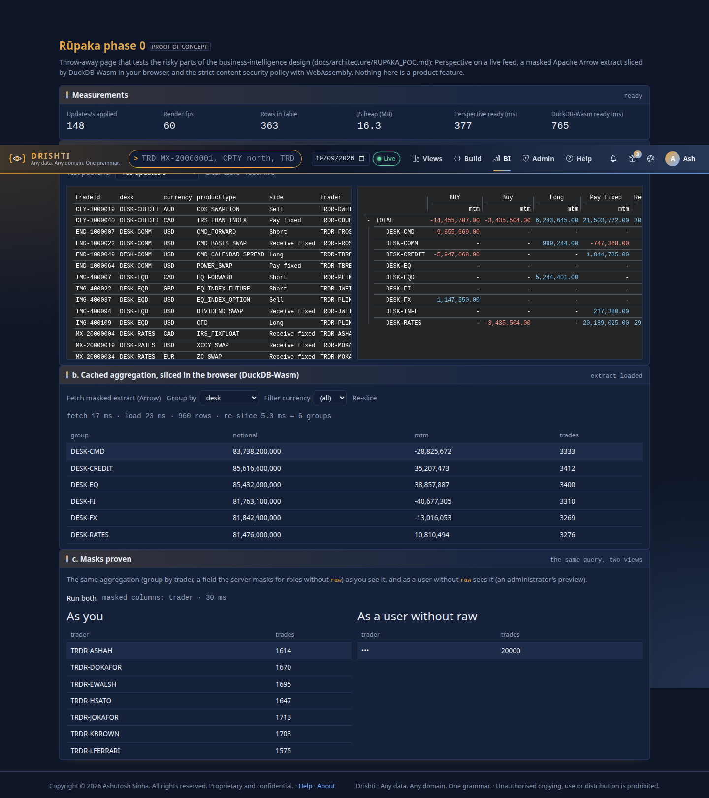
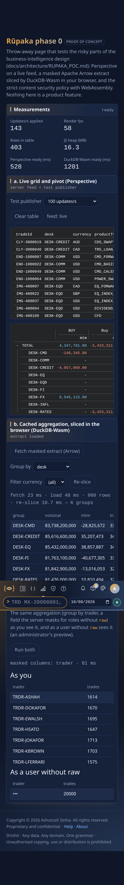

<!--
  Project Drishti · Any data. Any domain. One grammar.

  Copyright (c) 2026 Ashutosh Sinha <ajsinha@gmail.com>.
  All rights reserved.

  PROPRIETARY AND CONFIDENTIAL.

  This file is the confidential and proprietary property of Ashutosh Sinha.
  Unauthorised copying, use, modification, distribution or disclosure of this
  file, via any medium, is strictly prohibited except with the express prior
  written permission of the copyright holder.

  See the LICENSE file in the root of this repository for the full terms.
-->

# Rūpaka phase 0: the proof of concept, built and measured

Status: built and measured (2026-10-10). **Throw-away code**, off by default, that tests the risky parts of
[RUPAKA.md](RUPAKA.md) before the roadmap (section 20, phase 0) commits to them. Everything is marked `poc`: the server's
`com.ash.drishti.server.bi.poc` package and `/api/v1/bi/poc/**`, the console's `routes/bi_poc_routes.py`, `/bi/poc`,
`bi-poc.js`. Switches: server `drishti.bi.poc.enabled`, console `bi.poc_enabled` (both default `false`; see
[CONFIGURATION.md](../admin/CONFIGURATION.md)). With them off the paths answer 404 as if the code were absent.

## 1. Verdict for phase 1: **go, with four adjustments**

The three bets hold. Perspective takes 1,000 updates a second at 60 fps; masked Arrow out of a server DuckDB reaches the browser
in about 15 ms and DuckDB-Wasm re-slices it in about 4 ms; the strict CSP holds with WebAssembly allowed on one page. Adjust:

1. **Perspective 3.8.0 is fragile in a second tab.** In Chromium 153 a second tab of the same browser profile that opens five or
   more seconds after the first dies in the viewer's wasm (`RuntimeError: unreachable` in `restore({plugin})`), and Firefox
   (Playwright's build) traps on the first load. WebKit works. It reproduces on a bare page with no Drishti code and no CSP
   (section 8). A BI user with two reports in two tabs is the normal case, so phase 1 starts by re-testing the newest Perspective on
   real Chrome, Firefox and Safari, and keeps a fallback (ECharts and the existing grid) for visuals if it cannot be fixed.
2. **Serve the 36 MB DuckDB-Wasm compressed and load it only on demand.** Starlette's static files are not compressed
   (35 MB on the wire; 8 MB gzip). Put gzip or brotli in front, as the deployment already may, and keep the "optional" rule of
   RUPAKA.md section 7. The cached-load times below show that compile, not transfer, is the cost once it is in the browser cache.
3. **Decide the style policy for the BI shell.** Perspective writes `<style>` elements, which `style-src 'self'` refuses. Hashes of
   the six it writes for a grid and a pivot work (zero violations), but its charts and settings panel need about eight more
   and `'unsafe-hashes'`. Phase 1 should either generate the hash list when vendoring (a check fails when a library update adds
   one) or allow `style-src 'unsafe-inline'` on BI pages only (script policy unchanged: no inline script, no `unsafe-eval`).
4. **Store typed columns beside the JSON document** (section 7). Extracting fields from the JSON on every query is 30 times
   slower than typed columns; a rollup is no faster than typed columns at this size.

## 2. What was built

| Part | Where | Notes |
|---|---|---|
| Query endpoint | `POST /api/v1/bi/poc/query` | administrators; group by 1 to 4 of desk, currency, productType, side, trader, book; sum notional, sum mtm, count; optional day and one equality filter; `layout` json, typed or rollup; `preview: masked` answers as a user without `raw` |
| Arrow writer | `ArrowIpcWriter` | the Arrow IPC stream written from the format's own message classes (`arrow-format` and flatbuffers, Apache-2.0, 0.2 MB), 190 lines; text, 64-bit integer and double columns with nulls |
| Engine | `PocQueryService` | embedded DuckDB (the duckdb plugin's JDBC driver) over a Parquet sample lake generated on first use: 10,000 trades a day, 2 days, a JSON document column plus typed columns, and a rollup |
| Live feed | `GET /api/v1/bi/poc/rows` | 24 live demo trades through `TopicHub` (the path live views use); a `view` event (snapshot) then `row` events with the latest value of each row that changed, every 100 ms; masked by the caller's redactor |
| Layout comparison | `GET /api/v1/bi/poc/bench` | section 7; the answer also carries `biDir` (the BI folder, `drishti.bi.dir`, default `./config/bi`) and `biDatasets` (the `*.dataset.yaml` files found in its `datasets/`), the one use phase 0 makes of the folder ([RUPAKA.md](RUPAKA.md), "Where BI files live") |
| Console page | `/bi/poc` | top bar **BI** entry (only when enabled) and the reserved command `RUPAKA <GO>` (any case; reserved even when off, where it says so) |
| Cards | `bi-poc.js` | a. Perspective grid and pivot (group by desk, split by side) on the live feed plus a test publisher of 100, 500 or 1,000 updates/s; b. fetch the masked extract, load it into DuckDB-Wasm, re-slice by group-by and filter with timings; c. masks proven: the same query as you and as a user without `raw` |
| Live transport | the console's one channel | one more subscription kind, `poc:rows`, relayed by `core/channel.py`; the page opens no stream of its own (`test_pages_never_open_their_own_event_streams` stays green) |
| Vendoring | `web/static/vendor/VENDOR.md` | Perspective 3.8.0 (3.9 MB, committed), Arrow JS 17 bundle (0.2 MB, committed), DuckDB-Wasm 1.33.1-dev57.0 (36 MB, installed by `tools/fetch-duckdb-wasm.sh`, pinned SHA-256, not committed: over the 40 MB ceiling together) |

Access: administrators only (a `bi` role power is a nine-argument record change in the role catalogue, not trivial for a
throw-away). The masks proof therefore uses `preview: masked`, and the tests use a role with `admin` and without `raw`.





## 3. Why Arrow is written from `arrow-format`, not the Arrow Java libraries

Arrow Java (`arrow-vector` and `arrow-memory`) is Apache-2.0 and acceptable by licence, but it needs `--add-opens
java.base/java.nio=ALL-UNNAMED` on JDK 17 and later for its memory, brings Netty, and a first attempt to build its
vectors from JDBC rows would copy every value twice. DuckDB's JDBC driver can export Arrow only through those libraries. The
IPC stream is three messages (schema, one record batch, end marker), so the writer is about 190 lines over the format's flatbuffers
classes. It is verified three ways: a Java round-trip test (nulls, Unicode, empty), `pyarrow.ipc.open_stream` reads the server's
bytes (schema `desk: string, productType: string, notional: double, mtm: double, trades: int64`, 60 rows), and DuckDB-Wasm loads
them in Chromium. Phase 1 can swap in Arrow Java for multi-batch streaming without changing the wire format.

## 4. Measurements

Method: the real server (JDK 21, `-Xmx1g`) and console on this machine, Chromium 153 (Playwright), headless with software
rendering, loopback network, 10,000 trades a day for 2 days (20,000 rows; local-safe limit). Script and raw output are not part
of the repository; numbers are copied from the run of 2026-10-10.

### Vendored sizes (exact, raw and gzip: see VENDOR.md for every file)

Perspective 3,947,377 bytes raw (about 3.3 MB of it wasm). DuckDB-Wasm `eh` 35,913,747 wasm + 773,223 worker + 32,000 module =
36.7 MB raw, 8.25 MB gzip. Arrow JS bundle 209,281 (48,468 gzip). Total 40.9 MB raw.

### Page load

| | Perspective ready | Transferred | DuckDB-Wasm ready (first use) | Transferred |
|---|---:|---:|---:|---:|
| First load (empty cache) | 390 ms | 3.8 MB (uncompressed) | 555 ms | 35.0 MB (uncompressed) |
| Cached (same profile, browser restarted) | 438 ms | revalidation only | 822 ms | revalidation only |

"Ready" is from navigation start for Perspective (all of it: libraries, wasm compile, worker, table, two viewers) and from the click
for DuckDB-Wasm (module, worker, wasm instantiate, connection). Loopback hides transfer: the cached load is not faster because
compiling the wasm is the cost (the page's own timer reads 245 ms for Perspective). Over a 10 Mbit/s link the uncompressed 35 MB
would take about 28 s and the gzipped 8 MB about 7 s, hence adjustment 2. Page text and CSS add under 20 KB.

### Perspective, sustained

A test publisher updates random rows of a 2,000-row table, on top of the server's feed (24 live trades, 60 row updates a second).
12 s measured after 4 s warm-up, `requestAnimationFrame` intervals for frames.

| Publisher | Rows applied/s | Offered and dropped | fps (mean) | frame time p95 / max | Frames over 50 ms | Rows in table | JS heap |
|---|---:|---:|---:|---:|---:|---:|---:|
| off (server feed only) | 60 | 0 | 60.0 | 16.7 / 16.8 ms | 0 | 24 | 15.4 MB |
| 100/s | 160 | 0 | 60.0 | 16.7 / 16.8 ms | 0 | 1,107 | 16.3 MB |
| 500/s | 560 | 0 | 60.0 | 16.8 / 16.8 ms | 0 | 1,978 | 15.4 MB |
| 1,000/s | 1,060 | 0 | 60.0 | 16.7 / 16.8 ms | 0 | 2,024 | 16.3 MB |

The target (1,000 updates/s without dropping below 45 fps) is met with room: nothing dropped, no frame over 17 ms. Caveats: the
engine runs in a worker, so the main thread's frame time is not the whole story, and headless Chromium caps at 60 fps; a
real display with a heavier visual (a chart over 2,000 rows) is the phase 1 test. The server's feed at 100 ms batches carried
60 rows a second for 24 trades (each ticks every 400 ms). Live latency was not measured separately.

### DuckDB-Wasm re-slice

Extract: 960 rows (4 dimensions: 6 desks x 8 currencies x 10 products x 2 sides, aggregated), 63,008 bytes of Arrow. Fetched in
15 ms (server query 5.4 ms), loaded into DuckDB-Wasm in 18 ms. 60 re-slices alternating the four group-bys and five currency
filters (a prepared statement): **p50 4.3 ms, p95 7.4 ms, max 10.1 ms**. Cached-profile run: re-slice 8 ms, load 28 ms.

### Server query (HTTP, 100 requests each, after warm-up; Arrow answer included)

| Query | p50 | p95 | Arrow bytes |
|---|---:|---:|---:|
| group by desk | 6.3 ms | 9.0 ms | 832 |
| desk, productType | 7.0 ms | 8.9 ms | 3,744 |
| desk, currency, productType, side (the extract) | 7.5 ms | 10.6 ms | 63,008 |
| trader, masked | 3.7 ms | 4.9 ms | 648 |

The first query of a new lake took 441 ms: it generates the 20,000-row lake (two Parquet files and the rollup). Server heap: 222 MB
used after 400 queries and 100-run comparisons; the growth over them was 5.4 MB (the comparison itself, 10 MB). Browser
JS heap 15 to 16 MB with both Perspective viewers; DuckDB-Wasm's memory lives in its worker (not in the JS heap).

### Memory of the page

JS heap 15.4 to 16.3 MB at every rate (the table is in the engine's wasm memory: 2,000 rows is small). Not measured: a 100,000-row table.

## 5. Content security policy

| Question | Finding |
|---|---|
| `'wasm-unsafe-eval'` where? | `/bi/poc` only (Perspective's viewer wasm compiles on the main thread) and the two vendored workers (`perspective-server.worker.js`, `duckdb-browser-eh.worker.js`, which get the Calc worker policy: `default-src 'none'; script-src 'self' 'wasm-unsafe-eval'; connect-src <host>/static/ <host>/pyodide/`). Every other page and file is unchanged, with no `wasm` and no `unsafe-eval` (tests). |
| Workers | `worker-src 'self'` suffices because both engines are started from same-origin scripts. Perspective's default worker is a **blob** worker (`worker-src blob:` would be needed); `perspective.worker(Promise<Worker>)` takes our own, so no blob anywhere (a test greps the page code for `Blob` and `createObjectURL`). |
| Inline script, handlers, style attributes | none; `test_assets_policy.py` stays green. |
| **`<style>` elements** | Perspective writes them (its shadow roots' CSS): `style-src 'self'` blocks them and the grid draws no rows. Six SHA-256 hashes in `POC_STYLE_HASHES` (core/app.py) give zero violations for the grid and pivot. Opening a chart plugin and the settings panel logs about eight more and style attributes (`'unsafe-hashes'`): see adjustment 3. |
| SharedArrayBuffer, COOP/COEP | not needed. The `eh` DuckDB-Wasm build is single-threaded; `window.crossOriginIsolated` is `false` in the browser test, and everything works. The `coi` (threaded) build would need both headers, which would also break cross-origin embeds; not used. |
| `unsafe-eval` | not needed. The library's `Function(...)` fallback runs only for `file://` pages. |
| DuckDB-Wasm import | its module imports the bare name `apache-arrow`, which needs an import map (an inline script). `tools/fetch-duckdb-wasm.sh` points it at the vendored bundle `vendor/apache-arrow/17.0.0/`. |

## 6. Masks proven

`drishti.security.redact` names `trader` (and `counterpartyId`, `patientName`, ...). In the POC, for a role without `raw` a masked
column is replaced **before** aggregation: a masked dimension reads `•••` in every row and is **not grouped on**, so no
value can be told apart; a masked measure reads null; a filter on a masked column is refused (403), so it cannot be probed.
Seen in all three places: the server test (`PocApiTest`: group by trader as a masked administrator returns one row of `•••`
holding all 4,000 trades of the 2,000-row test lake), the Arrow bytes themselves (the console test finds the
mask in the stream), and the page's card c: "As you" lists the 12 traders; "As a user without raw" lists one row, `•••`, 20,000
trades (the screenshots above). Live rows go through the same redactor: the grid's trader column reads `•••` for such a user.
Values are bound parameters and names come from a fixed list (a test sends `USD' OR '1'='1` and gets zero rows).

## 7. JSON documents against typed columns against a rollup (the product owner's question)

Does DuckDB cope with data that is mostly JSON documents in Delta and Kafka? The same aggregation (group by desk and productType:
sum notional, sum mtm, count) answered three ways in the server's DuckDB over 2 days of 10,000 trades (20,000 rows; documents of
about 0.7 KB), 100 runs after a warm-up, each run opening a connection and reading every row of the result
(`GET /api/v1/bi/poc/bench`):

| Layout | p50 | p95 | Bytes read (compressed column chunks) | On disk | Ratio to typed (time / bytes) |
|---|---:|---:|---:|---:|---:|
| 1. JSON column: `json_extract_string(doc, '$.desk')` and `CAST(... AS DOUBLE)` on every query | **29.8 ms** | 37.8 ms | 1,350,827 | 1,515,770 (the whole lake) | 29.8x / 11.6x |
| 2. Typed columns (a Parquet projection of the same rows) | **1.00 ms** | 1.09 ms | 116,394 | 1,515,770 | 1 / 1 |
| 3. Pre-aggregated rollup table (desk, book, currency, productType, side, trader, day) | **1.04 ms** | 1.31 ms | 115,464 | 145,345 | 1.04x / 0.99x |

Reading it: at 20,000 rows the typed and rollup answers are both at the floor of a connection and a small Parquet read, so the
rollup shows no gain yet (its file is 10 times smaller; it will matter when the base grows to millions of rows, which this
local-safe test deliberately did not do). The JSON path costs 30 times the time and 11 times the bytes, and its time grows with
rows (parsing 0.7 KB per row); at 10 million rows that is the difference between hundreds of milliseconds and many seconds. DuckDB
handles JSON documents (the `json` extension is statically linked into the JDBC jar), but a BI path should read typed columns,
which is what Drishti's Delta connector already promotes (`layout.<kind>.columns`). Phase 2's cached datasets should be typed
projections, with the JSON kept for drill-down to the document.

**DuckDB extensions offline.** The JDBC jar (DuckDB 1.5.6) links `json`, `parquet`, `core_functions` and `icu` statically; `delta`,
`httpfs` and `iceberg` are not bundled and are downloaded the first time they are used (`LOAD delta` downloaded it here, with
network access). With auto-install off, `LOAD delta` fails with "extension not found". The POC therefore reads **Parquet files
directly** (a Delta table's data files are Parquet; its log is what `read_parquet` ignores, so deletes and updates are not
honoured: phase 2 reads Delta through the existing Delta connector, or pre-installs the extension in the image) and sets
`autoinstall_known_extensions` and `autoload_known_extensions` to false, so the server never downloads code at run time.

## 8. What failed or surprised

* **A second Perspective tab traps** (adjustment 1). Reproduced on a bare page (viewer, datagrid, worker, a one-row table and
  `restore({plugin: 'Datagrid'})`, no CSP, no Drishti): tab B opened 0 s after tab A works; 5 s or later it fails with `RuntimeError:
  unreachable` inside the viewer wasm. Playwright's Chromium 153, headless shell and the new headless mode, a hint of user agent
  (Chrome string) and V8 flags (`--liftoff-only`, `--no-wasm-tier-up`, `--no-wasm-dynamic-tiering`, `--no-opt`, `--disable-features=V8CodeCache`)
  changed nothing; a separate browser context (profile) works; WebKit works; Firefox's first load traps. The browser tests therefore
  start one Chromium per test, and the cached-load figure restarts the profile instead of opening a second tab. Not root-caused.
* **Perspective's CDN builds import their wasm relative to themselves** (`../wasm/...`): the folder layout of the npm package is
  kept (`cdn/`, `wasm/`, `css/` side by side).
* **DuckDB-Wasm's npm module imports `apache-arrow` by bare name**: solved by bundling Arrow JS once and rewriting one import.
* `PocApiTest`'s first run found DuckDB's `hash()` returns an unsigned type: `hash(i) % n - m` overflows; cast first.
* **Page `/bi/poc` is not in the help centre's reference**, only the design documents are; this document is linked from the docs index.
* The live demo source ticks only trades someone subscribes to (a fixture's `_meta.walk`); the feed subscribes 24 and every one moves.

## 9. Tests

Server: `ArrowIpcWriterTest` (round trip, nulls, Unicode, empty), `PocApiTest` (Arrow decodes; the three layouts agree; masks for a
role with `admin` and no `raw`; preview as masked; a masked filter refused; non-administrators 403; SQL injection as a value; the
comparison), `PocOffByDefaultTest` (404 for every path). Console: `test_bi_poc.py` (off by default, top bar, `RUPAKA <GO>` in any
case, libraries loaded on this page only, the CSP on the page and its workers and on no other page, Arrow pass-through, JSON only),
`test_bi_poc_browser.py` (Chromium: the grid draws and ticks, the pivot is fed, DuckDB-Wasm loads the extract and re-slices to 6, 8 and 1
groups, the mask reads `•••`, no CSP violation, `crossOriginIsolated` false; the publisher drives the table; skipped without the
browser or without `tools/fetch-duckdb-wasm.sh`), and the existing `test_assets_policy.py`, `test_docs_*`.

## 10. Reproducing

```
tools/fetch-duckdb-wasm.sh                               # once: 36 MB, pinned and verified
DRISHTI_BI_POC_ENABLED=true java -jar drishti-server/target/drishti-server-*-exec.jar     # trading pack
DRISHTI_BI_POC_ENABLED=true python drishti-console/run_drishti_web.py                     # then open /bi/poc, or type RUPAKA <GO>
curl -s -X POST -H 'Content-Type: application/json' -d '{"groupBy":["desk"]}' localhost:18480/api/v1/bi/poc/query | file -
curl -s localhost:18480/api/v1/bi/poc/bench           # the layout comparison (administrators)
```
