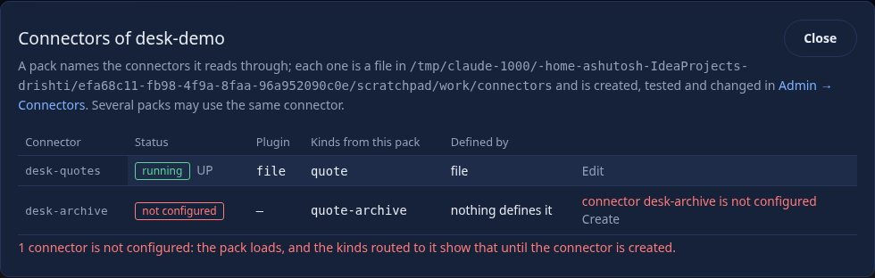
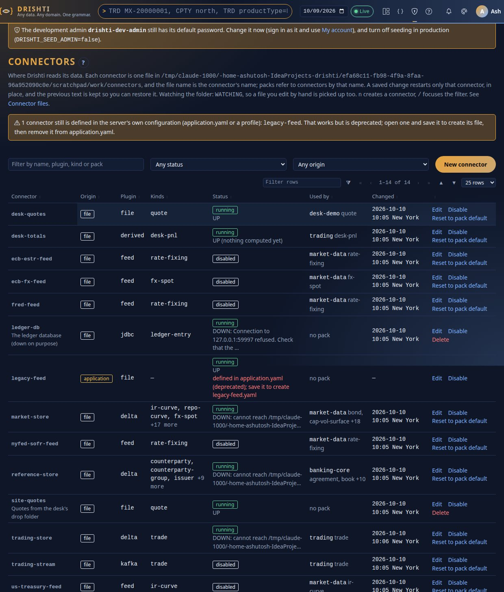
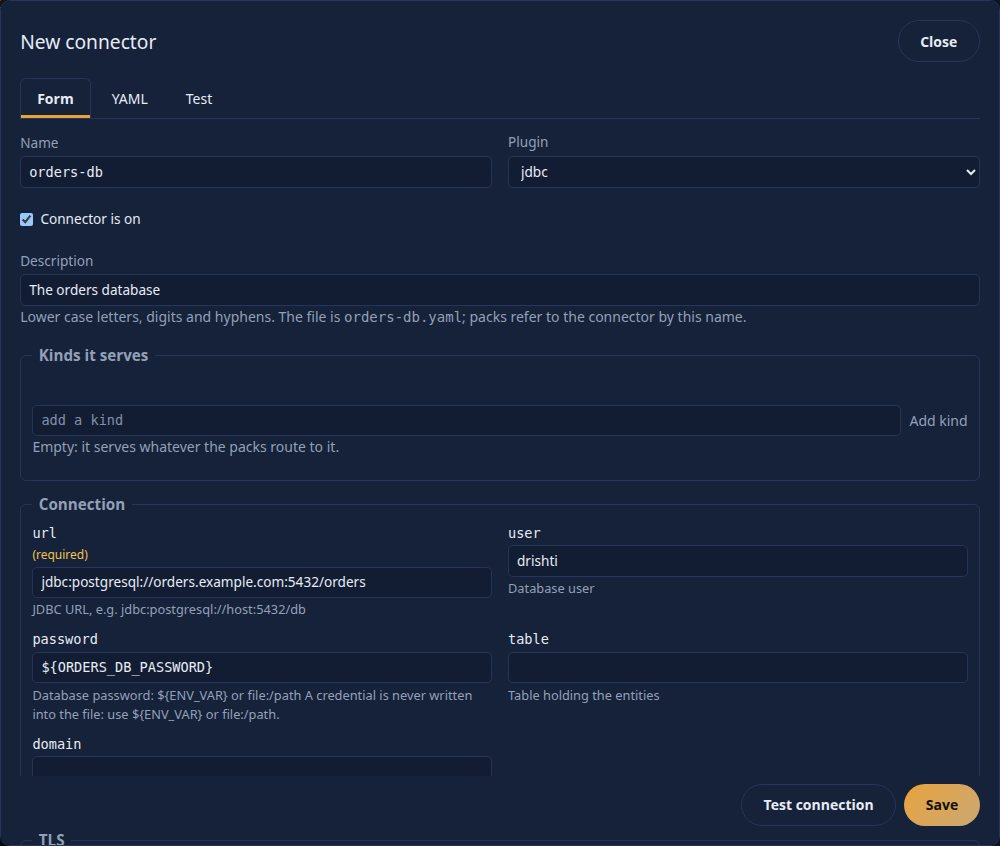
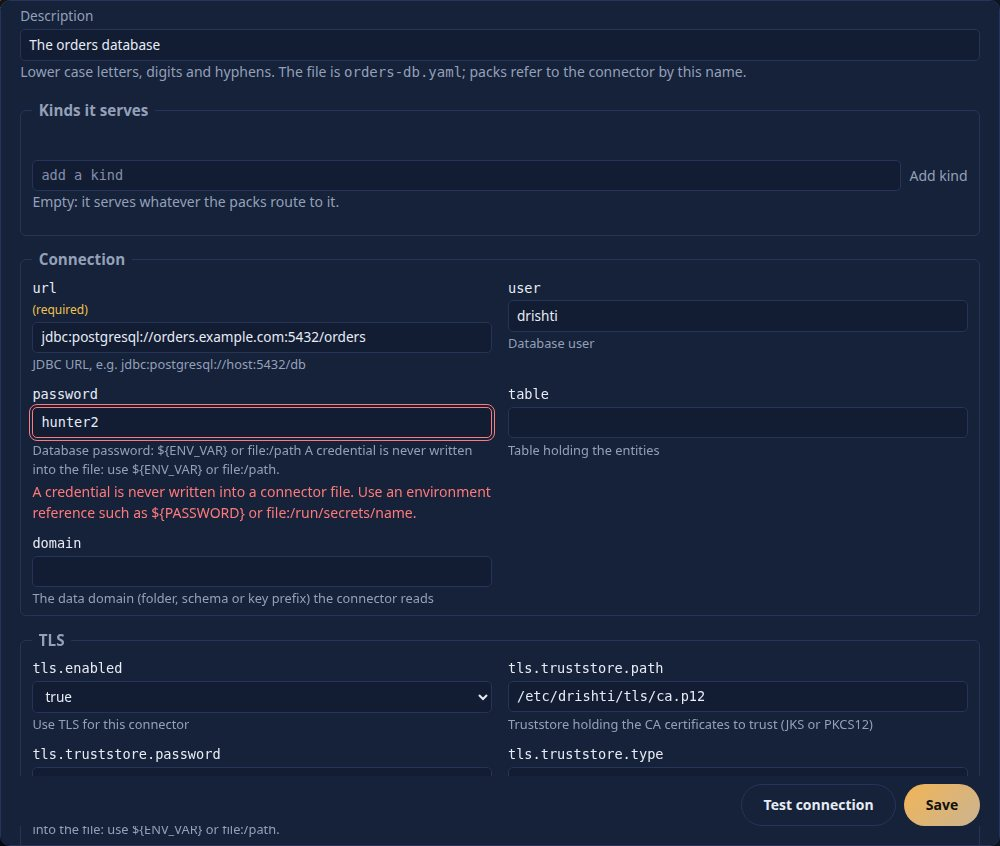
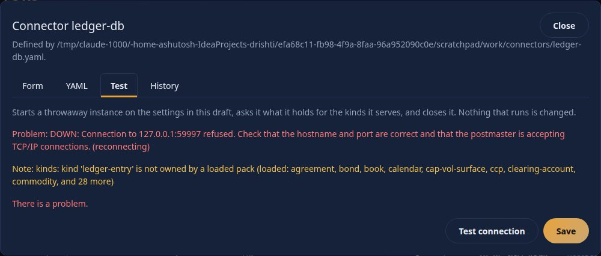
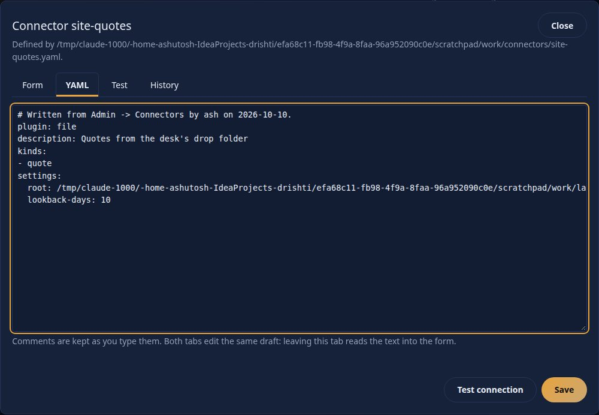
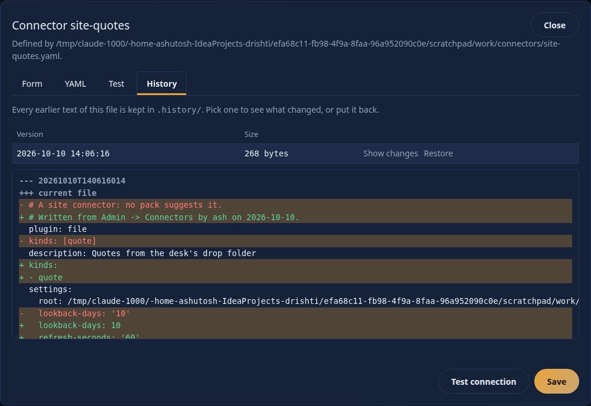
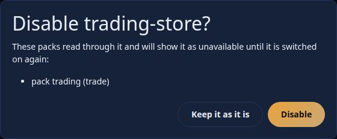
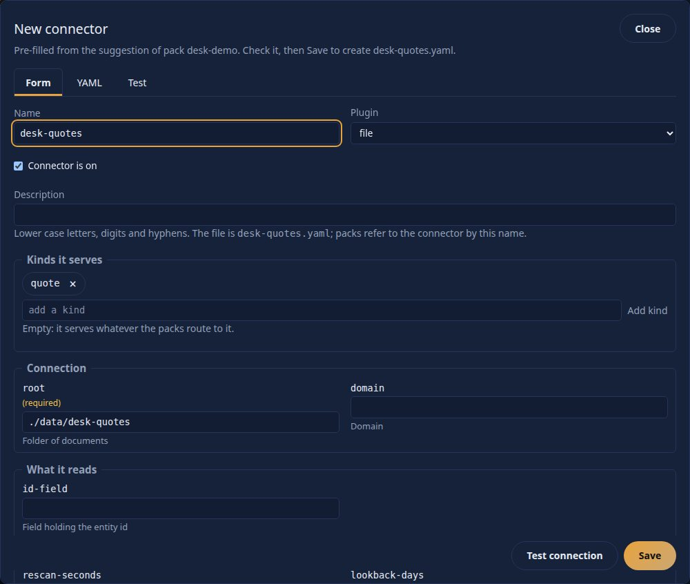
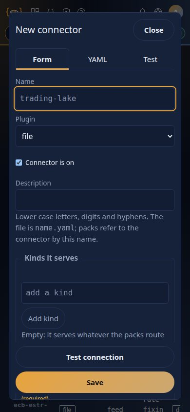

<!--
  Project Drishti · Any data. Any domain. One grammar.

  Copyright (c) 2026 Ashutosh Sinha <ajsinha@gmail.com>.
  All rights reserved.

  PROPRIETARY AND CONFIDENTIAL.

  This file is the confidential and proprietary property of Ashutosh Sinha.
  Unauthorised copying, use, modification, distribution or disclosure of this
  file, via any medium, is strictly prohibited except with the express prior
  written permission of the copyright holder.

  See the LICENSE file in the root of this repository for the full terms.
-->
# Connector files and Admin → Connectors

A **connector** is one configured instance of a source plugin: which plugin, how to reach the system behind it, and which
kinds it serves. Connectors belong to the **site**, not to a pack. Each one is a single YAML file in the connector folder,
`config/connectors/`, and **the file name is the connector's logical name**: `config/connectors/trading-lake.yaml` is the
connector `trading-lake`. A pack does not carry connection settings; it **names** the connectors it reads through, and
several packs may name the same one.

This page is the reference for the folder, the file format (with an example for every store), how a pack and a file fit
together, live reload, the **Admin → Connectors** page, the REST API, the `drishti.py connector` commands, and moving off
`application.yaml`. The settings each plugin reads are in its own page ([CONNECTOR_GUIDE.md](CONNECTOR_GUIDE.md) lists them).

Contents: [1](#1-the-model-in-one-minute) the model · [2](#2-the-folder) the folder · [3](#3-the-file) the file ·
[4](#4-examples-one-per-store) examples · [5](#5-credentials-and-tls) credentials and TLS · [6](#6-how-packs-and-files-fit-together) packs and files ·
[7](#7-live-reload) live reload · [8](#8-admin--connectors) the page · [9](#9-the-rest-api) the API · [10](#10-the-cli) the CLI ·
[11](#11-moving-off-applicationyaml-and-the-old-data-source-override) migration · [12](#12-health-and-problems) health · [13](#13-decisions) decisions

## 1. The model in one minute

```
  pack.yaml                         config/connectors/trading-lake.yaml          the system behind it
  ─────────                         ────────────────────────────────────         ────────────────────
  kinds: [trade]                    plugin: delta
  connectors: [trading-lake]   ──►  kinds: [trade]                         ──►   a Delta Lake, a database,
  routes: {trade: trading-lake}     settings: { root: /mnt/lake, … }             a Kafka topic, …
```

- The **pack** says *what* it needs: the kinds it owns and, in `routes:`, which connector answers each kind.
- The **file** says *how* to reach it: plugin, settings, switch. It is edited by the site, in the editor of your choice or in
  **Admin → Connectors**, and applied to the running server **without a restart**.
- A pack may also *suggest* a connector (a template). At the first start the server writes the suggestion to the file, once, and
  never overwrites it afterwards. So every pack shipped with Drishti works out of the box, and the file is then yours.
- A pack that names a connector that does not exist still loads; its kinds say so ([section 12](#12-health-and-problems)).

## 2. The folder

| Setting | Default | Meaning |
|---|---|---|
| `drishti.sources.connectors-dir` (`DRISHTI_CONNECTORS_DIR`) | `./config/connectors` | The folder, relative to the server's working directory. Created on the first write. |
| `drishti.sources.connectors-watch` | `auto` | `auto` uses file events and falls back to polling; `poll` only polls; `off` reads the files at start only. |
| `drishti.sources.connectors-poll` | `5s` | How often the files are looked at: the fallback when events are unavailable, and a safety net beside them. |
| `drishti.sources.connectors-drain` | `3s` | A connector being restarted or stopped stays open this long so reads in flight finish. |
| `drishti.sources.connectors-generate` | `true` | Write a file from a pack's template when no file of that name exists. |

```
config/connectors/
  trading-store.yaml        one file per connector; the name is the file name
  site-quotes.yaml
  .history/                 every earlier text of every file, written before each change
    site-quotes.20261010T140411601.yaml
```

Names are lower case letters, digits and hyphens, starting with a letter or digit, at most 64 characters (`trading-lake`,
`risk-store-2`). `plugins` and `history` are reserved. A file whose name breaks the rule (`Upper.yaml`, `a b.yaml`, `.yml`) is not
loaded; the server lists it in the log and on the Connectors page. Dot files and `.history/` are ignored.

**Keep this folder in version control** if you manage configuration as code; it holds no secret (section 5). Back it up with the
rest of the site configuration; `.history/` is a convenience, not a backup.

## 3. The file

```yaml
# config/connectors/trading-lake.yaml
plugin: delta                     # required: which source plugin (delta, jdbc, file, kafka, redis, …)
enabled: true                     # optional, default true; may be ${DRISHTI_LAKE_ENABLED:true}
kinds: [trade]                    # optional: limit the kinds it serves (default: what the plugin and the pack's routes say)
description: Trading lake         # optional, free text
settings:                         # the plugin's settings; nesting is flattened to the dotted keys the plugin reads
  root: ${DRISHTI_DELTA_ROOT:./data/delta}
  domain: trading
  tls:                            # tls: {ca-file: x} is the setting tls.ca-file
    ca-file: /etc/drishti/tls/ca.pem
```

- Only these top-level keys are allowed (`plugin`, `enabled`, `kinds`, `description`, `settings`, and an optional `name`); anything
  else is an error that names the key.
- A `name:` inside the file must equal the file name. A file `a.yaml` that says `name: b` is an error: rename the file or remove
  the line. The file name always wins as the identity.
- `${ENV_VAR}` and `${ENV_VAR:default}` placeholders are resolved when the connector starts, exactly as everywhere else in
  Drishti's configuration. An unset variable without a default refuses that file (the last good configuration keeps running).
- Lists become comma lists (`topics: [a, b]` is `topics: a,b`). Values are strings to the plugin.
- Comments are kept when you edit the YAML in an editor or in the YAML tab. Saving from the **Form** tab rewrites the file from the
  fields (comments are not kept; the earlier text is in `.history/`).

## 4. Examples, one per store

Ready-made files are in [`config/connectors.examples/`](../../config/connectors.examples). Copy one to `config/connectors/`,
change what is yours, and the server starts it within seconds. The folders `postgres/`, `duckdb/`, `aerospike/`, `mongodb/`,
`iceberg/`, `redis/` and `files/` hold the six banking data domains (`trading-store`, `risk-store`, …) read from that store, replacing
what the former `application-<store>.yaml` profiles did; `other/` holds a Kafka, RabbitMQ, ActiveMQ, REST, MongoDB and S3-backed Delta
connector over TLS. A test (`ConnectorExamplesTest`) keeps every example valid.

**Delta Lake** (`config/connectors/trading-store.yaml`, as generated from the trading pack's template):

```yaml
plugin: delta
enabled: "${DRISHTI_LAKE_ENABLED:true}"
kinds:
- trade
settings:
  root: "${DRISHTI_DELTA_ROOT:./data/delta}"
  domain: trading
  layout.trade.columns: "tradeId,productType,productName,direction,currency,notional,mtm,pnl1d,…"
  layout.trade.sort-by: id
```

**PostgreSQL / any JDBC database** (`examples/postgres/trading-store.yaml`):

```yaml
plugin: jdbc
kinds: [trade]
settings:
  domain: trading
  url: ${DRISHTI_PG_URL:jdbc:postgresql://localhost:5432/drishti}
  user: ${DRISHTI_PG_USER:drishti}
  password: ${DRISHTI_PG_PASSWORD}
  table: trading.entities
  pool-size: '12'
```

**DuckDB, Aerospike, MongoDB, Iceberg, Redis, files**: the same shape with that plugin's settings; see `examples/<store>/`. For
instance Redis:

```yaml
plugin: redis
kinds: [trade]
settings:
  domain: trading
  uri: ${DRISHTI_REDIS_URI:redis://localhost:6379}
  cluster: ${DRISHTI_REDIS_CLUSTER:false}
```

**Kafka over TLS** (`examples/other/trading-stream.yaml`):

```yaml
plugin: kafka
kinds: [trade]
settings:
  bootstrap-servers: kafka-1.example.com:9093,kafka-2.example.com:9093
  topics: [trades]
  kind: trade
  id-field: tradeId
  security.protocol: SSL
  tls:
    truststore: /etc/drishti/tls/ca.p12
    truststore-password: ${KAFKA_TRUSTSTORE_PASSWORD}
    keystore: /etc/drishti/tls/client.p12
    keystore-password: ${KAFKA_KEYSTORE_PASSWORD}
```

**A folder of JSON Lines** (a site connector no pack suggests, `site-quotes.yaml`):

```yaml
plugin: file
kinds: [quote]
description: Quotes from the desk's drop folder
settings:
  root: /srv/desk/lake
  lookback-days: '10'
```

The settings of every plugin, with type, default, whether it is required and whether it is a credential, are served by
`GET /api/v1/admin/connectors/plugins` and printed by `drishti.py connector plugins <name>`:

```
$ drishti.py connector plugins file
plugin file
  setting            type                default    what it is
  -----------------  --------  --------  -------    ------------------------------------------------------------------------------
  root               path      required             Folder of documents
  domain             string                         Domain
  id-field           string                         Field holding the entity id
  rescan-seconds     int                            Rescan interval
  lookback-days      int                            Days of history to index
  …
  source-name        string                         The name documents carry as their provenance (default: the connector's name)
  mode.*             string                         Per-kind read mode (mode.<kind>)
  stale-after        duration                       Mark the source stale when it has received nothing for this long (15m, 2h, 1d)
```

A plugin can declare its own settings (the `settingSpecs()` method of the source SPI, see
[CONNECTOR_DEVELOPER_GUIDE.md](CONNECTOR_DEVELOPER_GUIDE.md)); the shipped plugins are described in
`drishti/plugin-settings.yaml` inside the engine. A setting a plugin does not declare is a **warning** (a likely typo), never a
refusal, because plugins also read free-form keys (`layout.*`, `mode.*`, `query.*`).

## 5. Credentials and TLS

**A connector file never holds a secret.** A setting whose name says it is a credential (`password`, `secret…`, `token`,
`api-key`, `access-key`, `private-key`, `credential`) must be one of:

- an environment reference: `password: ${ORDERS_DB_PASSWORD}`, or
- a file reference: `password: file:/run/secrets/orders-db-password` (the first line of the file is the secret, read when the
  connector starts; this is how Docker and Kubernetes secrets are mounted).

A literal value, a default inside the reference (`${X:fallback}`) and a password inside a URL (`jdbc:…//user:pw@host`,
`?password=…`) are **refused** by Admin → Connectors, the API and the CLI with the reason and the name to use. A hand-edited file that
breaks this still loads (so a running site is not stopped by an edit), and the page shows a note on the connector.

**TLS.** Plugins that talk to a server over the network read one shared set of `tls.*` settings, and the form shows them as a **TLS**
section. The form's list is not typed by hand: it is generated from the class that reads the keys (`TlsSettings`), and a test fails if
the two ever differ. The full reference, with every key, the formats and the start-up messages, is [TLS.md](TLS.md); the keys are:

| Setting | Meaning |
|---|---|
| `tls.enabled` | Use TLS (a connector whose address already says so, such as `amqps://`, does not need it). |
| `tls.ca-file` | A PEM file of one or many CA certificates to trust (or the PEM text). |
| `tls.truststore`, `tls.truststore-password`, `tls.truststore-type` | A PKCS12 or JKS truststore instead of, or beside, the PEM file. |
| `tls.trust-jvm-default` | Also trust the public authorities the JVM knows. |
| `tls.cert-file`, `tls.key-file`, `tls.key-password` | The client certificate and key in PEM form, for mutual TLS. |
| `tls.keystore`, `tls.keystore-password`, `tls.keystore-type`, `tls.key-alias` | The client identity as a PKCS12 or JKS keystore. |
| `tls.protocols`, `tls.cipher-suites` | Protocol versions and cipher suites offered. |
| `tls.verify-hostname` | Check that the certificate names the host (default on). |
| `tls.insecure-trust-all` | Development only; refused unless `DRISHTI_ALLOW_INSECURE_TLS=true`. |

Every password has a `-file` twin (`tls.keystore-password-file: /run/secrets/ks`) that reads the first line of a file; the twin names
a path, so it is not itself a secret. A password written in a file is an environment reference or a `file:` reference, as above.
The Kafka connector also has `flavour`, `security.protocol`, `sasl.*` and `schema-registry.*` (with `schema-registry.tls.*` for the
registry's own certificate); the form lists them in a **Security** and a **Schema Registry** section.

**Test connection** turns a TLS failure into words: an untrusted certificate points you at `tls.ca-file` or `tls.truststore`, a name
mismatch tells you to connect by a name the certificate carries, an expired certificate says so, and a wrong store password points at
the reference. Ready-made secure files are in [`config/connectors.examples/other/`](../../config/connectors.examples/other):
`kafka-mtls-pem.yaml` (Kafka, PEM client certificate), `kafka-confluent-cloud.yaml` (Confluent Cloud with Schema Registry),
`rabbitmq-external.yaml` (`amqps://`, the certificate is the log-in), `activemq-ssl.yaml` (`ssl://`), and the PKCS12 forms in
`trading-stream.yaml`, `orders-queue.yaml`, `ops-events.yaml`, `positions-mongo.yaml` and `pricing-api.yaml`.

## 6. How packs and files fit together

A pack **names** its connectors. In `pack.yaml`:

```yaml
kinds: [trade, order]
connectors: [trading-store, trading-stream]     # the logical names of site connectors
routes:                                         # which connector answers each kind
  trade: trading-store
  order: trading-stream
connector-templates:                            # optional: what to suggest if the site has none yet
  trading-stream:
    plugin: kafka
    kinds: [order]
    settings: { bootstrap-servers: localhost:9092, topics: [orders], kind: order }
```

- `connectors:` is either a **list of names** (a pack that only names what it needs) or, as every pack shipped before connector
  files, a **mapping of definitions**. A mapping is read as the pack's **templates**; both forms work, and `connector-templates:`
  carries templates beside a list. Nothing about an existing pack has to change.
- **Kinds**: the pack's `routes:` decide the **primary** connector for a kind (the pack author knows where each kind lives). A
  connector's own `kinds:` (file, template or server configuration) makes it **serve** those kinds in addition, so a second
  connector listing a kind is consulted after the routed one (for example a lake behind a recent store, for dates the recent
  store does not hold). With no `kinds:` it serves what its plugin and the routes say. `kinds:` never removes a kind the routes send to it.
  This keeps a connector reusable across packs while the pack stays in charge of its own kinds.
- **Several server processes or test contexts sharing one connector folder** all watch it; a file that appears there is
  started by every one of them and, for a name they define differently, replaces what they run. Give each its own folder
  (`drishti.sources.connectors-dir`); a file left there by another run merges its settings (for example a Delta `domain`) into a connector the server configuration defines.
- A name may be used by **several packs**; Admin → Connectors shows who uses each connector and for which kinds, and asks before
  you switch one off or delete it.

### Precedence

Highest first. Each is documented and tested:

| Source | Role |
|---|---|
| Environment variables and `drishti.sources.connectors.*` in the server's own configuration (**deprecated**) | Override a file **setting by setting** until you move them to the file; a warning names the file to write. |
| `config/connectors/<name>.yaml` | The site's definition. It **replaces** the pack's template for that name **wholesale**: the settings are not merged, so what the file does not say is not inherited. |
| The pack's template (`connectors:` mapping or `connector-templates:`) | The pack's suggestion. Used to write the file once, and in memory when the file cannot be written. |

A file with **no** template of that name defines a **new site connector**. When two related packs (one `extends` the other) suggest
the same name, the more specific pack's template is the one written; two unrelated packs suggesting different definitions of one
name is an error, as it always was.

### Generation at the first start

If a pack suggests a connector and no file of that name exists, the server writes it (logged, and audited as
`connector-generated`) and never touches an existing file:

```
$ ls config/connectors
desk-quotes.yaml  desk-totals.yaml  ecb-estr-feed.yaml  ecb-fx-feed.yaml  fred-feed.yaml  market-store.yaml
nyfed-sofr-feed.yaml  reference-store.yaml  trading-store.yaml  trading-stream.yaml  us-treasury-feed.yaml  …

$ cat config/connectors/trading-store.yaml
# Generated at first start from the connector template of pack 'trading'. Edit it freely: it is never overwritten.
plugin: delta
enabled: "${DRISHTI_LAKE_ENABLED:true}"
kinds:
- trade
settings:
  root: "${DRISHTI_DELTA_ROOT:./data/delta}"
  domain: trading
  …
```

```
connectors: connector file trading-store.yaml generated from the template of pack 'trading'
connectors: connector file reference-store.yaml generated from the template of pack 'banking-core'
```

If you delete a generated file by hand while the pack still suggests it, it is written again at the next start; **Reset to pack
default** (below) does the same at once and keeps your text in the history. To stop generating files altogether, set
`drishti.sources.connectors-generate: false`; the templates are then used in memory, as before.

### A pack names a connector nobody defined

The pack loads. Its kinds say so, in three places:

- **Admin → Packs → Data source** lists the pack's connectors; a missing one is marked **not configured** with a **Create** link that
  opens New connector pre-filled from the pack's suggestion (if it has one).
- **Admin → Health** shows the pack as degraded with `connectorsNotConfigured`.
- Reading a view of such a kind fails with `DRS-1011`:

```
HTTP/1.1 404
{"title":"connector not configured","status":404,
 "detail":"DRS-1011 connector desk-archive is not configured: kind 'quote-archive' is routed to it, but no connector file desk-archive.yaml exists (create it in Admin -> Connectors)",
 "instance":"/api/v1/views/quote-archive/Q-1","code":"DRS-1011"}
```



### Deploying a pack archive

A pack archive (`pack make`, `pack bundle`, Admin → Packs → Deploy archive) carries the connector **names and templates only**,
never a site's settings. The deploy preview lists the connectors the pack names that the site lacks, and
`POST /api/v1/admin/packs/deploy/{id}/connectors` (the **Create connectors** step) writes files from the templates before you deploy.
Loading the pack writes them at the next start anyway.

## 7. Live reload

The folder is watched (file events, with polling as a fallback and a safety net, the same pattern as Sutra hot reload). Per file:

| What happens to the file | What the server does |
|---|---|
| A **new** file | Starts that connector. |
| A file **changes** | Stops and restarts **only that connector**. |
| A file is **deleted** | Stops it, or, if a pack's template names it, applies the template again. |
| A file is **bad** (not YAML, unknown key, `name:` disagrees, unset `${VAR}`) | Keeps the **last good configuration running**, and shows the problem. |

```
INFO  connector site-quotes stopped
INFO  connector site-quotes started (file)
INFO  connector site-quotes reconfigured from site-quotes.yaml: RUNNING
WARN  connector file site-quotes.yaml is not usable; the last good configuration keeps running: site-quotes.yaml: unknown key 'bogus' (allowed: plugin, enabled, kinds, description, settings)
INFO  connector new-drop started (file)
INFO  connector file new-drop.yaml was removed; the connector stops
```

A bad file shows in **Admin → Health** (`connectors.badFiles`, overall status degraded), on the Connectors page, and in
`drishti.py connector list`:

```
$ drishti.py connector list
  name         origin  plugin  kinds  state    used by  problems
  site-quotes  file    file    quote  running           site-quotes.yaml: unknown key 'bogus' (allowed: plugin, …) (the last good configuration is running)
```

**Concurrency.** One reconfiguration at a time **per connector**; different connectors reconfigure in parallel. The old instance is
taken out of routing at once, stays open for `connectors-drain` (3 s) so reads in flight finish on it, then closes; the new one
starts after. Connectors you did not touch are not interrupted. A connector's place in the read order is kept across restarts.

What is **not** live: a connector defined in the server's own configuration (`application.yaml`, deprecated) and a change of
`connectors-dir` itself; both need a restart.

## 8. Admin → Connectors

**Admin → Connectors** (`/admin/connectors`, administrators only; the Admin menu and the Admin tabs link to it; `?` opens this page).



The list shows each connector's **origin** (`file`, `pack` for a template with no file yet, `application` for the deprecated
configuration), plugin, kinds, **status** with the plugin's own health beside it, which packs use it (and for which kinds), and when
it last changed. Filter by text, status or origin. `n` creates a connector and `/` focuses the filter. A connector defined in
`application.yaml` is flagged with the file that would replace it; a bad file shows its problem on its row.

**New connector** and **Edit** open one editor with four tabs (arrow keys move between them):



- **Form.** Choose a plugin and the form is generated from its declared settings, grouped (connection, TLS, what it reads, tuning),
  with a required marker, the default as the placeholder, and the description under each field. A **TLS** section appears when the
  plugin supports it. Kinds are picked from the kinds the loaded packs own. Settings the plugin reads that have no field go in
  **Other settings**.
- **YAML.** The same draft as text, comments and all. Leaving the tab reads the text into the form (and tells you if it cannot be
  read); leaving the form renders it. Both tabs edit one draft.
- **Test.** **Test connection** starts a throwaway instance on the draft's settings, asks it what it holds for the kinds it serves
  (business dates and counts), and closes it. Nothing that runs is changed. A failure comes back in words, with a hint for TLS and
  network errors.
- **History** (existing files). Every earlier text with its time and size; **Show changes** shows a diff against the current file
  (added lines start with `+`, removed with `-`, so it reads without colour), **Restore** puts one back (and applies it).



Fields flagged as secrets accept only `${ENV_VAR}` or `file:` references. A literal value is refused in the form before anything is
sent, with the message above; the server refuses it too.







**Save** writes the file atomically (a timestamped copy of the old text goes to `.history/`), applies it to that connector and says
what state it reached. **Two editors cannot overwrite each other**: the page sends the version it read (the file's ETag) and the server
refuses a stale one with *changed since you read it*, offering **Load the current version**.

Row actions: **Disable / Enable** (keeps the rest of the file), **Reset to pack default** (for a connector a pack suggests: the
file is replaced by the suggestion and your text is kept in the history), and **Delete** (a file no pack suggests; its text is kept
in the history). A connector a pack suggests is never deleted: reset it or disable it. Before you disable or delete a connector that
packs use, the page lists them and asks:



**New connector from a pack's suggestion.** The Create link on a pack's Data source panel (or `/admin/connectors?new=<name>`) opens
the editor pre-filled from the suggestion:



The page is keyboard operable (`n`, `/`, arrow keys on the tabs, Esc closes a dialog and returns focus to what opened it), works in
both themes, and on a phone (390 px) fields stack and every target is at least 44 px:



## 9. The REST API

All under `/api/v1/admin/connectors`; administrators only; a personal API token needs the **`packs:admin`** scope for the writes;
every change is **audited** (setting *names*, never values) as `connector-saved`, `-deleted`, `-reset`, `-enabled`, `-disabled`,
`-restored`, `-tested`, `-generated`, `-migrated`. From the console the same-origin and CSRF rules apply.

| Method and path | Does |
|---|---|
| `GET /` | Every connector: `origin`, `plugin`, `kinds`, `enabled`, `state`, `health`, `lastUpdate`, `updated`, `etag`, `problems`, `usedBy`; plus `directory`, `watch`, `misnamed`, `fileProblems`, `deprecated`, `knownKinds`. |
| `GET /plugins` | The plugins and their settings: `name`, `type`, `required`, `default`, `description`, `secret`, `group`; `tls` says whether the TLS section applies. |
| `GET /{name}` | The effective settings (credentials masked), the file `text`, `etag` (also the `ETag` header), `usedBy`, `packDefault`, `history`. |
| `PUT /{name}` | Create or change. Body `{"text": "<yaml>"}` or the form's fields. An existing file needs `If-Match: <etag>`; `?confirm=true` after switching off a connector packs use. Validates, writes atomically, applies. |
| `DELETE /{name}` | Delete a file no pack suggests (`If-Match`, `?confirm=true` when packs use it). |
| `POST /{name}/enabled` | `{"enabled": false}`: switch on or off, keeping the rest of the file. |
| `POST /{name}/reset` | Put the pack's suggestion back. |
| `POST /{name}/test` | Try a draft (the same bodies as `PUT`), or the saved file with no body. |
| `POST /{name}/validate`, `/render`, `/parse` | Findings for a draft; the YAML of the form's fields; the form's fields of a YAML. Nothing is saved. |
| `GET /{name}/history/{id}`, `POST /{name}/restore/{id}` | A kept version's text; put it back. |

Validation: the name rule; the plugin exists; required settings are present; types (`int`, `boolean`, enums); credentials are
references; unknown settings and unknown kinds are **warnings**. Errors are `DRS-5031` (422); a version conflict, an existing file
without `If-Match`, or an unconfirmed change to a connector in use is `DRS-5032` (409); an unknown connector is `DRS-5033` (404).

```
$ curl -i -X PUT .../api/v1/admin/connectors/site-quotes -H 'If-Match: "0000000000000000"' -d '{"text":"plugin: file\n…"}'
HTTP/1.1 409
{"title":"connector conflict","status":409,"code":"DRS-5032",
 "detail":"DRS-5032 connector 'site-quotes' changed since you read it (now 3e4b312691e95f5c, you have 0000000000000000); reload it and apply your edit again"}
```

## 10. The CLI

`drishti.py connector list|get|apply|delete|test|plugins|enable|disable|reset|history`, over a personal token with `packs:admin`
(`DRISHTI_TOKEN`, `--server`), `--json` for machines, exit 0 done, 1 refused or a test failed, 2 usage. Real output:

```
$ drishti.py connector list
14 connector(s) in /srv/drishti/config/connectors   (watching: WATCHING)
  name              origin       plugin   kinds                                      state           used by       problems
  ----------------  -----------  -------  -----------------------------------------  --------------  ------------  ----------------------------
  desk-quotes       file         file     quote                                      running         desk-demo
  ecb-estr-feed     file         feed     rate-fixing                                disabled        market-data
  ledger-db         file         jdbc     ledger-entry                               running (DOWN)
  legacy-feed       application  file                                                running                       defined in application.yaml (deprecated); save it to create legacy-feed.yaml
  market-store      file         delta    ir-curve,repo-curve,fx-spot +17            running         market-data
  site-quotes       file         file     quote                                      running
  …
  deprecated: legacy-feed is defined in the server's own configuration; apply a file to replace it

$ drishti.py connector get site-quotes
connector site-quotes   origin file   plugin file   running   version 3e4b312691e95f5c
  file /srv/drishti/config/connectors/site-quotes.yaml
  kinds quote
  settings (credentials masked):
  setting        value
  -------------  ---------------------
  root           /srv/desk/lake
  lookback-days  10

$ drishti.py connector test site-quotes
site-quotes (file): reachable, health UP, 9 ms
  kind   business date  rows  note
  -----  -------------  ----  ----
  quote  2026-10-05     4
  quote  2026-10-02     3

$ drishti.py connector test ledger-db
ledger-db (jdbc): PROBLEM: DOWN: Connection to 127.0.0.1:59997 refused. Check that the hostname and port are correct and …
[exit 1]

$ drishti.py connector apply orders-lake.yaml          # a literal password
drishti: the server said 422 DRS-5031: DRS-5031 the connector is not valid: settings.password: a credential is never written into a connector file; use an environment reference such as ${PASSWORD} or a file: reference such as file:/run/secrets/password
[exit 1]

$ drishti.py connector apply orders-lake.yaml --test-first
applied orders-lake: running; changed (new connector), root; version 3694fd093d970a61

$ drishti.py connector history orders-lake
  version             kept at                         bytes
  20261010T140107985  2026-10-10T14:01:07.984455088Z  90

$ drishti.py connector disable trading-store
drishti: the server said 409 DRS-5032: DRS-5032 disabling connector 'trading-store' would stop serving pack trading (trade); repeat with confirm=true to go ahead
[exit 1]

$ drishti.py connector disable trading-store --confirm
trading-store is off (disabled)

$ drishti.py connector delete trading-store
drishti: the server said 409 DRS-5032: DRS-5032 connector 'trading-store' is named by pack trading's template, so it is not deleted: reset it to the pack's default, or disable it
[exit 1]
```

`apply` takes the name from the file name (`--name` overrides), reads the file's current version and sends it as `If-Match`, so it is
safe in a GitOps job: a concurrent edit makes the job fail instead of overwriting it (`--if-match` pins the version you expect).
`drishti.py server packs datasource get <pack>` shows a pack's connectors and exits 1 while one is not configured:

```
$ drishti.py server packs datasource get desk-demo
connectors of desk-demo   [files in /srv/drishti/config/connectors; change them with `drishti.py connector ...`]
  connector     state           plugin  kinds from this pack  defined by          problems
  ------------  --------------  ------  --------------------  ------------------  ----------------------------------------
  desk-quotes   running         file    quote                 file
  desk-archive  not configured          quote-archive         nothing defines it  connector desk-archive is not configured
  desk-archive is not configured: create it with `drishti.py connector apply desk-archive.yaml` or in Admin -> Connectors
[exit 1]
```

## 11. Moving off application.yaml and the old data-source override

**`drishti.sources.connectors` in `application.yaml`** (and `application-<profile>.yaml`, and environment variables such as
`DRISHTI_SOURCES_CONNECTORS_RISK_STORE_SETTINGS_ROOT`) **keep working**, but are deprecated. At start the server logs, per connector:

```
WARN  deprecated: connector 'legacy-feed' is defined in the server's own configuration (drishti.sources.connectors.legacy-feed);
      move it to /srv/drishti/config/connectors/legacy-feed.yaml and remove it from application.yaml. Until then it overrides that
      file setting by setting.
```

The Connectors page flags them too, and opening one and pressing Save creates its file. To move one: write the file (the YAML has the
same keys: `plugin`, `enabled`, `kinds`, `settings`), then delete the block from `application.yaml`.

**The per-store profiles** (`application-postgres.yaml`, `-duckdb`, `-aerospike`, `-mongodb`, `-iceberg`, `-redis`, `-files`) are
**kept working, deprecated**, and every one is also provided as **example files** in `config/connectors.examples/<store>/`. They were
not converted in place because a profile *overlays* the pack's generated files setting by setting, while a file *replaces* the
template; a faithful automatic conversion would hide a behaviour change. Copy the example files you want into `config/connectors/` and
drop the profile.

**The Admin → Packs → Data source override** (`data/packs/settings/<pack>.yaml`, written by the earlier Data source panel) is
**unified** with connector files. At the first start after the upgrade the server **migrates** each override into the connector file of
the same name: the override's `enabled` and `settings` are applied on top of the file (or, when there is none, on top of the pack's
template), the original override file is moved to `data/packs/settings/.migrated/<pack>.yaml.<timestamp>` as a backup, and the file's
earlier text, if there was one, goes to `.history/`. An override the server cannot place (no template and no file say which plugin to use) is
**left in place and reported**; nothing an administrator saved is dropped. It is logged and audited as `connector-migrated`:

```
connectors: data-source override of pack 'risk' for connector 'risk-store' moved into risk-store.yaml
connectors: original override file of pack 'risk' kept in data/packs/settings/.migrated
```

The panel itself is now a **view** of the pack's connectors with links to Admin → Connectors; the `PUT`, `DELETE` and `…/test` calls of
`/admin/packs/{name}/datasource` and `drishti.py server packs datasource set|test|reset` are gone (use the connector API and
`drishti.py connector`).

## 12. Health and problems

- **Admin → Health** has a `connectors` block (count, failed, `badFiles` with the message, watch state, folder, deprecated names), and
  a pack row lists `connectors`, `connectorsDown` and `connectorsNotConfigured`. A bad file or a missing connector makes the overall
  status **degraded**.
- `GET /api/v1/admin/health` → `connectors.watch` is `WATCHING`, `POLLING`, `OFF` or `STOPPED: <reason>`.

| You see | Cause and fix |
|---|---|
| `unknown key 'x'` | Only `plugin`, `enabled`, `kinds`, `description`, `settings` (and `name`) at the top level; put plugin settings under `settings:`. |
| `says name 'b' but the file name is the connector's name` | Rename the file, or delete the `name:` line. |
| `'password' refers to an environment variable that is not set` | Set the variable in the server's environment, or give a default for a non-secret value. The last good configuration keeps running. |
| `a credential is never written into a connector file` | Use `${ENV_VAR}` or `file:/path`. |
| `no plugin named 'x'` | The plugin is not installed; `drishti.py connector plugins` lists them. |
| A connector is `FAILED` | The plugin could not start; the message is the plugin's. **Test connection** shows it with a hint. |
| A file in the folder is ignored | Its name breaks the rule (listed on the page and in the log). |
| Edits are not picked up | `connectors-watch: off`, or `watch` is `STOPPED`; check Health and the log, or restart. |
| `DRS-1011` | A pack routes a kind to a connector with no file: create it ([section 6](#a-pack-names-a-connector-nobody-defined)). |

## 13. Decisions

- **Files replace templates, they do not merge.** Merging would make a site's file depend on what a pack happens to contain in its
  next version. A file says everything the connector needs.
- **Kinds come from the pack's `routes:`**, optionally narrowed by the file's `kinds:`, rather than only from the file: the author of a
  pack knows which kind lives where, and the same connector can then serve several packs.
- **The file name is the identity**, so a rename is a different connector, and two files cannot disagree about a name.
- **A literal credential is refused at the authoring surfaces, but not when the file watcher meets one**, so a hand edit never takes a running
  connector down; it is flagged instead.
- **Unknown settings and kinds are warnings.** Plugins read free-form keys, and a connector may be created before its pack is loaded.
- **Reset, not delete, for a pack's connector**, so a deleted file does not silently reappear at the next start.
- **Restarts drain.** A restart waits `connectors-drain` before closing the old instance so reads in flight finish; during that window
  and the new instance's start the connector's kinds are not served.
- **Pack files shipped in this repository keep their inline `connectors:` mappings**; they are read as templates and work as they did.
  Pack authors writing new packs may prefer the list form plus `connector-templates:`.
