<!--
  Project Drishti · Any data. Any domain. One grammar.

  Copyright (c) 2026 Ashutosh Sinha <ajsinha@gmail.com>.
  All rights reserved.

  PROPRIETARY AND CONFIDENTIAL.

  This file is the confidential and proprietary property of Ashutosh Sinha.
  Unauthorised copying, use, modification, distribution or disclosure of this
  file, via any medium, is strictly prohibited except with the express prior
  written permission of the copyright holder.

  See the LICENSE file in the root of this repository for the full terms.
-->
# Building screens in the Build workbench, step by step

This is a tutorial: you do four small projects, in order, and each one ends with a screen that has been reviewed and is live. [The screen designer guide](SCREEN_DESIGNER.md) is the reference for every feature of the workbench; here each step names the feature, shows what you should see, and links to the guide's section instead of explaining it all again. Panel kinds are described in [the panel catalogue](PANEL_KINDS.md).

| Project | You start from | You end with |
|---|---|---|
| [1. From JSON files](#project-1-from-json-files) (steps 1–16) | five trade documents | a drafted, refined, checked screen, approved by a second person, live at `/t` |
| [2. By hand, from a blank design](#project-2-by-hand-from-a-blank-design) (steps 17–30) | a desk's JSON and an empty Sutra | a desk report with tiles, facts, a chart, a pivot with row groups and a tree table |
| [3. Changing a live Sutra](#project-3-changing-a-live-sutra) (steps 31–37) | the Sutra project 1 published | version 3 of it, after a colleague published version 2 under you |
| [4. Keyboard only](#project-4-keyboard-only) (steps 38–45) | an empty design | a small screen built and checked without touching the mouse |

Then [sharing and shipping](#after-the-projects-share-ship-and-check-in-ci) (step 46), [common mistakes](#common-mistakes-and-how-to-fix-them) and [where to read more](#where-to-read-more).

Every picture was taken by a script (`tools/docs/shots/tutorial.py`) that performs these very steps on a real server, so what you see is what the workbench does. If the workbench changes, run the script again (see [Regenerating the pictures](#regenerating-the-pictures)).

Each step may carry a box:

> **What just happened.** What the workbench did, in plain words.
> **Why.** The reason it works that way.
> **Try this.** An experiment worth two minutes.
> **If it goes wrong.** The usual cause and the fix.

## Before you start

You need a server and a console, and two people on them: an **author** who designs and proposes, and an **approver** who reads the evidence and makes it live. With sign-in on and [four eyes](../admin/USER_MANAGEMENT.md) (the default), nobody approves their own proposal, which is what makes "propose, then approve as somebody else" real. This tutorial uses:

| Person | Role | Does |
|---|---|---|
| `asha` | `author` | designs, saves, proposes |
| `ravi` | `approver` | reads the evidence, approves or rejects |

Make them as the development admin (**Admin → Users → New user**, steps in [USER_MANAGEMENT.md](../admin/USER_MANAGEMENT.md)), or start the same scratch stack the pictures were made on:

```sh
drishti-console/.venv/bin/python tools/docs/screenshots.py --guide tutorial     # starts :18997 + :17997 with sign-in on, makes both people, does all four projects
```

On your own server the settings behind it are `DRISHTI_STUDIO_SAVE=true` (saving from the workbench is on), review on (the default, `DRISHTI_SUTRA_REVIEW`), four eyes on (the default), `DRISHTI_SECURITY_ENABLED=true` with a `DRISHTI_TOKEN_SECRET` shared with the console, and on the console `DRISHTI_AUTH_ENABLED=true` with a `DRISHTI_SESSION_SECRET`. With sign-in off everybody is one development user and there is nobody to approve for you; steps 1 to 12 still work and your design waits in **My designs**.

The data files are in this repository:

- `docs/guides/tutorial-data/MX-20000001.json` … `MX-20000005.json`: five fixed/float interest rate swaps (30 to 47 KB each), copies of what the demo server holds as `trade MX-2000000x`. Project 1 and 3.
- `docs/guides/tutorial-data/desk-rates.json`, `desk-credit.json`, `desk-fx.json`: one report per desk, made for this tutorial. Project 2 and 4.

> **Try this.** Open each file in a text editor first. A screen is only as good as your picture of its data, and the workbench will keep asking you about fields you have seen.

---

## Project 1: from JSON files

You have five trade documents and want a screen for them. Drishti drafts one, you refine it, check it against all five, and have it approved.

### Step 1. Sign in as the author

Open the console, press **Sign in** and use `asha`. Everything below happens under that name until step 14.

> **What just happened.** The top bar now shows `Asha`, and the **Build** menu is yours. Designing is open to everyone; saving needs the `author` right, which `asha` has.
> **If it goes wrong.** If the top bar shows a development user ("Ash") and a **Sign in** link is missing, the console has sign-in off; see [Before you start](#before-you-start).

### Step 2. Bring the five files

**Build → New screen**. Under *JSON files or a folder*, choose the five `MX-2000000x.json` files (or drop them on the dashed box).

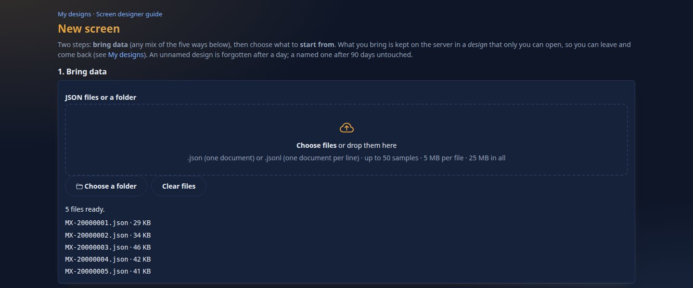

> **What just happened.** The page lists the five files and their sizes. Nothing is uploaded yet: the files become **samples** of a design when you press *Create design*.
> **Why.** One document tells you what *that* trade looks like; five tell you what is always there, what varies and what is rare. All three decide which panels are worth drawing.
> **Try this.** Add a sixth file that is not a trade. The next steps will show you the field conflicts it causes ([the Data pane](SCREEN_DESIGNER.md#3-the-data-pane-samples-shape-palette)), then remove it.

The other ways in (a JSON Schema, entities from a store, an example, an existing Sutra, a pack) are in [section 1 of the guide](SCREEN_DESIGNER.md#1-start-bring-data); project 3 uses the registry.

### Step 3. Name it, give it a kind, leave auto-design on

Scroll to **2. Start from**. Keep *Auto-design a first screen from the samples*, name the design `Rates trade screen` and set the kind of entity to `trade`.


Press **+ Create design**.

> **Why.** A named design is kept 90 days; an unnamed one is forgotten after a day. The kind (`trade`) is what the finished Sutra will apply to.
> **If it goes wrong.** If the page says *Auto-design: HTTP-500* the design was still created; press *open it as it stands* and use the **Auto-design** button once the cause is fixed.

### Step 4. Read the first draft

The workbench opens on a screen drawn from your data.

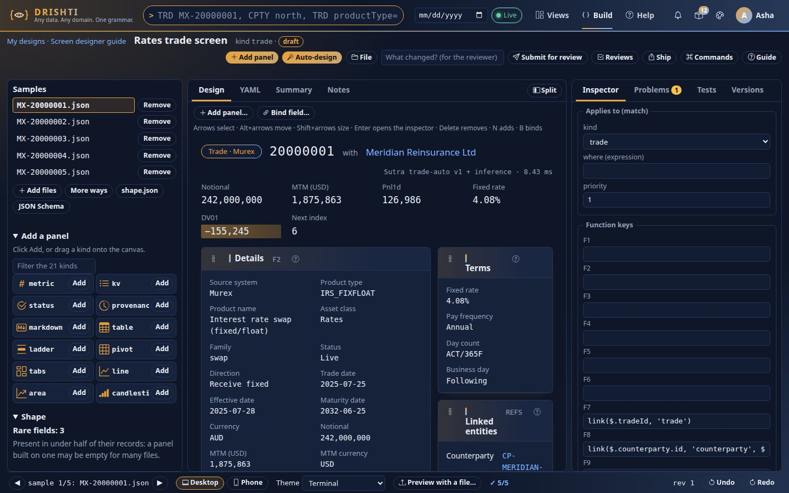

> **What just happened.** Drishti read the samples, decided what each part is (the trade id, a counterparty link, six key figures, a facts panel, tables and charts), and drew the *real* screen of the first sample. The header says `kind trade · draft`; the status bar says `✓ 5/5` (all five samples render without errors), `rev 1` and offers Undo and Redo. The bar above the screen holds **+ Add panel**, **Auto-design**, **File**, the note box for the reviewer, **Submit for review**, **Reviews**, **Ship**, **Commands** and **Guide**.
> **Why.** Starting from a draft is faster than a blank page, and because it is the real preview you judge the result, not a sketch of it.
> **Try this.** Press the ▶ in the status bar to see the same screen on the next sample. The tabs **Design**, **YAML**, **Summary** and **Notes** are different views of the same Sutra ([section 2](SCREEN_DESIGNER.md#2-the-workbench-at-a-glance)).

### Step 5. Read the shape and the roles

In the left pane, open **Shape**, click the `mtm` row and press Enter.

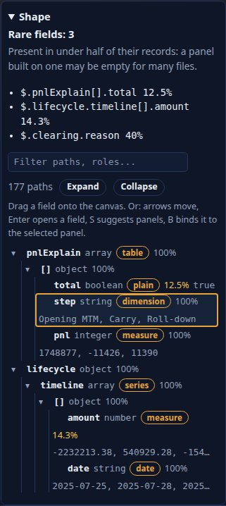

> **What just happened.** The row opened to show the path (`$.mtm`), its **role** (`measure`: a number to add up or chart), how many of the five documents have it and example values. Roles are how Drishti decides: an `id` names the screen, a `series` becomes a line, an `ohlc` a candlestick ([the roles](SCREEN_DESIGNER.md#3-the-data-pane-samples-shape-palette)).
> **Why.** If a panel looks wrong, the role of its field is the first thing to check. A field with the wrong role is fixed by your data, not by arguing with the draft.
> **Try this.** Type `rare` in the filter box, or read the *Rare fields* note above the tree: those are fields that fewer than half your samples have. A panel built on one is empty for the other documents.

### Step 6. Ask Auto-design to explain itself

Press **Auto-design**. The workbench asks before it replaces anything.

> **What just happened.** The question *Replace the Sutra? Auto-design replaces the Sutra (revision 1) with a new draft. Undo brings the old one back.* is the workbench's own, not the browser's. Press its **Auto-design** button.

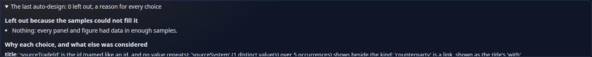

Above the screen a box opens: *The last auto-design: 0 left out, a reason for every choice*. Scroll it to the second heading.

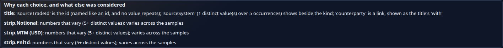

> **What just happened.** Every part of the draft has a sentence behind it. The title says *'sourceTradeId' is the id (named like an id, and no value repeats)*; each key figure says why it was chosen (*numbers that vary (5+ distinct values)*) and which one is emphasised (*it varies most across the samples*); a table-shaped list says what else it could have been. For `sensitivities` the draft chose bars (*signed amounts by bucket read best as bars*), with `line` and `table` as the runners-up.
> **Why.** You should never have to guess why a panel is there. If a reason is wrong, your data (or the role of a field) is the thing to fix. Panels that came out empty or broken on many samples are listed under *Left out because the samples could not fill it* ([section 7](SCREEN_DESIGNER.md#7-auto-design-and-its-alternatives)).
> **If it goes wrong.** If you pressed **Auto-design** after refining your own work, **Undo** (status bar, or Ctrl+Z) brings your previous Sutra back.

### Step 7. Swap a panel for its runner-up

The runner-up for `sensitivities` is a line. Hover the panel and press the trash button in its heading (named *Remove panel Sensitivities*).

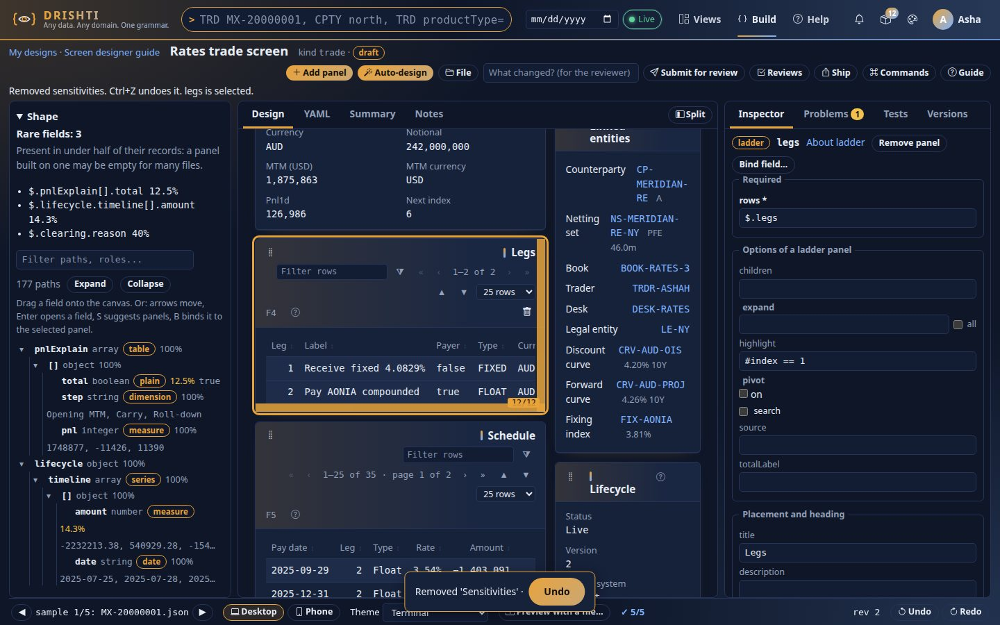

> **What just happened.** The panel is gone, and a toast says *Removed 'Sensitivities' · Undo*. Nothing asked "are you sure": Undo brings it back in place ([removing a panel](SCREEN_DESIGNER.md#removing-a-panel)).

Now drag the field back. In the shape filter type `sensitivities`, drag that row onto the lower edge of any panel and let go.

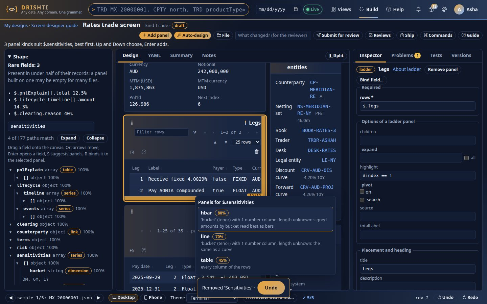

> **What just happened.** Dropping on an *edge* (not the middle) asks for suggestions: `hbar 80%`, `line 70%`, `table 45%`, each with its reason. Dropping on the *middle* of a panel binds the field into it instead ([section 6](SCREEN_DESIGNER.md#6-drop-a-field-suggestions-and-binding)).

Choose **line** with the mouse, or Down then Enter.

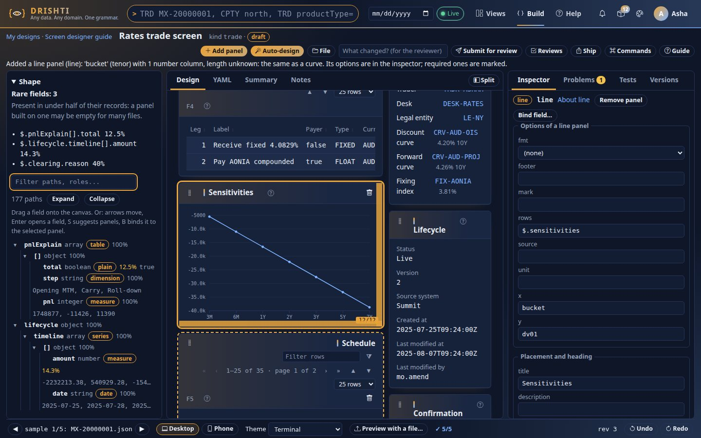

> **Why.** Swapping is "remove, drop again, pick another". The new panel arrives selected, with its inspector open and the options it needs filled from your data (`rows: $.sensitivities`, `x: bucket`, `y: dv01`).
> **Try this.** Press **Undo** twice and watch the bars come back, then **Redo** twice.

### Step 8. Move and resize with the mouse

Drag a panel by its heading (the grip ⋮) to another place; a bar shows where it will land.

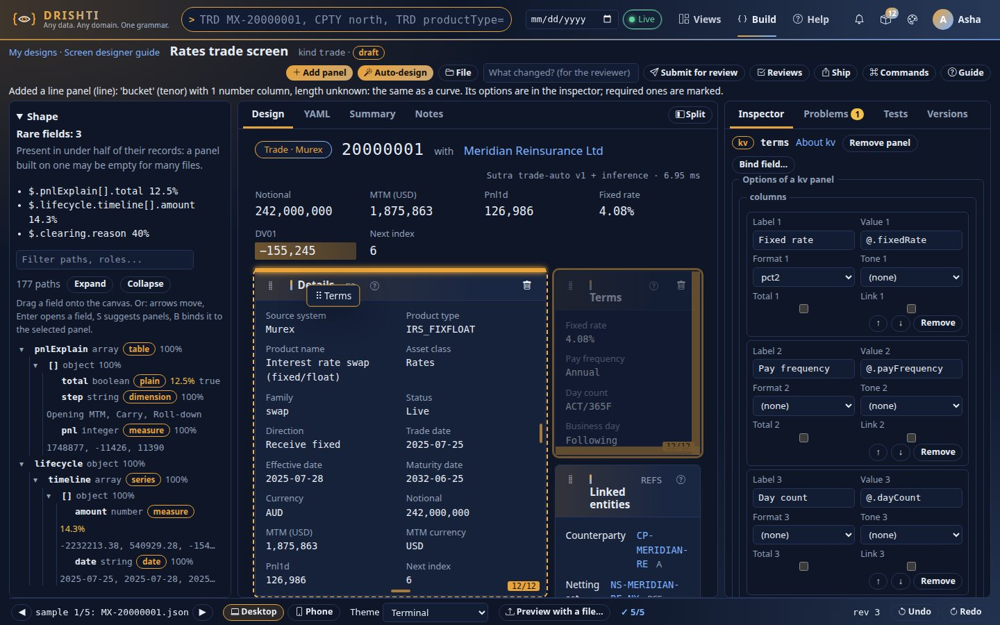

Then point at a panel and drag its right edge.

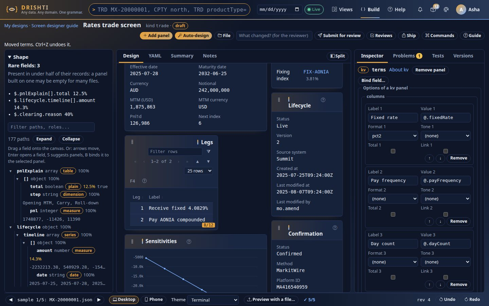

> **What just happened.** Each move or resize is one operation on the Sutra, with a revision. The status line said *Moved terms. Ctrl+Z undoes it* and *legs is 8 of 12 columns wide*. Panels narrower than 12 columns sit side by side ([the grid](SCREEN_DESIGNER.md#4-the-canvas-and-the-grid)).
> **If it goes wrong.** Esc during a drag cancels it. If the status says the design changed elsewhere (a second tab), it reloaded; make the change again.

### Step 9. Check every sample

Open **Tests** (right pane).

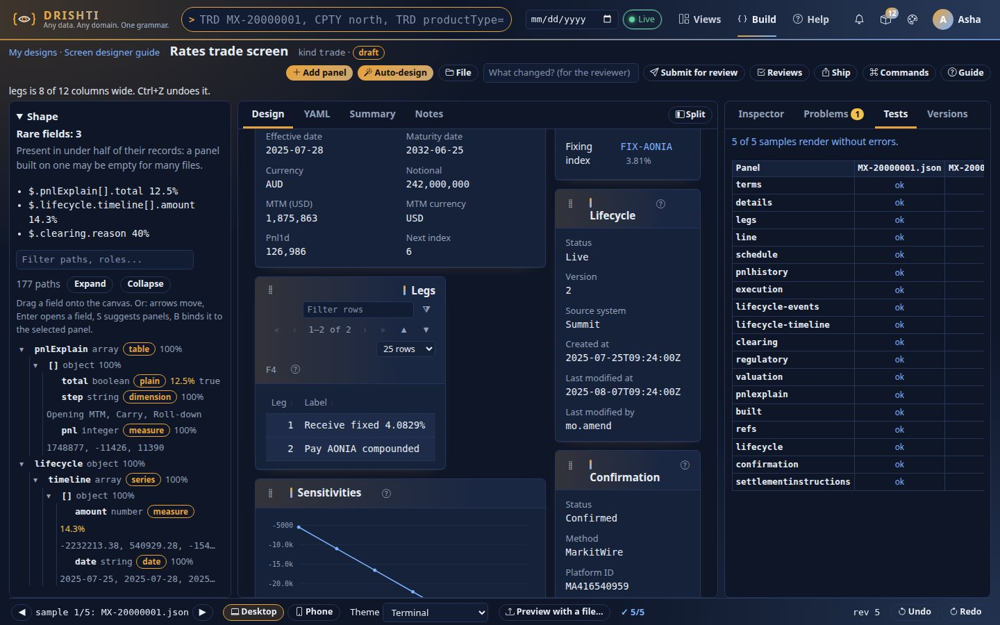

> **What just happened.** A row per panel and a column per sample; *ok* means it drew data. The line above says *5 of 5 samples render without errors*, and the status bar shows `✓ 5/5`. A moment after each change the whole matrix is checked again ([section 11](SCREEN_DESIGNER.md#11-tests-as-you-type)).
> **Why.** "Looks right on the sample I am looking at" is not a test. The same matrix goes to the reviewer as evidence (step 15).
> **Try this.** *Empty* is not an error: it means a sample has nothing for that panel. Preview the design with a file that lacks fields (**Preview with a file…**, [section 12](SCREEN_DESIGNER.md#12-preview-with-a-file)) and read the cells.

### Step 10. Give the Sutra a name

The draft is called `trade-auto`. Open the **YAML** tab and change the second line to `sutra: rates-trade`.

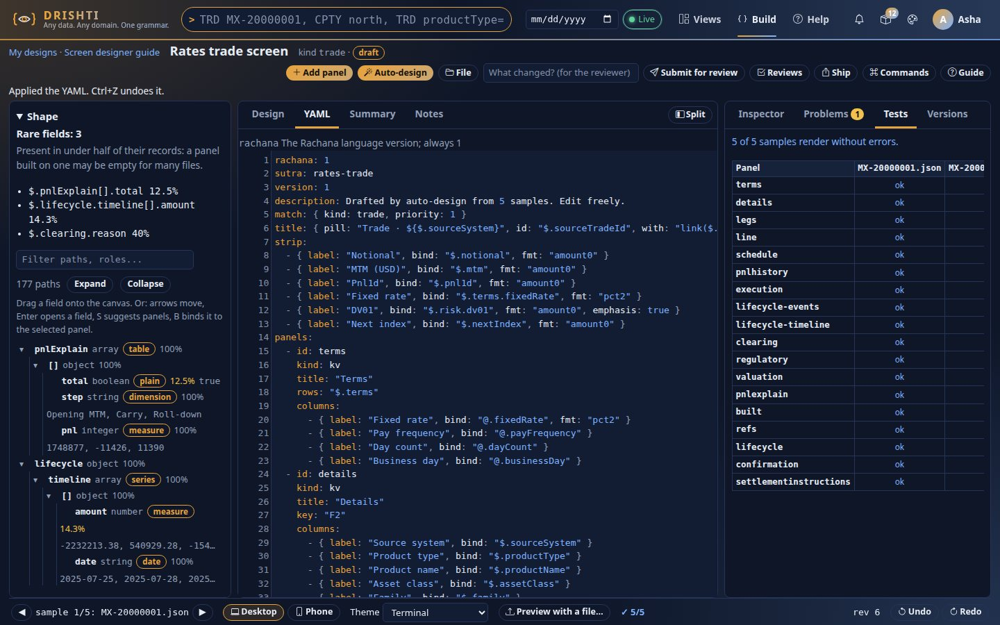

> **What just happened.** Typing in the YAML tab is an operation like any other: a moment after you stop, the text is sent, checked by the server and applied. If the server refuses it your text stays and the **Problems** tab says where ([section 9](SCREEN_DESIGNER.md#9-the-yaml-tab-the-split-view-and-the-summary), [section 10](SCREEN_DESIGNER.md#10-problems)).
> **Why.** The name is the Sutra's identity in the registry, in reviews and in versions: `rates-trade` v1 is what an approver will see.
> **If it goes wrong.** Wait until the status line says *Applied the YAML* before you leave the tab or press Submit. A name the registry already holds as a *different* Sutra is refused when you propose.

### Step 11. Say what it applies to

Go back to **Design** and click an empty part of the page so that nothing is selected; the inspector shows the screen's own settings.

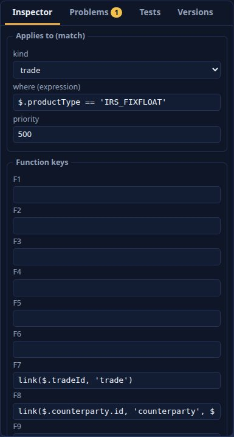

Under *Applies to (match)* type `$.productType == 'IRS_FIXFLOAT'` in **where (expression)** and `500` in **priority**.

> **What just happened.** The YAML now has `match: { kind: trade, priority: 500, where: "$.productType == 'IRS_FIXFLOAT'" }`.
> **Why.** More than one Sutra can match a trade. The most specific wins, and among equals the higher **priority** does; the Murex swap Sutra that ships with the demo packs has priority 10, so 500 puts yours first. Without a `where` your screen would claim *every* trade, including bonds it knows nothing about.

### Step 12. Propose it

Type a note for the reviewer in *What changed? (for the reviewer)* and press **Submit for review** (or Ctrl+S).

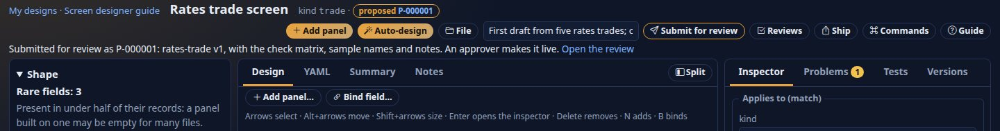

> **What just happened.** The server checked the Sutra once more, then sent a **proposal** with its evidence: the matrix, the *names* of the samples (not their contents), your notes and the design's identity. The status next to the title became **proposed P-000001**. Nothing is live yet ([section 22](SCREEN_DESIGNER.md#22-saving-and-proposing)).
> **Why.** Review is on and four eyes are on, so a Studio save is a proposal; you could not approve it yourself even with the right.
> **If it goes wrong.** *Designing is open to everyone; saving needs the author right* means `asha` lacks the role or saving is off on this server. *rates-trade@1 is already live exactly as proposed* means that text is already published; change something.

### Step 13. Switch to the approver

Sign out and sign in as `ravi`. Open **Build → Reviews**.

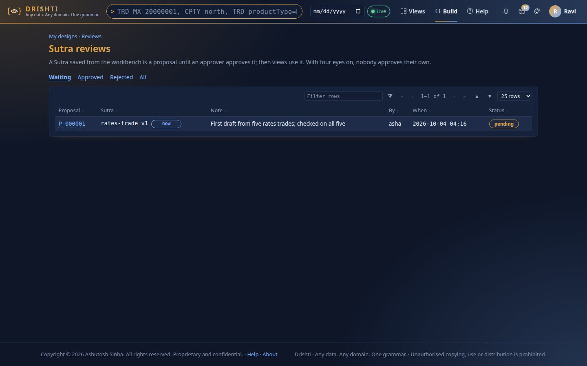

> **What just happened.** The *Waiting* list shows the proposal: Sutra and version, your note, who proposed it and when. The Build menu shows how many are waiting.

Open it.

### Step 14. Read the evidence, then approve

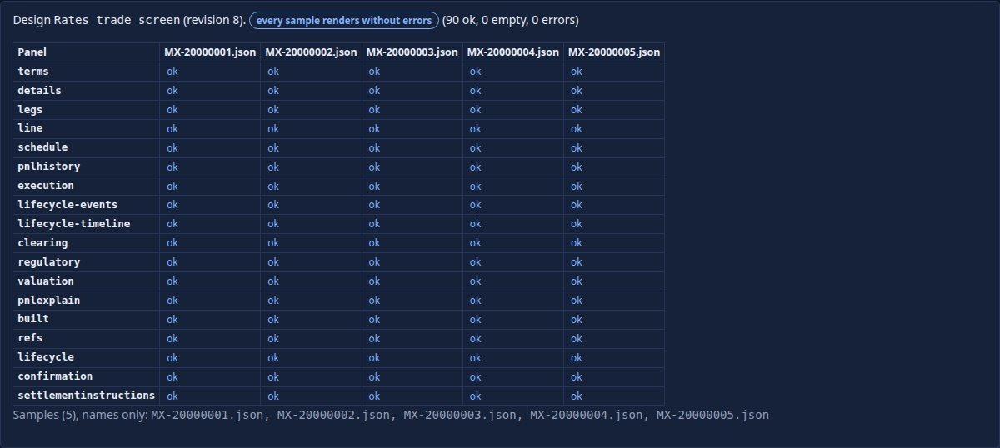

> **What just happened.** Under the diff of the whole Sutra (it is new, so every line is added) the reviewer sees the same matrix you saw, which samples were used (and which, if any, were generated from a schema and so are not real data), and your notes. No sample content travels.
> **Why.** An approver should not have to rebuild your design to trust it.

Press **Approve and publish**.

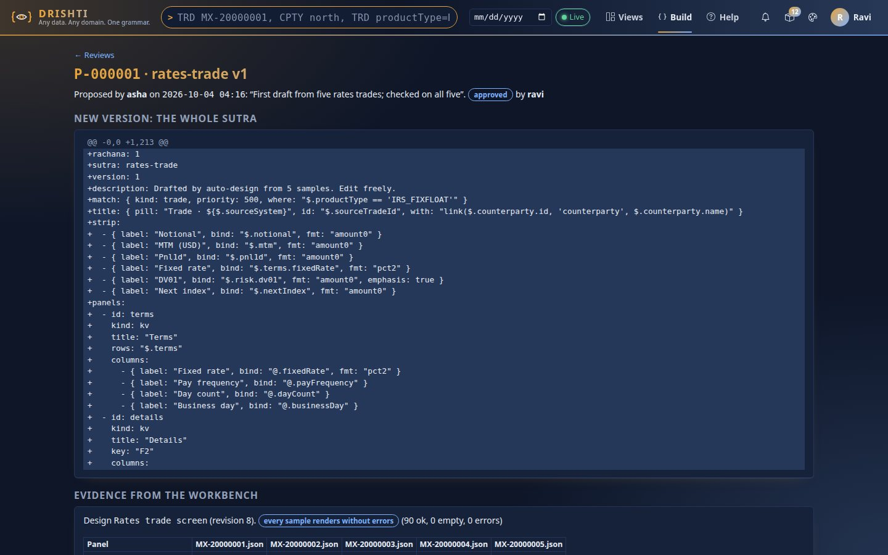

> **What just happened.** The Sutra was written to the registry as `rates-trade` v1 and the proposal says *approved by ravi*. *Reject* would need a reason and send the design back to `draft`.

### Step 15. See it live in My designs

Sign in as `asha` again and open **Build → My designs**.

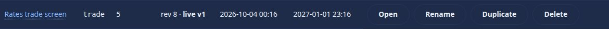

> **What just happened.** The status is **live v1**. A design edited after it was proposed or approved goes back to `draft`: the status always describes the revision you are looking at.

### Step 16. Open a real trade

In the command box at the top of the page type `TRD productType=IRS_FIXFLOAT` and press Enter, then open the first trade of the list.

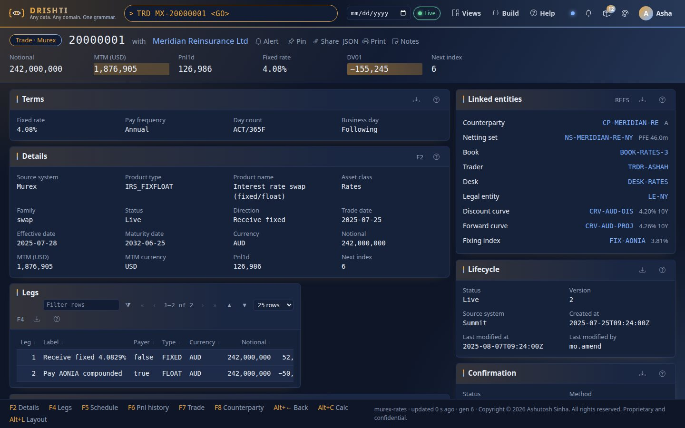

> **What just happened.** The trade opens with the title `Trade · Murex`, the six key figures and the panels of your design. The screen followed the data of a trade the design never saw: that is the proof of "from the shape of the data".
> **Why.** The next request after approval already uses the new Sutra; there is no restart.
> **If it goes wrong.** If you see the shipped Swap layout instead, either the `where` (step 11) is missing a character or the priority is lower than the shipped Sutra's; open the Sutra in a design and look at its `match`.

Project 1 is done. The reference version of this road is [section 23](SCREEN_DESIGNER.md#23-end-to-end-from-a-folder-of-json-to-a-live-screen).

---

## Project 2: by hand, from a blank design

No auto-design this time. You choose every panel and bind it from the shape. The data is a desk report: headline figures, facts, a P&L history, positions by desk and book, and an exposure tree.

### Step 17. Start from an empty Sutra

**Build → New screen**, choose the three `desk-*.json` files, pick **An empty Sutra for the kind**, name the design `Desk report` and the kind `desk-report`.

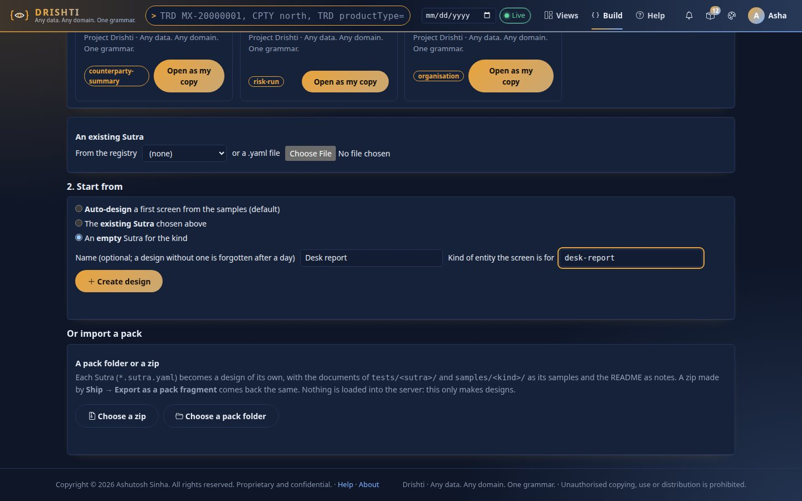

### Step 18. Look at the empty design

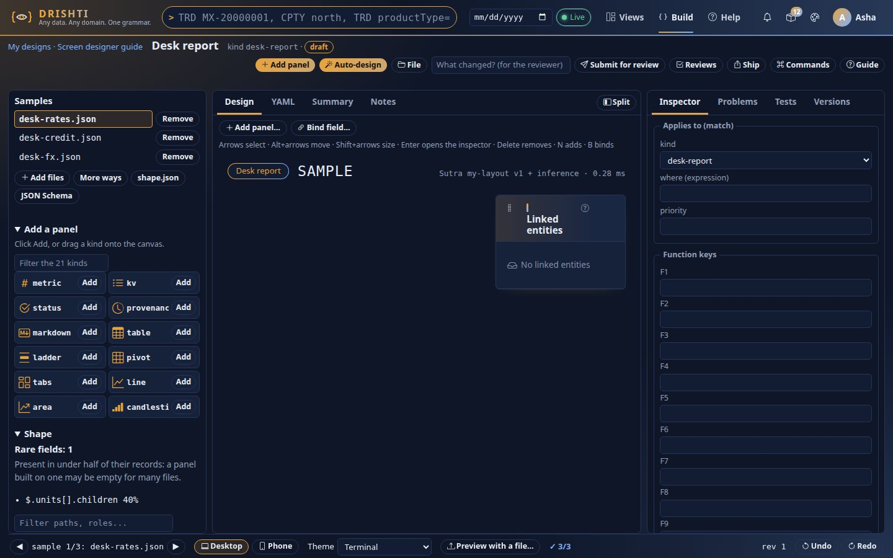

> **What just happened.** The Sutra holds no panels but the default *Linked entities* one (`refs`, empty here because the desk has no links). The shape tree lists the paths of the three desks; the *Rare fields* note warns that `$.units[].children` is in only 40% of the records.
> **Why.** The kind `desk-report` does not exist in any pack of this server; that does not matter for designing, because the samples are the data. It matters at the end (step 30).

### Step 19. Add a metric with + Add panel

Press **+ Add panel**, type `metr`.

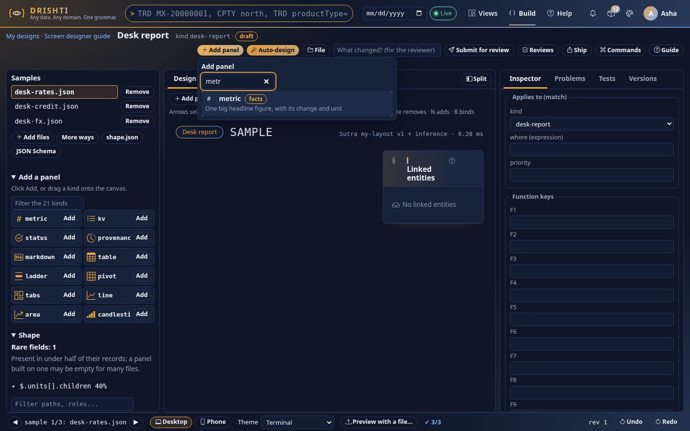

Press Enter.

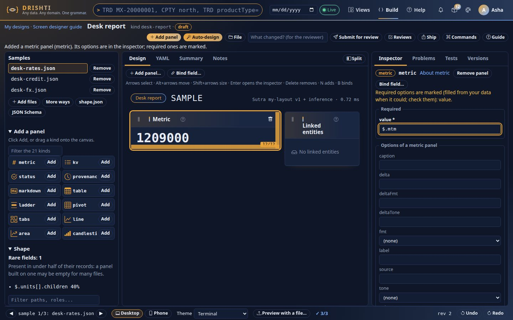

> **What just happened.** The tile shows `1209000` (the first number of the data) and the inspector says *Required options are marked (filled from your data when it could; check them): value.* The kind is described in [the catalogue](PANEL_KINDS.md#metric); the chooser is [section 5](SCREEN_DESIGNER.md#5-add-a-panel).
> **Why.** A new panel always draws something at once, from a guess about your data; the guess is marked so you do not forget to check it.

### Step 20. Fill the tile's options, with an expression

In the inspector set `title` to `Mark to market`, `fmt` to `signed0`, `tone` to `sign`, `unit` to `USD` and `span` to `4`. For `delta` start typing `$.mtm - $.mtmY`.

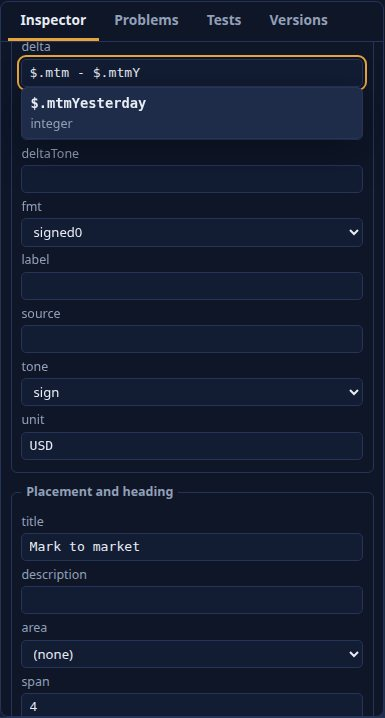

> **What just happened.** After `$` the field offers the paths of your shape; `$.mtmYesterday` is suggested with its type. Up/Down choose, Enter or Tab take, Esc closes, Ctrl+Space asks ([section 8](SCREEN_DESIGNER.md#8-the-inspector)).

Finish the expression `$.mtm - $.mtmYesterday`, set `deltaFmt` to `signed0` and `caption` to `versus yesterday's close`.

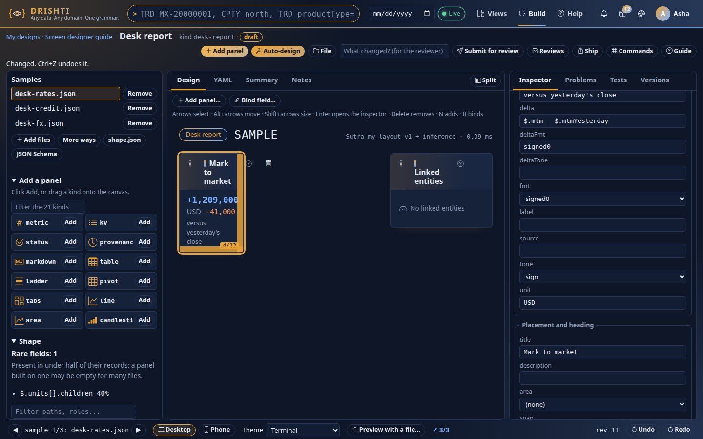

> **Why.** `delta` is an expression, so it can be a difference, a ratio or anything the expression language computes; see [RACHANA_REFERENCE.md](RACHANA_REFERENCE.md#metric) for every option.
> **If it goes wrong.** Each field sends its change when you leave it. If you typed and nothing changed, press Tab. A wrong expression shows in **Problems** with its line.

### Step 21. Duplicate it into a row of tiles

Right-click the tile, choose **Duplicate**; do it twice. Then select each copy (click it) and change its `value`, `title`, `delta` and `fmt`: `$.var99` / `VaR 99%` / `$.var99 - $.var99Yesterday` / `amount0`, and `$.limitUse` / `Limit use` / `$.limitUse - $.var99Yesterday / $.limit` / `pct2`.

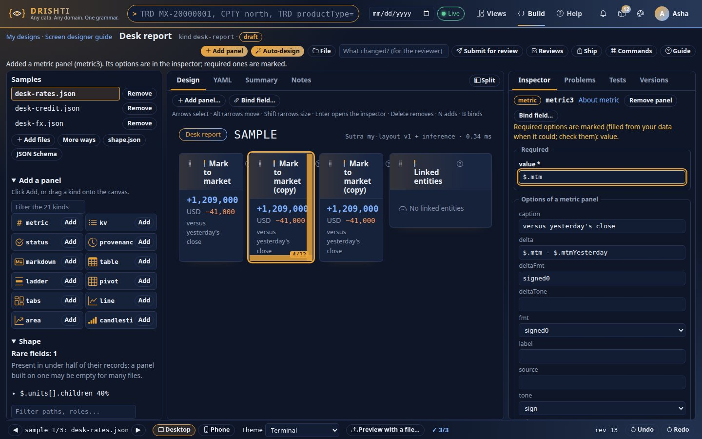

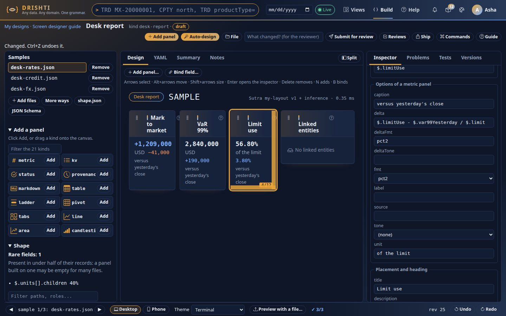

> **What just happened.** A duplicate is a copy placed right after the original, with an id of its own (`metric2`, `metric3`). Three tiles of `span: 4` fill the 12-column row.
> **Try this.** Right-click gives *Move up*, *Move down*, *Duplicate* and *Remove panel*; the command palette has the same.

### Step 22. A key/value panel, built by dropping fields

**+ Add panel**, `kv`, Enter; set its `title` to `Desk`. Now drag four rows of the shape onto the *middle* of the panel, one after the other: `name`, `headOfDesk`, `region`, `reportDate`.

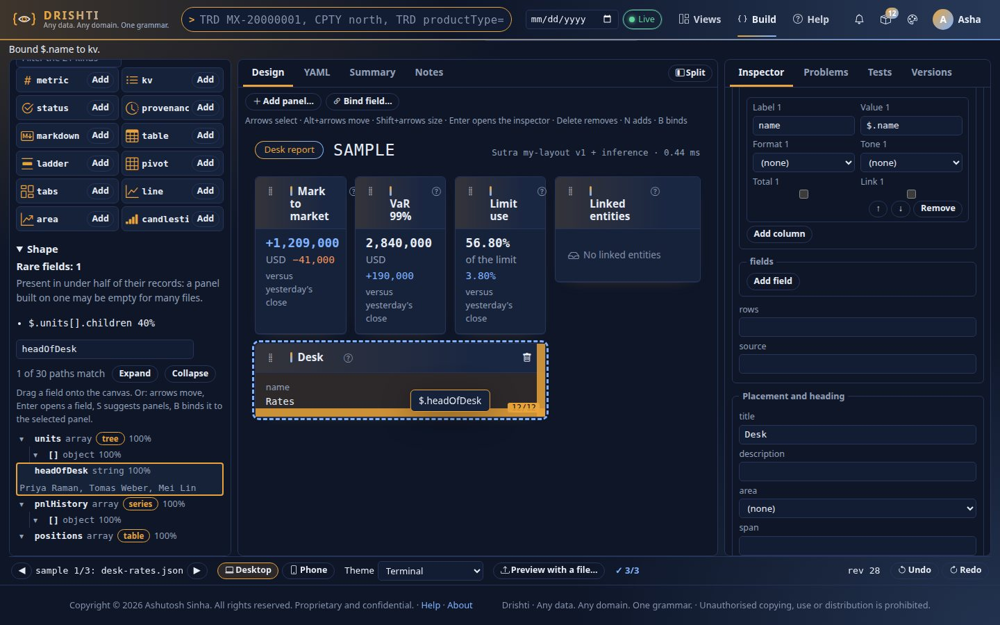

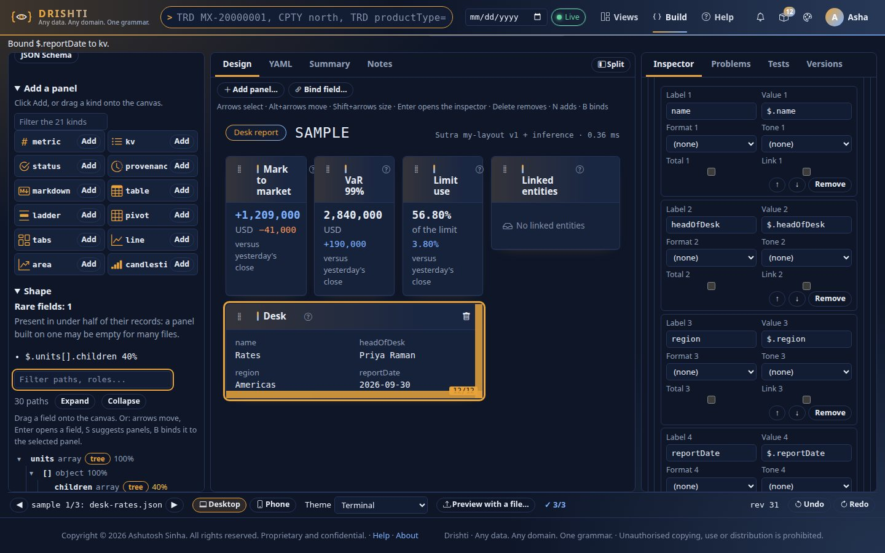

> **What just happened.** Each drop appended a column `{ label, bind: $.path }` to the panel and said *Bound $.headOfDesk to kv.* The labels are the field names; rename them in the inspector (columns list) when you want nicer ones.
> **Why.** Dropping in the *middle* binds; dropping on an *edge* asks for suggestions. The workbench never guesses between them.
> **If it goes wrong.** *'markdown' panels bind no data (DRS-5022)* style messages mean the panel kind cannot take a field. A drop outside any panel does nothing.

### Step 23. A line, a pivot and a tree table by edge drops

Drag `pnlHistory` onto the lower edge of the `Desk` panel and choose **line**. Drag `positions` onto the lower edge of the new line panel and choose **pivot**. Drag `units` onto the lower edge of the pivot and choose **table**.


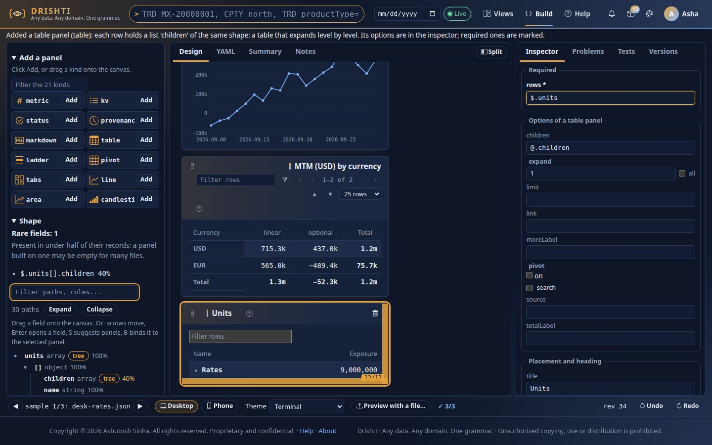

> **What just happened.** `pnlHistory` became `line` with `x: date, y: pnl`. `positions` became a `pivot` (the reason names the dimensions and the measure it found). `units`, whose role is `tree`, became a `table` with `children: "@.children"` and `expand: 1`: a **tree table**, each row opening to its children. See [table](PANEL_KINDS.md#table), [pivot](PANEL_KINDS.md#pivot) and [line](PANEL_KINDS.md#line).
> **Why.** Roles drive suggestions: a `series` suggests a line, a list of rows with dimensions and a measure a pivot, a `tree` a table with children.

### Step 24. Row groups in the pivot

Select the pivot. In the inspector the list **by** holds one item. Set `by 1` to `desk`, press **Add by**, set `by 2` to `book`, and give the panel a clearer `title`. Set `expand` to `1`.

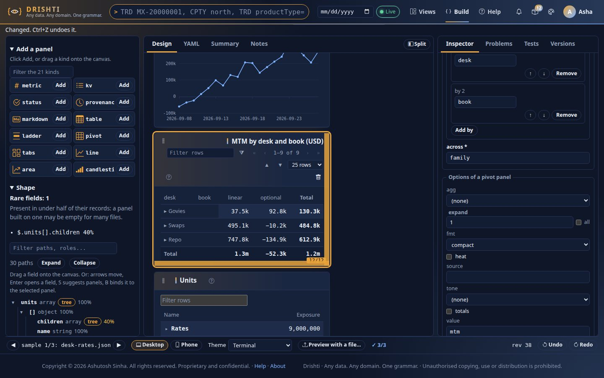

> **What just happened.** The YAML now reads `by: [desk, book]`: the rows group by desk, each opening to its books, with subtotals, and *Total* at the foot. `expand: 1` opens the first level; `all` opens every level.
> **Why.** Row groups are what turn a flat list of positions into something a person can read from the top down. The reference of every pivot option is [RACHANA_REFERENCE.md](RACHANA_REFERENCE.md); the example [pivot-row-groups](examples/pivot-row-groups.md) shows more.

### Step 25. The title line

Click the title line (`Desk report · SAMPLE`).

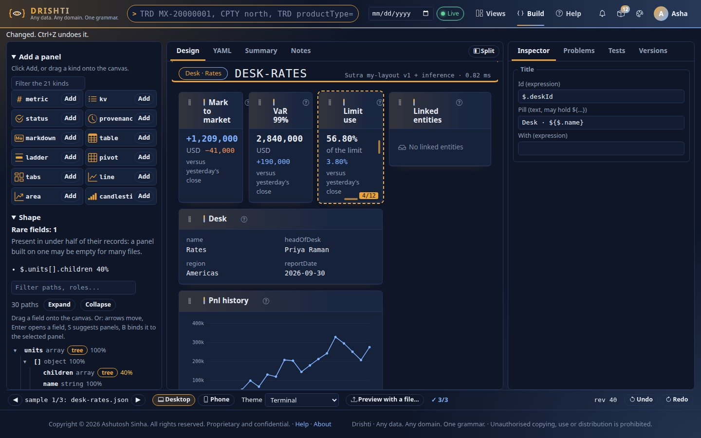

Set **Id (expression)** to `$.deskId` and **Pill** to `Desk · ${$.name}`.

> **What just happened.** The line now reads `DESK-RATES` with the pill `Desk · Rates`: the id is an expression over the document, the pill a text that may hold `${…}`.

### Step 26. A strip of key figures

The strip is the row of figures under the title. Open the **YAML** tab and type, above `panels:`:

```yaml
strip:
  - { label: Open trades, bind: $.openTrades, fmt: amount0 }
```

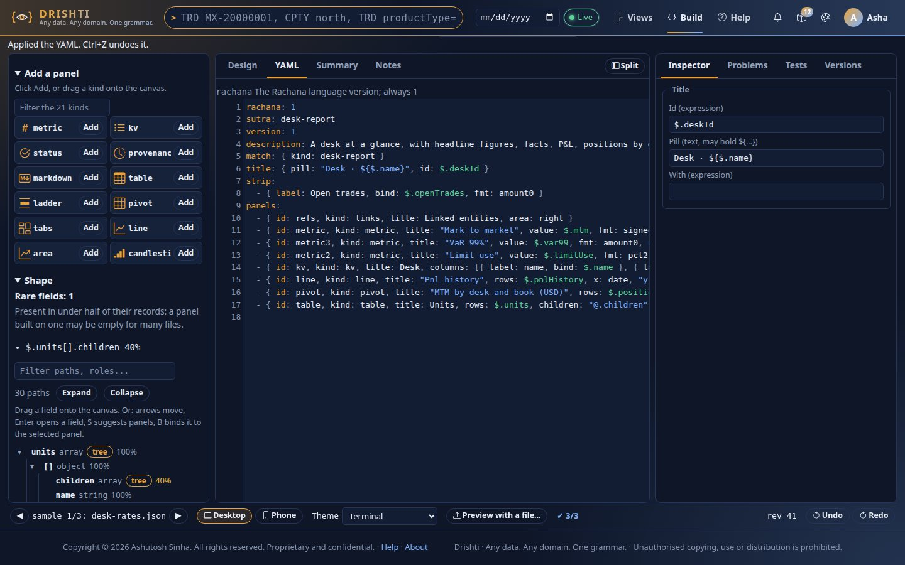

Back on **Design**, click the strip.

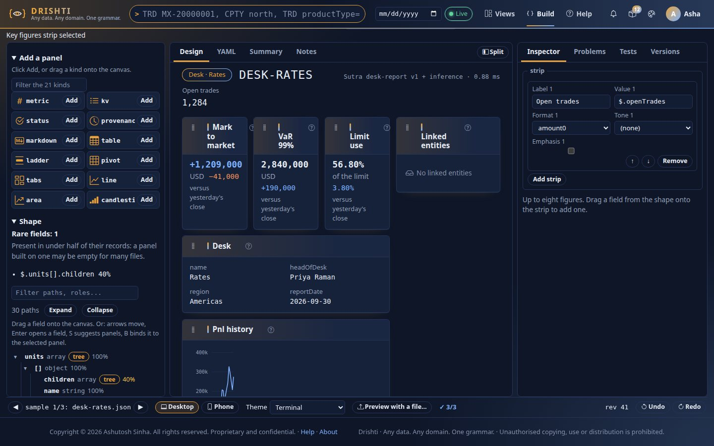

> **What just happened.** In the same breath the tutorial also gave the Sutra a name (`desk-report`) and a description, as in step 10. The strip is a list: *Add strip*, **Remove** and **↑ ↓** change it, up to eight figures.
> **Why.** The YAML tab is for what has no form yet (and for people who prefer text); both edit the same Sutra.

### Step 27. A function key, and the screen's settings

Select the pivot and set `key` to `F2`. Then press Esc and click an empty part of the page.

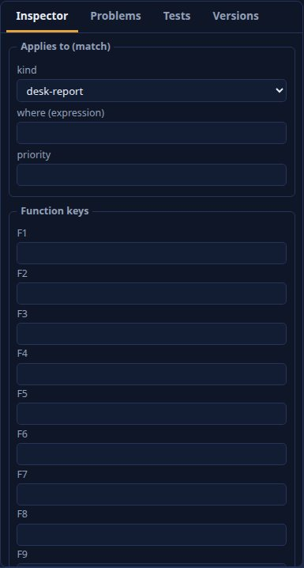

> **What just happened.** `F2` now jumps to the pivot on the finished view (the footer lists the keys). *Applies to* shows the kind `desk-report`; the `where`/`priority` pair you used in step 11 lives there, and the F1–F12 boxes take an expression too, for example a link.

### Step 28. Check phone width and a theme

Press **Phone** in the status bar and choose a theme (**Parchment**).

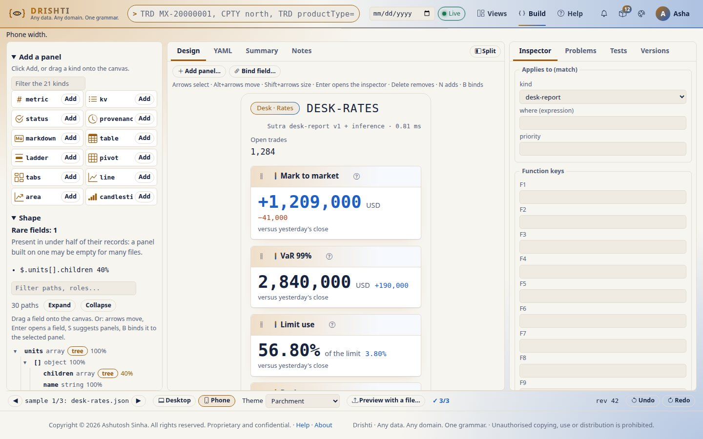

> **What just happened.** The canvas narrowed to a phone's width: the tiles stack, the figure shrinks, the pivot scrolls inside its panel. The theme changes only your preview ([section 14](SCREEN_DESIGNER.md#14-phone-width-and-themes)).
> **Why.** People open screens on phones and in other themes. A figure that wraps or a colour that vanishes shows here first.
> **Try this.** Switch **Theme** through all of them with a tile selected, then back to **Terminal**.

### Step 29. Check every sample and remove what is empty

Open **Tests**.

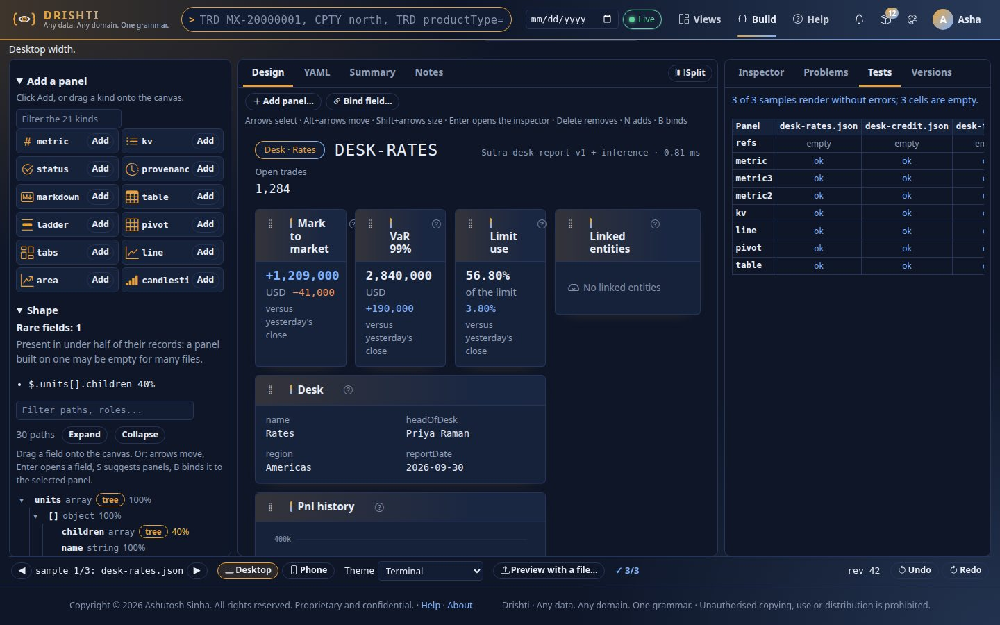

> **What just happened.** *3 of 3 samples render without errors; 3 cells are empty.* The empty cells are the `refs` panel: the desk has no links. Hover it and press its trash button (*Remove panel Linked entities*).

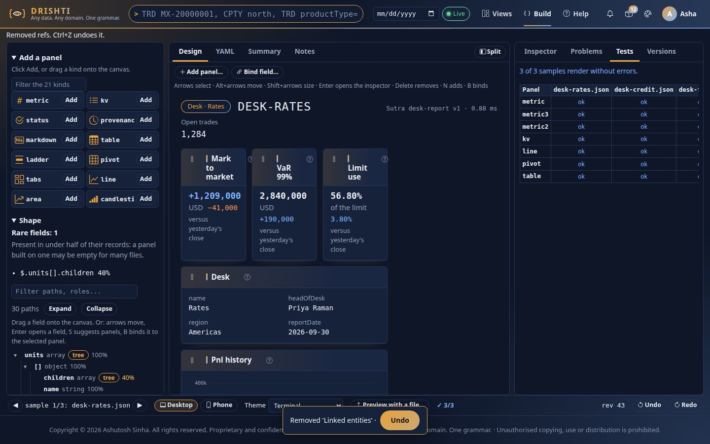

### Step 30. Propose it; approve it as ravi

Type a note, press **Submit for review**.

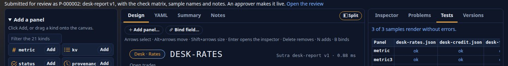

Sign in as `ravi`, open the proposal from **Build → Reviews** and press **Approve and publish**. Sign in as `asha` again and open the design.

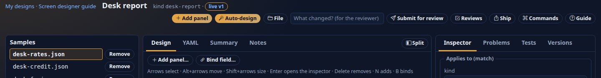

> **What just happened.** `desk-report` v1 is now in the registry. The server has no `desk-report` entities, so there is no `/t` view to open; the proof for this project is the matrix and **Preview with a file…** ([section 12](SCREEN_DESIGNER.md#12-preview-with-a-file)). In your own pack, entities of that kind would use the screen from the next request.

Project 2 is done: a screen of seven panels that you placed one by one.

---

## Project 3: changing a live Sutra

Screens change after they ship. Here you edit the `rates-trade` Sutra project 1 published, while a colleague changes it too.

### Step 31. Open the Sutra from the registry

**Build → New screen**, under *An existing Sutra* pick `rates-trade@1` from the registry, choose **The existing Sutra chosen above**, name the design `Rates trade, with a headline`, kind `trade`.


> **What just happened.** The design is a **copy** of the live Sutra; the original stays untouched until you propose. The header says *edits rates-trade@1*: that is the design's **base**.
> **Why.** The base is what lets the workbench show exactly what a proposal changes, and notice when someone else changes the live Sutra under you.

### Step 32. Add samples to preview with

A design that starts from a Sutra has no samples. Press **Add files** and choose three of the `MX-` files.

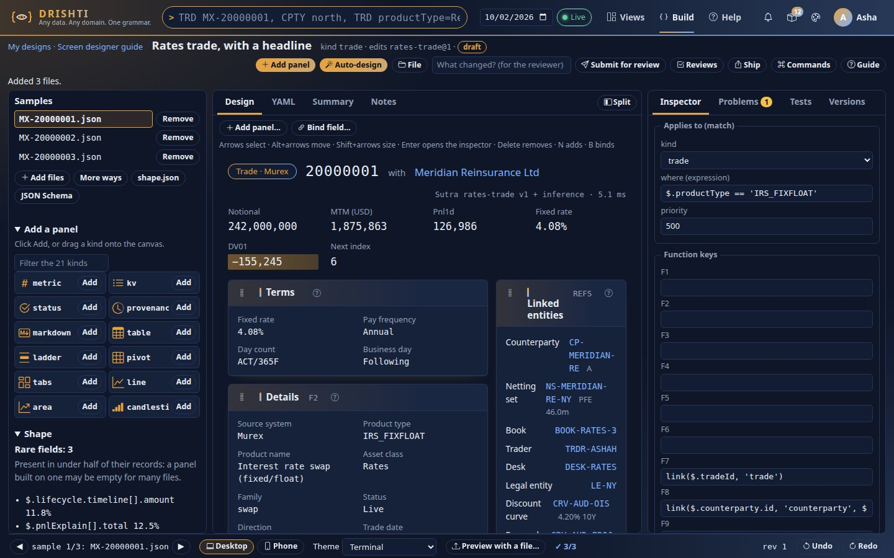

> **What just happened.** The preview line says `Sutra rates-trade v1 + inference`: this is the live layout, drawn from the samples; `✓ 3/3`.

### Step 33. Make a change

Add a headline tile above the details: **+ Add panel**, `metric`, then `value` `$.mtm`, `title` `Mark to market`, `fmt` `signed0`, `tone` `sign`, `unit` `USD`, as in step 20.

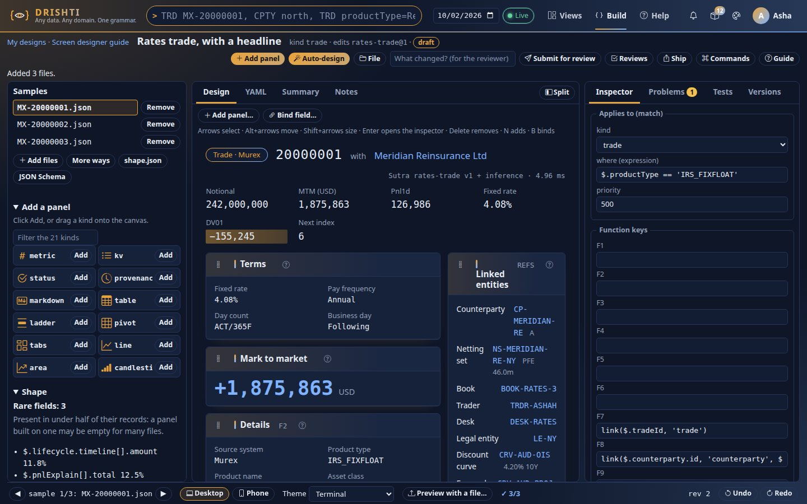

### Step 34. See what you changed: Versions

Open **Versions** (right pane).

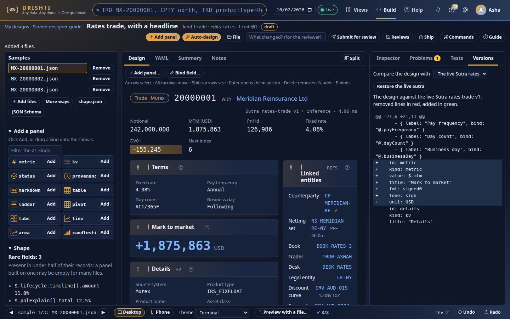

> **What just happened.** The tab compares the design with *the live Sutra rates-trade@1 (where this design came from)*: exactly what a proposal of this design would change. Panels that only moved are described in words first, so a reordering does not drown the edits ([section 21](SCREEN_DESIGNER.md#21-diff-and-versions)).

Pick *Version 0: as it started* from **Compare the design with**.

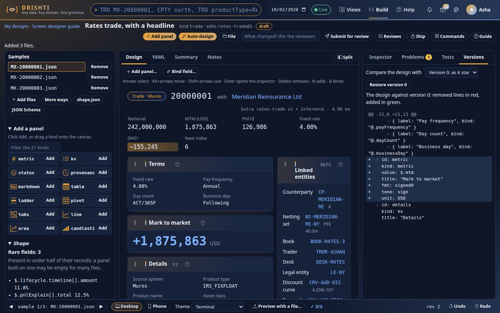

> **Why.** Every step in the design's log is a version (the last 100). **Restore this version** puts one back *as a new step*, so Undo still works and nothing is lost.

### Step 35. A colleague changes the live Sutra first

While you were working, a colleague opened `rates-trade@1` too, renamed the details panel to `Trade details`, proposed it, and an administrator approved it: `rates-trade` is now at version **2**. (The script does this as `ravi` and the development admin; you do not need to.)

> **What just happened.** The live Sutra is no longer the one your design was copied from. Nothing in your design changed.

### Step 36. The base moved: rebase

Open your design again.

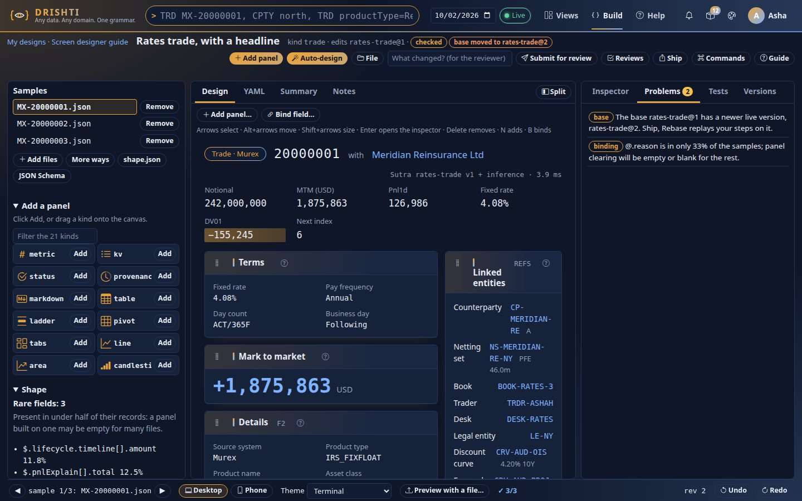

> **What just happened.** The chip **base moved to rates-trade@2** is in the header, and the **Problems** tab says *The base rates-trade@1 has a newer live version, rates-trade@2. Ship, Rebase replays your steps on it.*
> **Why.** Proposing now would be refused as stale, or worse would overwrite the colleague's change. The workbench tells you before you try.

Open **Ship**.

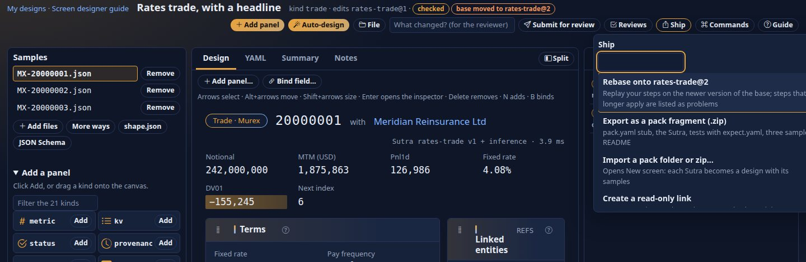

Choose **Rebase onto rates-trade@2**.

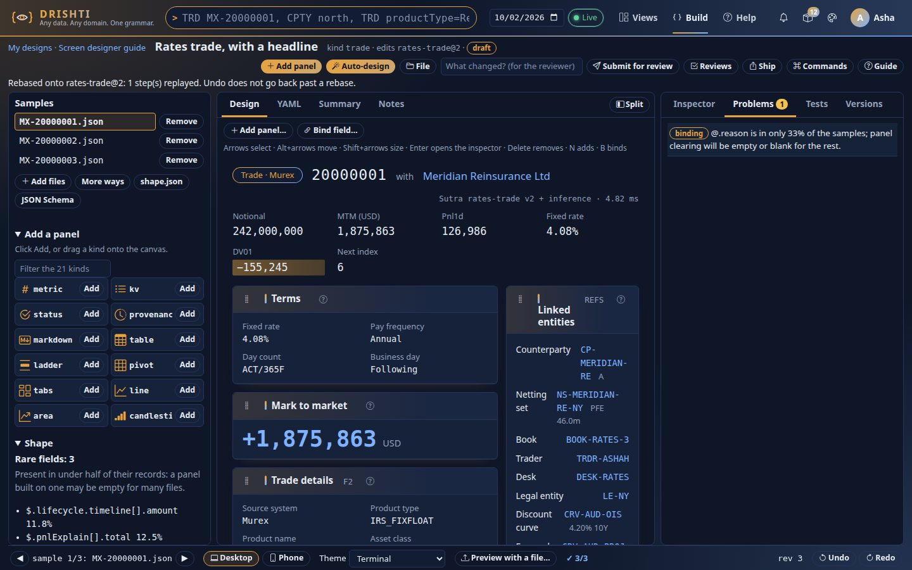

> **What just happened.** The message says *Rebased onto rates-trade@2: 1 step(s) replayed*. Your steps were applied again on top of version 2: the design now has your tile **and** the colleague's `Trade details` title. A step that no longer applies would be listed as a problem. The flag and the old base name are gone from the header. *Undo does not go back past a rebase.*
> **If it goes wrong.** If a replayed step cannot apply (the panel it changes was removed by the colleague) it is listed as a problem; change the design to match the new version and go on.

### Step 37. Propose with evidence; approval publishes the next version

Write a note and press **Submit for review**.

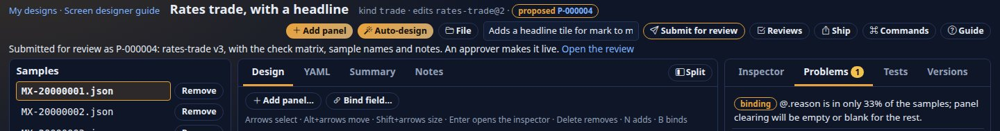

> **What just happened.** The message says *rates-trade v3*: the next version after the colleague's. As `ravi`, open the proposal: the diff is only your change against version 2, and the evidence matrix is on your three samples. Approve it.

Back as `asha`:

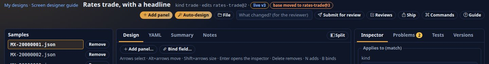

> **Why.** Versions are never overwritten; views use the highest approved one, and the registry keeps every earlier one. Rolling back is a new proposal of the older text.
> **If you wonder.** The header still says *edits rates-trade@2*, the version the design was copied from, and shows no *base moved* flag: the live Sutra is your own v3. To go on changing the Sutra, open `rates-trade@3` from the registry as a new design (step 31).

---

## Project 4: keyboard only

Everything the mouse does has a key ([section 15](SCREEN_DESIGNER.md#15-keyboard-reference)). This project builds a tiny screen without using the mouse after the page has loaded. Open an empty design with `desk-rates.json` and `desk-credit.json` as samples (step 17, or ask your script to do it).

### Step 38. The skip link

Press Tab from the top of the page. The first stop is the console's *Skip to content*; the next is the workbench's own.

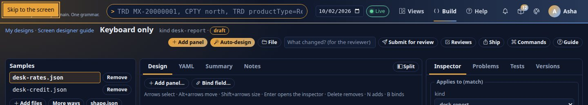

Press Enter.

> **What just happened.** *Skip to the screen* is the first Tab stop of the workbench; Enter puts the focus on the canvas, so you do not tab through the top bar, the samples, the palette and the shape first. From anywhere that is not a text field, **G** then **C** does the same, and so does *Go to canvas* in the command palette. Esc in the inspector returns the focus to the selected panel.
> **Why.** A screen reader or keyboard user should reach the thing being designed in one key.

### Step 39. The command palette

Press **Ctrl+K** and type `add panel`.

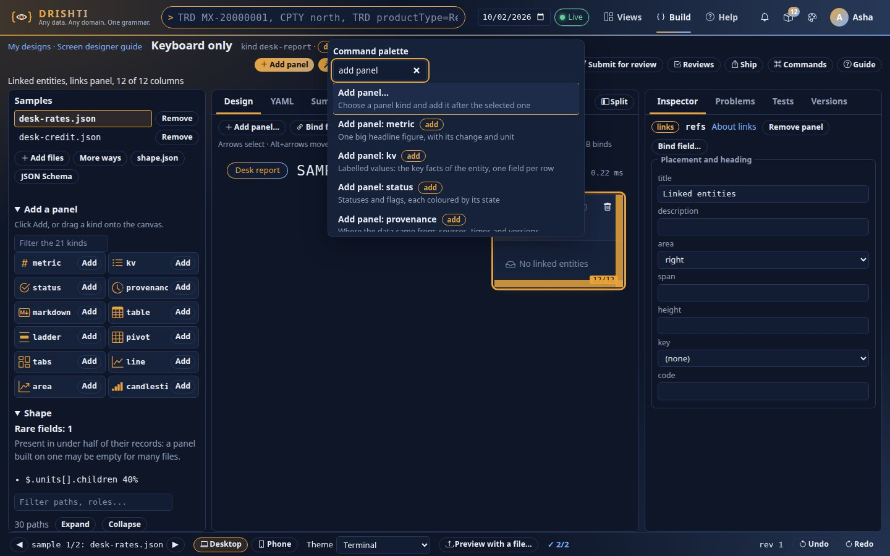

> **What just happened.** A list of commands opened with a filter box. Up and Down move, Enter runs, Esc (or Ctrl+K again) closes and puts the focus back ([section 20](SCREEN_DESIGNER.md#20-the-command-palette)).

Press Esc, then Ctrl+K again, type `add panel: metric` and press Enter.

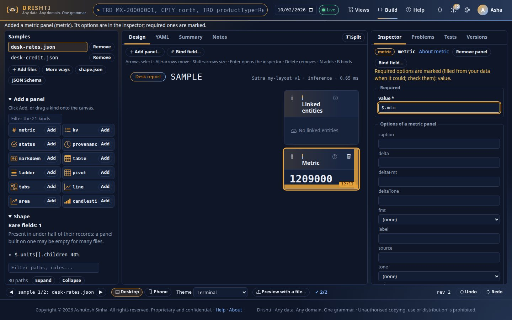

> **What just happened.** The tile is added, selected, and the inspector lists its required `value`. The status line (which a screen reader announces) says what was done.

### Step 40. The chooser from the canvas, and moving between panels

With the focus on a panel press **N**, type `kv`, press Enter.

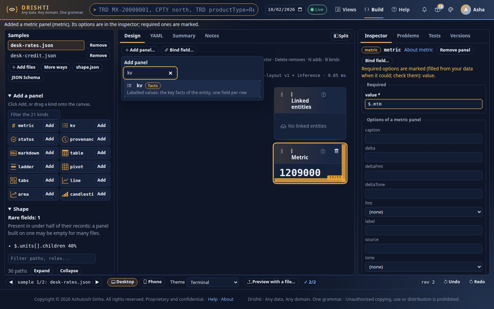

The new panel is *selected*, but the keys act on the panel that has the **focus**. Press **Down** until the focus is on it.

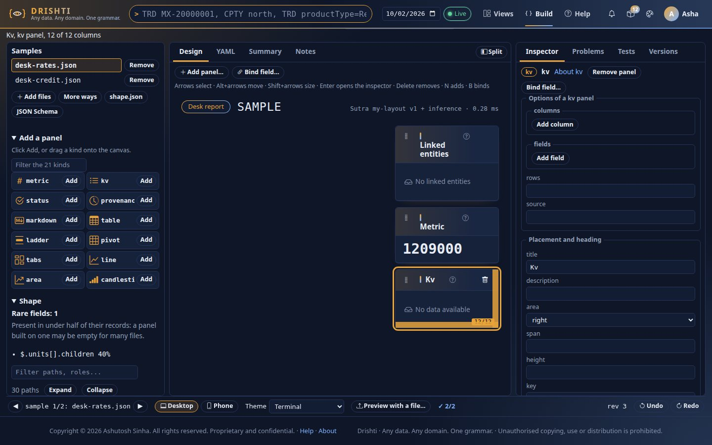

> **What just happened.** Up and Down select the previous or next panel; Left and Right jump to the first panel of the main or side column; Home and End to the first and last.
> **If it goes wrong.** If a size or move key acts on the wrong panel, the focus is somewhere else. Look at the inspector's header (the kind and id of the selected panel) and press Up or Down until it is the one you want.

### Step 41. Move and size it with the keys

Press **Alt+Left** to move the panel to the main column, then **Shift+Left** three times.

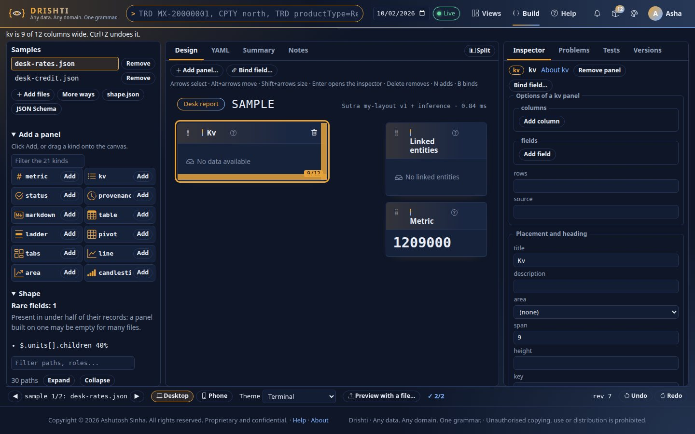

> **What just happened.** Alt+arrows move a panel one place (up or down its column, or to the other column); Shift+arrows change its width by one column (left, right) or its height by one row (up, down). The status line says *metric is 9 of 12 columns wide*.

### Step 42. Bind a field by keyboard

Press **B**, type part of a path, press Enter.

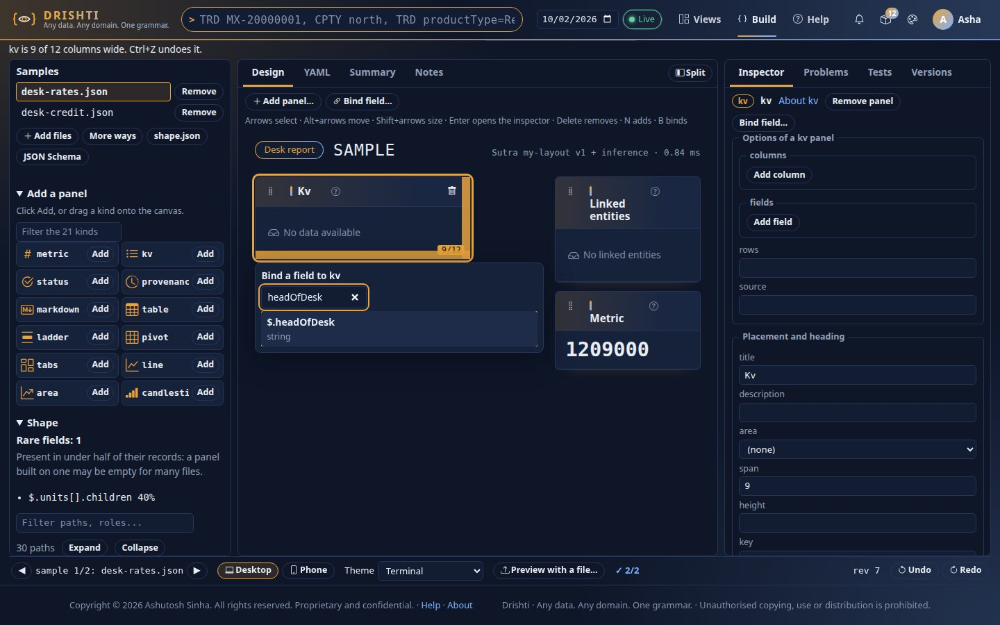

Do it again with `region`.

> **What just happened.** The path was bound to the focused panel, in the option its kind takes next: a `kv` panel gets a labelled value per field. In the shape tree the same is **S** (suggest panels for the focused field) and **B** (bind it to the selected panel).

### Step 43. The inspector by keyboard

Press **Enter** on the panel.

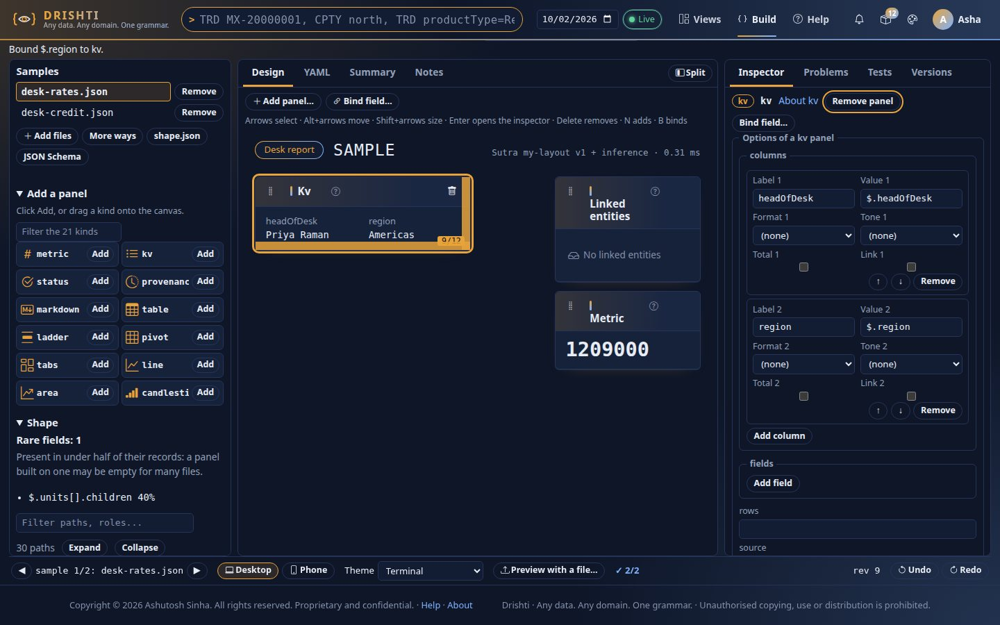

Tab through the fields, change one, and press **Esc** in the inspector.

> **What just happened.** Enter (or double-click) opens the inspector; Esc there puts the focus back on the panel. A change is sent when you leave the field.

### Step 44. Remove and undo

Press **Delete** on the panel.

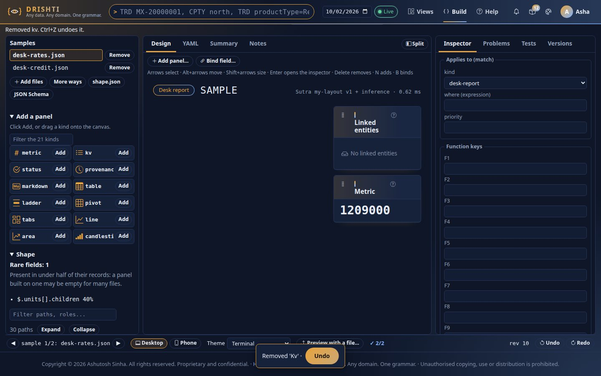

Press **Ctrl+Z**.

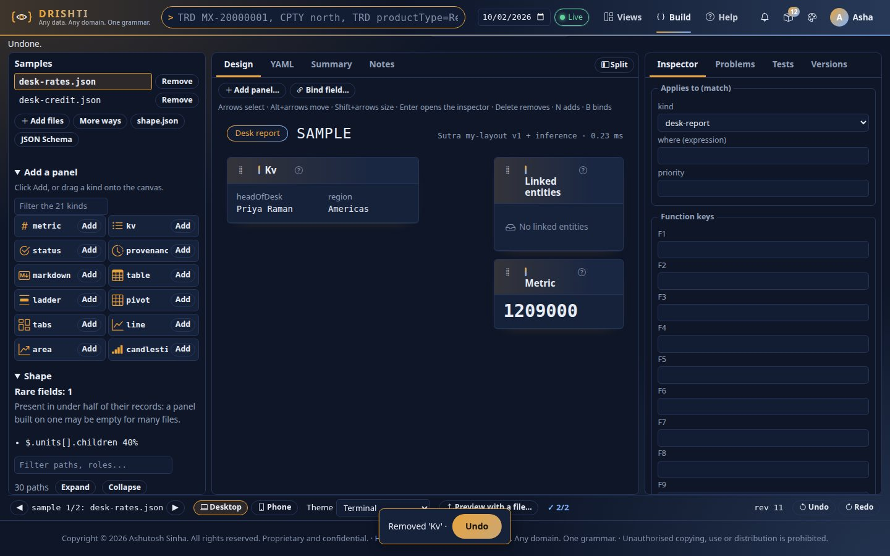

> **What just happened.** Delete removed the focused panel; Ctrl+Z (outside a text field) brought it back in place. Ctrl+Shift+Z or Ctrl+Y redoes.

### Step 45. The rest of the palette

Press Ctrl+K and run `run check`.

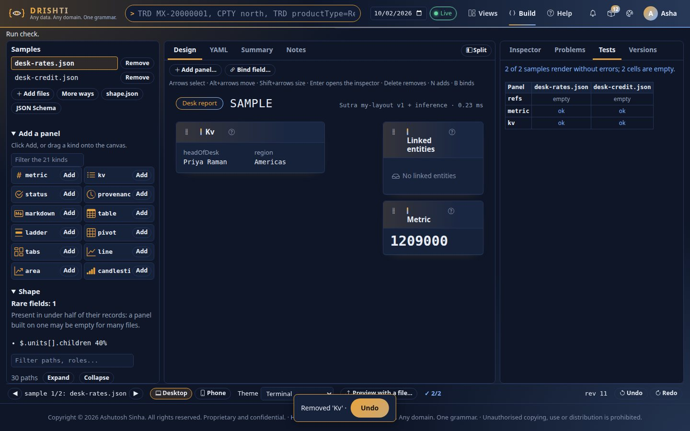

Then `switch to yaml`.

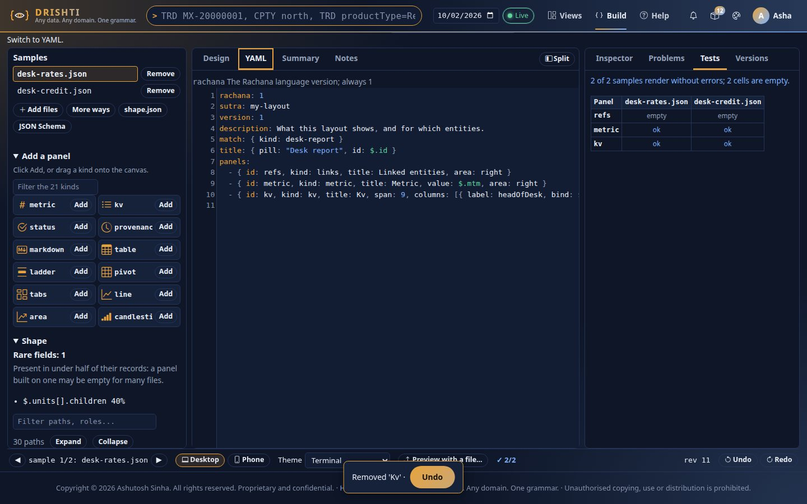

> **What just happened.** The palette runs the same things as the buttons: `run check`, `switch to` any tab, `next sample`, `go to panel: <id>`, `undo`, `redo`, `preview`, `save`, `propose`, `compare`, `open a file`, `guide`.
> **Try this.** Do steps 39 to 44 again with your eyes off the screen, reading only the status line aloud. If you can follow what happened, so can a screen reader user.

Project 4 is done. The full key table is [section 15](SCREEN_DESIGNER.md#15-keyboard-reference).

---

## After the projects: share, ship and check in CI

### Step 46. A read-only link, a pack fragment, the command line

Open **Ship** on the design of project 1.

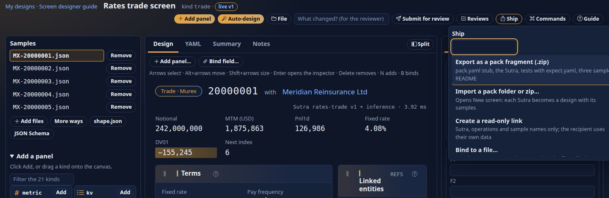

Choose **Create a read-only link**.

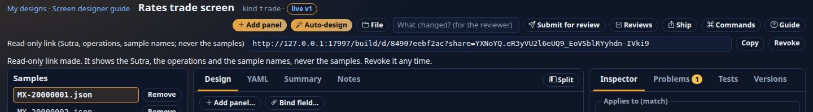

> **What just happened.** The link (`/build/d/<id>?share=…`) lets a colleague, signed in, see the Sutra, the operations you made and the *names* of the samples; they can preview it against data of their own. They never see your samples, notes or tests. **Revoke** stops it at once ([section 25](SCREEN_DESIGNER.md#25-sharing-a-design-read-only)).
>
> **Export as a pack fragment** downloads a zip with the Sutra, tests for every sample and a stub `pack.yaml`, to put in a pack ([section 24](SCREEN_DESIGNER.md#24-pack-fragments-export-and-import)). **Import** brings a pack or a folder of Sutras back as designs.
>
> The same checks run without a browser: `java -jar drishti-server-<version>-exec.jar sutra test config/packs/<pack>` uses the checker of the **Tests** tab, writes JUnit XML for your CI and exits `1` on a problem ([section 26](SCREEN_DESIGNER.md#26-the-command-line-and-ci), [the Sutra command guide](SUTRA_DEVELOPER_GUIDE.md#15-testing-expectyaml-sutra-linttestpreview-ci)). A fragment you export passes it unchanged.

---

## Common mistakes and how to fix them

| You see | Why | Do |
|---|---|---|
| The panel you just dropped a field on is empty | The field is in under half of your samples (*Rare fields*), or its role is not what the panel needs | Look at the field's row in the shape; use a sample that has it, or bind another field |
| A `kv` panel says *No data available* | It has no columns yet | Drop fields on its middle, or press **Bind field…** |
| *Bound … to kv* did nothing visible | The panel is empty for the sample you are previewing | Press ▶ to try another sample; read the **Tests** matrix |
| *Replace the Sutra?* appeared and you are not sure | **Auto-design** replaces your work | Cancel, or accept and use **Undo** to get it back |
| Your typed YAML vanished | The server refused it (the Sutra stays at its last good text) | Read the **Problems** tab: the line and the DRS code |
| A size or move key acts on a different panel | The keys act on the panel with the **focus**, not on the selected one | Up/Down until the inspector's header shows the panel you mean |
| *… is already live exactly as proposed* | The registry holds that exact text | Change something, or you are done |
| Proposal is *stale*, or the header says *base moved* | Someone published a newer version of the Sutra you copied | **Ship → Rebase onto …** (step 36), then propose again |
| *Designing is open to everyone; saving needs the author right* | No author role, or saving is off | Ask for the `author` role; the design stays in **My designs** |
| The live view shows the shipped layout, not yours | Another Sutra matches more specifically or with a higher priority | Check your `match`: `where` and `priority` (step 11) |
| The approver cannot approve | Four eyes: nobody approves their own proposal | Use a second person with the `approver` role |
| Auto-design lists panels under *Left out* | The draft hit the panel limits (`drishti.builder.max-panels`) or the samples could not fill a panel | Read the reason in the box above the screen; add samples that have the data |

More tables of this kind are in [the guide's troubleshooting](SCREEN_DESIGNER.md#17-troubleshooting) and [troubleshooting shipping](SCREEN_DESIGNER.md#28-troubleshooting-shipping).

## Where to read more

- [SCREEN_DESIGNER.md](SCREEN_DESIGNER.md): every workbench feature, every key, limits.
- [PANEL_KINDS.md](PANEL_KINDS.md): the 21 panel kinds, when to use each, what they do when empty, masked or on a phone. Developing a kind: [PANEL_DEVELOPER_GUIDE.md](PANEL_DEVELOPER_GUIDE.md).
- [RACHANA_REFERENCE.md](RACHANA_REFERENCE.md): every key, option, format, tone and the expression language of a Sutra.
- [HOW_IT_FITS.md](../architecture/HOW_IT_FITS.md): how kinds, Sutras, packs, the lake and the console fit together.
- [Examples](examples/README.md): ready-made Sutras with their data; each opens in the workbench as a copy.
- [USER_MANAGEMENT.md](../admin/USER_MANAGEMENT.md): users, roles and the four-eyes rule.

## Regenerating the pictures

```sh
drishti-console/.venv/bin/python tools/docs/screenshots.py --guide tutorial            # all four projects, on a scratch server :18997 and console :17997
drishti-console/.venv/bin/python tools/docs/screenshots.py --guide tutorial --only p3  # one project
drishti-console/.venv/bin/python tools/docs/screenshots.py --list --guide tutorial     # the file names
```

The script needs the built server jar and a JDK 21 or newer (see the header of `tools/docs/screenshots.py`), starts a server with sign-in on, creates `asha` and `ravi`, and never touches the usual `:18480` / `:17480`. The projects build on each other (project 3 edits what project 1 published), so a full run starts from a fresh server. `drishti-console/tests/test_guide_images.py` fails if this tutorial shows a picture that is missing or leaves one that no guide shows.
