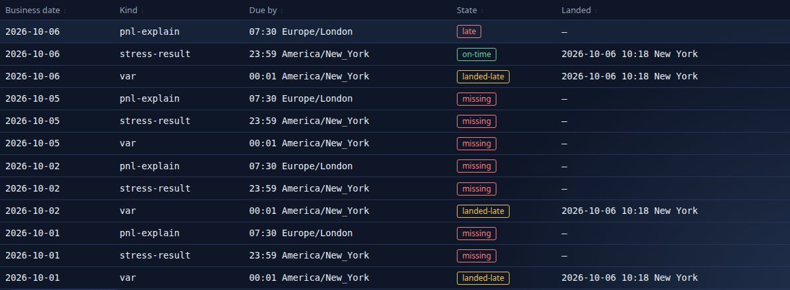
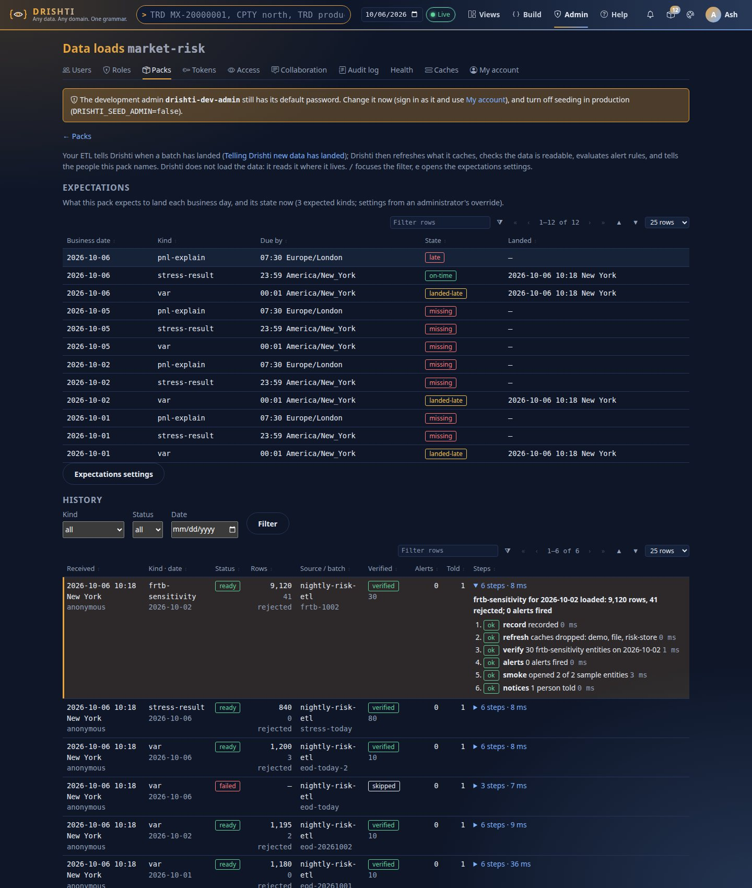
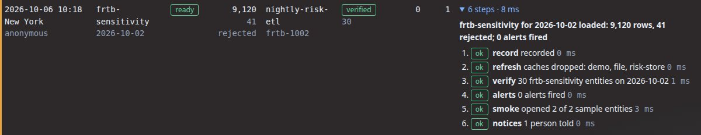
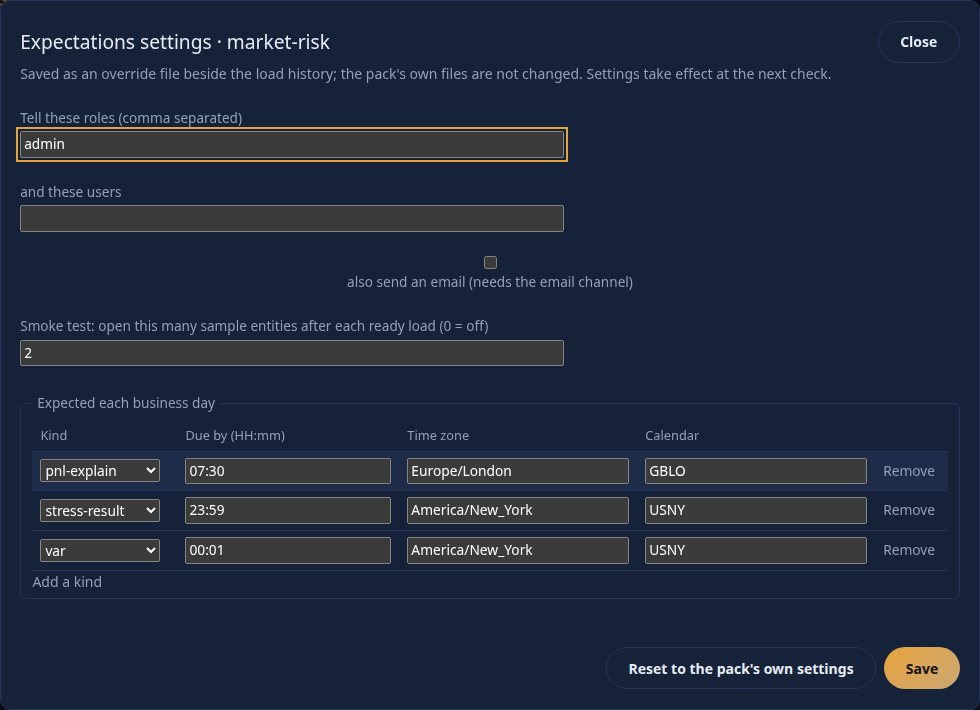
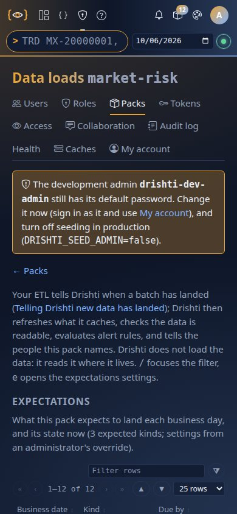

<!--
  Project Drishti · Any data. Any domain. One grammar.

  Copyright (c) 2026 Ashutosh Sinha <ajsinha@gmail.com>.
  All rights reserved.

  PROPRIETARY AND CONFIDENTIAL.

  This file is the confidential and proprietary property of Ashutosh Sinha.
  Unauthorised copying, use, modification, distribution or disclosure of this
  file, via any medium, is strictly prohibited except with the express prior
  written permission of the copyright holder.

  See the LICENSE file in the root of this repository for the full terms.
-->
# Telling Drishti new data has landed

Drishti reads data **where it lives**. It does not ingest, transform or schedule anything: loading the lake, the files or the database
is the job of your own ETL (or of a pipeline engine such as DishtaYantra). What only Drishti can do is **act on the data once it is
there**. One small signal, "this batch has landed", makes Drishti refresh what it caches, check the data is really readable, evaluate the
alert rules on it, and tell the right people. Expectations then flag a batch that has *not* landed in time.

## Contents

1. [Why: what the signal is for](#1-why-what-the-signal-is-for)
2. [Concepts: a load, its status, verified, expectations, late](#2-concepts)
3. [Your first load in five minutes](#3-your-first-load-in-five-minutes)
4. [The API reference](#4-the-api-reference)
5. [The command line reference](#5-the-command-line-reference)
6. [Configuration reference](#6-configuration-reference)
7. [What happens, step by step](#7-what-happens-step-by-step)
8. [Expectations and late data](#8-expectations-and-late-data)
9. [The Data loads page](#9-the-data-loads-page)
10. [Permissions: who may announce a load](#10-permissions)
11. [Recipes: curl, Python, Airflow, cron, DishtaYantra](#11-recipes)
12. [Troubleshooting](#12-troubleshooting)
13. [FAQ](#13-faq)

Related: [API_GUIDE.md](API_GUIDE.md) (every endpoint, the error codes), [CLI_GUIDE.md](CLI_GUIDE.md) (the `drishti.py` program),
[CONFIGURATION.md](../admin/CONFIGURATION.md) (every setting), [PACKS.md](PACKS.md) (what a pack is),
[OPERATIONALISING.md](OPERATIONALISING.md) (shipping packs and data to servers).

## 1. Why: what the signal is for

Without the signal Drishti finds out about new data by accident: the next person to open a view after a connector's cache expires.
Everything that should happen **because a batch landed** (a risk limit alert, an email to the desk, the check that the lake has
yesterday's date) then happens late or not at all, and nobody notices a batch that never came.

With the signal, the same four things happen every time, in order, and each leaves a result you can read:

| You want | Drishti does |
|---|---|
| views and date lists to include the new data now | drops the caches of the connectors that serve the kind (the same thing Admin → Caches does) |
| to know the data is really readable | counts the kind's entities on that business date and records `verified` or `not-found` |
| alerts on the new numbers | evaluates every alert rule on the kind for that date, as each rule's owner may see it |
| the right people told | one inbox notice (and the bell) each, and an email through the outbox if the pack asks for it |
| to know when a batch did **not** come | an expectation per kind (`trade by 19:00 America/New_York`); a scheduler flags it late on Health and tells the same people |

**What this is not.** Drishti will not copy, parse, transform or schedule your data. `drishti.py data ingest`, `data ingest --watch` and
`pack make` exist to stage data for a demo, a small team or a proof of concept; they are not a production ETL (see
[OPERATIONALISING.md](OPERATIONALISING.md) and [DEMO_DATA.md](../connectors/DEMO_DATA.md)). In production your ETL loads the store and, as its
last step, makes the one call this guide describes.

## 2. Concepts

**A load** is one announcement: *this pack's kind landed (or failed) for this business date*. It carries optional facts (rows, rejected,
source, batch id, a note) and Drishti adds what it did about it. Loads are kept per pack (the newest `drishti.loads.keep`, 2,000 by default)
and are what the [Data loads page](#9-the-data-loads-page) lists.

**Status.** `ready` says the data is in place and Drishti should act. `failed` says the batch did not land: Drishti records it, tells the
people, and does nothing else. A later `ready` for the same kind and date replaces a `failed`, and a later `failed` after a `ready` is
recorded as such (the date is then *failed* until a new `ready` arrives).

**Idempotent.** The key of a load is **pack, kind, business date and batch id**. Announcing the same key with the same status, rows and
rejected again is a no-op: the same record is returned (`200`, `duplicate: true`) and nothing runs twice, so a retried job is safe. The same key
with a *different* outcome is a new record (`attempt` 2, 3, ...). A `ready` for a kind and date that already has a `ready` is marked a
**reload**.

**Verified.** After a `ready` load, Drishti counts the kind's entities on that business date, through the same connectors every view uses.
`verified` means at least one was found; `not-found` means none (a wrong root, a date folder that was not written, a cache that
could not be refreshed); `skipped` means the check did not apply (a failed load). With a *dated* connector (Delta, the File connector's date
folders, a dated SQL source) this proves the date is there. A connector that holds no dates can only show the kind has entities.

**Expectations.** Per pack, per kind: *by when* the load is due each business day, in which time zone and by which business-day calendar.
They come from the pack's own `loads:` section and the administrator's override file, exactly like the data source.

**Late.** An expectation whose deadline has passed with no `ready` load is **late** (today) or **missing** (an earlier business day in the
look-back window). It is flagged once: a notice to the people the pack names, and a line on Admin → Health (`data late: my-bank/trade
2026-10-06`). It clears when the load lands.

```
  your ETL                       Drishti                                      people
  --------                       -------                                      ------
  copy / load data  ----------.
  (lake, files, SQL)           |
                               v
  POST /packs/{pack}/loads  -> record  (idempotent per pack+kind+date+batch)
        status=ready            |
                                +--> refresh   drop the caches of the kind's connectors
                                +--> verify    entities of the kind on that date?  verified | not-found
                                +--> alerts    evaluate the kind's alert rules on that date
                                +--> smoke     open N sample entities (optional)
                                +--> notices   inbox + bell (+ email) to the pack's roles/users ---> "trade for 2026-10-06
                                |                                                                    loaded: 48,213 rows,
        status=failed  ---------+--> record + notices only                                           12 rejected; 3 alerts fired"
                                |
  scheduler (every minute) -----+--> deadline passed, nothing ready?  ->  LATE  ->  Health + notice
                                +--> a ready load lands               ->  cleared
```

## 3. Your first load in five minutes

Everything below was run against a scratch server (`drishti-server` with the QUICKSTART packs, sign-in off, so no token is shown; with
sign-in on, add `-H "Authorization: Bearer $DRISHTI_TOKEN"`, see [Permissions](#10-permissions)). The pack is `market-risk`; its kind `var`
has data on the server.

**1. Say what you expect** (optional, but it is what makes late data visible). Save it as the pack's override from the page, or by API:

```
$ curl -s -X PUT http://127.0.0.1:18970/api/v1/admin/loads/market-risk/config -H 'Content-Type: application/json' -d '{
    "notify": {"roles": ["admin"], "users": [], "email": false},
    "smoke": 2,
    "expect": {"var": {"by": "23:59", "zone": "America/New_York", "calendar": "USNY"},
               "stress-result": {"by": "00:01"},
               "pnl-explain": {"by": "07:30", "zone": "Europe/London", "calendar": "GBLO"}}}'
```

**2. Announce a batch.**

```
$ curl -s -i -X POST http://127.0.0.1:18970/api/v1/packs/market-risk/loads -H 'Content-Type: application/json' -d '{
    "kind": "var", "businessDate": "2026-10-05", "status": "ready", "rows": 1200, "rejected": 3,
    "source": "nightly-risk-etl", "batchId": "eod-20261005-1"}'
HTTP/1.1 201
{
  "id": "muwrizvm-1",
  "pack": "market-risk",
  "kind": "var",
  "businessDate": "2026-10-05",
  "status": "ready",
  "rows": 1200,
  "rejected": 3,
  "source": "nightly-risk-etl",
  "batchId": "eod-20261005-1",
  "receivedAt": "2026-10-06T14:17:13.762877563Z",
  "receivedBy": "anonymous",
  "attempt": 1,
  "reload": false,
  "verified": "verified",
  "entities": 10,
  "alerts": 0,
  "notices": 1,
  "steps": [
    { "name": "record",  "status": "ok",      "detail": "recorded", "ms": 0 },
    { "name": "refresh", "status": "ok",      "detail": "caches dropped: demo, file, risk-store", "ms": 2 },
    { "name": "verify",  "status": "ok",      "detail": "10 var entities on 2026-10-05", "ms": 5 },
    { "name": "alerts",  "status": "ok",      "detail": "0 alerts fired", "ms": 0 },
    { "name": "smoke",   "status": "skipped", "detail": "not asked for (loads.smoke is 0)", "ms": 0 },
    { "name": "notices", "status": "ok",      "detail": "1 person told", "ms": 0 }
  ],
  "durationMs": 18,
  "done": true,
  "summary": "var for 2026-10-05 loaded: 1,200 rows, 3 rejected; 0 alerts fired",
  "duplicate": false
}
```

(The `smoke` step above ran before step 1 set `smoke: 2`; later loads show `opened 2 of 2 sample entities`.)

**3. Announce it again.** Nothing runs twice:

```
$ curl -s -w '\nHTTP %{http_code}\n' -X POST .../packs/market-risk/loads -d '{ ...the same body... }'
{ ...the same record, "duplicate": true }
HTTP 200
```

**4. The batch fails afterwards.** A different outcome for the same key is a new record, `attempt` 2:

```
$ curl -s -X POST .../packs/market-risk/loads -d '{"kind":"var","businessDate":"2026-10-05","status":"failed","batchId":"eod-20261005-1","note":"copy stopped: disk full"}'
{"id":"muwrjapj-2","pack":"market-risk","kind":"var","businessDate":"2026-10-05","status":"failed","batchId":"eod-20261005-1",
 "note":"copy stopped: disk full","attempt":2,"reload":false,"verified":"skipped","alerts":0,"notices":1,
 "steps":[{"name":"record","status":"ok","detail":"recorded as attempt 2","ms":0},
          {"name":"late","status":"skipped","detail":"a failed load does not clear a late-data flag","ms":0},
          {"name":"notices","status":"ok","detail":"1 person told","ms":0}],
 "summary":"var load for 2026-10-05 FAILED: copy stopped: disk full","duplicate":false}   -> HTTP 201
```

**5. A corrected batch lands** (a different batch id, so a reload):

```
$ curl -s -X POST .../packs/market-risk/loads -d '{"kind":"var","businessDate":"2026-10-05","status":"ready","rows":1250,"rejected":0,"batchId":"eod-20261005-2"}'
... "reload": true, ... "summary": "var for 2026-10-05 reloaded: 1,250 rows, 0 rejected; 0 alerts fired"   -> HTTP 201
```

**6. The same from the command line** (exit code 1 only when a `ready` load is not verified):

```
$ python tools/drishti.py data landed --server http://127.0.0.1:18970 --pack market-risk --kind stress-result \
      --date 2026-10-05 --rows 840 --rejected 0 --batch eod-20261005-1 --source nightly-risk-etl
stress-result for 2026-10-05 loaded: 840 rows, 0 rejected; 0 alerts fired
  load muwrjavp-5  status ready  verified verified  attempt 1
  record  ok      recorded
  refresh ok      caches dropped: demo, file, risk-store
  verify  ok      80 stress-result entities on 2026-10-05
  alerts  ok      0 alerts fired
  smoke   ok      opened 2 of 2 sample entities
  notices ok      1 person told
$ echo $?
0
```

**7. Read the history and what is due:**

```
$ python tools/drishti.py data loads --server http://127.0.0.1:18970 --pack market-risk --limit 6 --expectations
received             kind              date        status        rows    rej  verified  alerts told  batch / source
2026-10-06 14:17:28  var               2026-10-06  failed                     skipped        0    1  eod-today
2026-10-06 14:17:28  stress-result     2026-10-05  ready          840      0  verified       0    1  eod-20261005-1 nightly-risk-etl
2026-10-06 14:17:27  var               2026-10-05  ready         1250      0  verified       0    1  eod-20261005-2 nightly-risk-etl
2026-10-06 14:17:27  var               2026-10-05  failed                     skipped        0    1  eod-20261005-1
expectations:
  2026-10-06  pnl-explain       by 07:30 Europe/London       late
  2026-10-06  stress-result     by 00:01 America/New_York    late
  2026-10-06  var               by 23:59 America/New_York    failed
  2026-10-05  pnl-explain       by 07:30 Europe/London       missing
  2026-10-05  stress-result     by 00:01 America/New_York    landed-late
```

**8. Look at it.** Open Admin → Packs → *Data loads* for the pack ([section 9](#9-the-data-loads-page)), and Admin → Health for the late data.

## 4. The API reference

All paths are under `/api/v1`. Every call needs the caller from the bearer token (or `X-Drishti-User` when sign-in is off).

### 4.1 `POST /packs/{pack}/loads`: announce a load

Who: an administrator, or a personal API token with the `loads:write` scope whose user's roles open the kind. Success: `201` for a new
record, `200` with `"duplicate": true` for an announcement seen before.

Request body (JSON):

| Field | Type | Required | Default | Rules |
|---|---|---|---|---|
| `kind` | string | yes | | a kind the pack owns (`DRS-5012` otherwise); at most 100 characters |
| `businessDate` | string `yyyy-MM-dd` | yes, or `asOf` | | the business date the batch is for; not in the future (in the server's business-date zone); weekends and holidays are accepted as given |
| `asOf` | string `yyyy-MM-dd` | alias | | used when `businessDate` is absent |
| `status` | `ready` or `failed` | no | `ready` | anything else is `DRS-5001` |
| `rows` | integer >= 0 | no | unknown | shown in the notice and the history |
| `rejected` | integer >= 0 | no | unknown | rows your ETL rejected |
| `source` | string | no | none | the job or system name; at most 200 characters |
| `batchId` | string | no | none | part of the idempotency key; letters, digits and `. _ : / # @ -` and spaces, at most 100 characters |
| `note` | string | no | none | for a failed load, why; at most 1,000 characters; shown in the notice |

Response body: the record, plus `summary` and `duplicate`.

| Field | Type | Meaning |
|---|---|---|
| `id` | string | the load's id (use it in `GET /packs/{pack}/loads/{id}`) |
| `pack`, `kind`, `businessDate`, `status`, `rows`, `rejected`, `source`, `batchId`, `note` | | what you sent (absent when you did not send it) |
| `receivedAt` | instant | when the server received it |
| `receivedBy` | string | the user the request was made as |
| `attempt` | integer | 1 for the first outcome announced for the key, 2 for the next different one, ... |
| `reload` | boolean | a `ready` load of this kind and date was already recorded |
| `verified` | string | `verified`, `not-found` or `skipped` |
| `entities` | integer | entities of the kind found on the date (capped at `drishti.loads.verify-limit`; a count at the cap means "or more") |
| `alerts` | integer | alerts fired by the evaluation |
| `notices` | integer | people told |
| `steps` | array | `{name, status, detail, ms}` per step; status is `ok`, `warn`, `failed` or `skipped` (section 7) |
| `durationMs` | integer | how long the steps took |
| `done` | boolean | false only while the steps are still running |
| `summary` | string | the one line used in the notice |
| `duplicate` | boolean | true when this announcement had been seen before and nothing ran again |

**Idempotency rules.** Key = pack + kind + `businessDate` + `batchId` (empty when absent). Same key and same `status`, `rows` and `rejected` as
the newest record of that key: duplicate. Anything else: a new record. Without a `batchId`, send the same body twice and it is a duplicate; send
different `rows` and it is a reload.

**Errors** (problem JSON: `type`, `title`, `status`, `detail` starting with the code, `instance`, `code`):

| Status | Code | When | Example body |
|---|---|---|---|
| 400 | `DRS-5001` | `businessDate`/`asOf` missing, `status` not ready/failed, negative counts, an over-long field, a bad `batchId`, invalid JSON | `{"type":"about:blank","title":"bad request","status":400,"detail":"DRS-5001 businessDate (or asOf) is required, as yyyy-MM-dd","instance":"/api/v1/packs/market-risk/loads","code":"DRS-5001"}` |
| 400 | `DRS-4003` | the date is not `yyyy-MM-dd` or is in the future | `{"type":"about:blank","title":"bad business date","status":400,"detail":"DRS-4003 cannot read business date '05/10/2026' (use yyyy-MM-dd)","instance":"/api/v1/packs/market-risk/loads","code":"DRS-4003"}` |
| 401 | `DRS-5010` | no or an unknown bearer token | `{"title":"unauthenticated","status":401,"code":"DRS-5010","detail":"DRS-5010 missing bearer token"}` |
| 403 | `DRS-5002` | not an administrator and no `loads:write` token; a token without the scope; the token's user may not open the kind | `{"title":"forbidden","status":403,"code":"DRS-5002","detail":"this token lacks the scope loads:write"}` |
| 404 | `DRS-5011` | no loaded pack with that name (also for a pack none of whose kinds the caller may open: the two look the same) | `{"type":"about:blank","title":"load pack not found","status":404,"detail":"DRS-5011 no loaded pack named 'nope'","instance":"/api/v1/packs/nope/loads","code":"DRS-5011"}` |
| 422 | `DRS-5012` | the pack has no such kind | `{"type":"about:blank","title":"load kind unknown","status":422,"detail":"DRS-5012 pack 'market-risk' has no kind 'nope'; its kinds are [var, stress-scenario, stress-result, frtb-sensitivity, pnl-explain]","instance":"/api/v1/packs/market-risk/loads","code":"DRS-5012"}` |

A `ready` load that was recorded but could not be verified is **not** an error: it is `201` with `"verified": "not-found"` and a `warn`
`verify` step, so your job can decide (the CLI exits 1). For example (the shape; a dated connector with no data for the date):

```json
{"status":"ready","verified":"not-found","entities":0,"alerts":0,"notices":1,
 "steps":[{"name":"record","status":"ok","detail":"recorded","ms":0},
          {"name":"refresh","status":"ok","detail":"caches dropped: risk-store","ms":2},
          {"name":"verify","status":"warn","detail":"no var entities found on 2026-10-05; check the connector's root, dates and caches","ms":4},
          {"name":"alerts","status":"skipped","detail":"the data is not readable for 2026-10-05, so no rule was evaluated","ms":0},
          {"name":"smoke","status":"skipped","detail":"not asked for (loads.smoke is 0)","ms":0},
          {"name":"notices","status":"ok","detail":"1 person told","ms":0}],
 "summary":"var for 2026-10-05 loaded: 1,200 rows; NOT FOUND in the data"}
```

### 4.2 Reading

| Method | Path | Who | Answer |
|---|---|---|---|
| `GET` | `/packs/{pack}/loads?kind=&date=&status=&limit=` | an administrator, or a user whose roles open a kind of the pack (only loads of kinds they may open are listed) | `{pack, kinds, loads: [record ...]}`, newest first; `limit` 1-1000, default 100 |
| `GET` | `/packs/{pack}/loads/{id}` | as above | one record; `404 DRS-5011` when there is none |
| `GET` | `/packs/{pack}/loads/expectations` | as above | `{pack, now, origin, config, expectations: [{pack, kind, businessDate, by, zone, deadline, state, loadId, landedAt}]}` |
| `GET` | `/admin/loads/{pack}`, `/admin/loads/{pack}/{id}`, `/admin/loads/{pack}/expectations` | an administrator | the same three, for the console |
| `GET` | `/admin/health` | an administrator | adds `dataLate: [{pack, kind, businessDate, state, by, line}]`; the status is `DEGRADED` while it is not empty |

A token with only the default `read` scope may call every `GET` above (as the user it stands for).

### 4.3 The expectation settings (administrators; never open to a token)

| Method | Path | Does |
|---|---|---|
| `GET` | `/admin/loads/{pack}/config` | the settings in force: `{pack, origin, config: {notify: {roles, users, email}, smoke, expect: {kind: {by, zone, calendar}}}, kinds}`; `origin` is `pack`, `override` or `default` |
| `PUT` | `/admin/loads/{pack}/config` | saves the whole override (`DRS-5001` with every problem when it is invalid; `DRS-5012` for an unknown kind); audited as `data-load-config-changed` |
| `DELETE` | `/admin/loads/{pack}/config` | removes the override; the pack's own `loads:` section applies again; audited as `data-load-config-reset` |

## 5. The command line reference

`tools/drishti.py` (see [CLI_GUIDE.md](CLI_GUIDE.md) for installing it and the connection options `--server`, `--token-file`, `--user`,
`--timeout`, and the `DRISHTI_SERVER` / `DRISHTI_TOKEN` / `DRISHTI_USER` environment). The token is never printed.

### `data landed`

```
drishti.py data landed --pack P --kind K --date D [--status ready|failed] [--rows N] [--rejected N]
                       [--batch ID] [--source S] [--note TEXT] [--json]
```

| Option | Meaning |
|---|---|
| `--pack P` | the pack that owns the kind (required) |
| `--kind K` | the kind that landed (required) |
| `--date D` | the business date, `yyyy-MM-dd`, or `today` / `yesterday` (this machine's calendar day; use the date itself when your batch date differs) (required) |
| `--status` | `ready` (default) or `failed` |
| `--rows N`, `--rejected N` | counts |
| `--batch ID` | the batch id; makes retries idempotent |
| `--source S` | job or system name |
| `--note TEXT` | a note; for a failed load, why |
| `--json` | print the server's answer as JSON |

Exit codes: `0` recorded (and, for `ready`, verified); `1` a `ready` load is **not verified**, or the server refused it (an `ApiError` line
with the code and a hint); `2` usage (a bad `--date`, a missing option).

### `data loads`

```
drishti.py data loads --pack P [--kind K] [--date D] [--status ready|failed] [--limit N] [--expectations] [--json]
```

Lists the history (default 30), optionally filtered; `--expectations` also prints what is due and its state; `--json` prints
`{pack, kinds, loads, expectations?}`. Exit `0` unless the call fails.

## 6. Configuration reference

### 6.1 In the pack (`pack.yaml`)

```yaml
loads:
  notify:
    roles: [risk-ops, desk-head]     # everyone with one of these roles who may open the kind is told
    users: [ada]                     # and these users
    email: true                      # also queue an email (needs the collaboration email channel)
  smoke: 3                           # open this many sample entities after each ready load; 0 = off
  expect:                            # per kind, when its load is due each business day
    trade:  { by: "19:00", zone: America/New_York, calendar: USNY }
    curve:  { by: "07:30", zone: Europe/London,    calendar: GBLO }
    var:    { by: "23:59" }          # zone and calendar default to the server's business-date zone and calendar
```

| Key | Type | Default | Meaning |
|---|---|---|---|
| `notify.roles`, `notify.users` | lists of strings | the roles in `drishti.loads.default-notify-roles` (`admin`) when both are empty | who is told. A person is told only while they are enabled and may open the kind |
| `notify.email` | boolean | `false` | also an email per person through the outbox, if they have an address, did not turn the `load` event off (Settings, Notifications) and the email channel is on |
| `smoke` | integer | `0` | sample entities opened after a ready load (at most `drishti.loads.smoke-max`, 20) |
| `expect.<kind>.by` | `HH:mm` | | the local time of day the load is due |
| `expect.<kind>.zone` | time zone id | the server's business-date zone | the zone of `by` |
| `expect.<kind>.calendar` | calendar spec | the server's calendar | the business-day calendar (`USNY`, `GBLO`, `USNY+GBLO`, ...): no expectation is made for a day that is not a business day |

### 6.2 The administrator's override

Admin → Packs → *Data loads* → **Expectations settings** (or `PUT /admin/loads/{pack}/config`) writes `<drishti.loads.dir>/config/<pack>.yaml`
(by default `./data/loads/config/<pack>.yaml`). The pack's own files are never touched, so redeploying the pack keeps the override. The
override replaces the pack's sections **whole**: a saved `expect` replaces the pack's `expect`, a saved `notify` replaces its `notify`. A section
the override leaves out stays as the pack has it. **Reset** deletes the file.

```yaml
# <loads dir>/config/my-bank.yaml
notify:
  roles: [risk-ops]
  users: []
  email: true
smoke: 2
expect:
  trade: {by: '19:00', zone: America/New_York, calendar: USNY}
  curve: {by: '07:30', zone: Europe/London, calendar: GBLO}
```

### 6.3 Server settings (`drishti.loads.*`)

Also listed in [CONFIGURATION.md](../admin/CONFIGURATION.md#drishtiloads--data-loads-a-batch-landed).

| Setting | Default | Meaning |
|---|---|---|
| `drishti.loads.dir` (`DRISHTI_LOADS_DIR`) | `./data/loads` | the history per pack (`<pack>.json`) and the overrides (`config/<pack>.yaml`) |
| `drishti.loads.keep` | `2000` | loads kept per pack |
| `drishti.loads.scheduler` | `true` | `false` turns the late-data check off (the API and the page still work) |
| `drishti.loads.check-interval` | `60s` | how often expectations are checked |
| `drishti.loads.verify-limit` | `1000` | most entities counted when verifying |
| `drishti.loads.verify-timeout` | `20s` | how long the verify, alerts and smoke steps may each wait for the data |
| `drishti.loads.lookback-days` | `3` | business days before today still checked for missing data |
| `drishti.loads.default-notify-roles` | `[admin]` | told when a pack names no one |
| `drishti.loads.smoke-max` | `20` | most sample entities a pack may ask to be opened |
| `drishti.security.token-scopes` (`loads:write`) | declared | what the `loads:write` token scope opens: `POST /api/v1/packs/*/loads` |

## 7. What happens, step by step

### On `ready`

| Step | What it does | Result and how it shows |
|---|---|---|
| `record` | writes the announcement to the history (once per key) | always `ok`; the detail says `recorded`, `recorded as attempt N` or `recorded as a reload of an earlier ready load` |
| `refresh` | calls `purgeCaches()` on every connector that serves the kind, and drops the engine's layout caches: the same machinery as Admin → Caches, scoped to the kind | `ok` with the connectors named; `failed` with the error if a purge threw |
| `verify` | lists the kind's entities on the business date through the router and counts them | `ok` with the count; `warn` when none were found (`verified` becomes `not-found`) or when some sources could not answer (they are named); `failed` if the read threw |
| `alerts` | evaluates every enabled alert rule whose entity is of this kind against the entity **on that business date**, for every user, each as that user may see the data (field masks apply). A rule's remembered state is cleared first, so a condition that holds on the date fires once | `ok`: `N alerts fired`; `skipped` when the data is not readable for the date |
| `smoke` | opens the first N entities of the verify listing as views on that date (N = the pack's `smoke`) | `ok`: `opened 2 of 2 sample entities`; `failed` names the first failures; `skipped` when `smoke` is 0 |
| `late` | clears the late-data flag of this kind and date, if there was one | present only when a flag was cleared |
| `notices` | one inbox row and a bell each for the people the pack names, and an email when `notify.email` is on | `ok`: `N people told`; `skipped`: nobody with those roles may open the kind |

The notice text is the `summary`: `trade for 2026-10-06 loaded: 48,213 rows, 12 rejected; 3 alerts fired` (a reload says `reloaded`; a
not-found says `; NOT FOUND in the data`). A notice holds only counts and names, never a data value, and a reader sees it only while their
roles open the kind. Opening it goes to the Data loads page for administrators.

### On `failed`

`record` (always), `late` (skipped: a failed load does not clear a late flag) and `notices` (`var load for 2026-10-05 FAILED: copy stopped: disk
full`). Nothing is refreshed, verified or evaluated: the data is not there. The date shows **failed** in the expectations until a `ready` arrives.

Every announcement is also written to the audit log (`data-load-ready` or `data-load-failed`, with the kind, date, batch, the verified state,
alerts and people told); a token write is audited as `token-write` as well.

## 8. Expectations and late data

Every `check-interval` the scheduler looks, for each expected kind, at **today** (when it is a business day of the kind's calendar, in the
kind's zone) and at the previous `lookback-days` business days:

| State | Meaning |
|---|---|
| `pending` | today, and the deadline has not passed |
| `on-time` | a `ready` load arrived by the deadline |
| `landed-late` | a `ready` load arrived, after the deadline |
| `late` | today, the deadline has passed, nothing `ready` yet |
| `missing` | an earlier business day in the window, nothing `ready` ever landed |
| `failed` | the newest announcement for the date says `failed` |

`late` and `missing` are flagged **once**: a `load-late` notice to the people the pack names (`trade for 2026-10-06 is LATE: expected by 19:00
America/New_York`) and a line on Admin → Health that makes the overall status `DEGRADED`. The flag is persisted, so a restart does not tell
again, and it clears when a `ready` load lands (or the date leaves the window). Holidays and weekends of the kind's calendar have no expectation.
The check uses an injected clock in tests; in production it is the server's clock in the kind's own zone.




## 9. The Data loads page

Admin → Packs → **Data loads** on a loaded pack's row (`/admin/packs/{pack}/loads`; administrators only).



* **Expectations** lists each expected kind for today and the look-back days with its deadline, state (`on-time`, `landed-late`, `late`,
  `missing`, `pending`, `failed`; every state has its word, colour is only a hint) and when it landed.
* **History** lists the loads, newest first: received (and by whom), kind and date, status (`reload`, `attempt N` badges), rows and rejected,
  source and batch, verified (and the count), alerts fired, people told, and the steps. Filters (kind, status, date) are a plain form that works
  without scripts; the tables also sort, filter and page.
* **Steps** opens a load's results, each with its own status and time.



* **Expectations settings** edits the override (roles, users, email, smoke, one row per expected kind) and can reset it to the pack's own.



Keyboard: `/` focuses the kind filter, `e` opens the settings, `Esc` closes the dialog; every control is reachable by Tab and has a label.
Phone width: the page fits without sideways scrolling (the tables scroll inside their own frame) and controls are touch sized. It follows the
light, dark and high-contrast themes.



## 10. Permissions

| Caller | May announce a load | May read loads | May change the expectation settings |
|---|---|---|---|
| administrator (session or token) | yes (a token needs `loads:write`) | yes | yes (never with a token) |
| personal API token with `loads:write` | yes, **only for packs whose kinds the token's user's roles open**, and only for kinds they may open | yes | no |
| personal API token with the default `read` scope | no (`403`: *this token lacks the scope loads:write*) | the loads of kinds its user may open | no |
| any other user | no | the loads of kinds they may open | no |

A scope is a door, not a right: the call is checked against the roles the token's user holds **now**. Every announcement by a token is audited
(`token-write`, with the token's id, never its secret) and so is each refusal (`token-denied`).

**An ETL job's least-privilege token.** Make a role that opens only what the job loads, a user that holds it, and a token with only
`loads:write`, which must expire (`drishti.security.token-write-max-days`, 90 by default):

```
# 1. a role that opens only the kinds the job loads
curl -X PUT $S/api/v1/admin/role-definitions/risk-etl -H "Authorization: Bearer $ADMIN" -H 'Content-Type: application/json' \
     -d '{"description":"risk ETL: announces loads","kinds":["var","stress-result"]}'
# 2. a user that holds it (a service account; no human uses its password)
curl -X POST $S/api/v1/admin/users -H "Authorization: Bearer $ADMIN" -H 'Content-Type: application/json' \
     -d '{"username":"risk-etl","roles":["risk-etl"],"password":"a-long-random-password"}'
# 3. sign in as that user (or use My account -> API tokens) and create the token with only the load scope
curl -X POST $S/api/v1/me/tokens -H "Authorization: Bearer $RISK_ETL_SESSION" -H 'Content-Type: application/json' \
     -d '{"name":"nightly-risk-etl","days":90,"scopes":["loads:write"]}'
# -> {"secret":"drk_...", ...}   shown once: put it in your scheduler's secret store, as DRISHTI_TOKEN
```

The same token announces `var` and `stress-result` and nothing else: a call for another kind is `403`, for a pack it cannot reach `404 DRS-5011`,
and it cannot change expectations, users, tokens or packs.

## 11. Recipes

All of them end the same way: **after the data is committed**, one call. Put it in the job's success path, never before the copy finishes.

### 11.1 curl

```bash
curl -fsS -X POST "$DRISHTI/api/v1/packs/my-bank/loads" \
  -H "Authorization: Bearer $DRISHTI_TOKEN" -H 'Content-Type: application/json' \
  -d "{\"kind\":\"trade\",\"businessDate\":\"$BIZ_DATE\",\"rows\":$ROWS,\"rejected\":$REJECTED,\"source\":\"eod-copy\",\"batchId\":\"$RUN_ID\"}"
```

`-f` makes a refusal a non-zero exit; a retry with the same `RUN_ID` is a no-op.

### 11.2 Python (`requests`)

```python
import os, requests

def announce(pack, kind, date, rows=None, rejected=None, batch=None, status="ready", note=None):
    body = {"kind": kind, "businessDate": date, "status": status}
    body.update({k: v for k, v in (("rows", rows), ("rejected", rejected), ("batchId", batch), ("note", note)) if v is not None})
    r = requests.post(f"{os.environ['DRISHTI']}/api/v1/packs/{pack}/loads", json=body, timeout=60,
                      headers={"Authorization": f"Bearer {os.environ['DRISHTI_TOKEN']}"})
    r.raise_for_status()                       # 4xx: the body has the DRS code and what to fix
    load = r.json()
    if status == "ready" and load["verified"] != "verified":
        raise RuntimeError(f"landed but not readable: {load['summary']}")
    return load
```

### 11.3 Airflow

The announcement is the last task of the DAG; `trigger_rule` makes the failure announcement run when the load fails.

```python
from airflow.decorators import dag, task
from airflow.utils.trigger_rule import TriggerRule
import pendulum

@dag(schedule="0 18 * * 1-5", start_date=pendulum.datetime(2026, 1, 1, tz="America/New_York"), catchup=False)
def eod_trades():
    @task
    def load_trades(ds=None):
        ...                                     # your copy / COPY INTO / spark job; return the counts
        return {"rows": 48213, "rejected": 12}

    @task
    def announce_landed(counts, ds=None, run_id=None):
        from drishti_loads import announce        # the helper of 11.2
        announce("my-bank", "trade", ds, counts["rows"], counts["rejected"], batch=run_id, source="airflow:eod_trades")

    @task(trigger_rule=TriggerRule.ONE_FAILED)
    def announce_failed(ds=None, run_id=None):
        from drishti_loads import announce
        announce("my-bank", "trade", ds, batch=run_id, status="failed", note="eod_trades failed; see Airflow", source="airflow:eod_trades")

    c = load_trades()
    announce_landed(c)
    c >> announce_failed()

eod_trades()
```

Or, with the CLI on the worker: `BashOperator(bash_command="python /opt/drishti/tools/drishti.py data landed --pack my-bank --kind trade --date {{ ds }} --batch {{ run_id }}")`
(`DRISHTI_SERVER` and `DRISHTI_TOKEN` come from the worker's environment or an Airflow connection; the task fails when the data is not verified).

### 11.4 cron or a shell script after a copy

```bash
#!/bin/bash
set -euo pipefail
DATE=$(date +%F)
rsync -a --delete "/exports/trades/$DATE/" "/mnt/lake/trade/date=$DATE/"        # your copy
ROWS=$(cat "/exports/trades/$DATE/_rows")
if python /opt/drishti/tools/drishti.py data landed --pack my-bank --kind trade --date "$DATE" --rows "$ROWS" \
      --batch "eod-$DATE" --source "cron:$(hostname)"; then
  :                                                                              # landed, verified, people told
else
  echo "landed but not verified (exit $?): check the connector's root and dates" >&2
fi
# in a trap on error:  drishti.py data landed ... --status failed --note "copy failed on $(hostname)"
```

```
15 18 * * 1-5  DRISHTI_SERVER=https://drishti.example.com DRISHTI_TOKEN=$(cat /etc/drishti/etl.token) /opt/etl/eod_trades.sh
```

### 11.5 DishtaYantra

DishtaYantra (the author's pipeline engine, a separate project) is the natural ETL for an EOD batch (its
`docs/BATCH_FILE_PROCESSING.md` and `docs/HEADLESS_AND_ORCHESTRATION.md`). The extension point is **the end of the batch**, after its sinks
have committed; two ways to use it, neither changing DishtaYantra:

**(a) A headless batch job plus a final step (recommended).** `python -m core.dag.headless_runner --job eod_job.json --summary out/summary.json`
runs the DAGs to completion, drains every publisher and the write-ahead log, writes the summary (per DAG: `completed_by`, `published`,
`drained`, ...) and exits `0` on success and `1` when incomplete or on error. The scheduler (or the job's wrapper) then makes the one call:

```bash
python -m core.dag.headless_runner --job eod_job.json --summary out/summary.json
status=$?
ROWS=$(python - <<'EOF'
import json; s = json.load(open("out/summary.json"))
dags = s.get("dags", s)                       # check the shape of your summary file once
print(sum(int(d.get("published", 0)) for d in (dags.values() if isinstance(dags, dict) else dags)))
EOF
)
if [ $status -eq 0 ]; then
  python /opt/drishti/tools/drishti.py data landed --pack my-bank --kind trade --date "$BIZ_DATE" --rows "$ROWS" --batch "$JOB_ID" --source dishtayantra
else
  python /opt/drishti/tools/drishti.py data landed --pack my-bank --kind trade --date "$BIZ_DATE" --status failed --batch "$JOB_ID" --note "headless job exited $status"
fi
```

**(b) A final `delegate://` sink as a hook.** A DishtaYantra publisher can be your own class
(`delegate_module`, `delegate_class`, `delegate_config`; the contract is a constructor taking `name` and `config`, and `publish(data)`; see its
`docs/TUTORIAL_delegate_connectors.md`). Give the DAG a last node that emits one *batch complete* marker record **after** the real sink has
committed, and route only that marker to this class:

```python
# drishti_landed_sink.py  (ordinary Python; imports nothing from DishtaYantra)
import json, urllib.request

class DrishtiLandedSink:
    def __init__(self, name, config):
        self.url = config["drishti"].rstrip("/") + f"/api/v1/packs/{config['pack']}/loads"
        self.token = config["token"]
        self.kind = config["kind"]

    def publish(self, data):                         # one marker record: {"businessDate": "...", "rows": N, "rejected": N, "batchId": "..."}
        body = {"kind": self.kind, "businessDate": data["businessDate"], "rows": data.get("rows"), "rejected": data.get("rejected"),
                "batchId": data.get("batchId"), "source": "dishtayantra"}
        req = urllib.request.Request(self.url, data=json.dumps({k: v for k, v in body.items() if v is not None}).encode(), method="POST",
                                     headers={"Content-Type": "application/json", "Authorization": "Bearer " + self.token})
        with urllib.request.urlopen(req, timeout=60) as r:       # raise, do not swallow: a refused announcement must be seen
            r.read()
```

Because the call is idempotent per batch id, DishtaYantra's replays and retries cannot announce a batch twice.

## 12. Troubleshooting

| You see | Cause | What to do |
|---|---|---|
| `403 ... this token lacks the scope loads:write` | the token was made with the default `read` scope | make a token with `scopes: ["loads:write"]` (My account → API tokens, tick *loads:write*) |
| `403 ... may not open trade data` | the token's user has no role that opens the kind | give the service user a role that opens it (section 10) |
| `403 ... only an administrator, or a personal API token with the loads:write scope` | a session of a non-administrator | use a token, or an administrator |
| `404 DRS-5011 no loaded pack named ...` | wrong pack name, the pack is not loaded or switched off, or the caller can open none of its kinds | `GET /api/v1/packs` for the names; Admin → Packs |
| `422 DRS-5012 pack ... has no kind ...` | a typo, or the kind belongs to another pack | the message lists the pack's kinds |
| `400 DRS-4003 ... is in the future` | the business date is after today in the server's zone | send the date the data is *for* |
| `"verified": "not-found"` / CLI exit 1 | the connector cannot read that date: wrong root, the date folder or partition is not written yet, a stale cache on another server | check Admin → Packs → Data source → Test connection; on a multi-server setup announce on every server (section 13) |
| `refresh ... no connector serves trade` | the kind is served by no connector of this server | the data source is not configured on this server |
| `alerts ... skipped` | the data is not readable for the date (see `verify`) | fix verify first |
| `notices ... no one to tell` | nobody with the named roles may open the kind, or the roles/users are misspelt | Expectations settings; the roles must exist and open the kind |
| a load is `late` although it landed | the load was announced for another business date, another kind, or `failed` was announced last | History: the dates and the newest status per kind and date |
| `data late` stays on Health | nothing `ready` landed for that date, or the date is still inside the look-back window | announce the load; or let it leave the window (`lookback-days`) |
| no email arrives | `notify.email` is off, the email channel is off, the person has no address, turned the `load` event off, or hit the hourly cap | Admin → Collaboration (outbox, dead letters); the person's Settings → Notifications |
| the settings page says *settings from the defaults* | no `loads:` section in the pack and no override | add one in the pack, or save the settings |

## 13. FAQ

**Why does Drishti not ingest the data itself?** Because it is the other half of a system you already have. Your ETL knows when a batch is
complete and correct; Drishti knows who needs to hear about it and what the data means. Keeping them separate means a Drishti restart can
never lose a load, and your ETL can change engine without touching Drishti. `data ingest`, `--watch` and `pack make` are for staging, small
setups and proofs of concept.

**Can I announce the same batch again?** Yes: the same pack, kind, date and batch id with the same outcome is a no-op (`duplicate: true`).
Use that for retries. To *replace* a batch, announce it again with a new batch id (or different counts): it is recorded as a reload and the
steps run again.

**How do I backfill many dates?** One call per kind and date, oldest first, from a loop. A backfill is a load like any other, so each date
refreshes caches, verifies and evaluates alerts, and tells the people the pack names: expect one notice per date (pass `--note backfill`
so the history says why). To keep a large backfill quiet, set `notify.users` to a service user for its duration in the Expectations settings, and
reset it afterwards.

**What about holidays and weekends?** An expectation is only made for a business day of the kind's calendar (`calendar`, e.g. `USNY` or
`GBLO`), so a bank holiday is never "late". A load you announce for a weekend or holiday date is accepted as given.

**Several kinds land together.** Announce each kind: the history, expectations and notices are per kind.

**Several Drishti servers read the same lake.** Each server caches on its own; announce on each (the call is cheap and idempotent), for example
from the same job in a loop over the servers.

**Does the signal change any data?** No. It drops caches, reads, evaluates and notifies. The alert evaluation does store the alerts it fires,
in the owners' alert history, as it would when the data ticked.

**What if the announcement call itself fails?** Your job should retry with the same batch id and, if it still fails, alert you: the data is
there, Drishti simply has not been told. Until it is, expectations will (rightly) flag the load as late.
