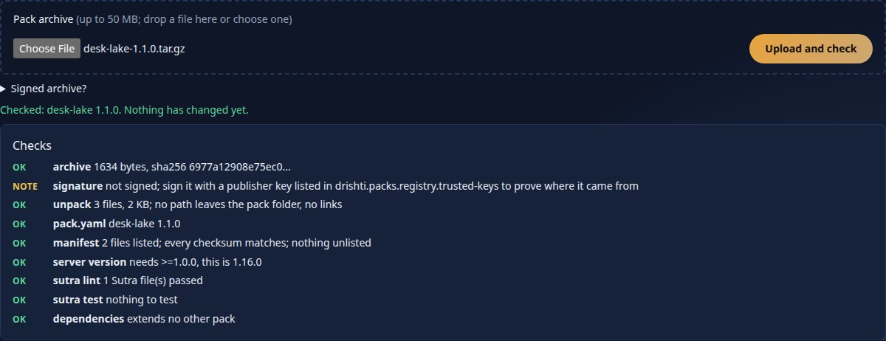
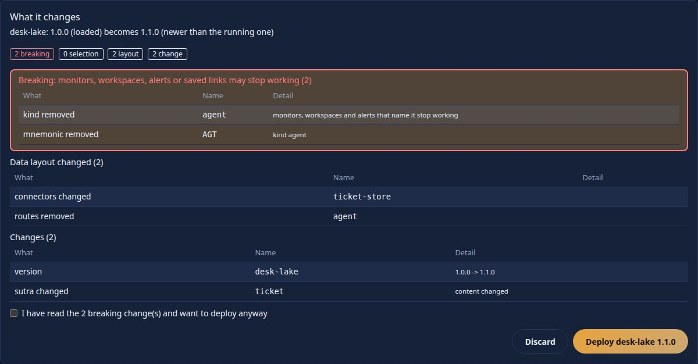
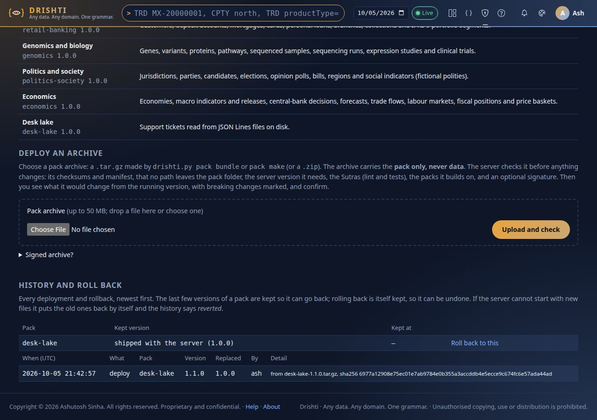
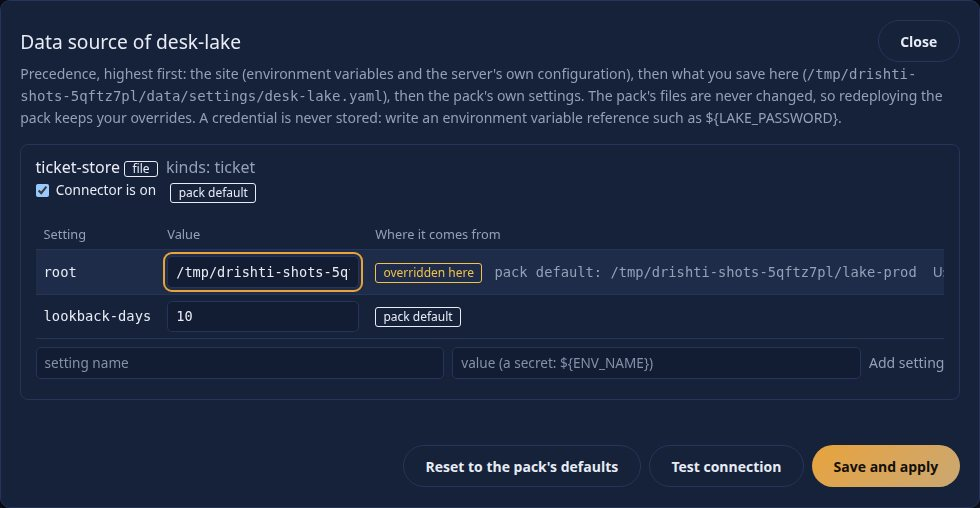
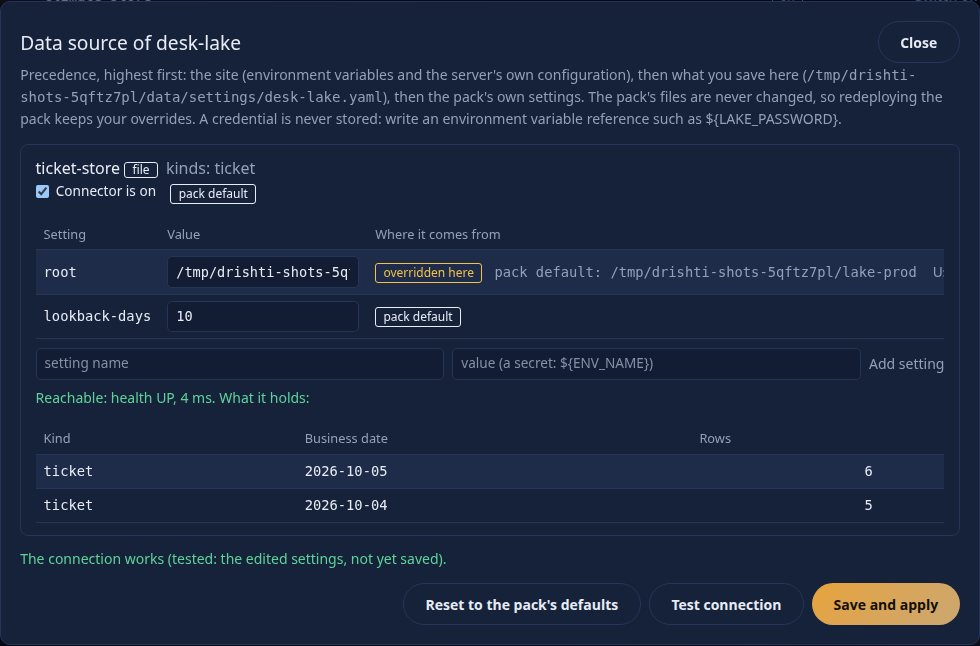

<!--
  Project Drishti · Any data. Any domain. One grammar.

  Copyright (c) 2026 Ashutosh Sinha <ajsinha@gmail.com>.
  All rights reserved.

  PROPRIETARY AND CONFIDENTIAL.

  This file is the confidential and proprietary property of Ashutosh Sinha.
  Unauthorised copying, use, modification, distribution or disclosure of this
  file, via any medium, is strictly prohibited except with the express prior
  written permission of the copyright holder.

  See the LICENSE file in the root of this repository for the full terms.
-->

# Operationalising what you build: artifacts, copying, promotion and rollback

Everything you build for Drishti (a pack, a Sutra, an about file, a data lake) is a **plain file or folder**. Getting it
onto a server is therefore a **copy**, and it needs **no server API, no token and no running server**. This guide is
the operator's path from "it works on my laptop" to "it runs in production, and I can put the old one back":

1. [The artifacts and where each one goes](#1-the-artifacts-and-where-each-one-goes)
2. [How the server becomes aware of each](#2-how-the-server-becomes-aware-of-each)
3. [Make a bundle (the versioned pack artifact)](#3-make-a-bundle)
4. [Verify it, offline](#4-verify-a-bundle-offline)
5. [Deploy it by copying](#5-deploy-by-copying)
6. [Promote dev, test, prod: the same bundle](#6-promote-dev--test--prod-the-same-bundle)
7. [Sutra files, about.yaml and design exports](#7-sutra-files-aboutyaml-and-design-exports)
8. [Data: a lake or a files root](#8-data-a-delta-lake-or-a-files-root)
9. [Check it after a deploy](#9-check-it-after-a-deploy)
10. [Roll back](#10-roll-back)
11. [Git as the source of truth, and a CI example](#11-git-as-the-source-of-truth-and-a-ci-example)
12. [Permissions and ownership](#12-permissions-and-ownership)
13. [Docker and Kubernetes](#13-docker-and-kubernetes)
14. [Windows](#14-windows)
15. [Troubleshooting](#15-troubleshooting)
16. [`pack make`: one folder to deploy](#16-pack-make-one-folder-to-deploy)
17. [Deploy from Admin → Packs, change a data source, history and roll back](#17-deploy-from-admin--packs-change-a-data-source-history-and-roll-back)

The commands are those of `tools/drishti.py` ([CLI_GUIDE.md](CLI_GUIDE.md)). You need Python 3.10+ and PyYAML
(`uv run --with pyyaml python tools/drishti.py ...`) on the machine that builds and verifies. The **target** machine
needs only a shell: `tar` and `cp` are enough to do by hand what `pack deploy` does ([section 5.3](#53-by-hand-no-tool-at-all)).

## 1. The artifacts and where each one goes

| Artifact | What it is | Made by | Goes to (on the server) | Server notices it |
|---|---|---|---|---|
| **Pack bundle** `<name>-<version>.tar.gz` (+ `.sha256`) | one pack, versioned, with a manifest of every file's checksum | `pack bundle` | unpacked by `pack deploy` into the **packs folder**: `drishti.packs.dir` (`DRISHTI_PACKS_DIR`, default `./packs`) or `drishti.packs.installed-dir` (`./data/packs/installed`, searched first) | `DRISHTI_PACKS` + restart, or Admin → Packs → Load |
| **Pack folder** `packs/<name>/` | the same content, unpacked (what git holds) | you, `pack new` | the same places, as `<packs folder>/<name>/` | the same |
| **Sutra files** `sutras/**/*.sutra.yaml` | one screen each; inside a pack's `sutras/` or a site folder | `sutra design`, `sutra gen`, the Screen Designer's export | `<pack>/sutras/` (or the site Sutra folder, `drishti.rachana.dirs`) | **hot reload**: seconds, no restart |
| **`config/about.yaml`** (+ `about.<lang>.yaml`, `help.yaml`, `formats.yaml`) | glossary text and formats of a pack | you | `<pack>/config/` | on pack load / restart; Sutra help follows hot reload |
| **Delta lake** | the data, `<root>/<domain>/<kind>/business_date=…/` | `data ingest --lake`, `tools/lake/*` | `DRISHTI_DELTA_ROOT` (or `s3a://…`) | the connector re-reads the table version every `refresh-seconds` (10) and rebuilds its index every minute |
| **Files root** | JSON Lines, `<root>/<domain>/<date>/<kind>.jsonl` | `data ingest --store files` | `DRISHTI_FILES_ROOT` (default `./data/files`) | the connector rescans every `rescan-seconds` (30) |
| **Config overlay** | settings, not content | you | environment variables (`/etc/drishti/drishti.env`, a ConfigMap) and `data/packs/added.yaml` (`DRISHTI_PACKS_OVERLAY`: the packs an admin loaded at run time) | restart (settings); the overlay is read at start |

A **bundle carries the pack only**. Data is separate (section 8) because it changes daily while a pack changes with a
release, and because a lake can be terabytes.

## 2. How the server becomes aware of each

| You copied | What happens | What you do |
|---|---|---|
| a **new pack** (a name not in `DRISHTI_PACKS`) | nothing: the server loads only the packs it is told to | add it to `DRISHTI_PACKS` and restart, **or** Admin → Packs → **Load** (the server restarts in place and records it in `data/packs/added.yaml`). Details: [PACKS.md, Turning packs on](PACKS.md#turning-packs-on) and its *Load* section |
| a **new version of a loaded pack** | the running server still has the old content in memory | Sutra edits show by themselves (hot reload); anything else (pack.yaml, kinds, connectors, config) needs a restart ([PACKS.md, upgrading a pack](PACKS.md)) |
| **Sutra files** into a loaded pack's `sutras/` | the watcher debounces (250 ms) and reloads | nothing; see `sutraProblems` in Admin → Health if a file is invalid (the last good version stays live) |
| **data** | the connector sees a new Delta version or a new file at its next refresh | nothing; a new business date appears within a minute |

A running server is **never touched** by `pack deploy`. That is deliberate: copy during the day, switch at the moment you choose.

## 3. Make a bundle

```bash
python3 tools/drishti.py pack bundle packs/finance --out dist
```

```text
== finance: sutra lint: exit 0
== finance: sutra test: exit 0
bundled finance 1.0.0: 58 files
  dist/finance-1.0.0.tar.gz
  sha256 244a3feead2efd619f4e4aec1b196a25ddb4c073cb3c2da34832e91f5e552e38
```

(The bundle runs `pack check` first, so a pack that does not lint and test never becomes an artifact; `--no-check` skips that.) You get three files:

```text
dist/finance-1.0.0.tar.gz          the artifact: copy THIS
dist/finance-1.0.0.tar.gz.sha256   its checksum, in `sha256sum` format; keep it next to the archive
dist/finance-1.0.0.manifest.json   a copy of the manifest, readable without unpacking
```

The manifest (also inside the archive as `finance/MANIFEST.json`) describes the artifact:

```json
{
  "format": 1,
  "pack": "finance",
  "version": "1.0.0",
  "extends": [],
  "kinds": ["trade", "netting-set", "csa", "..."],
  "requiresServer": ">=1.18.0",
  "generator": { "tool": "drishti.py pack bundle", "python": "3.14.7", "server": "1.18.0" },
  "data": { "ingest": {}, "connectors": [], "note": "the bundle carries the pack only; data ... is deployed separately" },
  "files": [ { "path": "pack.yaml", "sha256": "…", "size": 1210 }, "…" ]
}
```

| Field | Meaning |
|---|---|
| `pack`, `version` | from `pack.yaml`; **bump `version` for every release** (a bundle is named after it) |
| `requiresServer` | the lowest server version this was built against (default: this checkout's; `--requires-server 1.14.0` to say lower) |
| `kinds`, `extends` | what the pack defines and the packs it needs loaded with it |
| `data.ingest` | the pack's `ingest:` block: which field is each kind's id and business date, i.e. the layout the data must have |
| `files` | every file with its SHA-256 and size |

The archive is **reproducible**: no timestamps, owners or machine paths, so the same content gives the same bytes and
the same checksum, whoever builds it. `.git`, `__pycache__` and editor files are left out.

## 4. Verify a bundle, offline

```bash
python3 tools/drishti.py pack verify dist/finance-1.0.0.tar.gz
```

```text
verify dist/finance-1.0.0.tar.gz: finance 1.0.0
  checksums ok
  schema    ok
  server    ok
  sutra     ok
verified
```

| Check | What it does | Fails when |
|---|---|---|
| (before everything) | the archive's SHA-256 against the `.sha256` next to it; refuses unsafe archive entries (links, `..`, absolute paths) | the file changed after it was bundled, or was damaged in transfer |
| `checksums` | every manifest file is present with its checksum; **no unlisted file** is present; `pack.yaml` agrees with the manifest | a file was edited, added or removed after bundling |
| `schema` | `pack`, `version`, list-shaped `kinds` and `extends`, a `sutras/` folder, the `ingest:` block | pack.yaml is malformed |
| `server` | `requiresServer` against `--server-version` (default: this checkout's) | the target server is older than the bundle needs |
| `sutra` | `sutra lint` and `sutra test` on the unpacked content (needs Java 21 and the exec jar; `--no-sutra` skips) | a Sutra does not parse or a test fails |

`pack verify` also takes a **folder**, which is how you check a pack that is already deployed for drift: a hand edit shows at once.

```text
$ drishti.py pack verify prod/packs/finance --no-sutra
verify prod/packs/finance: finance 1.0.0
  checksums FAILED
    - checksum mismatch: pack.yaml
  schema    ok
  server    ok
  sutra     skipped
NOT verified
[exit 1]
```

A tampered archive is refused before anything is unpacked:

```text
drishti: finance-1.0.1.tar.gz: sha256 does not match finance-1.0.1.tar.gz.sha256 (the file changed after it was bundled)
[exit 1]
```

Use `--server-version 1.10.0` to check a bundle against an older server than your checkout, `--json` for a machine-readable report. Exit codes: 0 verified, 1 not verified, 2 usage.
The `.sha256` file protects against damage and accidents; if the artifact travels through an untrusted store, publish it
signed instead ([PACKS.md, registry](PACKS.md); `pack publish`/`verify --registry`).

## 5. Deploy by copying

### 5.1 One command

```bash
python3 tools/drishti.py pack deploy dist/finance-1.0.1.tar.gz --to /opt/drishti/packs --backup /opt/drishti/backups
```

```text
verify dist/finance-1.0.1.tar.gz: finance 1.0.1
  checksums ok
  schema    ok
  server    ok
  sutra     skipped
verified
deployed finance 1.0.1 to /opt/drishti/packs/finance; previous 1.0.0 kept at /opt/drishti/backups/finance-1.0.0-20261005T181007_529311
next: DRISHTI_PACKS must name it (restart) or Admin > Packs > Load; Sutra edits of a loaded pack hot-reload
```

What it does, in order: verifies (above); copies the pack into a **temporary sibling** `/opt/drishti/packs/.finance.incoming-<pid>`
(same filesystem, so the last step is a rename); checks the copy against the manifest; moves the current
`finance/` to the backup folder, named `<name>-<version>-<UTC stamp>`; renames the new folder into place; deletes the
temporary folder. If the final rename fails the old folder is moved back. A reader never sees a half-copied pack, and the
previous version is never lost. A folder that begins with a dot is ignored by the server.

| Option | Meaning |
|---|---|
| `--to DIR` | the packs folder: `DRISHTI_PACKS_DIR`, or `drishti.packs.installed-dir` (searched before the packs dir, so it overrides a shipped pack of the same name) |
| `--backup DIR` | where replaced versions go (default `<to>/.previous`). Keep it **outside** the packs folder if you want it excluded from a volume that is mounted into containers |
| `--dry-run` | verify and say what would change, copy nothing |
| `--no-sutra`, `--server-version V`, `--strict`, `--json` | as `pack verify` |

```text
$ drishti.py pack deploy dist/finance-1.0.0.tar.gz --to prod/packs --dry-run
…
dry run: would copy finance 1.0.0 to prod/packs/finance (a new pack)
```

Deploying refuses (exit 1, nothing copied) when verification fails.

### 5.2 Remote machines

`pack deploy` is local to the machine whose disk it writes. Two patterns:

```bash
# copy the artifact, then run deploy there (needs the repo's tools/ or just the one file tools/packbundle.py + drishti.py)
scp dist/finance-1.0.1.tar.gz* ops@prod1:/srv/drishti/incoming/
ssh ops@prod1 'python3 /srv/drishti/tools/drishti.py pack deploy /srv/drishti/incoming/finance-1.0.1.tar.gz --to /srv/drishti/packs --backup /srv/drishti/backups --no-sutra'

# or verify here, then rsync the verified folder (rsync -a keeps modes; --delete makes it an exact mirror)
python3 tools/drishti.py pack verify dist/finance-1.0.1.tar.gz
```

### 5.3 By hand, no tool at all

On a server that has only `tar` and `sha256sum`:

```bash
cd /srv/drishti/incoming
sha256sum -c finance-1.0.1.tar.gz.sha256            # finance-1.0.1.tar.gz: OK
mkdir -p ../packs/.stage && tar -xzf finance-1.0.1.tar.gz -C ../packs/.stage
mv ../packs/finance ../backups/finance-1.0.0         # keep the old one (skip on a first deploy)
mv ../packs/.stage/finance ../packs/finance          # the rename is the switch
rmdir ../packs/.stage
```

`MANIFEST.json` stays inside the deployed folder, so `pack verify <folder>` can check it any time.

## 6. Promote dev → test → prod: the same bundle

The point of a bundle is that **what you tested is what you ship**. Build once, on CI, and copy the same file through the stages:

```text
git (packs/finance, tag v1.0.1)
   │  CI: pack check, pack bundle
   ▼
finance-1.0.1.tar.gz + .sha256        ← built ONCE, stored as a CI artifact
   │  pack deploy                  │  pack deploy                  │  pack deploy
   ▼                               ▼                               ▼
 dev server                     test server                     prod server
```

Rules that keep it honest:

1. **Never rebuild per environment.** Compare the checksum: `sha256sum finance-1.0.1.tar.gz` must print the same value on every machine, and `pack verify` checks it for you.
2. **Environment differences live in configuration, not in the pack**: `DRISHTI_PACKS`, `DRISHTI_DELTA_ROOT`, connector URLs in `${ENV_VAR:default}` form inside `pack.yaml`, secrets in the environment file ([OPERATIONS.md, §6 and §7](../admin/OPERATIONS.md)).
3. Promote by **copying the artifact** (a shared folder, an artifact store, `scp`), not by re-running the build.
4. Deploy to test, run the smoke checks ([section 9](#9-check-it-after-a-deploy)), then deploy the identical file to prod.
5. Record what runs where: `ls <packs>/*/MANIFEST.json` or `pack verify <folder>` shows each deployed pack's name and version.

## 7. Sutra files, about.yaml and design exports

All of these are plain text files, so they are copied like anything else.

- **Sutras** (`*.sutra.yaml`) made by `sutra design`, `sutra gen`/`sutragen` or the Screen Designer are ordinary files. Copy them into a pack's `sutras/<folder>/`. On a **running** server they hot-reload ([RACHANA_REFERENCE.md, Editing files on disk](RACHANA_REFERENCE.md#hot-reload-the-workbench-and-governance)): a valid file replaces the old one at once, an invalid one is reported and the last good version stays live, a deleted file's Sutras disappear.
- **Designer export:** `drishti.py design export <id> -o design.zip` writes a zip of the Sutra and its samples. Unzip it and copy the `.sutra.yaml` into the pack (git first, then the next bundle); or hot-copy it onto a server for an urgent fix, and put the same file into git afterwards so the next bundle contains it.
- **`config/about.yaml`** (and `about.<lang>.yaml`): copy into `<pack>/config/`. Check it with `pack about-check packs/<name>` before you ship ([PACK_DEVELOPER_GUIDE.md](PACK_DEVELOPER_GUIDE.md)).

Prefer shipping a Sutra change as a **new bundle** (a version, a checksum, a rollback). Hot-copy is for emergencies, and
`pack verify <deployed folder>` will then report the drift until you redeploy a bundle.

```bash
cp new-var.sutra.yaml /opt/drishti/packs/market-risk/sutras/market-risk/       # live within a second or two
curl -s localhost:18480/api/v1/admin/health | python3 -c "import json,sys; print([(p['name'],p['sutraProblems']) for p in json.load(sys.stdin)['packs']])"
```

## 8. Data: a Delta lake or a files root

> **Staging, not production ETL.** `drishti.py data ingest`, `data ingest --watch` and `pack make` are for staging data, small setups and
> proofs of concept. Drishti is not an ingestion engine and will not become one: in production **your own ETL** (or a pipeline engine such as
> DishtaYantra) loads the lake, the files or the database, and its last step tells Drishti the batch landed, so Drishti refreshes, verifies,
> evaluates alerts and tells people, and flags a batch that is late: [DATA_LOADS.md](DATA_LOADS.md).

Data is **not** in the bundle. The rule for both stores: **never write into the folder the server is reading in place
while it is half-finished.** Write somewhere else, then make it appear in one step.

**Files root** (`DRISHTI_FILES_ROOT`, layout `<root>/<domain>/<business-date>/<kind>.jsonl`). The connector lists the folders every 30 s and re-indexes a changed file when it is next read.

```bash
# 1. produce a day somewhere private (the ingest tool is idempotent per business date)
python3 tools/drishti.py data ingest --from new-day.jsonl --pack packs/finance --store files --root /srv/stage/files
# 2. copy the date folder next to the others: first under a dot name, then rename (a rename is atomic on one filesystem)
cp -r /srv/stage/files/finance/2026-10-05 /srv/drishti/files/finance/.2026-10-05.part
mv /srv/drishti/files/finance/.2026-10-05.part /srv/drishti/files/finance/2026-10-05
```

A single file: write to `<kind>.jsonl.tmp`-style temporary name and `mv` it to `<kind>.jsonl` ([FILE_CONNECTOR.md](../connectors/FILE_CONNECTOR.md)).
To replace a whole root: build `files.new/`, then `mv files files.old && mv files.new files` (a few milliseconds of "no directory" at worst, which the connector reports DOWN and recovers from at the next rescan), keep `files.old` for rollback.

**Delta lake** (`DRISHTI_DELTA_ROOT`, layout `<root>/<domain>/<kind>/business_date=…/`). A Delta table is a folder of
Parquet files plus a `_delta_log`; the log decides what is visible, and a new commit is atomic. Two safe ways:

- **Ingest into the live lake with the tool** (`data ingest --lake`): it commits through Delta, so readers see the new version only when it is complete. This is the normal route for a daily load.
- **Copy a finished lake or partitions:** build it in a stage folder, copy **the Parquet data files first and `_delta_log/` last** (the log is what makes files visible), for example `rsync -a stage/finance/trade/ live/finance/trade/ --exclude _delta_log && rsync -a stage/finance/trade/_delta_log/ live/finance/trade/_delta_log/`. Replacing a whole lake: `mv lake lake.old && mv lake.new lake`, then restart or wait for the connector (`refresh-seconds`, 10; the search index within about a minute). For `s3a://`, upload the same way (data first, log last) with `aws s3 sync`.

Keep local test loads small ([DEMO_DATA.md](../connectors/DEMO_DATA.md)). For what the layout must be, see the manifest's `data.ingest` and [DELTA_CONNECTOR.md](../connectors/DELTA_CONNECTOR.md).

## 9. Check it after a deploy

```bash
# 1. is the server healthy, and is every pack OK with no Sutra problems?
curl -s http://localhost:18480/api/v1/admin/health | python3 -c "
import json,sys
for p in json.load(sys.stdin)['packs']: print(p['name'], p['version'], p['status'], 'problems:', p['sutraProblems'], 'down:', p['connectorsDown'])"
# 2. the same, as a command with an exit code (1 unless OK)
python3 tools/drishti.py server health
python3 tools/drishti.py server packs list
# 3. a smoke command: a real read through the new pack (use any id you know)
curl -s -o /dev/null -w '%{http_code}\n' http://localhost:18480/api/v1/packs
```

In the console: **Admin → Packs** shows each pack's loaded and installed version and status; **Admin → Health** lists
`sutraProblems` and connectors that are down; **About** lists the loaded packs. Then open the terminal (`/t`) and run a
command from the pack. Pass criteria: the version is the one you shipped, `status` is OK, `sutraProblems` is empty, no connector down.

## 10. Roll back

```bash
python3 tools/drishti.py pack rollback finance --to /opt/drishti/packs --backup /opt/drishti/backups
```

```text
restored finance 1.0.0 from prod/backups/finance-1.0.0-20261005T181007_529311; the 1.0.1 it replaced is kept at prod/backups/finance-1.0.1-20261005T181007_529311
```

It puts back the **newest** backup (`--version 1.0.0` picks one), keeps the version it replaced (so rolling back is itself
undoable) and swaps in one rename. Then make the server notice: restart the server; Sutra-only differences
already hot-reloaded. By hand: `mv packs/finance packs/finance.bad && mv backups/finance-1.0.0-… packs/finance`.
Data rolls back by `mv files files.new && mv files.old files` (section 8) or, for Delta, by `RESTORE`/time travel on the table.

## 11. Git as the source of truth, and a CI example

Keep `packs/<name>/` in git, **including** the version bump. A release is a tag. Production is reproducible from the tag:
`git checkout v1.0.1 && pack bundle` gives the same bytes. Never edit a deployed folder; change git, build, deploy.

A GitHub Actions job that produces the bundle (adapt the syntax to any CI):

```yaml
name: bundle-pack
on: { push: { tags: ["v*"] } }
jobs:
  bundle:
    runs-on: ubuntu-latest
    steps:
      - uses: actions/checkout@v4
      - uses: actions/setup-java@v4
        with: { distribution: temurin, java-version: 21 }
      - uses: astral-sh/setup-uv@v5
      - run: ./mvnw -q -DskipTests package -pl drishti-server -am        # the exec jar that lint and test use
      - run: uv run --with pyyaml python tools/drishti.py pack check packs/finance --strict --junit build/reports
      - run: uv run --with pyyaml python tools/drishti.py pack bundle packs/finance --out dist
      - run: uv run --with pyyaml python tools/drishti.py pack verify dist/finance-*.tar.gz
      - uses: actions/upload-artifact@v4
        with: { name: finance-bundle, path: "dist/finance-*" }
```

A deploy job (or a person) downloads `finance-bundle` and runs `pack deploy` per environment, in order.

## 12. Permissions and ownership

- The server must be able to **read** the pack folders and the data; it never writes into a pack. Make the deployed tree owned by the deploying user (or root) and readable by the service account: `chown -R deploy:drishti /opt/drishti/packs && chmod -R g+rX,o-rwx /opt/drishti/packs`.
- `pack deploy` runs as the deploying user, and the archive records **no owners**, so files are created as that user. Run it with the same umask every time (`umask 027`).
- Folders need `x` for the service account; `.previous/` and the backup folder should not be readable by others.
- If `data/packs/` (the overlay and installed packs) must be written by the server (Admin → Packs → Load writes `added.yaml`), that folder is the one place the service account needs write access.
- Do not run `pack deploy` as the server's own user against a folder the server also edits through the registry installer, unless you want it to move that pack to the backup folder.

## 13. Docker and Kubernetes

The image ships the packs it was built with. Provide yours without rebuilding the image by mounting a folder as the
**installed** packs folder (searched before the shipped ones):

```yaml
# compose.yaml (service drishti-server)
environment:
  DRISHTI_PACKS: finance,my-bank
volumes:
  - /srv/drishti/packs:/opt/drishti/data/packs/installed:ro      # filled by `pack deploy --to /srv/drishti/packs`
  - /srv/lake:/opt/drishti/data/delta:ro
```

On the host, deploy as usual (`pack deploy ... --to /srv/drishti/packs`), then `docker compose restart drishti-server`
(or Admin → Packs → Load). A `:ro` mount is fine: the server only reads.

**Kubernetes: an init container copies the bundle in.** The bundle is the artifact; keep it in an object store or an image layer:

```yaml
spec:
  volumes:
    - { name: packs, emptyDir: {} }
  initContainers:
    - name: packs
      image: registry.example.com/drishti-packs:1.0.1        # FROM busybox; COPY finance-1.0.1.tar.gz* /bundles/
      command: ["sh", "-c", "cd /bundles && sha256sum -c finance-1.0.1.tar.gz.sha256 && tar -xzf finance-1.0.1.tar.gz -C /packs"]
      volumeMounts: [{ name: packs, mountPath: /packs }]
  containers:
    - name: drishti-server
      env: [{ name: DRISHTI_PACKS, value: "finance" }, { name: DRISHTI_PACKS_DIR, value: "/packs" }]
      volumeMounts: [{ name: packs, mountPath: /packs, readOnly: true }]
```

The checksum check makes the pod fail to start on a damaged artifact. Rolling back is rolling the pod spec back to the previous bundle tag. Config overlay values (`DRISHTI_*`) go in a ConfigMap or Secret; a lake is a read-only PersistentVolume or `s3a://`.

## 14. Windows

The tools are the same; use `py` and backslash or forward-slash paths. PowerShell:

```powershell
py tools\drishti.py pack bundle packs\finance --out dist
py tools\drishti.py pack deploy dist\finance-1.0.1.tar.gz --to D:\drishti\packs --backup D:\drishti\backups
Get-FileHash dist\finance-1.0.1.tar.gz -Algorithm SHA256     # compare with the .sha256 file
tar -xzf dist\finance-1.0.1.tar.gz -C D:\drishti\packs\.stage   # tar.exe ships with Windows 10+
```

Keep the packs folder on the **same drive** as the backup folder so the swap is a rename; antivirus or an open Explorer window
on a pack folder can block the rename ("Access is denied"): close it and retry, the old version is put back automatically.
More in [WINDOWS.md](WINDOWS.md).

## 15. Troubleshooting

| Symptom | Cause | Fix |
|---|---|---|
| `sha256 does not match …` | the archive changed or was damaged in transfer | copy it again from the artifact store; compare `sha256sum` on both ends |
| `checksum mismatch: <file>` / `file not in the manifest: <file>` | a deployed or unpacked pack was edited by hand | put the change in git and ship a new bundle, or redeploy the bundle |
| `the bundle needs server >=X but the target is Y` | the bundle was built against a newer server | upgrade the server, or rebuild with `--requires-server` if you know it is compatible |
| `unsafe entry` | a handmade archive with `..`, absolute paths or links | rebuild it with `pack bundle` |
| `the pack fails pack check` | lint/test failed before bundling | run `pack check packs/<name>`; fix; `--no-check` only for a diagnosis |
| `no drishti-server-*-exec.jar` | verify/bundle need the jar for lint and test | build it, set `DRISHTI_JAR`, or `--no-sutra` on a target that has no Java |
| deployed, but the old content is served | the server holds the old pack in memory | restart the server |
| deployed, but the pack is not in Admin → Packs | its name is not in `DRISHTI_PACKS` | add it and restart, or Admin → Packs → Load |
| `sutraProblems` is not empty after a copy | a Sutra is invalid; the last good one stays live | read the DRS code in Admin → Health; fix the file; hot reload retries on the next save |
| `PermissionError` on deploy | the target or backup folder is not writable by you | fix ownership (section 12); deploy as the deploying user |
| `Access is denied` / rename fails (Windows) | a program holds the folder open | close it; the previous version is restored automatically |
| new data does not show | the connector has not refreshed yet, or the layout differs from the pack's `ingest:` block | wait a minute; check the path layout in section 8 |
| a partition appears half-loaded | it was copied in place | copy under a dot name and rename; for Delta copy `_delta_log` last |

See also: [CLI_GUIDE.md](CLI_GUIDE.md) (every command), [PACKS.md](PACKS.md) (turning packs on, Load, the registry),
[PACK_DEVELOPER_GUIDE.md](PACK_DEVELOPER_GUIDE.md) (building a pack), [OPERATIONS.md](../admin/OPERATIONS.md) (install, services, backups).

## 16. `pack make`: one folder to deploy

Sections 3 to 9 build the artifacts one command at a time. When you start from JSON Lines, **one command makes them all** and puts
them in a single folder, so that what you carry to a server is that folder:

```bash
uv run --with pyyaml --with deltalake --with pyarrow python tools/drishti.py pack make data/jsonl \
    --kind trade --match productType --name my-bank
```

The folder (`build/my-bank-1.0.0/`) holds the pack (`pack/my-bank/`, section 5: copy it into the packs folder), the data
(`data/delta/`, section 8: copy to the lake root or point `DRISHTI_DELTA_ROOT` at it), the bundle (`bundle/`, section 3 and 4,
already verified), a ready configuration overlay, `run-server.sh` and `.ps1`, a `MANIFEST.json`, and a `README.txt` with the deploy,
verify, "lift the data from Delta", update and rollback steps filled in with your kind, ids and dates. Options and the folder tree:
[CLI_GUIDE.md, Quickest path](CLI_GUIDE.md#quickest-path-pack-make).

## 17. Deploy from Admin → Packs, change a data source, history and roll back

Sections 3 to 10 deploy by **copying files**: no server, no token. When the server is running and you are an administrator you can do the same
from the browser (or the terminal) and get four things the copy does not give you: the server **checks the archive first**, shows you **what it
changes** from the running version (breaking changes marked), **keeps the version it replaces** for a one-click rollback, and **puts the old files
back by itself** if it cannot start with the new ones. The archive is the one section 3 makes (`pack bundle` or `pack make`): a `.tar.gz` holding
**the pack only, never data**. Data is deployed separately (section 8), and where a pack reads it from is set in [17.5](#175-where-a-pack-reads-its-data-data-source).

### 17.1 Deploy an archive

1. Build and verify the bundle as in sections 3 and 4 (`drishti.py pack bundle packs/my-bank`).
2. **Admin → Packs → Deploy an archive**: choose the `.tar.gz` (or drop it on the box) and press **Upload and check**. Nothing changes yet.

   

   The server runs these checks and shows each as OK, NOTE (worth a look) or FAIL. Any FAIL refuses the archive and nothing is staged.

   | Check | What it proves | Refused when |
   |---|---|---|
   | **archive** | size and SHA-256; with a `.sha256` file beside it (the CLI sends it) or `--sha256`, that the file arrived as it was bundled | larger than `drishti.packs.deploy.max-archive-mb` (HTTP 413, before it is read); the checksum differs |
   | **signature** | an Ed25519 signature of the archive by a publisher whose key is in `drishti.packs.registry.trusted-keys` (the same keys as the registry) | a signature that does not verify, or a publisher that is not trusted; with `drishti.packs.deploy.require-signature: true`, no signature |
   | **unpack** | only plain files and folders; no absolute path, no `..`, no link, device or special file; at most `max-files` files and `max-unpacked-mb` once unpacked | any of those (a zip or tar slip, a zip bomb) |
   | **pack.yaml** | a plain `pack` name and `version` | missing or odd names |
   | **manifest** | every file `MANIFEST.json` lists is there with its SHA-256 and size, nothing present is unlisted, and the manifest names the same pack and version as `pack.yaml` (the rules of `pack verify`) | a changed, missing or extra file; no manifest (unless `require-manifest: false`) |
   | **server version** | the `requiresServer` the bundle was made with against this server's version | this server is older |
   | **sutra lint**, **sutra test** | every Sutra parses and its expressions check, and every sample test passes: the same checker as `drishti.py sutra lint` / `test` | any problem, with the first ones named |
   | **dependencies** | each pack it `extends` is loaded or on disk | a missing parent: deploy that pack first |

3. Read **What it changes**. It is the same comparison as `drishti.py pack diff` (the Java and Python rule sets are tested against the same cases), between the
   archive and the version that is **running** (or, for a pack that is not loaded, the copy on disk):

   

   | Level | Means | Deploying it |
   |---|---|---|
   | **breaking** | a kind or a mnemonic removed or renamed: monitors, workspaces, alerts and saved links name them | needs you to tick *I have read the breaking changes* (API: `acceptBreaking=true`) |
   | **selection** | a Sutra added or removed, or its `match` changed: some documents get another screen | allowed |
   | **layout** | connectors, routes, ingest or columns changed: the data layout moved | allowed; check the data source |
   | **change** | Sutra content, about text or glossary changed | allowed |

   A version that is the same as, or older than, the running one is flagged and still allowed.
4. **Deploy**. The server swaps the files into `drishti.packs.installed-dir` (the folder that wins over `packs/`), keeps the previous version under
   `.previous/<pack>/<version>-<time>`, then checks all loaded packs with the new one, **restarts in place** and reloads. A pack that was not loaded is loaded.
   If the check fails, or the server cannot start with the new files, the old files are put back and the history says *reverted*; users stay signed in and
   live views reconnect.

### 17.2 History and roll back

**Admin → Packs → History and roll back** lists every deployment, rollback and reverted attempt (when, what, pack, version, the version it replaced, who) and, above it,
the versions kept for a rollback. **Roll back to this** puts a kept version back the same safe way. Rolling back is itself kept, so it can be undone.



- `drishti.packs.deploy.keep-versions` (5) previous versions are kept per pack; older ones are deleted.
- A pack that was first deployed over the copy that ships with the server also offers **shipped with the server**: rolling back to it removes the installed copy.
- Rollback restores **files only**. Data is not touched, and a data-source override ([17.5](#175-where-a-pack-reads-its-data-data-source)) stays as it was.
- The history is `data/packs/deploy-history.jsonl` (`DRISHTI_PACKS_DEPLOY_HISTORY`); every step is also an audit row: `pack-upload-checked`, `pack-deployed`, `pack-rolled-back`.


### 17.3 The same from the terminal

```bash
python3 tools/drishti.py server packs deploy dist/my-bank-1.1.0.tar.gz --preview   # checks and changes; discards the upload
python3 tools/drishti.py server packs deploy dist/my-bank-1.1.0.tar.gz --accept-breaking --wait 60
python3 tools/drishti.py server packs history --pack my-bank
python3 tools/drishti.py server packs rollback my-bank --version 1.0.0              # or --version shipped
```

Without `--preview` the command deploys; with a breaking change it prints the preview and exits 1 until you add `--accept-breaking`. A personal API token
needs the **packs:admin** scope (and its user the admin role). Every option and real output: [CLI_GUIDE.md, `server packs deploy`](CLI_GUIDE.md#server-packs-deploy-history-rollback-and-datasource).

### 17.4 Copy path or Admin → Packs

| | Copy (sections 5, 10) | Admin → Packs / `server packs deploy` |
|---|---|---|
| Needs a running server and a login | no | yes (administrator, `packs:admin` for a token) |
| Checks before anything changes | `pack verify` on your machine | the server's checks above, on the server |
| Shows what changes | `pack diff` | the same, in the page, against what is running |
| Previous version kept | `.previous/` beside the packs | `.previous/` under the installed folder, N kept, listed in the page |
| Restart | you | in place, with automatic undo |
| Audit | file system | audit rows and the history file |

### 17.5 Where a pack reads its data (Data source)

A pack declares **connectors** (`connectors:` in `pack.yaml`): a plugin (a Delta lake, JSON Lines files, a database...), the kinds it serves, and its settings (a
`root`, a JDBC `url`...). The settings in force come from three layers; the **highest wins**:

| Layer | Where | Typical use |
|---|---|---|
| **site** | environment variables and the server's own configuration, e.g. `DRISHTI_SOURCES_CONNECTORS_RISK_STORE_SETTINGS_ROOT=/mnt/lake` | an operator pinning a value for the machine; the page shows it and cannot change it |
| **override** | `data/packs/settings/<pack>.yaml` (`drishti.packs.settings-dir`, `DRISHTI_PACKS_SETTINGS`), written by Admin → Packs → **Data source** | pointing a pack at this site's lake or database |
| **pack** | the pack's own `pack.yaml` | the default that ships with the pack |

The pack's files are **never rewritten** by a data-source change, and a redeploy (17.1) replaces the pack folder but not the override, so your settings survive upgrades.
The override file holds only what differs from the pack:

```yaml
# data/packs/settings/market-risk.yaml, written by Admin → Packs → Data source
connectors:
  risk-store:
    enabled: true            # optional: switch the connector on or off
    settings:
      root: /mnt/shared/lake
      engine: native
      password: ${RISK_LAKE_PASSWORD}   # a credential is only ever an environment reference
```

**Admin → Packs → Data source** (a button on every loaded pack) shows each connector's settings with where each value comes from, in words: *pack default*,
*overridden here* (with the pack's value beside it), *set by the site: wins over this file*:



- Edit a value, add a setting, or press **Use pack default** on a row. Only values that differ from the pack are kept.
- **Test connection** tries the edited settings (before anything is saved) against the real source and lists, per kind, the newest business dates and how many
  entities the source holds for each. For a source that cannot list its dates the count is the latest data, marked "≥" when it hit the search cap. It changes nothing.

  

- **Save and apply** writes the override file, runs the same check the server runs at start, then restarts in place; if it cannot start, the previous file is put back.
- **Reset to the pack's defaults** removes the override (from the CLI, one connector's: `datasource reset my-bank --connector risk-store`).
- A pack with an override is badged **data source overridden** in the packs table.

  

**Credentials.** A setting whose name says it is a credential (`password`, `secret`, `token`, `api-key`, `access-key`, `private-key`, `credential`) can only be an environment
reference such as `${LAKE_PASSWORD}`; the server refuses the plain value, and a password written inside a URL (`jdbc:postgresql://user:pw@host/db`, `?password=...`).
The password lives in the environment of the server process (a secret store, a Kubernetes secret), never in a file or a page. If the variable is not set, Test connection says so by name.

**Shared connectors.** A connector belongs to the pack that declares it. If two unrelated packs declare the same connector name with different settings the server
refuses to start, so override a shared connector in each pack that declares it, with the same values (the check on Save catches a mismatch before anything restarts).

From the terminal:

```bash
python3 tools/drishti.py server packs datasource get my-bank
python3 tools/drishti.py server packs datasource test my-bank --connector bank-store --set root=/mnt/dr-lake
python3 tools/drishti.py server packs datasource set my-bank bank-store root=/mnt/dr-lake password='${LAKE_PW}' --test-first
python3 tools/drishti.py server packs datasource reset my-bank
```

### 17.6 Settings, scopes and API

| Property (environment) | Default | Meaning |
|---|---|---|
| `drishti.packs.deploy.max-archive-mb` | 50 | larger uploads are refused with HTTP 413; the console takes `packs.deploy_max_mb` |
| `drishti.packs.deploy.max-unpacked-mb`, `max-files` | 200, 10000 | what an archive may unpack to |
| `drishti.packs.deploy.keep-versions` | 5 | previous versions kept per pack |
| `drishti.packs.deploy.require-signature` | false | only archives signed by a trusted publisher |
| `drishti.packs.deploy.require-manifest` | true | an archive needs `MANIFEST.json` |
| `drishti.packs.deploy.staging-minutes` | 30 | how long a verified upload waits for its confirmation |
| `drishti.packs.deploy.history-file` (`DRISHTI_PACKS_DEPLOY_HISTORY`) | `./data/packs/deploy-history.jsonl` | the deployment history |
| `drishti.packs.deploy.probe-dates`, `probe-timeout-seconds` | 3, 30 | Test connection: dates per kind, wait per source |
| `drishti.packs.settings-dir` (`DRISHTI_PACKS_SETTINGS`) | `./data/packs/settings` | the override files |

The endpoints (all `/api/v1/admin/packs/...`, administrator only; a personal token needs `packs:admin`): [API_GUIDE.md](API_GUIDE.md#deploying-a-pack-archive-and-the-data-source).

### 17.7 Troubleshooting

| You see | Meaning | Do |
|---|---|---|
| *checksum mismatch: sutras/x.sutra.yaml* | the file changed after the bundle was made | bundle again; copy with a checksum-preserving tool |
| *unsafe path in the archive* | an entry leaves the pack folder or is a link | rebuild the archive with `pack bundle`; never hand-tar absolute paths |
| *no MANIFEST.json* | built with plain `tar`/`zip` | use `pack bundle`, or set `require-manifest: false` (not recommended) |
| *the archive needs server >=X* | the bundle was made on a newer build | upgrade the server first |
| *extends X, which is neither loaded nor on disk* | a parent pack is missing | deploy or load the parent first |
| HTTP 413 | larger than `max-archive-mb` | raise it (and the console's `packs.deploy_max_mb`) if the archive is right; archives carry no data, so a big one usually has data in it |
| history says *reverted* | the server could not start with the new files and put the old ones back | read `server.log` at that time; fix the pack and redeploy |
| *a credential is never stored here* | a secret setting is not `${NAME}` | export the variable for the server process and write the reference |
| *refers to an environment variable that is not set* | the server process has no such variable | set it in the process environment (not your shell) and restart |
| a setting shows *set by the site* and edits do nothing | an environment variable or `application.yaml` sets it, and wins | change it there, or remove it |
