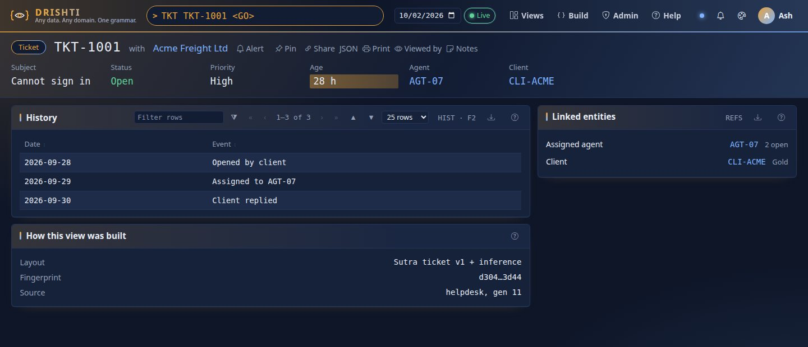
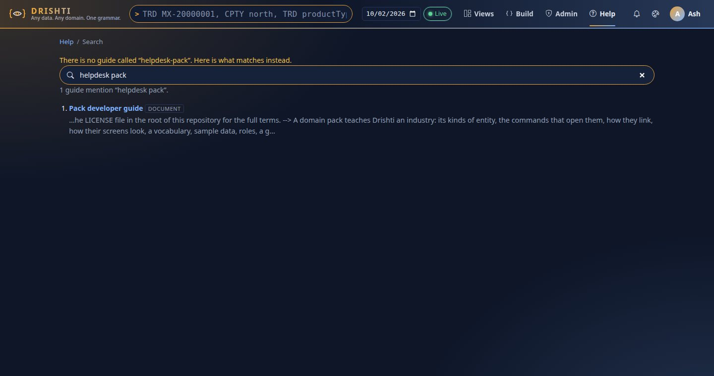
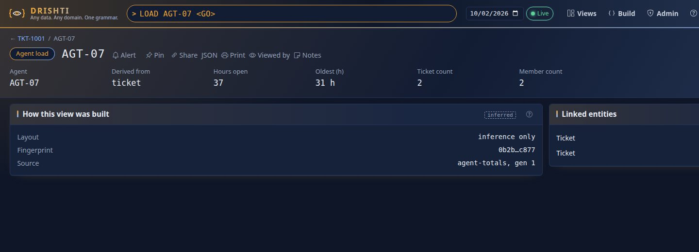
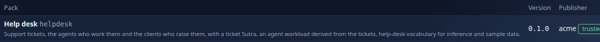
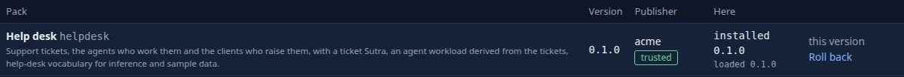
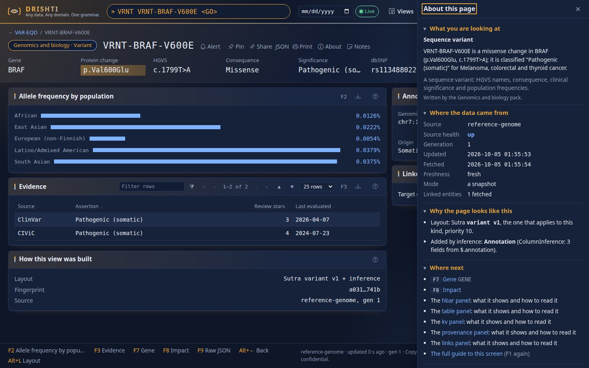
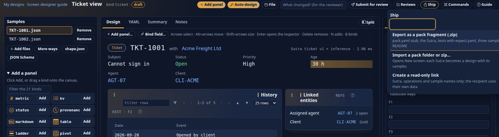

<!--
  Project Drishti · Any data. Any domain. One grammar.

  Copyright (c) 2026 Ashutosh Sinha <ajsinha@gmail.com>.
  All rights reserved.

  PROPRIETARY AND CONFIDENTIAL.

  This file is the confidential and proprietary property of Ashutosh Sinha.
  Unauthorised copying, use, modification, distribution or disclosure of this
  file, via any medium, is strictly prohibited except with the express prior
  written permission of the copyright holder.

  See the LICENSE file in the root of this repository for the full terms.
-->
# Pack developer guide

A **domain pack** teaches Drishti an industry: its kinds of entity, the commands that open them, how they link, how
their screens look, a vocabulary, sample data, roles, a guide. It is configuration and content: no Java and no Python
the server runs. This guide is for the person who **writes** a pack. It builds one end to end, a help-desk pack, with
real commands and the real output they gave, then covers each topic in depth.

Who reads what:

| You are | Read |
|---|---|
| a user or administrator: which packs ship, turning them on and off, who sees which | [PACKS.md](PACKS.md) |
| writing a pack | this guide |
| writing the Sutras of a pack | [Sutra guide](SUTRA_DEVELOPER_GUIDE.md), every key in [RACHANA_REFERENCE.md](RACHANA_REFERENCE.md), the workbench in [SCREEN_DESIGNER.md](SCREEN_DESIGNER.md) |
| connecting a pack to a database, a lake or a queue | [CONNECTOR_DEVELOPER_GUIDE.md](../connectors/CONNECTOR_DEVELOPER_GUIDE.md) and the per-connector pages it lists |

Contents:

1. [What a pack is made of](#what-a-pack-is-made-of)
2. [The worked example: a help-desk pack](#the-worked-example-a-help-desk-pack)
3. [Build it, step by step](#build-it-step-by-step) (steps 1 to 17)
4. The topics, each in depth: [`pack.yaml` key by key](#packyaml-key-by-key) · [the lake layout](#large-kinds-the-lake-layout) ·
   [derived kinds](#derived-kinds-entities-computed-from-other-kinds) · [samples](#samples) ·
   [vocabulary](#vocabulary-labels-formats-and-inference-hints) · [guides and help](#guides-and-help) ·
   [roles and field masks](#roles-and-field-masks) · [Calc snippets](#calc-python-snippets) · [inheritance](#inheritance)
5. Around the pack: [tests](#testing-a-pack) · [generators](#how-the-shipped-packs-are-generated) ·
   [versioning](#versioning-a-pack) · [the signed registry](#a-signed-pack-registry-publishing-and-installing) ·
   [loading while the server runs](#loading-a-pack-while-the-server-runs) · [pack fragments from the workbench](#pack-fragments-from-the-build-workbench) ·
   [verifying a pack](#verifying-a-pack)

## What a pack is made of

A pack is one folder under `packs/`. The folder name is the pack's name. Here is the finished help-desk pack of this
guide, `docs/guides/examples/pack/helpdesk/`:

```text
helpdesk/
├── pack.yaml                    the manifest: kinds, commands, links, columns, roles, alerts, connectors, console extras
├── sutras/
│   └── ticket.v1.sutra.yaml     a layout (a Sutra) for tickets
├── tests/
│   └── ticket/                  sample tickets and expect.yaml: what `sutra test` checks about the Sutra
├── config/
│   ├── semantics.yaml           field-name hints and labels for inference
│   ├── formats.yaml             a number format of the pack ("30 h")
│   ├── about.yaml               what a ticket is and what its fields mean (About this page)
│   ├── workspaces.yaml          a starter workspace
│   └── help.yaml                the pack's card in the help centre
├── guides/
│   └── helpdesk.md              the guide that card opens
├── python/
│   └── queue-by-status.py       a Calc snippet
└── samples/
    ├── catalog.json             the list of sample entities (kind, id, title, subtitle)
    └── ticket/TKT-1001.json …   one JSON document per entity, in a folder per kind
```

Words used throughout:

| Word | Meaning | Example |
|---|---|---|
| **kind** | a type of entity; a kind belongs to exactly one pack | `ticket`, `agent`, `trade` |
| **mnemonic** | the short command that opens a kind | `TKT` opens a `ticket` |
| **id** | one entity's identifier | `TKT-1001` |
| **Sutra** | a layout for a kind, one YAML file starting `rachana: 1` | `sutras/ticket.v1.sutra.yaml` |
| **connector** | a named data source the pack reads from | `agent-totals` (a derived one) |
| **route** | which connector answers a kind | `agent-load: agent-totals` |
| **inference** | the layout Drishti works out from a document when no Sutra matches | the agent view below |

A pack with only `pack.yaml` and `samples/` already works: inference lays out every kind. Everything else makes it
better, and each piece is optional.

## The worked example: a help-desk pack

Four kinds: **ticket** (`TKT`), **agent** (`AGT`), **client** (`CLI`) and **agent-load** (`LOAD`), a *derived* kind:
nothing stores it, the server sums each agent's open tickets. The pack has links with badges, impact (F8), pick-list
columns and a Pivot tab, two roles, an alert suggestion, a vocabulary, a Sutra with tests, a guide, a starter
workspace and monitor, a Calc snippet and a signed registry entry. It is small enough to read in one sitting and uses
every part of a pack except the lake layout.

The finished pack is in the repository. Open it beside this guide:

| Part | File |
|---|---|
| manifest | [pack.yaml](examples/pack/helpdesk/pack.yaml) |
| Sutra and its tests | [ticket.v1.sutra.yaml](examples/pack/helpdesk/sutras/ticket.v1.sutra.yaml), [tests/ticket/](examples/pack/helpdesk/tests/ticket/expect.yaml) |
| vocabulary | [semantics.yaml](examples/pack/helpdesk/config/semantics.yaml), [formats.yaml](examples/pack/helpdesk/config/formats.yaml) |
| About this page | [about.yaml](examples/pack/helpdesk/config/about.yaml) |
| samples | [catalog.json](examples/pack/helpdesk/samples/catalog.json) |
| guide and starters | [helpdesk.md](examples/pack/helpdesk/guides/helpdesk.md), [help.yaml](examples/pack/helpdesk/config/help.yaml), [workspaces.yaml](examples/pack/helpdesk/config/workspaces.yaml) |

It is not in `packs/`, so no server loads it by accident. To follow along, build it yourself in `packs/helpdesk/`
(steps 1 to 14), or copy the finished folder there.

**A scratch server to try things on.** Every step ends with something you can see. Use a scratch server and console on
ports of their own, so that nothing of yours is touched: the QUICKSTART packs, plus the one you are writing
(`DRISHTI_PACKS` is explained in [PACKS.md](PACKS.md#turning-packs-on); the start-up recipe is in
[QUICKSTART.md](QUICKSTART.md)):

```bash
export JAVA_HOME=/usr/lib/jvm/java-25-openjdk-amd64
DRISHTI_PORT=18996 DRISHTI_PACKS=market-risk,counterparty-risk,liquidity-risk,climate-risk,operational-risk,retail-banking,genomics,politics-society,economics,helpdesk \
  java -jar drishti-server/target/drishti-server-1.15.0-exec.jar
DRISHTI_BACKEND_URL=http://127.0.0.1:18996 DRISHTI_CONSOLE_PORT=17996 console/.venv/bin/python console/run_drishti_web.py
```

The commands below use `B=http://localhost:18996/api/v1` for the server's API. **Packs load when the server starts:**
after a change to `pack.yaml`, `config/` or `samples/`, restart the server. A change to a Sutra needs no restart
(see [Versioning a pack](#versioning-a-pack) for what a change needs).

## Build it, step by step

Each step says what to type and what you should see. The outputs are real: they were produced by running the steps
on the finished pack. (Your counts and ticking numbers may differ a little: the ticket's age walks up and down.)

### Step 1. Create the folders

```bash
mkdir -p packs/helpdesk/{samples/ticket,samples/agent,samples/client,sutras,tests/ticket,guides,config,python}
```

### Step 2. The smallest working manifest

`packs/helpdesk/pack.yaml`. Every file in the repository carries the copyright header: copy the comment block from
the top of `packs/logistics/pack.yaml`, or run `python3 tools/license_headers.py --fix` when you are done (the build's
`LicenseHeaderTest` fails otherwise).

```yaml
pack: helpdesk                    # must equal the folder name
version: 0.1.0
code: HELP                        # typed alone, opens the pack's overview
title: Help desk
description: Support tickets, the agents who work them and the clients who raise them.

kinds: [ticket, agent, client]    # the kinds this pack owns; no other loaded pack may own them

mnemonics:                        # what users type
  TKT: { kind: ticket, label: Ticket }
  AGT: { kind: agent,  label: Agent }
  CLI: { kind: client, label: Client }

graph:
  id-patterns:                    # a bare id is recognised by its prefix
    - { pattern: "^TKT-", kind: ticket }
    - { pattern: "^AGT-", kind: agent }
    - { pattern: "^CLI-", kind: client }

console:
  examples:                       # shown on /t
    - ["TKT TKT-1001", "An open ticket · history, agent and client"]
    - ["AGT AGT-07", "An agent · inferred"]
```

Only `pack` is required. The other keys are explained in [`pack.yaml`, key by key](#packyaml-key-by-key); the finished
file has more keys than this one, which later steps add.

### Step 3. Sample data

The built-in `demo` source serves every loaded pack's `samples/` folder, so the pack works before there is a real data
store. `samples/catalog.json` lists every sample (`kind` and `id` are required; `title` and `subtitle` are what the
type-ahead shows), and `samples/<kind>/<id>.json` is the document, with a `_meta` block. The full format, and what each
`_meta` key does, is in [Samples](#samples). The ticket the guide uses throughout, `samples/ticket/TKT-1001.json`:

```json
{
  "ticketId": "TKT-1001",
  "subject": "Cannot sign in",
  "status": "Open",
  "priority": "High",
  "assignee": "AGT-07",
  "client": "CLI-ACME",
  "clientName": "Acme Freight Ltd",
  "ageHours": 30,
  "history": [
    { "date": "2026-09-28", "event": "Opened by client" },
    { "date": "2026-09-29", "event": "Assigned to AGT-07" },
    { "date": "2026-09-30", "event": "Client replied" }
  ],
  "_meta": { "source": "helpdesk", "generation": 1, "live": true, "walk": { "ageHours": 1 } }
}
```

`"live": true` with `"walk": {"ageHours": 1}` makes the age tick while someone watches the ticket: a live view with no
code. Write the other five documents in the same way (they are in [samples/](examples/pack/helpdesk/samples/catalog.json)):
two more tickets, one agent, two clients. A catalogue entry whose file is missing stops the demo source from starting.

### Step 4. Load it

Start the scratch server with `helpdesk` in `DRISHTI_PACKS` (above), and check that it loaded:

```bash
B=http://localhost:18996/api/v1
curl -s $B/packs | python3 -c 'import json,sys; [print(p["name"], p["version"]) for p in json.load(sys.stdin) if p["name"]=="helpdesk"]'
```

```text
helpdesk 0.1.0
```

If the server stopped instead, its message says why: a typo in a folder name, a kind another pack owns, a clash with
an unrelated pack ([TROUBLESHOOTING.md](TROUBLESHOOTING.md#building-and-starting)). The console needs no restart: it
asks the server which packs are on.

### Step 5. Open it (inference only)

In the terminal (`/t`) type `TK`: the dropdown offers `TKT` *Ticket*. Type `TKT TKT-1001` and press Enter. There is no
Sutra yet, so **inference** lays the ticket out. See what it did for the agent, which will never get a Sutra here:

```bash
curl -s $B/views/agent/AGT-07 | python3 -c '
import json,sys; v=json.load(sys.stdin)
print([(s["label"], s["text"]) for s in v["strip"]]); print([(p["id"], p["kind"]) for p in v["panels"]])'
```

```text
[('Name', 'Priya N.'), ('Team', 'Identity'), ('Open tickets', '2'), ('Shift', 'EMEA early')]
[('built', 'provenance'), ('refs', 'links')]
```

*How this view was built* says `inference only`. `TKT TKT-100` is a **pick list** (`2 of 2 tickets match`), and a bare
`TKT-1001` opens the ticket because of the `^TKT-` pattern. See [INFERENCE.md](../architecture/INFERENCE.md) for how
inference decides.

### Step 6. Links and badges

Add to `graph:` in `pack.yaml`:

```yaml
  fields:                         # a field whose value is another entity's id becomes a link
    assignee: { kind: agent,  label: Assigned agent }
    client:   { kind: client, label: Client }
  badges:                         # Rachana-EL, evaluated on the TARGET of the link
    agent:  "$.openTickets + ' open'"
    client: "$.tier"
```

Restart and open `TKT TKT-1001`. *Linked entities* now lists the agent and the client, with their badges. The
view-model answer says it exactly:

```text
{'label': 'Assigned agent', 'text': 'AGT-07', 'link': {'kind': 'agent', 'id': 'AGT-07', 'mnemonic': 'AGT'}, 'badge': '2 open', 'status': 'resolved'}
{'label': 'Client', 'text': 'CLI-ACME', 'link': {'kind': 'client', 'id': 'CLI-ACME', 'mnemonic': 'CLI'}, 'badge': 'Gold', 'status': 'resolved'}
```

A link field name means **one kind everywhere**: if another loaded pack also declares a `client` field for a
different kind, the server refuses to start. Pick names that fit your domain.

### Step 7. Impact (F8)

Add under `graph:`:

```yaml
  impact:
    follow: [client]                        # roll dependents up through these link fields
    measures: { ticket: "$.ageHours" }      # Rachana-EL per dependent kind, summed per group
    formats:  { ticket: amount0 }
```

Restart, open `AGT AGT-07` and press `F8`. The same answer from the API (`curl -s $B/impact/agent/AGT-07`, condensed):

```text
level 1  ticket  TKT-1001 (30)  TKT-1002 (6)  TKT-1003 (52)   total 88
level 2  client  CLI-ACME, CLI-GLOBEX                         via "client"
```

Tickets depend on the agent directly (they name her in `assignee`), with their ages summed; the clients roll up
through the tickets' `client` field. That answers *which clients are affected if Priya is off sick?* Impact finds
dependents through the sources' reverse lookups; the demo source has them, as do the lake and database connectors.
See the [Impact guide](../../console/web/guides/impact.md).

### Step 8. Pick-list columns and a Pivot tab

```yaml
columns:                          # key fields beside each id in pick lists and searches
  ticket: [subject, status, priority, assignee, ageHours]
  agent:  [name, team, openTickets]
  client: [name, tier, country]

pivot:                            # a Pivot tab on the kind's search results
  ticket:
    fields: [status, priority, assignee, client, ageHours]
    rows: [assignee]
    columns: [status]
    values: [{ field: ageHours, agg: sum }]
```

`TKT TKT-100` now answers with exactly those five columns. The server's reply to `TKT status=open` (one match, so the
ticket opens at once in the terminal) lists them with their labels:

```text
"columns": ["$.status", "$.subject", "$.priority", "$.assignee", "$.ageHours"]
```

(the field the command names comes first, then the kind's `columns`). Details, and how the Pivot tab computes on the
server: [`columns`](#columns-the-key-fields-of-a-pick-list) and [`pivot`](#pivot-a-pivot-tab-on-search-results).

### Step 9. Roles, field masks and an alert suggestion

```yaml
roles:
  support:      { kinds: [ticket, agent, client, agent-load] }               # opens the pack's kinds, nothing else
  support-lead: { kinds: [ticket, agent, client, agent-load], raw: true, calc: true }   # sees every field unmasked, may use Calc

alerts:
  - kind: ticket
    name: "Open more than a day"
    when: "$.ageHours > 24 && $.status != 'Closed'"
    severity: warn
    message: "${$.ticketId}: open ${fmt($.ageHours, 'age0')} (${$.clientName})"
```

Roles take effect when sign-in is on; they appear in *Admin → Roles* marked **built-in**. The difference between
`support` and `support-lead` is `raw`: a role without it sees every field named in the site's `drishti.security.redact` as `•••`
(for example `clientName`, if the site treats client names as confidential). Masks are a site setting, not a pack key,
so a pack can say who is exempt but not what is hidden: see [Roles and field masks](#roles-and-field-masks). The alert
appears in the Alert dialog of every ticket: open `TKT TKT-1001`, click **Alert**, and pick *Open more than a day*.

### Step 10. Vocabulary

`config/formats.yaml` (a format of your own) and `config/semantics.yaml` (hints inference and labels use):

```yaml
# config/formats.yaml
formats:
  age0: { type: number, decimals: 0, suffix: " h" }
```

```yaml
# config/semantics.yaml
roles:                              # a field-name pattern → how inference shows such fields
  - { role: age, pattern: "hours$", fmt: age0, weight: 80 }
  - { role: label, pattern: "priority|team|tier|shift", weight: 64 }
labels:                             # field → label, everywhere (strips, tables, pick-list headings)
  ageHours: Age (h)
  assignee: Agent
idFields: ["ticketId", "agentId", "clientId"]
```

Restart. The age reads `30 h` and the pick list column is headed *Age (h)*. The format file and the hints are
explained in [Vocabulary](#vocabulary-labels-formats-and-inference-hints).

### Step 10b. About this page: say what a ticket is

Every view has an *About this page* drawer (`?`). It already says where the data came from and why the page looks as it
does; the sentence at the top and the meaning of each field are yours to write, in one more file,
`config/about.yaml`:

```yaml
# config/about.yaml
about: 1
kinds:
  ticket:
    title: Support ticket
    about: >-
      ${$.ticketId} ("${$.subject}") is a ${lower($.priority)}-priority ticket for ${$.clientName}, ${lower($.status)} for
      ${$.ageHours} hours and assigned to ${$.assignee}.
    glossary:
      ageHours:
        term: Age
        means: Hours since the ticket was opened. It keeps counting while the ticket is open.
        unit: hours
```

Restart and press `?` on `TKT TKT-1001`: the drawer's first section reads *TKT-1001 ("Cannot sign in") is a high-priority
ticket for Acme Freight Ltd, open for 30 hours and assigned to AGT-07.* The sentence is a template over the ticket, so
it changes when the ticket does. The keys, the rules and the checks are in
[About text and glossary](#about-text-and-glossary).

### Step 11. A Sutra: the layout you want

Inference is a good start; a **Sutra** fixes the layout. `sutras/ticket.v1.sutra.yaml`: the copyright header as `#`
comments, then `rachana: 1`, the name, the version and the layout.

```yaml
rachana: 1
sutra: ticket
version: 1
description: A support ticket with its history, agent and client.
match: { kind: ticket, priority: 10 }
title: { pill: "Ticket", id: $.ticketId, with: $.clientName }
strip:
  - { label: Subject, bind: $.subject }
  - { label: Status, bind: $.status, tone: status }
  - { label: Priority, bind: $.priority }
  - { label: Age, bind: $.ageHours, fmt: age0, emphasis: true }
  - { label: Agent, bind: "link($.assignee, 'agent')" }
  - { label: Client, bind: "link($.client, 'client')" }
panels:
  - id: history
    kind: ladder
    title: History
    code: HIST
    key: F2
    rows: $.history
    highlight: "#index == size($.history) - 1"
    columns:
      - { label: Date, bind: "@.date", fmt: date }
      - { label: Event, bind: "@.event" }
  - { id: built, kind: provenance, title: How this view was built }
  - { id: refs, kind: links, title: Linked entities, code: REFS, area: right }
keys: { F7: "link($.assignee, 'agent')", F9: raw }
```

Pack Sutras are watched: the server picks the file up within about a second, no restart. Check it:

```bash
curl -s $B/sutras/problems
```

```text
{}
```

Open `TKT TKT-1001`:



*How this view was built* now says `Sutra ticket v1 + inference`. A mistake (`kind: ladderr`) is reported with its line
and the view keeps the last good version ([runbooks/sutra-broken.md](../admin/runbooks/sutra-broken.md)).

Writing Sutras is taught in the [Sutra guide](SUTRA_DEVELOPER_GUIDE.md); every key is in
[RACHANA_REFERENCE.md](RACHANA_REFERENCE.md). You can design the Sutra in the **Build workbench** instead of by hand:
start from the samples, let auto-design draft it, edit on the canvas, and export the result into your pack as a
[fragment](#pack-fragments-from-the-build-workbench) ([SCREEN_DESIGNER.md](SCREEN_DESIGNER.md)).

### Step 12. Put the Sutra under test

A Sutra that renders today can break with next month's data. `tests/<sutra>/` holds sample documents and an
`expect.yaml`; `sutra test` renders the Sutra against every sample and checks the expectations, with no server and no
port:

```text
tests/ticket/TKT-1001.json        copies of two samples
tests/ticket/TKT-1002.json
tests/ticket/expect.yaml
```

```yaml
noErrors: true            # no panel in an error state on any sample (the default)
nonEmpty: [history]       # these panels must render with data on every sample
```

```bash
java -jar drishti-server/target/drishti-server-1.15.0-exec.jar sutra test packs/helpdesk --junit target/sutra-tests.xml
```

```text
ok   packs/helpdesk/sutras/ticket.v1.sutra.yaml (2 samples)
```

Exit code `0`. `target/sutra-tests.xml` is JUnit XML for your CI's report step. Now break the expectation on purpose
(`nonEmpty: [history, timeline]`):

```text
ticket / TKT-1001.json: panel timeline is not in the Sutra
ticket / TKT-1002.json: panel timeline is not in the Sutra
FAIL packs/helpdesk/sutras/ticket.v1.sutra.yaml (2 samples)
```

Exit code `1`. A mistake in the Sutra itself fails `sutra lint`, with the line (`DRS-2021 unknown panel kind
'ladderr'`). The Maven build runs `sutra test` over every pack that has a `tests/` folder, so a Sutra change that breaks
a pack fails the build: see [Testing a pack](#testing-a-pack).

### Step 13. Guide, help card, starters

`guides/helpdesk.md` describes the domain (not the sample records) and has a **Finding things** section;
`config/help.yaml` puts it in the help centre and makes it the guide F1 opens on the terminal; `config/workspaces.yaml`
offers a starter workspace. Their contents are in [Guides and help](#guides-and-help) and in the files linked above.
Then in `pack.yaml`:

```yaml
console:
  examples:
    - ["TKT TKT-1001", "An open ticket · history, agent and client"]
    - ["AGT AGT-07", "An agent · inferred"]
    - ["LOAD AGT-07", "A derived kind · the agent's open tickets summed"]
  workspaces: config/workspaces.yaml
  help: config/help.yaml
  monitors:
    Queue watch: [ { kind: ticket, id: TKT-1001 }, { kind: ticket, id: TKT-1002 } ]
```

Within a minute the help centre has a card *The help-desk pack*, *Views → Workspaces* offers *Ticket desk*, and *Views →
Monitors* offers *Queue watch*.



### Step 14. A derived kind

*How many tickets does each agent have open, and for how long?* No source holds that; the server computes it. Add to
`pack.yaml`:

```yaml
kinds: [ticket, agent, client, agent-load]
mnemonics:
  LOAD: { kind: agent-load, label: Agent workload (derived from tickets) }
connectors:
  agent-totals:
    plugin: derived
    kinds: [agent-load]
    settings:
      refresh: 30s
      agent-load:
        from: ticket
        group-by: $.assignee            # one agent-load entity per assignee
        where: $.status != 'Closed'
        id-field: agent
        members: ticketIds
        fields:
          ticketCount: count
          hoursOpen: sum $.ageHours
          oldestHours: max $.ageHours
routes:
  agent-load: agent-totals
```

and `ticketIds: { kind: ticket, label: Ticket }` under `graph.fields`, so the members show as links. Restart and type
`LOAD AGT-07`:



TKT-1003 is closed, so it is not a member: 30 + 6 = 36 hours over two tickets. The connector is healthy
(`agent-totals ['agent-load'] UP`). All the options of a derived kind are in
[Derived kinds](#derived-kinds-entities-computed-from-other-kinds).

### Step 15. A Calc snippet

Calc is Python in the user's browser (`Alt+C` on a view). A pack switches it on for its kinds and may ship starter
code. In `pack.yaml`:

```yaml
python:
  enabled: true
```

and `python/queue-by-status.py` (three comment lines, then the code; the copyright header above them is not shown to
the user):

```python
# title: Hours open by status
# description: The ticket's own age and status as a one-row DataFrame, to start a queue analysis from.
# kinds: ticket

import pandas as pd
pd.DataFrame([{"status": view.doc["status"], "hours": view.doc["ageHours"]}])
```

Only roles with `calc: true` see Calc (here `support-lead`). More in [Calc: Python snippets](#calc-python-snippets).

### Step 16. Real data: a connector and a route

Samples are for demos. Real tickets live somewhere else; here, JSON files that a ticketing system exports to a folder
every few minutes. The `file` plugin reads such a folder ([FILE_CONNECTOR.md](../connectors/FILE_CONNECTOR.md)).
Put one exported ticket in `data/helpdesk/ticket/TKT-2001.json` (the kind is the folder name, the id is the file name; no
`_meta` needed), then declare the connector and route tickets to it:

```yaml
connectors:
  helpdesk-store:
    plugin: file
    enabled: ${HELPDESK_STORE_ENABLED:true}
    kinds: [ticket]
    settings:
      root: ${HELPDESK_DIR:./data/helpdesk}
      rescan-seconds: 30
routes:
  ticket: helpdesk-store            # tickets are read from this connector first
```

Restart and check the connector, then open `TKT TKT-2001`:

```bash
curl -s $B/sources | python3 -c 'import json,sys; [print(s["name"], s["kinds"], s["health"]) for s in json.load(sys.stdin)["sources"] if s["name"]=="helpdesk-store"]'
```

```text
helpdesk-store ['ticket'] UP
```

*How this view was built* names `helpdesk-store` as the source (`helpdesk-store, gen 1791079067339`), and
`TKT-1001` still opens from the samples (`helpdesk, gen 1`). `TKT ageHours < 10` now finds a sample and the exported
ticket together. The derived `LOAD` kind reads tickets through the normal routing, so it counts the exported ones too.
For a database, a lake, Kafka or S3 only the `plugin` and `settings` change; see the connector pages. A site can point
the connector elsewhere without touching the pack (`HELPDESK_DIR=/srv/exports/tickets`, or
`drishti.sources.connectors.helpdesk-store.settings.root`). The finished example pack in the repository leaves this
step out, so that it needs no data folder.

### Step 17. Check it, and publish it

```bash
python3 tools/license_headers.py --fix                                  # a header on every new file
java -jar drishti-server/target/drishti-server-1.15.0-exec.jar sutra test packs/helpdesk
python3 tools/packreg/packreg.py keygen --out ~/.drishti/acme           # once per publisher
python3 tools/packreg/packreg.py publish packs/helpdesk --registry /srv/drishti-registry --key ~/.drishti/acme.pem --publisher acme
```

```text
published helpdesk 0.1.0 (9965 bytes, sha256 67f9b532f473…) signed by acme
```

An administrator trusts the publisher's key and presses **Install** in *Admin → Packs*:





The server checked the archive's SHA-256 and signature, unpacked it, and restarted in place; the pack is on
(`helpdesk 0.1.0` in the pack list):


The signing model and every refusal are in [the signed registry](#a-signed-pack-registry-publishing-and-installing).
Last, [verify the pack](#verifying-a-pack): Admin → Health, `sutras/problems`, the CLI, and the checklist at the end of
this guide.

### What you built, key by key

| Step | Key or file | What the user gets |
|---|---|---|
| 2 | `pack`, `version`, `code`, `title`, `description`, `kinds`, `mnemonics`, `graph.id-patterns`, `console.examples` | `TKT TKT-1001`, `TKT-1001` alone, suggestions, `HELP` for the pack's overview |
| 3 | `samples/` | data with no database, a live ticking age |
| 6 | `graph.fields`, `graph.badges` | links between tickets, agents and clients, with badges |
| 7 | `graph.impact` | F8 on an agent: tickets, then clients |
| 8 | `columns`, `pivot` | useful pick lists and a Pivot tab |
| 9 | `roles`, `alerts` | access control, `raw`, Calc rights; one-click alert rules |
| 10 | `config/formats.yaml`, `config/semantics.yaml` | `30 h`, *Age (h)* |
| 10b | `config/about.yaml` | a sentence about the ticket and the meaning of its fields in the *About this page* drawer |
| 11 | `sutras/` | the layout you designed |
| 12 | `tests/` | the Sutra under CI |
| 13 | `guides/`, `console.help`, `console.workspaces`, `console.monitors` | help card, F1, starters |
| 14 | `connectors` (`derived`), `routes` | an entity computed from others |
| 15 | `python` | Calc and a starter snippet |
| 16 | `connectors` (`file`), `routes` | real data |
| 17 | the registry | install, upgrade, roll back |

## `pack.yaml`, key by key

Below is the complete `packs/logistics/pack.yaml`, annotated. Then the keys only larger packs use, from
`packs/counterparty-risk/pack.yaml`. Every key here is read either by the server's pack loader
(`drishti-packs/…/PackLoader.java`) or by the console (`console/core/packs.py`); keys not listed are ignored.

**Every key at a glance.** Only `pack` is required; a pack with nothing else loads and does nothing.

| Key | Read by | One-line example | What it does | Details |
|---|---|---|---|---|
| `pack` | server | `pack: helpdesk` | The pack's name; must equal the folder name | below |
| `code` | server | `code: HELP` | The pack's short code: typed alone on the command line it opens the pack's overview (`/p/<pack>`). It must not equal a mnemonic (a mnemonic wins) | [Pack codes](PACKS.md#pack-codes) |
| `version` | server | `version: 1.2.0` | Shown in About, Admin → Health and Admin → Packs | [Versioning](#versioning-a-pack) |
| `title`, `description` | both | `title: Help desk` | The pack's name and paragraph in menus, help and admin pages | below |
| `extends` (or `requires`) | server | `extends: [market-data, trading]` | Inherit everything from these packs | [Inheritance](#inheritance) |
| `kinds` | server | `kinds: [ticket, agent]` | The kinds this pack owns | below |
| `mnemonics` | server | `TKT: { kind: ticket, label: Ticket }` | The commands | below |
| `graph.id-patterns` | server | `- { pattern: "^TKT-", kind: ticket }` | Recognise a bare id's kind | below |
| `graph.fields` | server | `assignee: { kind: agent, label: Assigned agent }` | Turn a field's value into a link | below |
| `graph.badges` | server | `agent: "$.openTickets + ' open'"` | Text shown beside a link, read from the target | below |
| `graph.impact` | server | `follow: [assignee]`, `measures: { ticket: "$.ageHours" }` | What F8 rolls up and sums | below |
| `columns` | server | `ticket: [subject, status, priority]` | Key fields in pick lists and searches | [columns](#columns-the-key-fields-of-a-pick-list) |
| `pivot` | server | `trade: { rows: [book], columns: [currency] }` | A Pivot tab on the kind's search results and pick lists | [pivot](#pivot-a-pivot-tab-on-search-results) |
| `roles` | server | `support: { kinds: [ticket, agent] }` | Roles this pack adds | [Roles](#roles-and-field-masks) |
| `python` | server | `python: { enabled: true }` | Calc (Python in the browser, `Alt+C`) on this pack's kinds, and starter snippets (also `python/*.py`) | [Calc](#calc-python-snippets) |
| `connectors` | server | `helpdesk-store: { plugin: file, … }` | Named data sources | [below](#keys-for-packs-that-inherit-and-read-real-data) |
| `routes` | server | `ticket: helpdesk-store` | Which connector answers a kind | [below](#keys-for-packs-that-inherit-and-read-real-data) |
| `alerts` | server | `- { kind: ticket, name: …, when: "$.ageHours > 24" }` | Suggested alert rules | below |
| `sutras`, `formats`, `semantics`, `samples` | server | `sutras: sutras` | Where the pack's folders and files are | below |
| `console.examples` | console | `- ["TKT TKT-1001", "An open ticket"]` | Example commands on `/t` and the landing page | below |
| `console.workspaces` | console | `workspaces: config/workspaces.yaml` | Starter workspaces | below |
| `console.help` | console | `help: config/help.yaml` | Help-centre cards and F1 targets | [Guides and help](#guides-and-help) |
| `console.monitors` | console | `Queue watch: [ { kind: ticket, id: TKT-1001 } ]` | Starter monitors | below |

Values may use `${VARIABLE:default}`, resolved from the environment when the server starts
(`root: ${HELPDESK_DIR:./data/helpdesk}`).

```yaml
pack: logistics                 # REQUIRED. Must equal the folder name, or the server refuses to start.
version: 1.0.0                  # shown on About and Admin → Health. Default "0".
title: Logistics · ocean freight          # display name (pack switcher, help, About). Default: the pack name.
description: >-                 # one paragraph for About and the help centre.
  Shipments, reefer containers, vessels and ports, with a shipment Sutra, logistics vocabulary for inference
  (weights, temperatures, delays, knots, TEU) and live sample data.

kinds: [shipment, container, vessel, port]   # the kinds this pack OWNS. A kind belongs to exactly one installed
                                             # pack. Pack access (who may open a kind) is decided by this list.

mnemonics:                      # the commands. MNEMONIC: { kind, label }
  SHP:  { kind: shipment, label: Shipment }  # "SHP SHP-10042 <GO>" opens kind shipment, id SHP-10042
  CTR:  { kind: container, label: Container }# label is shown in suggestions; default: the mnemonic itself
  VSL:  { kind: vessel, label: Vessel }
  PORT: { kind: port, label: Port }

graph:                          # how entities link to each other
  id-patterns:                  # a bare id typed on its own ("SHP-10042") is recognised by a regex
    - { pattern: "^SHP-", kind: shipment }
    - { pattern: "^CTR-", kind: container }
    - { pattern: "^VSL-", kind: vessel }
    - { pattern: "^PORT-", kind: port }
  fields:                       # a document field whose value is an id of another kind becomes a link
    origin:      { kind: port, label: Origin port }       # "origin": "PORT-SGSIN" → a link to that port
    destination: { kind: port, label: Destination port }  # label: how the link is named in Linked entities
    nextPort:    { kind: port, label: Next port }
    vessel:      { kind: vessel, label: Vessel }
    container:   { kind: container, label: Container }
    shipment:    { kind: shipment, label: Shipment }
  impact:                       # F8 impact: what depends on an entity
    follow: [vessel, destination]            # roll dependents up through these link fields
    measures: { shipment: "$.declaredValue" }# Rachana-EL summed per dependent kind ("the amount at stake")
    formats:  { shipment: amount0 }          # how that sum is shown
  badges:                       # the small text beside a link, read from the TARGET entity (Rachana-EL)
    container: "fmt($.currentC, 'temp1')"           # a link to a container shows "4.2 °C"
    vessel: "fmt($.speedKnots, 'knots1')"           # a link to a vessel shows "18.5 kn"
    port: "'wait ' + $.berthWaitHours + ' h'"       # a link to a port shows "wait 6 h"

roles:                          # roles this pack adds. ROLE: { kinds, raw?, author?, approve?, admin?, calc? }
  ops: { kinds: [shipment, container, vessel, port] }   # "*" means every kind; raw: true: no field is masked for the role

alerts:                         # suggested alert rules, offered in the Alert dialog for that kind
  - kind: shipment
    name: "Delayed more than 12 h"           # what the user sees in the list of suggestions
    when: "$.etaDelayHours > 12"             # Rachana-EL condition, checked on every change
    severity: critical                       # info, warn or critical
    message: "${$.shipmentId}: ETA ${fmt($.etaDelayHours, 'hours0')}"   # ${…} is evaluated
  - { kind: container, name: "Reefer out of range", when: "$.currentC > 8 || $.currentC < 2",
      severity: critical, message: "${$.containerId}: ${fmt($.currentC, 'temp1')}" }

console:                        # read by the console only
  examples:                     # [command, description] pairs on the terminal home and landing page
    - ["SHP SHP-10042", "Shipment in transit · route, milestones, reefer temperature"]
    - ["CTR CTR-MSKU1234567", "Reefer container · inferred"]
    - ["VSL VSL-9811000", "Vessel · inferred"]
    - ["SHP SHP-10077", "A delivered shipment · no Sutra match, inferred"]
  workspaces: config/workspaces.yaml        # starter workspaces (a "templates:" map), offered on /w
  help: config/help.yaml                    # help centre cards ("guides:") and F1 targets ("contextual:")
  monitors:                                 # starter monitors: NAME: [ {kind, id}, … ], offered on /m
    Fleet watch: [ { kind: shipment, id: SHP-10042 }, { kind: container, id: CTR-MSKU1234567 },
                   { kind: vessel, id: VSL-9811000 }, { kind: port, id: PORT-NLRTM } ]
```

Four more keys say where the pack's folders are. All are optional, relative to the pack folder, and the default
is used when the key is absent. A folder or file that does not exist is simply skipped.

| Key | Default | What is there |
|---|---|---|
| `sutras` | `sutras` | Sutras (`*.sutra.yaml`), scanned recursively; any other `.yaml`, `.yml` or `.sutra.md` file there is reported (`DRS-2004`) |
| `formats` | `config/formats.yaml` | extra named formats (`formats: { temp1: { type: number, decimals: 1, suffix: " °C" } }`) |
| `semantics` | `config/semantics.yaml` | inference hints: `roles:` (a field-name regex → format, tone, strip weight) and `idFields:` |
| `samples` | `samples` | sample documents for the built-in `demo` source |
| `about` | `config/about.yaml` | the words of the *About this page* drawer: a sentence per kind, a glossary of fields ([About text and glossary](#about-text-and-glossary)); read when the file exists |

### `columns`: the key fields of a pick list

When a command names several entities (`TRD MX-200000`, `CPTY north`, `TRD productType=Revolver`), the user gets a
**pick list**: a table with one row per entity. `columns:` says which fields of each kind appear beside the id,
in order. From `packs/trading/pack.yaml` and `packs/banking-core/pack.yaml`:

```yaml
columns:                        # KIND: [field, …]  document paths, as in a search ("counterparty.name" works too)
  trade:
  - productType
  - direction
  - currency
  - notional
  - mtm
  - maturityDate
  - book
```

```yaml
columns:
  counterparty: [name, rating, sector, country, netMtm]
  book: [name, deskName, tradeCount, mtm, dv01]
```

With these, `TRD MX-200000 <GO>` shows:

```text
TRD      Product type   Direction      Currency  Notional      MTM (USD)    Maturity date  Book
MX-20000001  IRS_FIXFLOAT   Receive fixed  AUD       242,000,000   1,875,863    2032-06-25     BOOK-RATES-3
MX-20000002  IRS_FIXFLOAT   Pay fixed      EUR       110,000,000   1,761,589    2031-04-15     BOOK-RATES-1
…
```

How the columns of a pick list or search are chosen:

1. the fields the command itself uses, in the order they appear (`TRD currency=usd order by mtm desc` puts
   *Currency* and *MTM (USD)* first);
2. then the kind's `columns:`, skipping any already shown;
3. if the kind has no `columns:`, the first plain (non-list, non-object) fields of the first document,
   leaving out `id` and fields starting with `_`, up to six columns in all.

Column headings come from the label taxonomy (*MTM (USD)* for `mtm`), like every other label. A path may be
written `mtm` or `$.mtm`; both mean the same.

Rules:

- `columns:` is optional. Only `trade`, `counterparty` and `book` have it in the shipped packs; every other
  kind uses the automatic columns (for `LCR`: *Lcr ID*, *Legal entity name*, *Lcr*, *Hqla*, …).
- Choose five to seven fields that tell rows apart at a glance: a type, a direction or status, an amount, a
  date, an owner.
- A child pack may give a kind of its parent other columns; the more specific pack wins, as for every other
  key ([Inheritance](#inheritance)).
- In a **generated** pack, set the columns in the generator, never in `pack.yaml`
  ([below](#how-the-shipped-packs-are-generated)). For the banking packs that is the `COLUMNS` table in
  `tools/packgen/banking/make_packs.py`; for the packs built with `tools/packgen/common/packbuild.py` it is the
  `columns=` argument of the pack's `PackSpec` (for example `columns={"lcr": ["legalEntity", "lcr", "hqla"]}` in
  `tools/packgen/liquidity/make.py`), then rerun its `make.py`.

Check what the server uses for a kind:

```bash
curl -s -G http://localhost:18480/api/v1/search --data-urlencode 'q=BOOK limit 1' \
  | python3 -c 'import json,sys; print(json.load(sys.stdin)["columns"])'
```

You should see `['$.name', '$.deskName', '$.tradeCount', '$.mtm', '$.dv01']`.

### `pivot`: a Pivot tab on search results

A kind's search results and pick lists can offer the same **Table | Pivot** switch a Sutra gives a table
([USER_GUIDE.md](USER_GUIDE.md#the-pivot-tab-slice-a-table-your-way)). It is offered **only** for the kinds a pack names
under `pivot:`, beside `columns:`; every other kind's results stay a plain list. From `packs/trading/pack.yaml`
(generated):

```yaml
pivot:                          # KIND: true, or { fields, rows, columns, values, filters, heat, chart }
  trade:
    fields: [book, desk, currency, assetClass, productType, direction, status, counterparty.name, nettingSet,
             sourceSystem, maturityDate, notional, mtm, pnl1d, risk.dv01]
    rows: [book]
    columns: [currency]
    values: [{ field: mtm, agg: sum }]
    filters: [assetClass, status]
```

The value is the same as a Sutra's [`pivot` option](RACHANA_REFERENCE.md#pivot-a-pivot-tab-on-a-table-or-ladder),
with one difference: fields are **document paths** (`counterparty.name`, `risk.dv01`; `$.` may be written), never
expressions (`bind` is refused). `pivot: { trade: true }` offers the kind's `columns:` as the fields. `false` (or no
entry) offers nothing.

Unlike a panel's pivot, which the browser computes from one document's rows, a search's pivot is computed **on the
server** over every entity the search matches on the business date (not only the page shown), from the day's
**columns**: the fields its store keeps beside each document ([Large kinds](#large-kinds-the-lake-layout)). So choose
fields the connector's `layout.<kind>.columns` lists; the trading pack's are exactly its trade table's columns. A
field that no source keeps as a column is marked *doc* in the field list; using it, the server refuses with the reason
and the user may ask for a **document read** instead (at most `drishti.pivot.document-scan`, 20,000 documents; marked
partial beyond). The sample data (the demo plugin) keeps no columns, so on samples every search pivot is a document
read.

Fields the user's role may not see are masked exactly as in a search: grouped under `•••`, never added up.

The server keeps each kind's declaration as `drishti.search.pivot.<kind>`: `true`, or the mapping as JSON. A site may
set it directly in its configuration, as `true` or a JSON string (`drishti.search.pivot.trade: '{"rows": ["book"]}'`). A
declaration the server cannot read is logged (*no Pivot tab for trade: …*) and that kind offers no Pivot tab; a value
that is neither `true`, `false` nor a mapping stops the pack from loading. In a generated pack, set it in the
generator: `PIVOTS` in `tools/packgen/banking/make_packs.py`.

A Sutra's tables opt in on their own (`pivot:` on the panel). In the banking generators that is `pivot=` on a `Panel`
in `tools/packgen/banking/risk_data.py` (netting sets, books, clearing accounts, desks, collateral) and
`SCHEDULE_PIVOTS` in `make_sutras.py` (a trade's cash flows, fixings and amortisation); rerun `make_sutras.py`.

### Keys for packs that inherit and read real data

From `packs/counterparty-risk/pack.yaml` (abridged; the file is generated by `tools/packgen/banking/make_packs.py`):

```yaml
pack: counterparty-risk
extends:                        # the packs this one inherits from, in order (the older name "requires" works too)
- market-data
- trading
kinds: [netting-set, credit-limit, exposure-profile, cva, sa-ccr, collateral-balance, margin-call, simm]

connectors:                     # named data sources. NAME: { plugin, enabled?, kinds, settings }
  credit-store:
    plugin: delta               # which source plugin: delta, jdbc, aerospike, kafka, s3, rest, file, feeds, …
    enabled: ${DRISHTI_LAKE_ENABLED:true}    # ${VAR:default} is resolved from the environment
    kinds: [netting-set, credit-limit, exposure-profile, cva, sa-ccr]
    settings:                   # passed to the plugin as-is (see CONNECTOR_GUIDE.md for each plugin's settings)
      root: ${DRISHTI_DELTA_ROOT:./data/delta}
      domain: credit            # reads data/delta/credit/<kind>/
  collateral-store:
    plugin: delta
    enabled: ${DRISHTI_LAKE_ENABLED:true}
    kinds: [collateral-balance, margin-call, simm]
    settings: { root: "${DRISHTI_DELTA_ROOT:./data/delta}", domain: collateral }

routes:                         # KIND: CONNECTOR — which connector answers each kind
  netting-set: credit-store
  margin-call: collateral-store
  # … one line per kind

roles:
  credit-risk: { kinds: ["*"], raw: true }   # may open every kind and sees every field unmasked
```

- **Connectors are per data domain, not per pack.** The lake is laid out as `data/delta/<domain>/<kind>/`. Several
  packs may declare the same connector; if they declare it identically, that is fine. A different declaration
  under the same name is an error, unless one pack extends the other (then the more specific wins).
- **Site configuration overrides a pack.** To point the `credit` domain at PostgreSQL instead of the lake, or to
  switch a connector off, set `drishti.sources.connectors.credit-store.…` in the site configuration. See
  [CONNECTOR_DEVELOPER_GUIDE.md](../connectors/CONNECTOR_DEVELOPER_GUIDE.md) and [CONFIGURATION.md](../admin/CONFIGURATION.md).

### What becomes of each key

The server turns the manifest into ordinary settings. Knowing this helps when you read logs or override something:

| `pack.yaml` | Becomes |
|---|---|
| `kinds` | `drishti.packs.kinds.<pack>[i]` |
| `mnemonics.SHP` | `drishti.commands.mnemonics.SHP.kind` / `.label` |
| `graph.id-patterns` | `drishti.graph.id-patterns[i]` |
| `graph.fields.vessel` | `drishti.graph.fields.vessel.kind` / `.label` |
| `graph.badges.vessel` | `drishti.graph.badges.vessel` |
| `graph.impact.*` | `drishti.graph.impact.follow[i]`, `.measures.<kind>`, `.formats.<kind>` |
| `roles.ops` | `drishti.security.roles.ops.kinds[i]`, `.raw`, `.author`, `.admin`, `.approve` |
| `connectors.x` | `drishti.sources.connectors.x.plugin`, `.enabled`, `.kinds[i]`, `.settings.*` |
| `routes.kind` | `drishti.sources.routes.<kind>` |
| `columns.trade` | `drishti.search.columns.trade[i]` |
| `pivot.trade` | `drishti.search.pivot.trade` (`true`, or the mapping as JSON) |
| `sutras`, `formats`, `semantics` | added to `drishti.rachana.pack-dirs`, `drishti.rachana.pack-formats-files`, `drishti.inference.pack-semantics-files` |
| `samples` | added to `drishti.sources.plugins.demo.settings.dirs` |

`alerts` and `console` are read directly from the manifest (by the server's alert suggestions and by the console).

## Large kinds: the lake layout

A kind with millions of entities a day (a bank's trades) is stored so that readers never load a whole day. The pack
declares, on its Delta connector, which document fields are also stored as columns, and how the table is sorted:

```yaml
connectors:
  trading-store:
    plugin: delta
    settings:
      root: "${DRISHTI_DELTA_ROOT:./data/delta}"
      domain: trading
      layout:
        trade:
          columns: [tradeId, productType, productName, direction, currency, notional, mtm, pnl1d, maturityDate,
                    tradeDate, book, desk, status, assetClass, counterparty.id, counterparty.name, nettingSet,
                    risk.dv01, sourceSystem]
          sort-by: id               # each business day sorted by id, cut into files of file-rows
          file-rows: 250000
          row-group-rows: 1000      # opening one trade decodes one row group (about 7 MB of documents)
```

- **The writers follow it.** `make_data.py --lake`, `tools/samplegen/bulk_trades.py` and any pack built with
  `packbuild.py` write the table this way: `id`, the document (`doc`), the business date, and one column per field
  (`counterparty.id` is the column `counterparty__id`; numbers as `float64`, everything else as text). A bank's own
  loader (Spark, Databricks) writes the same columns; `tools/lake/maintain.py relayout` rewrites an existing table into
  the layout, a day at a time, and leaves days already in it alone.
- **The server uses it.** Opening a trade reads one row group of one file (the id says which). Type-ahead indexes the
  id column alone. Searches, pick lists, derived kinds (desk P&L) and impact (F8) read the columns, over every trade
  of the day, exactly, without parsing a document; a query that uses a field that is not a column reads documents as
  before. Field masks apply to column values exactly as to documents.
- **Health tells you.** A table that lacks a declared column shows in Admin → Health:
  `UP (not laid out as the pack declares: trade (12 of 19 columns); searches read documents)`.
- **Choose the columns** a desk searches and lists by: the pick-list `columns:` of the kind, the fields in its
  alerts, impact measures and derived kinds, and the link fields reverse lookups follow (`nettingSet`, `book`,
  `counterparty.id`). Each column costs little: repeated values (books, desks, currencies) compress to almost
  nothing.

The measured effect, for 1,000,000 trades a day, is in [PERFORMANCE.md](../admin/PERFORMANCE.md#a-book-of-a-million-trades-a-day).

## Derived kinds: entities computed from other kinds

A derived kind is a kind no source holds: the server computes it from another kind by grouping and adding up. A
book's P&L from its trades, a currency's exposure, a desk's count of open tickets. A pack declares one as a
connector of the built-in plugin `derived` and routes the kind to it. The finance pack ships `book-pnl`
(`BPNL RATES-NY-3 <GO>`), and the trading pack `desk-pnl`, each desk's MTM, one-day P&L and DV01 from its trades
(`DPNL DESK-RATES <GO>`). The finance one:

```yaml
connectors:
  book-totals:
    plugin: derived
    kinds: [book-pnl]
    settings:
      refresh: 30s              # recomputed at most this often per business date (default 30s)
      max-scan: 50000           # members read at most (default 50000)
      book-pnl:
        from: trade             # the kind it is built from (read through the normal routing)
        group-by: $.book        # Rachana-EL over a member: its group, which is the derived entity's id
        where: $.mtm != null    # optional: which members count
        id-field: book          # a field holding the key besides `id` (default: id only)
        members: tradeIds       # the members' ids, sorted (default: members)
        fields:
          tradeCount: count
          mtm: sum $.mtm
          dv01: sum $.dv01
          largestNotional: max $.notional
          worstMtm: min $.mtm
          currencies: distinct $.currency
        rows:                   # optional: one row per member, for a table (field `rows`, or set rows-field)
          trade: $.tradeId
          mtm: $.mtm
routes:
  book-pnl: book-totals
```

- **Keys.** Each value of `group-by` is one entity (a member whose `group-by` is empty, or whose `where` is false,
  counts in no group). The entity's id is the key; the document has `id`, the `id-field`, `derivedFrom`, each field,
  the members' ids, and `rows` when declared.
- **Fields.** `count`; `sum`, `avg`, `min`, `max` over an expression (values that are missing or not numbers are
  skipped); `distinct` (the sorted distinct values); `first` (the first member's value, members in id order).
- **Links.** Declare the members field under `graph.fields` (`tradeIds: { kind: trade, label: Trade }`) and the
  members show as links; an `id-field` that is already a link field (`book`) links the derived entity to its key's.
- **Business dates.** A picked date is computed from that date's members, so a derived kind has history wherever its
  members do, and *Data for* says which day.
- **Cost.** One computation reads every member (up to `max-scan`) once per `refresh` per business date, and is shared
  by every reader and by all the derived kinds of the connector built on the same kind. Health shows `DOWN` with the
  reason when a computation fails; Admin → Caches → Purge recomputes.
- **Everything else is a kind like any other.** Give it a mnemonic, a Sutra (or let inference lay it out), roles,
  alerts and pick-list columns as usual. It shows in search (`BPNL where mtm < 0`) and the type-ahead.
- **Mistakes fail the start.** A missing `group-by`, an unknown aggregate, a field without its expression, an
  expression that does not parse or a kind built from itself puts the connector under *failed to start* in Admin →
  Health, with the reason.

## Samples

The built-in `demo` source serves every enabled pack's `samples/` folder, so a pack works with no database. The
format:

`samples/catalog.json` lists every sample. The demo source needs only `kind` and `id`; give `title` and
`subtitle` too, since they are what type-ahead shows:

```json
[
  { "kind": "shipment", "id": "SHP-10042", "title": "SHP-10042", "subtitle": "Shipment · Singapore → Rotterdam" },
  { "kind": "port",     "id": "PORT-NLRTM", "title": "PORT-NLRTM", "subtitle": "Port · Rotterdam, NL" }
]
```

`samples/<kind>/<id>.json` is the document itself, plus a `_meta` block that becomes its provenance (shown in
*How this view was built* and in `F9`):

```json
{
  "shipmentId": "SHP-10042",
  "status": "In transit",
  "origin": "PORT-SGSIN",
  "destination": "PORT-NLRTM",
  "vessel": "VSL-9811000",
  "etaDelayHours": 6,
  "_meta": { "source": "port-ops", "generation": 512, "live": true, "walk": { "etaDelayHours": 1 } }
}
```

| `_meta` key | Meaning |
|---|---|
| `source` | the name shown as the source system |
| `generation` | a version number shown with the source |
| `live` | `true`: the document ticks while someone watches it |
| `walk` | `{ field: step }`: top-level numeric fields that random-walk on each tick by a normal draw whose standard deviation is `step` (usually within a step or two, but unbounded); a step of 1 or more keeps whole numbers. No code needed. |

Every catalogue entry must have its file; a missing file stops the demo source from starting. An entry whose path
would lead outside the pack's `samples/` folder is skipped. The `title` and `subtitle` are what the suggestions
dropdown shows.

Realistic samples matter: they should look like what the real system would hold. `tools/samplegen` is a small,
standard-library-only toolkit for that:

| Module | What it gives |
|---|---|
| `ids` | LEI (ISO 17442 check digits), ISIN (Luhn), CUSIP, UTI, UPI, BIC |
| `dates` | business-day calendars (USNY, GBLO, EUTA, JPTO and joint calendars), tenors, schedules with stubs, day counts (ACT/360, ACT/365F, 30/360, 30E/360, ACT/ACT) |
| `curves` | zero curves with log-linear discount factors, forwards and the published pillar table |
| `legs` | fixed and floating legs with every calculation period: fixing dates, year fractions, fixings or projected rates, amounts, DFs, PVs and status |
| `blocks` | execution, lifecycle and audit, confirmation, clearing, regulatory reporting, settlement instructions, valuation and P&L history |

`tools/samplegen/test_samplegen.py` checks the library against known values and the finance samples against
themselves.

## Vocabulary: labels, formats and inference hints

Two optional files teach every screen the pack's words. They are read at start-up and join the site's configuration at
the lowest precedence ([What becomes of each key](#what-becomes-of-each-key)); a more specific pack's entry wins over
a parent's ([Inheritance](#inheritance)).

`config/formats.yaml` names formats a Sutra (or the vocabulary) can use as `fmt:`:

```yaml
formats:
  age0: { type: number, decimals: 0, suffix: " h" }       # 30 → "30 h"
```

Every key of a format, and the built-in ones, is in [RACHANA_REFERENCE.md](RACHANA_REFERENCE.md) (Formats).

`config/semantics.yaml` has three parts:

| Part | What it does | Example |
|---|---|---|
| `roles` | a field-name **regex** → how *inference* shows such fields (`role`, `fmt`, `tone`, `weight` for the strip, `dateOnly`). Tried before the core roles, in order | `{ role: age, pattern: "hours$", fmt: age0, weight: 80 }` shows `ageHours` as `30 h` |
| `labels` | field → label, **everywhere** (strips, tables, pick-list headings, a Sutra that gives no label). A field with no label is humanised (`openTickets` → *Open tickets*) | `ageHours: Age (h)` |
| `idFields` | document fields that hold the id, so inference leads with it | `["ticketId", "agentId", "clientId"]` |

The roles only steer **inference**: a Sutra states its formats itself. Labels reach both. How inference scores a field and
how the hints fit in is in [INFERENCE.md](../architecture/INFERENCE.md). Mistake to avoid: a `labels` entry is global
to the server, so `status: Ticket status` would relabel `status` in every other pack that is loaded. Name labels for
fields that are yours (`ageHours`), and give a Sutra's strip entry an explicit `label:` for the shared ones.

## About text and glossary

The *About this page* drawer (`?` on a view; [how a user reads it](USER_GUIDE.md#about-this-page)) always shows where the
data came from and why the layout is what it is: those come from the engine. What only **you** can say is what a
kind is and what its figures mean. That is the pack's `config/about.yaml`, found beside `formats.yaml`,
`semantics.yaml` and `help.yaml`. The file is optional: without it the drawer still works.



### The file

From `packs/market-risk/config/about.yaml` (generated; shown shortened):

```yaml
about: 1                           # the file's version, required
vocabulary:                        # entries to reuse, named by a field name
  var99:
    term: Value at risk, 99%, 1 day
    means: The loss the portfolio is expected not to exceed on 99 of 100 trading days, from historical simulation.
    unit: USD
    sign: A loss, written as a positive number.
kinds:
  var:                             # a kind of this pack, or of a pack it extends
    title: Value-at-risk result
    about: >-                      # the sentence at the top of the drawer: a ${...} template over the document
      ${$.resultId} is a 1-day 99% historical VaR for ${coalesce($.deskName, $.desk, 'this portfolio')}:
      ${fmt($.var99, 'compact')} USD, ${fmt($.var99 / $.limit, 'pct0')} of its ${fmt($.limit, 'compact')} limit,
      with ${$.exceptions} exception(s) in 250 days.
    guide: market-risk             # slug[#anchor] of the pack's guide, linked from the drawer
    glossary:                      # one entry per field, keyed by its path (dots between names)
      var99: { use: var99 }        # reuse a vocabulary entry
      exceptions:
        term: Backtesting exceptions
        means: Days in the last 250 whose actual loss was larger than the VaR of the day before.
        unit: days
    panels:
      scenarios:
        about: "The markers are -VaR (${fmt($.var99, 'compact')}) and -ES; days left of them are tail losses."
```

### Keys and rules

| Key | Where | Type | Rule |
|---|---|---|---|
| `about` (file) | top | integer | required, `1` (`DRS-2040` otherwise) |
| `vocabulary.<name>` | top | entry | `<name>` is a field name (no dots) |
| `kinds.<kind>` | top | map | the kind must belong to this pack or a pack it `extends` (`DRS-2041`) |
| `title` | kind | text | plain |
| `about` | kind, `panels.<id>` | template | `${...}` expressions of the Rachana expression language, compiled when the pack loads (`DRS-2042`, with line and column) |
| `guide` | kind | `slug[#anchor]` | a help-centre guide; the console's help-link test checks it |
| `glossary.<key>` | kind | entry or `{ use: <name> }` | the key is a field path, dots between names, arrays not a step (the rule of `drishti.security.redact`); `use` must name a `vocabulary` entry visible to this pack (`DRS-2043`) |
| entry: `term`, `means`, `unit`, `sign`, `note` | entry | plain text | at most `drishti.about.max-text` (600) characters each (`DRS-2044`); never evaluated, so no `${}` |
| entry: `formula` | entry | plain text | shown as written; a derived kind's own fields get their formula automatically |
| entry: `values` | entry | map | the meaning of each value of an enumerated field, shown for the value on the page |
| `panels.<id>` | kind | `{ about }` | a note shown for that panel; the id should exist in some Sutra of the kind |

Unknown keys are errors (`DRS-2040`): the parser is strict, so a typo is found when the pack loads. A broken entry is
left out (the view and the drawer still work) and is reported with file, line and column on the admin *Sutras* page's
problems list and in `GET /api/v1/sutras/problems`, under the key `<pack>/<file>`.

### What the template sees: your readers' view, not the stored document

`about` text is rendered over the document **as the person asking may see it**. A field named in
`drishti.security.redact` reads `•••` in the sentence for a role without `raw`; do not try to work around it, and do not
put values in a glossary entry (entries are never evaluated). An expression that fails renders `—` and is counted
(`drishti.explain.template-errors`), never shown as an error. A rendered text is capped at `drishti.about.max-rendered`
(1,000) characters. Formats are the pack's named formats (`fmt($.x, 'compact')`, your `formats.yaml` names too).


### Inheritance: `extends`

The catalogue is built from every loaded pack's file in the order `extends` defines, **most specific pack first**
(child first, parents right to left: the same order as `semantics.yaml`). A child can replace any entry by its key
(write the whole `{ term, means }` again) and cannot delete one. There is no inheritance between kinds. Put a shared
word in the lowest pack that owns the concept (`mtm` in `trading`, which `market-risk` and `counterparty-risk` reach
through `extends`), as a `vocabulary` entry, and point to it with `use:`.

How a field's entry is found (the glossary stage of the design, [CONTEXT_HELP.md](../architecture/CONTEXT_HELP.md); until it
ships, the drawer shows the sentence, the panel notes and the other layers, not the glossary): the kind's `glossary`
in the most specific pack, then a `vocabulary` entry with the field's last name, then, for a derived kind, the entry
generated from its definition ("Sum of `mtm` over the trades of the desk"), then nothing: the field shows no hint.

### Translations

A pack can say the same things in another language: `config/about.<lang>.yaml` beside `about.yaml` (`<lang>` is a language
tag such as `fr` or `fr-CA`). It has the same shape and the same strict parse (`DRS-2040` to `DRS-2044`, reported under
`<pack>/about.fr.yaml`) and is laid over the English file **key by key**: whatever it does not translate stays English,
so a first translation can be one kind, or one sentence. For a regional tag the plain language fills in before English
(`fr-CA`, then `fr`, then `en`). The language of an answer is `?locale=` on the explain request, else the user's *Language of
help text* on the account page, else the browser's `Accept-Language`; the first of those with an overlay wins, and the
answer's `locale` says which was used. Numbers in a template use the pack's named formats and are not localised. The
shipped example is `packs/market-risk/config/about.fr.yaml` (the VaR page in French).

### Generated packs

The shipped packs are generated (see [How the shipped packs are generated](#how-the-shipped-packs-are-generated)).
Their `config/about.yaml` (and any `about.<lang>.yaml`) is copied from a hand-kept source in the generator folder
(`tools/packgen/banking/about/<pack>.yaml`, `tools/packgen/<generator>/about.yaml`) by `make_packs.py` / `packbuild.py`: edit
that source and regenerate, never the generated file; `--check` fails when they differ. `sutra lint packs/<pack>` and
`sutra test packs/<pack>` (with `help: { about: true }` in `expect.yaml` and a `tests/help-coverage.txt` ratchet) keep every
shown field explained.

### Check it

- Start the server: a file with a problem lists it (codes `DRS-2040` to `DRS-2044`, [RACHANA_REFERENCE.md](RACHANA_REFERENCE.md)).
- Open an entity and press `?`: the first section is your sentence, filled in. Try it as a user whose role is not
  `raw`: masked fields read `•••`.
- `sutra lint packs/<pack>` will warn (`DRS-2046`, `DRS-2047`) about a `panels.<id>` that matches no panel and about
  fields a Sutra shows that have no glossary entry; and `expect.yaml` will take `help: { coverage: 0.9, about: true }`,
  the share of shown fields with an entry and that `about` renders without an error. Both are the lint-and-coverage
  stage of the design and are **not available until it is merged**; see [CONTEXT_HELP.md](../architecture/CONTEXT_HELP.md).
- The Build workbench has an **About** tab to write and preview this text over your samples: the card of the previewed entity, the problems with their lines and the lint warnings, kept with the design and exported as `config/about.yaml` in the pack fragment ([SCREEN_DESIGNER.md](SCREEN_DESIGNER.md#the-about-tab)). It is a draft until you put the file in the pack: approving the design's Sutra does not make the About text live.

## Guides and help

A pack's help appears in the help centre (`/help`) next to the core guides.

`config/help.yaml`:

```yaml
guides:
  - { slug: logistics-pack, category: start, title: "The logistics pack", kind: guide, icon: truck,
      file: guides/logistics.md, summary: "Shipments, reefer containers, vessels and ports." }
contextual:                     # optional: which guide F1 opens on a screen
  terminal: logistics-pack
```

| Key | Meaning |
|---|---|
| `slug` | the guide's address: `/help/logistics-pack`. Must be unique across all packs. |
| `category` | where the card goes: `start`, `layouts`, `data`, `packs`, … (the categories in `console/config/help.yaml`) |
| `title`, `summary`, `icon` | the card. `icon` is a Bootstrap Icons name without the `bi-` prefix. |
| `kind` | `guide` or `tutorial`: the badge shown beside the title |
| `file` | the Markdown file, relative to the pack folder |

Screens for `contextual` include `landing`, `terminal`, `view`, `studio`, `workspace`, `monitor`, `alerts`,
`impact`, `admin`, `account` and `help`.

Write the guide in Markdown with the copyright header comment at the top. Describe the domain (what each kind
is, how they link, where the data comes from) rather than listing sample records, and include a **Finding
things** section like the one above, so readers know the commands work on their own data too. Links to other help documents with a relative
path (`[Sutra guide](SUTRA_DEVELOPER_GUIDE.md)`) open inside the help centre.

## Roles and field masks

A pack can add roles. A role says which kinds its holder may open and what else they may do:

```yaml
roles:
  trader: { kinds: [trade, curve, fx-spot, index, book, contract-spec, clearing-account, counterparty, fixing] }
  risk:   { kinds: ["*"], raw: true }
```

| Field | Meaning |
|---|---|
| `kinds` | the kinds the role may open; `"*"` means all. Links to other kinds show disabled, with the reason. |
| `raw` | sees every field: nothing in `drishti.security.redact` is masked for the role (otherwise those fields read `•••` in raw JSON, views, search, Impact and the type-ahead) |
| `author` | may use the Build workbench and propose Sutras |
| `approve` | may approve Sutra proposals |
| `admin` | may administer users |
| `calc` | may use Calc, Python in the browser on what the role opens ([PYTHON_CALC.md](PYTHON_CALC.md#9-roles-who-may-use-calc)) |

The core always has `viewer`, `author`, `approver` and `admin`. Roles are given to users by an administrator; see
[USER_MANAGEMENT.md](../admin/USER_MANAGEMENT.md). Security is off by default for local development; roles take effect when
it is on.

A pack's roles appear in *Admin → Roles* marked **built-in**, read-only: change them in the pack (or, for a
generated pack, in its generator). An administrator can also define new roles there without touching any pack;
the dialog's *Add every kind of a pack* buttons fill in a pack's kinds in one click
([USER_GUIDE.md](USER_GUIDE.md#admin--roles-what-a-role-may-do)).

### Field masks: what a role without `raw` sees

What is hidden is **site** configuration, not a pack key: `drishti.security.redact` names fields, and a role without
`raw` sees every such field as `•••` on every path that shows or computes from its value (raw JSON, views, search,
Impact, the type-ahead, alert rules, Calc, the workbench's previews). A pack therefore decides *who is exempt*
(`raw: true` on its lead roles) and *which kinds a role may open*; the site decides *which fields are sensitive*.
Write your pack so that it works with any set of masked fields: a view that shows `•••` for a figure is correct, and
a test against sample documents always sees the unmasked values (tests run without roles).

How the setting works, and what it deliberately does not hide, is in
[API_GUIDE.md › Field masks](API_GUIDE.md#field-masks):

- **dotted paths**: a `redact` entry with dots names a field by the end of its path, so
  `lifecycle.timeline.description` masks every `description` under `lifecycle.timeline` and no other;
- **masks work on fields**, so a sensitive value copied into free text (a ticket's history line "Called J. Smith")
  stays readable unless the site turns on `drishti.security.mask-copies`, which scrubs exact copies of masked values
  from the other text of the same document. For the help-desk pack, a site that masks `clientName` should also turn it
  on, because `history` events name the client;
- the setting list, with defaults, is in [CONFIGURATION.md](../admin/CONFIGURATION.md) (`drishti.security`).

Packs that carry personal or confidential fields should say so in their guide, so that an administrator knows what to
put in `redact`. The shipped setting masks `trader`, `counterpartyId`, `patientName` and the trading timeline's
`description` for exactly this reason.


## Calc: Python snippets

Calc is a Python panel on any view (`Alt+C`): code that runs in the user's browser, reads the screen and Drishti with
the user's own rights, and draws tables and charts ([PYTHON_CALC.md](PYTHON_CALC.md)). A pack decides whether its
kinds offer it, and may ship starter code:

```yaml
python:
  enabled: true                 # Calc on the views of this pack's kinds
  snippets:                     # optional starters, offered in the panel's Snippets list
    - title: Member trades, summed from the screen
      description: The netting set's member trades as a DataFrame, MTM by product.
      kinds: [netting-set]      # where it is offered; none: every kind of this pack
      code: |
        trades = view.tables["Member trades"]
        trades.groupby("Product", as_index=False)["MTM (USD)"].sum()
  dir: python                   # optional: the folder of snippet files (default python/)
```

Longer snippets read better as files: `packs/<pack>/python/<name>.py`, in name order after the inline ones, each
starting with three comment lines (after the copyright header, which is not shown to the user):

```python
# title: VaR and expected shortfall from the scenario P&L
# description: Historical-simulation VaR (99%) and ES (97.5%) recomputed with numpy from the scenario P&Ls.
# kinds: var

import numpy as np
pnl = np.asarray(view.doc["scenarioPnl"], dtype=float)
...
```

| Rule | |
|---|---|
| Where Calc is offered | on a view whose kind is owned by a pack with `python.enabled: true`, to users with a role with `calc` |
| Which snippets a view lists | from every active pack that enables Calc: those naming the view's kind in `kinds`, and those naming no kind from the pack that owns it |
| Limits | a file over 64 KB is skipped; at most 100 snippets a pack |
| When changes apply | at the server's next start (the pack model reads them once; `GET /api/v1/packs` carries them to the console) |
| Roles | give the pack's analyst roles `calc: true` ([Roles](#roles-and-field-masks)); a pack that enables Calc without such a role offers it only to roles that have it elsewhere |

The banking packs enable Calc with a library of 75 snippets (27 in `market-data`, 13 each in `trading` and
`market-risk`, 12 in `counterparty-risk`, 10 in `banking-core`): curves, FX, vol surfaces, options, bonds, credit,
VaR and its backtest, stress, FRTB, exposure, CVA, collateral, SA-CCR, desks, books and counterparties. Their
generator writes them from `tools/packgen/banking/snippets/<pack>/*.py` (read by `calc_snippets.py`); `finance` has
two inline ones and eight files. They share the pricing maths of `drishti.quant`. Every one, with the sample entity it
runs on, is in [PYTHON_CALC.md › Snippet catalogue](PYTHON_CALC.md#18-snippet-catalogue).

## A signed pack registry: publishing and installing

Packs can be published to a **registry** and installed from Admin → Packs, with a version history and a rollback.
Every archive is signed; a server installs only what a publisher it trusts signed (ADR-018).

**1. Make a signing key (once per publisher).**

```bash
python3 tools/packreg/packreg.py keygen --out ~/.drishti/acme
```

You should see the private key's file (`~/.drishti/acme.pem`, keep it secret) and the public key, a line like
`MCowBQYDK2VwAyEAgL7g…`.

**2. Publish a pack.** The registry is a folder (put it on a web server, or a shared drive):

```bash
python3 tools/packreg/packreg.py publish packs/trading --registry /srv/drishti-registry \
    --key ~/.drishti/acme.pem --publisher acme
```

You should see `published trading 1.0.0 (… bytes, sha256 …) signed by acme`. The folder now has
`trading-1.0.0.zip` and `index.json`. Publishing the same folder again makes the same archive, byte for byte. Bump
`version:` in `pack.yaml` for each release; old versions stay in the registry.

**3. Trust the publisher on a server**, and point it at the registry:

```yaml
drishti:
  packs:
    registry:
      url: https://packs.bank.example/drishti/     # or a folder: /srv/drishti-registry
      trusted-keys:
        acme: MCowBQYDK2VwAyEAgL7gT+jpnB5N0yEJH8tUzAdrHC0gkN7EfmtNZPB8lHs=
```

**4. Install.** Admin → Packs shows **From the registry**: every pack version, its publisher (*trusted* or *not
trusted*), and what is installed and loaded here. **Install** downloads the archive and checks its SHA-256, its
signature, that its files stay inside the pack, and that its `pack.yaml` names the same pack and version. Only then
is it unpacked into `data/packs/installed/<name>/` and loaded (the server restarts in place). Installing another
version upgrades; the replaced version is kept and **Roll back** puts it back.

Installed packs are looked for before the shipped ones (`drishti.packs.dir`), so an installed `trading` 1.1.0
replaces the shipped `trading`. Check a registry from the command line:

```bash
python3 tools/packreg/packreg.py verify --registry /srv/drishti-registry --publisher acme --public-key MCowBQYDK2Vw…
```

| Refused because | Message (Admin → Packs) |
|---|---|
| the publisher's key is not in `trusted-keys` | `refused to install 'x': its publisher 'y' is not trusted on this server` |
| the archive changed after it was indexed | `… its SHA-256 is …, the index says …` |
| it was signed with another key | `… its signature does not verify with y's key` |
| a file would land outside the pack (`../`) | `… it has a file outside the pack: …` |
| `pack.yaml` names another pack or version | `… its pack.yaml says …, the index says …` |
| the registry is plain `http:` | `plain http registries are refused` |

## Loading a pack while the server runs

You do not need access to the machine to bring your pack in: an administrator presses **Load** in *Admin → Packs* for
a pack that is on disk but not named in `DRISHTI_PACKS` (or **Install** for one from [the registry](#a-signed-pack-registry-publishing-and-installing)).
The server runs the start-up check on the loaded packs plus yours, records the pack in the overlay
`data/packs/added.yaml`, and restarts **inside its own process**; if it cannot start it puts the old configuration back.
The steps, the API and the audit entries are in [PACKS.md](PACKS.md#loading-a-pack-while-the-server-runs).

What that means for the author: **the check is the one that refuses a bad pack at start-up** (a kind another pack owns, a
clash with an unrelated pack, a bad manifest), so a pack that loads on your scratch server loads on theirs. Test with
the packs they run: if their site runs `trading` and your pack defines `TRD`, you will find out in the scratch server, not
in front of the administrator.

## Inheritance

`extends: [a, b]` means: this pack has everything `a` and `b` have — their kinds (to open), mnemonics, id patterns
and link fields, badges, roles, connectors and routes, Sutras, labels and formats, samples, alert suggestions,
workspaces and help — and turning this pack on turns them on too.

When two **related** packs define the same thing differently, **the more specific definition wins**, for every user:

1. a child wins over its parents;
2. among parents, **the rightmost wins**: with `extends: [market-data, trading]`, `trading` beats `market-data`;
3. a pack reached through several parents counts once, below all of them.

This order is C3 linearisation, the rule Python uses to order classes (ADR-015).

### Worked example: the order for `counterparty-risk`

The packs involved:

```text
banking-core:       extends []
market-data:        extends [banking-core]
trading:            extends [banking-core, market-data]
counterparty-risk:  extends [market-data, trading]
```

Work it out from the bottom:

| Pack | Order (most specific first) | Why |
|---|---|---|
| `banking-core` | banking-core | no parents |
| `market-data` | market-data → banking-core | one parent |
| `trading` | trading → market-data → banking-core | rightmost parent (`market-data`) first, then `banking-core`; `banking-core` appears once, after `market-data` (which also extends it) |
| `counterparty-risk` | counterparty-risk → trading → market-data → banking-core | rightmost parent (`trading`) first; `market-data` must come before `banking-core` |

So if `counterparty-risk`, `trading` and `market-data` all defined a mnemonic `FIX`, the `counterparty-risk`
definition would be used. If only `trading` and `market-data` defined it, `trading`'s would win.

### Worked example: overriding a parent

Say your bank wants `NSET` to read "Netting set (CSA)" and wants netting sets read from its own PostgreSQL
connector, without editing the shipped pack. Create `packs/my-bank/pack.yaml`:

```yaml
pack: my-bank
version: 1.0.0
title: My bank
extends: [counterparty-risk]
mnemonics:
  NSET: { kind: netting-set, label: Netting set (CSA) }      # same name as the parent's: replaces it
connectors:
  bank-credit-db:
    plugin: jdbc
    kinds: [netting-set]
    settings:                                                # table mode; see CONNECTOR_GUIDE.md for the jdbc settings
      url: ${BANK_CREDIT_JDBC_URL}                           # e.g. jdbc:postgresql://db:5432/credit
      user: ${BANK_CREDIT_DB_USER}
      password: ${BANK_CREDIT_DB_PASSWORD}
      table: credit.entities                                 # (kind, id, business_date, doc jsonb)
routes:
  netting-set: bank-credit-db                                # replaces counterparty-risk's route
```

Start the server with `DRISHTI_PACKS=my-bank`. `counterparty-risk`, `trading`, `market-data` and `banking-core`
come with it. *Admin → Health* lists every override, one per line, in the form `<what> <name>: <winner> overrides
<loser>`:

```text
mnemonic NSET: my-bank overrides counterparty-risk
route netting-set: my-bank overrides counterparty-risk
```

The same list is in `GET /api/v1/admin/health` under `overrides`. It is empty when nothing is overridden.

### Worked example: a child of two parents (the rightmost wins)

This example is the one `PackLoaderTest.aChildInheritsItsParentsAndTheRightmostParentWins` builds and checks
on every build, so the results below are guaranteed. Four small packs:

```yaml
# packs/base/pack.yaml
pack: base
kinds: [curve]
mnemonics: { CRV: { kind: curve, label: Curve } }
roles: { viewer: { kinds: [curve] } }
graph: { badges: { curve: "'base'" } }
```

```yaml
# packs/left/pack.yaml
pack: left
extends: [base]
kinds: [trade]
mnemonics: { TRD: { kind: trade, label: Left trade } }
roles: { trader: { kinds: [trade] } }
graph: { badges: { curve: "'left'" } }
```

```yaml
# packs/right/pack.yaml
pack: right
extends: [base]
kinds: [quote]
mnemonics: { TRD: { kind: trade, label: Right trade } }
roles: { trader: { kinds: [trade, quote] } }
```

```yaml
# packs/child/pack.yaml
pack: child
extends: [left, right]
kinds: [var]
roles: { viewer: { kinds: [curve, trade, var] } }
```

Start the server with `DRISHTI_PACKS=child`. All four load, and the order, most specific first, is:

```text
child → right → left → base
```

(`right` comes before `left` because it is the rightmost parent; `base` comes once, after both.) Each thing
defined more than once is settled by that order:

| Defined by | Thing | Result | Why |
|---|---|---|---|
| `left` and `right` | mnemonic `TRD` | label *Right trade* | rightmost parent wins |
| `left` and `right` | role `trader` | kinds `[trade, quote]` | rightmost parent wins |
| `base` and `child` | role `viewer` | kinds `[curve, trade, var]` | the child wins over everything |
| `base` and `left` | badge for `curve` | `'left'` | only `left` redefines it, and `left` is more specific than `base` |
| `base` only | mnemonic `CRV` | `curve` | inherited untouched |

The override report (*Admin → Health*, *Overrides*, and `overrides` in `GET /api/v1/admin/health`) lists each
decision, one line per thing, including:

```text
mnemonic TRD: right overrides left
role viewer: child overrides base
```

Now start the server with `DRISHTI_PACKS=left,right` instead, without `child`. `left` and `right` are now
**unrelated**: neither extends the other, and no loaded pack extends both. Their different `TRD` stops the
server:

```text
mnemonic TRD is defined by both pack 'left' and pack 'right', which do not inherit from each other; declare it identically, or make one pack extend the other
```

That is the point of the rule: two packs may disagree only when some pack has said which of them it prefers, by
listing both in its `extends:`.

### What can be redefined

| Thing | A more specific pack may |
|---|---|
| mnemonic, link field, badge, role, connector, route | define the same name again; its definition replaces the parent's |
| Sutra | ship a Sutra with the same `name` and `version` (it replaces the parent's), or another name with a higher `match.priority` |
| labels (`semantics.yaml`) and formats (`formats.yaml`) | define the same label or format; the more specific pack's wins |
| impact measures and formats | define the same kind; the more specific pack's wins |

Two rules never bend:

- **A kind belongs to exactly one pack.** A child cannot redefine a parent's kind; it re-lays it out with a Sutra.
- **Unrelated packs may not disagree.** If neither pack inherits from the other, and no loaded pack inherits from
  both, the same name must be defined identically, or the server stops with:
  `mnemonic X is defined by both pack 'a' and pack 'b', which do not inherit from each other; declare it identically, or make one pack extend the other`.
  For example, `liquidity-risk` and `climate-risk` both extend `trading` but not each other: they may not define
  the same role differently.

## Testing a pack

Four layers, from the cheapest. The first three need no server.

| Layer | Command | What it proves |
|---|---|---|
| Sutra lint | `sutra lint packs/<pack>` | every Sutra parses and its keys, expressions and panel options are valid (`DRS-…` codes with the line) |
| Sutra tests | `sutra test packs/<pack>` | each Sutra renders against the samples in `tests/<sutra>/` with no panel in error, and the panels `expect.yaml` names are filled |
| The pack's tests in the build | `./mvnw verify` | the manifest loads, every `packs/*/sutras/` validates, every Sutra survives imperfect data, `sutra test` runs over every pack that has tests |
| A scratch server | the [checklist](#verifying-a-pack) | links resolve, connectors are up, commands open, the guide renders |

### `tests/` and `expect.yaml`

```text
packs/<pack>/tests/<sutra>/        one folder per Sutra, named by the Sutra's name (the `sutra:` line)
    TKT-1001.json                  plain entity documents (the kind comes from the Sutra's match.kind); .jsonl files hold one document per line
    expect.yaml                    optional
```

```yaml
noErrors: true            # no panel in an error state on any sample (the default)
nonEmpty: [history]       # these panels must render with data on every sample
samples:                  # optional: more expectations for one sample file
  TKT-1002.json: { nonEmpty: [history] }
```

`expect.yaml` will also take `help: { coverage: 0.9, about: true }` once the lint-and-coverage stage of
[CONTEXT_HELP.md](../architecture/CONTEXT_HELP.md) is merged: `sutra test` then reports `help coverage 7/9 (78%)` per Sutra
(the share of shown fields that have a glossary entry across the samples, and that the pack's `about` text renders without
an error); see [About text and glossary](#about-text-and-glossary).

Any other key in `expect.yaml` is a usage error (exit `2`), so a typo cannot silently pass. Without a `tests/<sutra>/`
folder a Sutra is reported `skip (no samples)`, which is not a failure. Choose samples that differ: a ticket with one
history entry and one with many, a closed one, one with a missing field. Exit codes: `0` ok, `1` problems, `2` usage.
Every command and option (`--junit`, `--out` snapshots, the shape and design commands) is in
[SUTRA_DEVELOPER_GUIDE.md](SUTRA_DEVELOPER_GUIDE.md#15-testing-expectyaml-sutra-linttestpreview-ci).

### In CI

```sh
java -jar drishti-server-exec.jar sutra lint packs/helpdesk
java -jar drishti-server-exec.jar sutra test packs/helpdesk --junit target/sutra-tests.xml
java -jar drishti-server-exec.jar sutra preview packs/helpdesk --out target/snapshots   # HTML snapshots to attach as build artifacts
```

Publish `sutra-tests.xml` with your CI's JUnit report step. A Sutra whose panels read other entities with `source:` needs
those entities' packs enabled for the run: set `DRISHTI_PACKS=…` in the job, as for the server. In this repository
`SutraCliTest` runs `sutra test` over every shipped pack that has a `tests/` folder, so a Sutra change that breaks a
pack's own tests fails the Maven build. The Build workbench writes the same layout when you export a
[fragment](#pack-fragments-from-the-build-workbench), so an exported fragment passes `sutra test` unchanged.

### The checks that run on every build

| Check | Where | What it proves | Picks up a new pack by itself? |
|---|---|---|---|
| `PackLoaderTest` | `drishti-packs` | the loader: manifests, inheritance order, overrides, refusals (clashes, cycles, missing packs) | — (tests the rules, with packs it writes itself) |
| `PackSutrasTest` | `drishti-rachana` | every pack's Sutras parse and validate with zero problems, and every `name@version` is unique | yes: every `packs/*/sutras/` |
| `SutraCliTest` | `drishti-server` | `sutra test` over every pack with a `tests/` folder | yes |
| `ImperfectDataTest` | `drishti-server` | every Sutra of every pack survives missing fields, wrong types and flipped shapes: the view still builds, and empty panels say *No data available* | yes |
| `DomainPacksTest` | `drishti-server` | the generated domain packs load together, and every example command they advertise opens a full view built by a Sutra, every panel filled, no link missing | no: it names the packs it tests |
| `BankingPacksTest` | `drishti-server` | enabling two risk packs brings the packs they extend, their Sutras and their data-domain connectors | no |
| generator checks | `tools/packgen/*/make*.py --check` | generated files are exactly what the generator writes | yes, for generated packs |
| `LicenseHeaderTest` | `drishti-it` | every file carries the copyright header | yes |

Run the pack-related tests alone while you work:

```bash
export JAVA_HOME=/usr/lib/jvm/java-25-openjdk-amd64
./mvnw -q -pl drishti-packs -am test -Dtest=PackLoaderTest -Dsurefire.failIfNoSpecifiedTests=false
./mvnw -q -pl drishti-rachana -am test -Dtest=PackSutrasTest -Dsurefire.failIfNoSpecifiedTests=false
./mvnw -q -pl drishti-server -am test -Dtest='ImperfectDataTest,DomainPacksTest,SutraCliTest' -Dsurefire.failIfNoSpecifiedTests=false
```

To have your pack's examples tested like the shipped ones, add its name to the list in
`DomainPacksTest.everyAdvertisedExampleOpensAFullView` and to the `drishti.packs.enabled` property at the top of that
class. The test then opens each `console.examples` command and fails if a view is laid out by inference only, if a panel is
empty, or if a link points at an entity no source holds.

## How the shipped packs are generated

Most shipped packs are **generated**: a Python program writes their `pack.yaml`, Sutras, samples, guides and
help cards from one description. Each generated file says so in a comment near the top:

```yaml
# Generated by tools/packgen/banking/make_packs.py from the taxonomy. Edit the generator, not this file.
```

| Packs | Generator |
|---|---|
| `banking-core`, `market-data`, `trading`, `market-risk`, `counterparty-risk` | `tools/packgen/banking/`: `make_packs.py` the manifests and the Calc snippets (`python/*.py`, from `snippets/<pack>/*.py` through `calc_snippets.py`), `make_sutras.py` the 171 Sutras, `make_docs.py` the guides, `make_data.py` the documents and the lake |
| `liquidity-risk`, `climate-risk`, `operational-risk`, `retail-banking`, `genomics`, `politics-society`, `economics` | `tools/packgen/<area>/make.py` (`liquidity`, `climate`, `oprisk`, `retail`, `genomics`, `politics`, `economics`), all on the common builder `tools/packgen/common/packbuild.py` |
| `finance`, `logistics` | hand-written; their samples come from `packs/<name>/tools/` |

### Never edit a generated file by hand

A hand edit to a generated `pack.yaml`, Sutra, sample or guide is lost the next time the generator runs, and
before that it **fails the drill**. `tools/drill.sh`, which must pass before anything is merged to `main`,
runs every generator in check mode:

```bash
python3 tools/packgen/banking/make_packs.py --check
python3 tools/packgen/banking/make_sutras.py --check
python3 tools/packgen/retail/make.py --check
```

When everything is in step you should see:

```text
5 pack manifests up to date
171 Sutras up to date
retail-banking: 159 files up to date
```

After a hand edit to `packs/trading/pack.yaml`, the first command stops with
`pack manifests out of date; run make_packs.py: ['packs/trading/pack.yaml']`. The packbuild generators also
refuse files they did not write: an extra Sutra dropped into `packs/retail-banking/sutras/` gives
`retail-banking pack out of date; run tools/packgen/retail/make.py. stale=[] extra=[…]`.

### Changing a generated pack, step by step

Example: show the trader's name in trade pick lists.

1. Find the generator named in the file's comment: `tools/packgen/banking/make_packs.py`.
2. Change its input. Here, the `COLUMNS` table near the top:

   ```python
   COLUMNS = {"trading": {"trade": ["productType", "direction", "currency", "notional", "mtm", "maturityDate", "book", "trader"]},
   ```

3. Run the generator without `--check`. It rewrites the files:

   ```bash
   python3 tools/packgen/banking/make_packs.py
   ```

   You should see `wrote 5 pack manifests: banking-core, market-data, trading, market-risk, counterparty-risk`.
4. Check the result: `git diff packs/trading/pack.yaml` shows `- trader` added under `columns: trade:`.
5. Restart the server (packs load at start-up), type `TRD MX-200000` and press Enter: the pick list has a
   *Trader* column.
6. Commit the generator **and** the files it wrote, together. `--check` now passes.

### Changing a pack you do not own

To change a shipped pack for your site without touching its files at all, use one of these instead:

| You want | Do this |
|---|---|
| A different layout for one kind | Put a Sutra with a higher `version` in the site Sutra folder (`./sutras`, `DRISHTI_SUTRAS`), or design it in the Build workbench ([SCREEN_DESIGNER.md](SCREEN_DESIGNER.md)) |
| Other mnemonics, labels, columns, connectors or routes | A small pack of your own that `extends` the shipped one ([Inheritance](#inheritance)) |
| A connector pointed elsewhere, or switched off | Site configuration: `drishti.sources.connectors.<name>.…` ([CONFIGURATION.md](../admin/CONFIGURATION.md)) |
| A pack hidden from everyone | *Admin → Packs* → **Switch off** ([PACKS.md](PACKS.md#switching-packs-off-and-on-admin--packs)) |

The banking lake is built with:

```bash
uv run --with deltalake --with pyarrow --with pyyaml python tools/packgen/banking/make_data.py --lake data/delta
```

### Writing your own generator

A pack with many kinds and many consistent documents is better **generated**: you describe kinds and documents in a
short Python script, and the common pack builder checks them and writes the manifest, Sutras, samples, guide, help
card and (optionally) a Delta Lake. Every pack after the banking family was made this way
(`tools/packgen/common/packbuild.py`). This walk-through generates a small library pack with two kinds (book titles
and authors); the script below was run as written, and printed the lines shown. For a handful of kinds, writing the
pack by hand ([above](#build-it-step-by-step)) is simpler.

#### What you need

- the repository checked out, and Python 3 with `pyyaml` (or `uv`, which can supply it);
- the server and console running (see [QUICKSTART.md](QUICKSTART.md)), so you can open the result.

#### Generator step 1. Create the generator script

Create `tools/packgen/library/make.py`. Start with the imports every generator uses:

```python
# tools/packgen/library/make.py: the top of the file
"""The library pack: book titles and authors.

    python3 tools/packgen/library/make.py            write packs/library
    python3 tools/packgen/library/make.py --check    fail if packs/library differs from what would be written
"""
from __future__ import annotations

import sys
from pathlib import Path

HERE = Path(__file__).resolve().parent
sys.path.insert(0, str(HERE.parent / "common"))
sys.path.insert(0, str(HERE.parent / "banking"))
import packbuild as PB  # noqa: E402  the common pack builder
import taxonomy as T  # noqa: E402  the banking packs' link fields, so yours cannot clash with them
from risk_model import Kind, Panel as P  # noqa: E402
```

(Every file in the repository also starts with the project's copyright header; copy it from any other
`make.py`, or run `python3 tools/license_headers.py --fix` afterwards.)

#### Generator step 2. Describe the kinds

A `Kind` names an entity type and describes its screen. Its arguments, in order:

| Argument | Example | Meaning |
|---|---|---|
| kind | `"book-title"` | The kind's name: lower-case, unique across all enabled packs (`book` is already a banking kind). |
| mnemonic | `"TITLE"` | What users type: `TITLE TITLE-0001`. |
| prefix | `"TITLE-"` | Every id starts with it; it becomes the id pattern, so a bare `TITLE-0001` also opens. |
| label | `"Book"` | The human name. |
| group | `"Library"` | Groups the Sutras (`sutras/library/`). |
| desc | `"A title in the catalogue…"` | One sentence, used in the Sutra and the guide. |
| id_field | `"titleId"` | The document field that holds the id. |
| strip | list of `(label, path, format, tone, emphasis)` | The header figures, at most eight. |
| panels | list of `Panel` | The body. |
| `links=` | `{"author": ("author", "Author")}` | Document field → (kind it points at, label). Makes the field a link. |
| `badge=` | `"$.onLoan + ' on loan'"` | The short text shown beside a link to this kind. |

A `Panel` is `P(kind, id, title, rows, columns, …)` with `kind` one of `kv`, `table`, `line`, `area`, `hbar`,
`ladder` or `surface`; columns are `(label, path, format, tone, total)`; and `x=`, `y=`, `label=`, `value=`,
`fmt=`, `key=`, `area=` as in a Sutra. Paths are Rachana-EL, exactly as in a Sutra.

Add this to the script:

```python
# the two kinds
G = "Library"
KINDS = [
    Kind("book-title", "TITLE", "TITLE-", "Book", G, "A title in the catalogue: author, copies and loans.", "titleId",
         [("Title", "$.title", None, None, True), ("Author", "$.authorName", None, None, False),
          ("Copies", "$.copies", "amount0", None, False), ("On loan", "$.onLoan", "amount0", None, False)],
         [P("line", "loans", "Loans per month", "$.loansByMonth", x="month", y="loans", fmt="amount0", key="F2"),
          P("table", "copies", "Copies", "$.copyList", [("Barcode", "@.barcode", None, None, False),
            ("Branch", "@.branch", None, None, False), ("Status", "@.status", None, "status", False)], key="F3")],
         links={"author": ("author", "Author")}, badge="$.onLoan + ' on loan'"),
    Kind("author", "AUTH", "AUTH-", "Author", G, "An author and their titles.", "authorId",
         [("Name", "$.name", None, None, True), ("Titles", "$.titleCount", "amount0", None, False)],
         [P("table", "titles", "Titles", "$.titles", [("Title", "@.title", None, None, False)], key="F2")]),
]
```

Every generated Sutra ends with *How this view was built* and binds **F8** (../../console/web/guides/impact.md) and **F9** (raw JSON). A kind
with `links` also gets a *Linked entities* panel and **F7** to its first link; a kind with no links gets neither.

#### Generator step 3. Write the documents

One function returns every document, by kind and then by id. Two rules:

- **Consistent:** every link must point at a document that exists (an author's `titleCount` should match the titles
  that name them).
- **Deterministic:** the same input gives the same output (seed any random generator from the id), so `--check`
  can tell whether the committed pack is current.

```python
# the sample documents
def build() -> dict[str, dict[str, dict]]:
    meta = {"source": "catalogue", "generation": 1}
    docs = {"book-title": {}, "author": {}}
    docs["author"]["AUTH-001"] = {
        "authorId": "AUTH-001", "name": "Ada Okafor", "titleCount": 1,
        "titles": [{"title": "Rivers of Light"}], "_meta": meta}
    docs["book-title"]["TITLE-0001"] = {
        "titleId": "TITLE-0001", "title": "Rivers of Light", "author": "AUTH-001", "authorName": "Ada Okafor",
        "copies": 4, "onLoan": 3,
        "loansByMonth": [{"month": "2026-07", "loans": 9}, {"month": "2026-08", "loans": 11}, {"month": "2026-09", "loans": 14}],
        "copyList": [{"barcode": "31000451", "branch": "Central", "status": "On loan"},
                     {"barcode": "31000452", "branch": "Central", "status": "Available"}],
        "_meta": {**meta, "live": True, "walk": {"onLoan": 1}}}
    return docs
```

`_meta` says where a document came from. `"live": true` with `"walk": {"onLoan": 1}` makes the demo source tick
that field up and down, so the view shows live updates.

#### Generator step 4. Describe the pack and call the builder

```python
# the pack itself
def spec() -> PB.PackSpec:
    return PB.PackSpec(
        name="library", title="Library", description="Titles, authors and loans.",
        requires=[],                                    # packs this one extends; written as extends: in pack.yaml
        generator="tools/packgen/library/make.py",
        domains={"library": KINDS},                     # data domain -> kinds; one Delta Lake folder each
        examples=[("TITLE TITLE-0001", "A book · loans and copies"), ("AUTH AUTH-001", "An author · titles")],
        roles={"librarian": {"kinds": [k.kind for k in KINDS], "raw": True}})


if __name__ == "__main__":
    PB.main(spec(), build(), T.graph_fields())
```

| `PackSpec` field | Meaning |
|---|---|
| `name`, `title`, `description` | The pack's id (its folder name and what `DRISHTI_PACKS` lists), display name and summary. |
| `requires` | Packs this one builds on, e.g. `["banking-core"]` to link to counterparties. |
| `domains` | Data domain → kinds. Each domain becomes a Delta Lake connector `<domain>-store`. |
| `examples` | Commands shown on the landing page and in the pack's guide. |
| `roles` | Roles the pack adds: which kinds they may open, and whether they see raw JSON. |
| `impact=` | Optional F8 configuration (`follow`, `measures`, `formats`); see [F8 · Impact](../../console/web/guides/impact.md). |
| `external_ids=` | Ids that live in a required pack, so links to them pass the check. |
| `overview=` | Extra prose for the generated guide. |

#### Generator step 5. Run it

```bash
# write packs/library
python3 tools/packgen/library/make.py
```

You should see:

```text
library: wrote 8 files (2 documents, 2 kinds)
```

Before writing anything the builder checks that every id field matches its key, every link resolves (to this pack
or, through `external_ids`, to a pack it requires), every path a strip or panel's rows reads exists in every
document, and no link field already means another kind in the banking packs. A failure stops it and names the
document, for example:

```text
library data is inconsistent:
  book-title/TITLE-0001: author -> author/AUTH-002 does not exist
```

Other commands:

```bash
# fail if packs/library differs from what the script would write (tools/drill.sh runs this for every generator)
python3 tools/packgen/library/make.py --check

# also build ten business days of history in the Delta Lake, for the date picker
uv run --with deltalake --with pyarrow --with pyyaml python tools/packgen/library/make.py --lake data/delta
```

#### Generator step 6. What you get

```text
packs/library/
  pack.yaml                            kinds, mnemonics, id patterns, link fields, badges, roles, connector, routes, examples
  sutras/library/book-title.v1.sutra.yaml   one YAML Sutra per kind (rachana: 1, with a description)
  sutras/library/author.v1.sutra.yaml
  samples/book-title/TITLE-0001.json   the documents, for the built-in demo source
  samples/author/AUTH-001.json
  samples/catalog.json                 the list the demo source and suggestions read
  guides/library.md                    an overview guide: kinds, fields, links and "Try it" commands
  config/help.yaml                     the guide's card under Help → Domain packs
```

Never edit these files by hand: change the script and run it again (each file says so at the top).

#### Generator step 7. Open it

Restart the server with the pack enabled, for example on its own:

```bash
# start the server with only the library pack
DRISHTI_PACKS=library java -jar drishti-server/target/drishti-server-*-exec.jar
```

or alongside others: `DRISHTI_PACKS=finance,library`. Restart the console too, so it reads the new guide. Then:

1. In the terminal, type `TI`. You should see `TITLE` (Book) in the suggestions.
2. Type `TITLE TITLE-0001` and press Enter. You should see the pill *Library · Book* and the id *TITLE-0001*; the
   strip *Title Rivers of Light* (highlighted), *Author Ada Okafor*, *Copies 4*, *On loan 3*; the panels *Loans
   per month* (F2) and *Copies* (F3); and, on the right, *Linked entities* with *Author AUTH-001*. *On loan*
   ticks.
3. Press **F7**: the author opens.
4. Open **Help → Domain packs**: the *Library pack* guide is there.

If an admin assigns packs per user, add `library` to your user under **Admin → Users** (see
[Users and roles](../admin/USER_MANAGEMENT.md)).

> **Live data and history.** Live views work from the samples straight away. Real history for the date picker needs the Delta Lake built
> with `--lake`; without it, a picked date shows the samples as they are, with a note that the source is not a
> dated source.

#### Generator step 8. Make it part of the build

- Commit `tools/packgen/library/make.py` and `packs/library/`.
- Add `library` to the pack list in `drishti-server/src/test/java/com/ash/drishti/server/DomainPacksTest.java`, so
  every example command is checked to open with no empty panel and no missing link.
- `tools/drill.sh` runs every generator with `--check`, so a pack that drifts from its script fails the build.

## Versioning a pack

**The pack's `version`** (`version: 1.2.0`) is a label: it is shown on About, *Admin → Health* and *Admin → Packs*, and the
registry's index and install checks use it, but nothing in the pack depends on it. Raise it whenever the pack changes, so an
administrator can tell which copy a server runs and the registry can offer the new one:

```bash
curl -s http://localhost:18480/api/v1/packs | python3 -c 'import json,sys; [print(p["name"], p["version"]) for p in json.load(sys.stdin)]'
```

**Sutras carry their own versions** (`version: 2` inside the file, and `ticket.v2.sutra.yaml` as the file name by
convention). The highest version of each Sutra name is the one used. Keep the old file while views may still need it to
compare, or delete it; a name and version defined twice is an error (`DRS-2028`). Publishing a pack to the registry
makes the same archive byte for byte for the same folder, so bump `version:` before each `publish`.

**What a change needs**, by part of the pack:

| You changed | It takes effect |
|---|---|
| a Sutra (`sutras/`) | within about a second (hot reload), on every server reading that folder |
| `pack.yaml` (any key), `config/formats.yaml`, `config/semantics.yaml` | at the next server restart |
| `samples/` | at the next server restart (the demo source reads them when it starts) |
| `console:` keys, `guides/`, `config/help.yaml`, `config/workspaces.yaml` | in the console within a minute |
| data behind a connector | at once, or at the connector's next rescan |

Upgrading a pack on a running installation, and removing one, are administrator tasks: see
[PACKS.md](PACKS.md#upgrading-and-removing-a-pack). **Before you rename a kind, a mnemonic or a link field**, remember
that saved monitors, workspaces and alert rules refer to kinds and ids: a rename leaves them pointing at nothing, so
add the new name and keep the old one for a release where you can.

## Pack fragments from the Build workbench

You do not have to write a Sutra by hand. Design it in the Build workbench (from JSON samples, a JSON Schema, or an
existing Sutra: [SCREEN_DESIGNER.md](SCREEN_DESIGNER.md)), and **ship** it as a pack fragment: *Ship → Export as a pack
fragment* downloads a zip you can put in `packs/`. The workbench section that describes the export, the import and the
file layout is [SCREEN_DESIGNER.md §24](SCREEN_DESIGNER.md#24-pack-fragments-export-and-import); this is what it means for
a pack author, from a real export of the help-desk ticket Sutra (the design id is in the address bar):



```text
ticket-view/pack.yaml
ticket-view/sutras/studio/ticket.v1.sutra.yaml
ticket-view/tests/ticket/TKT-1001.json
ticket-view/tests/ticket/TKT-1002.json
ticket-view/tests/ticket/expect.yaml
ticket-view/samples/ticket/TKT-1001.json
ticket-view/samples/ticket/TKT-1002.json
ticket-view/README.md
```

A design that has About text (the workbench's About tab) also writes `ticket-view/config/about.yaml` and an `about: config/about.yaml` line in the `pack.yaml`.

The generated `pack.yaml` is a **stub** (abridged here: its comments, the description and `extends: []` are left out) (the kind, a mnemonic suggestion, an id pattern from the id field of your
samples), and `expect.yaml` records what `sutra test` found on your samples:

```yaml
pack: ticket-view
version: 0.1.0
code: TICK
title: "Ticket view"
kinds:
- ticket
sutras: sutras
mnemonics:
  TICK:
    kind: ticket
    label: "ticket"
graph:
  id-patterns:
  - pattern: "^TICK-"
    kind: ticket
```

```yaml
noErrors: true
nonEmpty:
- "history"
- "built"
- "refs"
```

From a fragment to a pack, as an author:

1. **Rename it.** The folder name, `pack:` and the title; set the real `version` and `code`.
2. **Fix the stub.** The mnemonic should be the one your users type (`TKT`, not `TICK`), the id pattern should match your real
   ids (`^TKT-`, not `^TICK-`), and the stub knows nothing of links, columns, roles or connectors: add them as in the steps above.
   `kinds:` must be a kind **no other pack owns**.
3. **Keep the tests.** `tests/<sutra>/` already passes `sutra test`; add a sample for each shape your data really has.
4. **Load it** from *Admin → Packs → Load* (the folder under `packs/`), or list it in `DRISHTI_PACKS`.

The other way round: *New screen → Or import a pack* takes a zip or a folder (any pack) and turns each `*.sutra.yaml`
into a design, with the pack's `tests/` and `samples/` documents as its samples. Use it to revise a shipped pack's Sutra
in the workbench, then bring the new version back as a fragment (or propose it, for the live registry: the workbench's
*Ship → Propose* path puts it through review and approval). Stored-entity samples are references, not data, so they are
not exported; export from synthetic or uploaded samples. The ten examples of
[docs/guides/examples](examples/README.md) each open as a design in the workbench, which is the quickest way to see a
fragment of each panel family.

## Verifying a pack

After any change, one minute on a scratch server tells you the pack is sound.

**In the console**

| Where | Look for |
|---|---|
| *Admin → Packs* (`/admin/packs`) | the pack, its version, **on**; *Needed by* shows what builds on it |
| *Admin → Health* (`/admin/health`) | the pack **OK**, with its kinds, Sutras and connectors; **no Sutra problems**, no connector down, and the *Overrides* you expect and no others |
| *About* (`/about`) | the pack among the loaded packs |
| `HELP` (the pack's `code`) typed on the command line | the pack's overview: every kind you may open, its mnemonic, how many entities the sources hold, an example, the key fields |
| *Help → Help centre* | the pack's guide card |

**On the command line**

```bash
B=http://localhost:18996/api/v1
curl -s $B/sutras/problems                                  # {}
curl -s $B/admin/health | python3 -c 'import json,sys; d=json.load(sys.stdin); print(d["overrides"]); print([(p["name"], p["status"], p["version"]) for p in d["packs"] if p["name"]=="helpdesk"])'
curl -s $B/packs/HELP/overview | python3 -c 'import json,sys; d=json.load(sys.stdin); print(d["name"], d["code"], [(k["mnemonic"], k["count"]) for k in d["kinds"]])'
curl -s $B/sources | python3 -c 'import json,sys; [print(s["name"], s["kinds"], s["health"]) for s in json.load(sys.stdin)["sources"]]'
java -jar drishti-server/target/drishti-server-1.15.0-exec.jar sutra test packs/helpdesk
```

The output for the finished help-desk pack, with the file connector of step 16 on:

```text
{}
[]
[('helpdesk', 'OK', '0.1.0')]
helpdesk HELP [('TKT', 4), ('AGT', 1), ('CLI', 2), ('LOAD', 1)]
helpdesk-store ['ticket'] UP
agent-totals ['agent-load'] UP
ok   packs/helpdesk/sutras/ticket.v1.sutra.yaml (2 samples)
```

`[]` is the list of overrides (nothing of another pack was redefined). The four counts are the entities each kind has
for today's business date: three sample tickets and the exported one.

**The checklist**

1. `sutras/problems` prints `{}`, and `sutra test` passes.
2. *Admin → Health* shows the pack **OK**, with the overrides you expect (and no others).
3. Each `console.examples` command opens, and its *How this view was built* names a Sutra (or says `inference only` where
   you meant it to).
4. `<MN> <GO>` for each mnemonic gives a pick list with sensible columns; the type-ahead offers the mnemonics.
5. The links of one entity of each kind resolve, and F8 on a central entity lists what depends on it.
6. A role without `raw` sees `•••` for the fields the site masks, and the views still make sense.
7. The guide renders in the help centre and its links open.
8. The pack's **version** is bumped, and the registry archive (`packreg verify`) is current.
