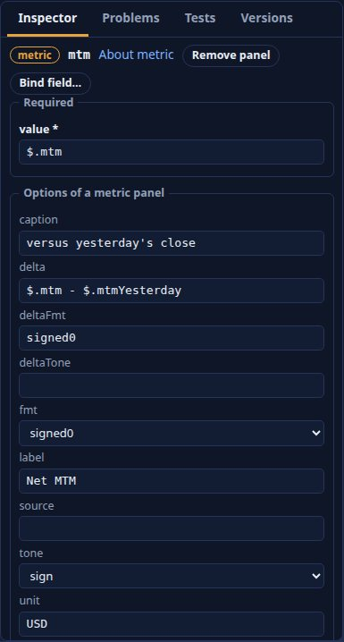
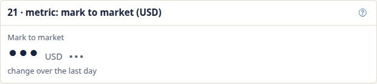
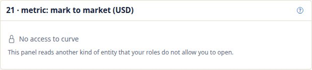
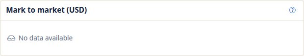
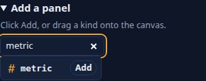
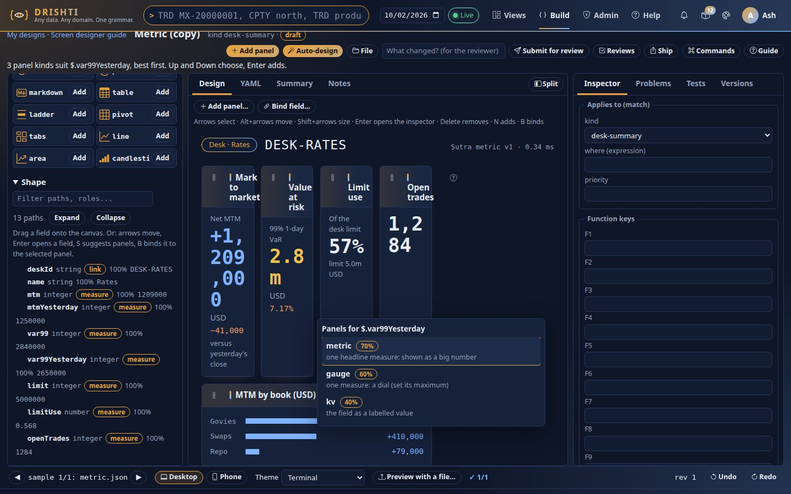
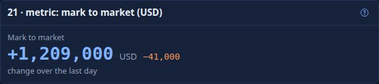
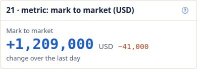

<!--
  Project Drishti · Any data. Any domain. One grammar.

  Copyright (c) 2026 Ashutosh Sinha <ajsinha@gmail.com>.
  All rights reserved.

  PROPRIETARY AND CONFIDENTIAL.

  This file is the confidential and proprietary property of Ashutosh Sinha.
  Unauthorised copying, use, modification, distribution or disclosure of this
  file, via any medium, is strictly prohibited except with the express prior
  written permission of the copyright holder.

  See the LICENSE file in the root of this repository for the full terms.
# Developing a panel kind

This guide takes you from "Drishti has no panel for this" to a new panel kind that is parsed, validated, bound, drawn,
editable in the workbench, exported, checked by the guard tests and documented. It uses a real kind as the worked
example: **`metric`**, the 21st kind (a big-number KPI tile with a change, a unit and a caption). Every snippet below
is the code that is in the repository today, with its path, not a sketch: open the file beside the guide and follow
along. The commit that added the kind is a useful companion (`git show 7b59cdfd`, then `git show cab01094` for the
merge).

Who it is for: a developer who changes Drishti itself. If you only *use* kinds in a Sutra, read the
[catalogue](PANEL_KINDS.md) and the [Rachana reference](RACHANA_REFERENCE.md#panels); if you design screens, read
[SCREEN_DESIGNER.md](SCREEN_DESIGNER.md). The general repository rules (file size, header, vendored front end) are in
[DEVELOPER_GUIDE.md](DEVELOPER_GUIDE.md#3-project-rules).

> **Why this is long.** A panel kind is not one class. It is a word in the grammar, a record in the view model, a
> macro, a style, a row in the workbench's palette, a rule in the auto-designer, a CSV shape, an example, a
> screenshot and about a dozen counts in tests and prose. The ordered checklist in [section 4](#4-the-checklist) is the
> short version; sections 5 to 15 are the reasoning, one topic each.

## Contents

1. [Should this be a new kind at all?](#1-should-this-be-a-new-kind-at-all)
2. [How a panel travels](#2-how-a-panel-travels)
3. [Two decisions before you write code](#3-two-decisions-before-you-write-code)
4. [The checklist](#4-the-checklist)
5. [The grammar](#5-the-grammar-rachana)
6. [The view model: the record and emptiness](#6-the-view-model-the-record-and-emptiness)
7. [The binder](#7-the-binder)
8. [Masks, `source` and no access](#8-masks-source-and-no-access)
9. [The console: macro, styles and (for charts) `charts.js`](#9-the-console-macro-styles-and-for-charts-chartsjs)
10. [Live updates](#10-live-updates)
11. [CSV export](#11-csv-export)
12. [The workbench: palette, inspector, binding, suggestions, auto-design](#12-the-workbench-palette-inspector-binding-suggestions-auto-design)
13. [Accessibility, phone width and themes](#13-accessibility-phone-width-and-themes)
14. [Examples, screenshots and documentation](#14-examples-screenshots-and-documentation)
15. [Tests: yours and the guard tests](#15-tests-yours-and-the-guard-tests)
16. [What goes wrong, and which test says so](#16-what-goes-wrong-and-which-test-says-so)

## 1. Should this be a new kind at all?

A kind is a permanent word in the language: every Sutra author, every pack, the schema, the palette, the
auto-designer and the documentation carry it for ever, and the language is versioned. Before adding one, check that no
existing kind, option or combination does the job.

| You want | Try first |
|---|---|
| a different look for a list of rows | `table` options (`columns`, `tone`, `fmt`), a `ladder`, a `pivot` |
| a figure with a label | `kv` with one column, or a `strip` entry in the Sutra |
| a figure against a maximum | `gauge` |
| a new chart shape that ECharts already draws | still a new kind, but a chart kind: see [3.2](#32-html-kind-or-echarts-kind) |
| a different colour or format | a format or tone ([RACHANA_REFERENCE.md](RACHANA_REFERENCE.md#formats)), not a kind |

`metric` earned its place because the strip (the row of figures under a view's title) only carries a label and a value,
and a headline figure needs a change, a unit and a caption **and** needs to be a movable, resizable panel in the grid.

## 2. How a panel travels

```text
Sutra YAML ──parse──▶ Panel(kind, options) ──compile EL──▶ bind(Panel, document) ──▶ PanelView{kind, data, empty, error}
  (rachana)             PanelKind, PanelOptions         Binder / ChartBinder           PanelData record (engine)
                        SutraExpressions
                                                             │
          ┌──────────────────────────────────────────────────┘
          ▼
   JSON view model ──▶ console macro (_macros/panels.html) ──▶ HTML ──▶ view.js / charts.js / tables.js enhance
                       first paint, no JavaScript needed          live: the same macro, re-run per patch

   Workbench (Build): palette.js, RachanaSchema → inspector, Bind.BINDABLE, PanelChooser, AutoDesigner, SampleChecker
```

| Step | Where | What it does for a kind |
|---|---|---|
| Parse | `drishti-rachana/.../model/PanelKind.java`, `PanelOptions.java` | the kind word (`DRS-2021`), required options (`DRS-2022`), accepted options (`DRS-2023`), restricted values (`DRS-2029`) |
| Compile | `drishti-rachana/.../SutraExpressions.java` | which options are expressions, compiled when the Sutra loads (`DRS-2101`) |
| Schema | `drishti-rachana/.../RachanaSchema.java` | the JSON Schema served at `GET /api/v1/rachana/schema`: completion, the YAML editor and the workbench inspector all read it |
| Bind | `drishti-engine/.../bind/Binder.java`, `ChartBinder.java` | evaluates the options against the document into a `PanelData` record; masks and `source` are handled around it |
| View model | `drishti-engine/.../view/PanelData.java`, `Emptiness.java` | the record, and when it counts as empty |
| Draw | `console/web/templates/_macros/panels.html`, `static/css/terminal.css`, `static/js/charts.js` | first paint from the macro; ECharts kinds then enhanced by `charts.js` |
| Live | `console/routes/api_routes.py` (`_view_event`) | a changed panel is re-rendered by the same macro |
| Export | `console/core/export.py` | the CSV of the panel |
| Workbench | `static/js/build/palette.js`, `actions.js`; `design/ops/Bind.java`; `design/PanelChooser.java`, `AutoDesigner.java`; `design/SampleChecker.java` | the palette, a new panel's seeding, which fields can be dropped, what is suggested and drafted, how a design is checked on samples |

The engine **knows nothing of HTML**. The console **knows nothing of the grammar**: it draws the view model it is
given. Keep it that way: all decisions (formatting, tones, aggregation, binning, limits) belong in the binder, which is
tested in Java with no browser.

## 3. Two decisions before you write code

### 3.1 Reuse a `PanelData` record, or add a new one?

`PanelData` is a sealed interface; every kind's data is one of its records. A new kind can borrow a record when its
view model is **exactly** that shape and its **emptiness** is the same rule.

| Choose | When | Examples in the repository |
|---|---|---|
| **Reuse** a record | the console can draw it with the same macro branch shape, and "empty" means the same | `table` and `ladder` both use `PanelData.Table`; `kv` and `status` both use `Fields` |
| **Add** a record | the kind has parts the existing record cannot carry, or it needs its own emptiness | `PanelData.Gauge`, `Surface`, `Waterfall`, ... and `Metric` |

`metric` first looked like a one-cell `Fields` (the old recipe in DEVELOPER_GUIDE did exactly that). It could not stay
one, for two reasons that are the tests you apply to your own kind:

1. **Does the record carry everything the kind shows?** A tile has a unit, a caption and an optional change next to the
   figure. `Fields` is a list of labelled cells and has nowhere to put them.
2. **Is the emptiness rule the same?** `Fields` is empty only when **all** cells are blank. A tile with a missing figure
   but a caption must be empty. So the kind needs its own `case` in `Emptiness.of`.

If either answer is "no", add a record, and the Java compiler will then force you to handle it everywhere that switches
over `PanelData` (`Emptiness.of`, and any other exhaustive `switch`): that is the point of a sealed interface.

### 3.2 HTML kind, or ECharts kind?

| | HTML kind | ECharts kind |
|---|---|---|
| Drawn by | the Jinja macro alone (first paint), styled by `terminal.css` | the macro emits `<div class="chart xchart" data-xchart="{json}">`; `charts.js` draws it with the vendored ECharts after load |
| Needs JavaScript to be readable | no | the picture does; the macro also emits a collapsed **Data** table (or list) with the same numbers, so it is readable without |
| Examples | `kv`, `table`, `status`, `gauge`, `hbar`, `metric` | `waterfall`, `histogram`, `scatter`, `candlestick`, `graph` (via `charts.js`); `line`, `area`, `surface` (via `view.js`) |
| Extra files | none | a builder in `static/js/charts.js` (`BUILD`), a macro that calls `xchart(...)` and `data_table(...)`, an `aria-label` that says what the chart shows |
| Colours | CSS variables (`var(--d-ink)`, `--d-muted`, tones `t-pos`, `t-neg` ...) | read from the theme tokens by `tokens()` in `charts.js`, so a theme change redraws them |
| Computing over lists | in the binder | in `ChartBinder.java` (binning, running totals, aggregates), under `drishti.panels` limits |

Rule of thumb: if the figure is text and boxes, it is HTML (and it works at first paint, in print, in a screen reader
and with scripts blocked). If it needs axes, scales or interaction, it is ECharts. `metric` is an HTML kind and the
rest of this guide follows it; [section 9.4](#94-an-echarts-kind-chartsjs-and-the-data-table) lists what an ECharts kind
adds, with `waterfall` as the reference.

## 4. The checklist

Work through it in this order: each step compiles and tests on its own, and the first failure you meet is then the
step you just did. "Catches it" names the test that fails (or the compiler) when the step is missed; "no guard"
means nothing fails and a human has to look, which is why those steps say what to check.

| # | File | Change | Why | Catches it if missed |
|---|---|---|---|---|
| 1 | `drishti-rachana/.../model/PanelKind.java` | add the enum constant with required and optional options | the word exists; the parser's `DRS-2021/2022/2023` come from it | compiler (exhaustive `switch` in `Binder`), `StudioTest` kind count |
| 2 | `drishti-rachana/.../model/PanelOptions.java` | only for an option with a fixed set or a shape rule | `DRS-2029` instead of a silent mistake | your own parser test (`MetricPanelTest.theGrammarAcceptsTheOptionsAndRejectsTheRest`) |
| 3 | `drishti-rachana/.../SutraExpressions.java` | the options that hold expressions, in `EL_OPTIONS` | compiled and checked at load (`DRS-2101`); the workbench offers autocomplete in exactly these | `MetricPanelTest` (`DRS-2101` on a broken `value`) |
| 4 | `drishti-rachana/.../RachanaSchema.java` | a `kindOption` branch for every option that is not plain text; `SCHEMA_CHOICES` for fixed sets | the inspector's editors and descriptions come from here | `test_workbench_options_browser.py` (labelled editor); **no guard** for a missing description: look at the inspector |
| 5 | `drishti-engine/.../view/PanelData.java` | a record, when [3.1](#31-reuse-a-paneldata-record-or-add-a-new-one) says so | the view model | compiler |
| 6 | `drishti-engine/.../view/Emptiness.java` | a `case` for the record | when the panel says *No data available*; the `SampleChecker` and auto-design pruning read it | compiler (sealed `switch`); `MetricPanelTest.aMissingFigureIsAnEmptyPanelNotAnError` |
| 7 | `drishti-engine/.../bind/Binder.java` (or `ChartBinder.java`) | a `case` in the `switch` in `bind`, and the method | the data | compiler; `MetricPanelTest` |
| 8 | `console/web/templates/_macros/panels.html` | a branch in `panel(p)`, with an accessible name and `data-path` | first paint, and every live patch | `test_metric.py` (yours); `test_terminal.py::test_every_panel_kind_renders_imperfect_data_without_failing` after step 17 |
| 9 | `console/web/static/css/terminal.css` | the styles, theme variables only, a phone rule | no inline styles (CSP) | `test_metric.py` stylesheet test (yours); `test_contrast.py` |
| 10 | `console/web/static/js/charts.js` | ECharts kinds only: a builder in `BUILD` | the drawing | a browser test of yours |
| 11 | `console/core/export.py` | `EXPORTABLE` and a `panel_rows` branch | the CSV | `test_metric.py` CSV test (yours) |
| 12 | `console/web/templates/_macros/panels.html` | the kind in the tuple that shows the download link | the ↓ in the heading | `test_metric.py` (`data-export-panel`) |
| 13 | `drishti-rachana/.../design/ops/Bind.java` | new bindable option names into `BINDABLE` | a field dropped on the panel can fill them | **no guard**: add a test beside the `Bind` op tests |
| 14 | `drishti-engine/.../design/PanelChooser.java` | `scalarChoices` (or the list/object choices) | what the field-drop menu and the alternatives offer | `AutoDesignerTest.suggestReturnsTheExpectedFirstChoicePerRole` (changed by yours) |
| 15 | `drishti-engine/.../design/AutoDesigner.java` | `Collector.scalar` (or the list branch) | what the first draft contains | `AutoDesignerTest` |
| 16 | `console/web/static/js/build/palette.js`, `actions.js` | a `KINDS` row; seeding in `actions.js` | the kind in the palette and the Add-panel chooser; a new panel starts with a sensible `value` | `test_workbench_add_browser.py` (21 kinds), `test_workbench_metric_browser.py` (yours) |
| 17 | `console/tests/test_terminal.py` | the kind in `KINDS` | the macro against broken data | itself |
| 18 | `docs/guides/examples/` | the kind in the showcase **and** an example of its own; the examples README | the examples are the source of the docs and the tests | `test_examples.py`, `ExamplePreviewTest`, `test_build_designs.py` |
| 19 | `console/tests/fixtures/view_sutra_all-panels-showcase.json` | the panel, by hand, as the server returns it | the fake backend's showcase | `test_build_designs*.py`, `test_workbench_model.py` |
| 20 | the counts | see [14.3](#143-the-counts) | every "twenty" in code, tests and prose | `StudioTest`, `test_workbench_options_browser.py`, `test_examples.py`, the docs tests; `grep -rni "twenty"` for the prose |
| 21 | docs and screenshots | the catalogue section, the reference section, `tools/docs/shots/panels.py`, the help entry | users find it; the image test passes | `test_guide_images.py`, `test_panel_kinds.py` |
| 22 | tests of your own | server, macro, live, CSV, CSS, browser | [section 15](#15-tests-yours-and-the-guard-tests) | (these are the tests) |
| 23 | `CHANGELOG.md` | one bullet under *Unreleased* | release notes | review |

Then run the whole set: [15.4](#154-how-to-run-them). The sections that follow take the steps in groups.

## 5. The grammar (Rachana)

### 5.1 `PanelKind`: the word and its options

`drishti-rachana/src/main/java/com/ash/drishti/rachana/model/PanelKind.java`:

```java
    /**
     * One large formatted, toned figure (a KPI tile), with an optional small change beside it ({@code delta}, with its own
     * format and tone), a {@code unit} and a {@code caption} under it.
     */
    METRIC(Set.of("value"), Set.of("label", "fmt", "tone", "delta", "deltaFmt", "deltaTone", "unit", "caption"));
```

The two sets are the **required** and the **optional** options. The parser rejects a kind it does not know
(`DRS-2021`), an option the kind does not list (`DRS-2023`) and a missing required one (`DRS-2022`). Two more things
hang on this one line:

- `readsData()` is true for every kind except `links` and `provenance`, so `source` is accepted automatically (see
  [section 8](#8-masks-source-and-no-access)). A kind that merely describes the view should be added to that exception
  list; a kind that reads data needs nothing.
- Keys every panel takes (`id`, `title`, `key`, `span`, `height`, ...) are never kind options; do not list them.

Also update the class Javadoc ("The twenty-one panel kinds of the grammar"): it is one of the counts in
[14.3](#143-the-counts).

### 5.2 `PanelOptions`: restricted values and shape rules

When an option takes a fixed set, a range or a particular shape, `PanelOptions` reports `DRS-2029` with a message that
names the allowed values, when the Sutra loads, instead of letting a typo through. `metric` has one rule, because
`value` and `delta` are one expression written as text, and a YAML list or mapping there is always a mistake:

```java
        if (kind == PanelKind.METRIC && (value instanceof List<?> || value instanceof Map<?, ?>)) {
            return Optional.of(what + " is one value written as text (an expression for value and delta), not a list or a mapping");
        }
```

Add a rule only for a mistake people will make; every rule is a message to write and a test to keep.

### 5.3 `SutraExpressions`: which options are expressions

`drishti-rachana/src/main/java/com/ash/drishti/rachana/SutraExpressions.java` holds `EL_OPTIONS`, the map from kind to
the options that are Rachana-EL expressions:

```java
            Map.entry(PanelKind.PIVOT, Set.of("rows")), Map.entry(PanelKind.METRIC, Set.of("value", "delta")));
```

An option listed here is compiled when the Sutra loads, so `value: '$.a +* 2'` is `DRS-2101` at load rather than a dash
in a view. The workbench also reads this set (through the schema) to offer expression autocomplete in the inspector.
`caption` is **not** an expression: it is a template (`${...}` parts), rendered by the binder with a fallback to the
literal text.

### 5.4 `RachanaSchema`: the editor schema is *not* automatic

This is the step the old recipe got wrong. `RachanaSchema` builds the JSON Schema from `PanelKind`, so the new kind and
its option **names** appear on their own. But each option's **type, choices and description** come from
`kindOption(kind, option)`; an option it does not know gets only the generic `option of metric panels`, which is what
the inspector would then show.

`fmt` and `tone` are special-cased by name; expression options are typed by `SutraExpressions`. Everything else needs a
branch in `drishti-rachana/src/main/java/com/ash/drishti/rachana/RachanaSchema.java`:

```java
        if (k == PanelKind.METRIC && (o.equals("deltaFmt") || o.equals("deltaTone"))) {
            return Map.of("type", "string", "description", o.equals("deltaFmt") ? "How the change is formatted (default: the format of value)"
                    : "The change's tone: sign (default: positive green, negative red), status, or a fixed tone such as neg, warn or accent");
        }
        if (k == PanelKind.METRIC && (o.equals("unit") || o.equals("caption"))) {
            return Map.of("type", "string", "description", o.equals("unit") ? "A short unit shown small beside the figure (USD, bp)"
                    : "Small text under the figure (may hold ${…})");
        }
```

Write a branch for every option that has a fixed set (`enum`), a non-text type (integer with bounds, boolean, array)
or a description better than the generic one. For a fixed set the parser does not police, also list it in
`SCHEMA_CHOICES` (read by `forKind`). Then **look at the inspector** (picture below): the guard test checks only that
every option has a labelled editor, not that its description is good.



Check the served schema from a running server:

```bash
curl -s localhost:18480/api/v1/rachana/schema | python3 -c 'import json,sys; print(json.load(sys.stdin)["$defs"]["panel"]["properties"]["kind"]["enum"])'
```

(or ask the scratch server you started: never write to a server you did not start.)

## 6. The view model: the record and emptiness

### 6.1 The record

`drishti-engine/src/main/java/com/ash/drishti/engine/view/PanelData.java`:

```java
    /**
     * {@code metric}: one headline figure.
     *
     * @param value the figure (its label is the panel's {@code label})
     * @param delta the change against a previous value, or null
     * @param unit a short unit, or null
     * @param caption small text under the figure, or null
     */
    record Metric(Cell value, Cell delta, String unit, String caption) implements PanelData {}
```

Reuse `Cell` (`text`, `tone`, `link`, `emphasis`, `path`) for anything the console shows as a formatted value: it is what
carries the masked `•••`, the tone and the `data-path` that notes and history attach to. Put **no HTML and no colour**
in the record: tones are names (`pos`, `neg`, `ok`, `warn`, `bad`, `accent`, ...), the console maps them to classes.
Records are immutable and shared between threads (the bind pool binds panels in parallel), so use only immutable
members.

### 6.2 Emptiness

`drishti-engine/src/main/java/com/ash/drishti/engine/view/Emptiness.java`:

```java
            case PanelData.Metric m -> m.value() == null || blank(List.of(m.value()));
```

The compiler insists on this line (the `switch` over the sealed interface is exhaustive). The *rule* is yours: it is
the single answer to "is this panel worth showing" that the console, the `SampleChecker`, the auto-designer's pruning
and the Studio test all use. `blank` treats a missing text, an empty text and the formatter's dash `—` as blank. A tile
with a caption but no figure is empty, which is the whole reason `metric` has its own record. Be explicit about edge
cases: what happens when *some* parts are present?

`PanelView` carries `empty` computed by `Emptiness.of(data)`, and `error` when binding threw; the macro turns both into
*No data available* (with the reason on hover for an error).

## 7. The binder

`drishti-engine/src/main/java/com/ash/drishti/engine/bind/Binder.java` binds one panel at a time. Add a `case` to the
`switch` (the compiler insists):

```java
                case PIVOT -> charts.pivot(p, c);
                case METRIC -> metric(p, c);
            };
```

and the method:

```java
    private PanelData metric(Panel p, BindContext c) {
        String expr = p.option("value").orElseThrow();
        Object v = evalOrNull(expr, c);
        String fmt = p.option("fmt").orElse(null);
        Cell value = cell(p.option("label").orElse(null), v, fmt, p.option("tone").orElse(null), true, pathOf(expr));
        Cell delta = null;
        Optional<String> dExpr = p.option("delta");
        if (dExpr.isPresent()) {
            Object d = evalOrNull(dExpr.get(), c);
            if (!Values.isNull(d) || Values.masked(d)) {
                delta = cell(null, d, p.option("deltaFmt").orElse(fmt), p.option("deltaTone").orElse("sign"), false, pathOf(dExpr.get()));
            }
        }
        String caption = p.option("caption").map(t -> {
            try {
                return el.template(t).render(c.eval());
            } catch (RuntimeException e) {
                return t;
            }
        }).orElse(null);
        return new PanelData.Metric(value, delta, p.option("unit").orElse(null), caption);
    }

    /** A value a document may lack: it shows as a dash, never as an error. */
    private Object evalOrNull(String expr, BindContext c) {
        try {
            return eval(expr, c.eval());
        } catch (SourceDeniedException e) {
            throw e;
        } catch (RuntimeException e) {
            return null;
        }
    }
```

What to notice, because each is a rule for your own binder:

- **`cell(...)` does the work.** `Binder.cell(label, value, fmt, tone, emphasis, path)` formats the value
  (`formats.format`), resolves the tone (`Tones.resolve`, so `tone: sign` becomes `pos`/`neg`, `status` reads the text),
  turns an entity id into a link, and carries the mask. Do not format numbers yourself.
- **A missing field is a dash, not an error.** `eval` throws on a path the document lacks. Real documents are
  incomplete, so a value the document may lack is read through a helper that turns the exception into `null`
  (`evalOrNull`), and then `cell(...)` renders the dash and `Emptiness` calls the panel empty. An *error* panel is for
  a genuine bug in the data's shape, and it must never take the view down: `bind` catches `RuntimeException` and
  `StackOverflowError` per panel.
- **Optional parts are absent, not blank.** A `delta` whose expression is missing from the document is `null`, so the
  console draws nothing; a delta that is *masked* is kept (so the tile shows `•••`, not an empty space that would let a
  reader infer something).
- **`pathOf(expr)`** gives the cell its `path` (for `$.mtm` it is `mtm`): live patches, notes and history address a cell
  by it. Set it for every cell that comes from one field.
- **Do not hard-code** a pack name, a field name or a threshold. A limit or a default is configuration
  (`drishti.panels`, see [CONFIGURATION.md](../admin/CONFIGURATION.md)); a kind that computes over a list takes its
  limit from `PanelLimits`.
- **Computing over a list** (bins, running totals, aggregates, graphs) belongs in `ChartBinder.java`, beside
  `waterfall`..`pivot`, which reads at most the `PanelLimits` it is given and records what it dropped (`more`,
  `dropped`) so the console can say so. Keep both files under 1,500 lines (`Binder.java` is near the cap; a new
  computing kind belongs in `ChartBinder` for that reason too).

## 8. Masks, `source` and no access

You write **no code** for any of the three if you follow section 7, but you must understand them, because your tests
should cover them.

**Masks** (field masks by role: [API_GUIDE.md](API_GUIDE.md#field-masks)). The pipeline replaces masked values in the
document *before* binding (`ViewPipeline.seen(doc, redact)`); a masked value is a `DataNode` flagged masked whose
text is `DataNode.MASK` (`•••`). `Binder.cell` turns it into a `Cell` with the mask as its text and **no tone and no
link**, so the figure's colour cannot leak the sign. Your obligations:

- never add a masked value up (a total, a running sum, a mean): `Values.masked(x)` is the test, and `Binder.table`,
  `ChartBinder.waterfall` and `maskedPivot` show the pattern (the group stays, the number reads the mask);
- never *chart* one: a masked number is not a number, so a chart kind skips it (and the panel may come out empty);
- keep a masked optional part (the metric's `delta`) rather than dropping it.

The test: `MetricPanelTest.aMaskedFigureShowsTheMaskAndNoTone` previews with the 4-argument
`pipeline.preview(sutra, doc, redact, mayOpen)` and a redactor that masks `mtm`.

**`source`.** Every kind with `readsData()` accepts `source: "link('USD-SOFR', 'curve')"`: the panel reads its
expressions from a *linked entity's* document, fetched with the view's business date and masks. `ViewPipeline` collects
the sources before binding; `Binder.sourced(p, c)` swaps the context. Nothing to write: your `eval(expr, c.eval())`
already reads the swapped context. (`line` names its source in its own data and is the one exception.)

**No access.** When the user's roles do not allow the *source's kind*, the entity is never fetched: `sourced` throws
`SourceDeniedException` *before your method runs*, and the pipeline returns a panel with `denied = "no access to
curve"`, `data == null` and `empty == true`; the macro shows a lock and *No access to curve*. Two consequences for
your code: do not catch `SourceDeniedException` (that is why `evalOrNull` rethrows it), and do not look at values of a
source you were not given. The test: `MetricPanelTest.aSourceTheUserMayNotOpenShowsNoAccessAndNoValue`.

The three states side by side (a masked tile, one with no access, an empty one):





## 9. The console: macro, styles and (for charts) `charts.js`

### 9.1 The macro

`console/web/templates/_macros/panels.html` has one `panel(p)` macro with an `elif` per kind. The metric branch:

```jinja
  <div class="metric" role="group" aria-label="{{ p.title or p.id }}: {{ m.text }} {{ p.data.unit }}, change {{ d.text }}"><span class="metric-l">{{ m.label }}</span><div class="metric-row"><span class="metric-v mono{{ tone(m) }}" data-path="{{ m.path }}">{{ cell_text(m) }}</span><span class="metric-u">{{ p.data.unit }}</span><span class="metric-d mono{{ tone(d) }}" data-path="{{ d.path }}">{{ d.text }}</span></div><span class="metric-c">{{ p.data.caption }}</span></div>
```

Rules for a macro branch:

- It is reached only when the panel is **not** empty and has data: the code above it handles `p.empty`, `p.denied` and
  `p.error` for every kind (`no_data(p)`), so you never write those states.
- **First paint must be readable without JavaScript.** Emit the figure as text.
- **An accessible name.** A tile is a `role="group"` with an `aria-label` that reads the figure, its unit and its change
  together (`MTM: −1,250 USD, change +1.23%`), so a screen reader says it once instead of three fragments. A chart is
  `role="img"` with a label that says what it shows.
- **`data-path`** on the elements that show a field, so live patches, notes and history can address them.
- **`tone(cell)` and `cell_text(cell)`** are macros that already exist in the file: a tone is only ever a class
  (`t-neg`), never a colour, and a link is rendered by `cell_text`.
- **No inline `style=`**: the content security policy forbids it. A dynamic width is a `data-w` attribute set by
  `view.js` (the way `gauge` and `hbar` do it).
- Escape nothing by hand: Jinja autoescapes. Do not use `|safe` on document data.

### 9.2 The styles

`console/web/static/css/terminal.css`, next to `.gauge`:

```css
.metric { display: flex; flex-direction: column; gap: .15rem; min-width: 0; container-type: inline-size; }
.metric-row { display: flex; flex-wrap: wrap; align-items: baseline; gap: .15rem .6rem; }
.metric-v { font-size: clamp(1.1rem, 16cqi, 2.2rem); font-weight: 600; line-height: 1.1; color: var(--d-ink); white-space: nowrap; font-variant-numeric: tabular-nums; }
.metric-u { color: var(--d-muted); font-size: .9rem; }
.metric-d { font-size: .9rem; color: var(--d-muted); }
.metric-l, .metric-c { color: var(--d-muted); font-size: .8rem; }
@media (max-width: 640px) { .metric-v { font-size: clamp(1.1rem, 16cqi, 1.8rem); } }
```

**A figure must never break inside.** The first version used `overflow-wrap: anywhere`, and a six-digit figure in a
narrow workbench tile wrapped digit by digit. Now the tile is a size container (`container-type: inline-size`) and the
figure keeps to one line (`white-space: nowrap`) while its size follows the tile's width (`16cqi`) between a readable
minimum and the full size. `tabular-nums` keeps digits aligned when a live value ticks.

Colours are **theme variables only** (`--d-ink`, `--d-muted`, `--d-pos`, ...): the themes carry the contrast, and
`test_contrast.py` checks every theme's tokens. A hard-coded `#hex` in a kind's CSS is a bug in every theme but one.
Tones are already defined (`.t-pos`, `.t-neg`, ...). Give a layout that survives a narrow column: `min-width: 0` and
wrapping, `overflow-wrap`, and a phone rule at 640 px, the breakpoint `layout.css` uses.

> A real limitation worth knowing: in the workbench's four-across layout (`span: 3` beside the side panes) a six-digit
> figure can wrap digit by digit because `overflow-wrap: anywhere` breaks it. The screenshots draw the tile at a tile's
> width for that reason. If you design a tile for narrow columns, prefer `fmt: compact` for large numbers.

### 9.3 Where the checks for 9.1 and 9.2 live

`console/tests/test_metric.py` renders the macro with a hand-written panel and asserts the structure, the accessible
name, the tone classes, `data-path`, the absence of `style=`, the help link and the download link; and it reads the
stylesheet and asserts every part is styled with theme variables only and a phone rule. Copy it for your kind: it is
~80 lines. `test_terminal.py::test_every_panel_kind_renders_imperfect_data_without_failing` then renders **every** kind
in `KINDS` against null, empty and mistyped data and requires `class="pnl"` and *No data available* where empty, so add
the kind there (step 17).

### 9.4 An ECharts kind: `charts.js` and the data table

An ECharts kind adds three things to the HTML ones:

1. **A macro** that emits the chart container and the same numbers as a table (`waterfall`, in `panels.html`):

   ```jinja
   
   
   {{ xchart(p, steps | length ~ ' steps' ~ ((', ending at ' ~ steps[-1].text) if steps and steps[-1].text else '')) }}
   
   {{ data_table(['Step', 'Amount' ~ ((' (' ~ d.unit ~ ')') if d.unit else '')], rows) }}
   
   ```

   `xchart(p, label)` writes `<div class="chart xchart" data-xchart="{view model as JSON}" data-kind="waterfall"
   role="img" aria-label="...">`; `data_table` writes a collapsed **Data** section: the accessible, printable and
   no-JavaScript version of the picture. The label should say what the chart shows with a number in it (*9 steps, ending
   at +1,875,863*), not "chart".
2. **A builder** in `console/web/static/js/charts.js`: a pure function `(data, tokens, size) -> ECharts option`, added to
   `BUILD`:

   ```js
   var BUILD = { waterfall: waterfall, histogram: histogram, scatter: scatter, candlestick: candlestick, graph: graph };
   ```

   `draw(root)` finds every `.xchart[data-xchart]`, parses the JSON, calls `BUILD[kind]` and sets the option; it is
   re-run after a live patch and a theme change. Read colours from `tokens()` (the theme's CSS variables), never
   hard-code them, and make colour non-exclusive (a signed label on each waterfall bar). A builder must tolerate empty
   or odd data: a throw is caught and the chart is replaced by *No data available* without stopping the other charts.
   The builders are exposed as `window.drishtiCharts.options` for tests.
3. **The binder** computes everything (bins, from/to levels, layout) and the limit it applies is a `drishti.panels`
   setting, so the browser never receives an unbounded list.

If the kind draws in 3D or needs a heavy library, load it only on demand (as `surface` loads ECharts GL on **3D**) and
fall back to a 2D drawing when WebGL is missing. All JavaScript and CSS is vendored; never reference a CDN.

## 10. Live updates

You write nothing for live updates, but know what happens. A live view sends *patches*: a changed panel arrives whole.
`console/routes/api_routes.py`:

```python
CHART_KINDS = {"line", "area"}

def _panel_html(request: Request, panel: dict) -> str:
    """Renders one panel with the same macro as first paint, so live and static views look identical."""
    module = request.app.state.templates.env.get_template("_macros/panels.html").module
    return str(module.panel(panel))
```

`_view_event` renders every patched panel whose kind is **not** in `CHART_KINDS` with that macro and sends the HTML, so
a new kind is re-rendered by the macro you already wrote: the tile replaces itself, whole, with its new figure and its
new change together. `line` and `area` instead send data, and `view.js` moves the existing chart. ECharts kinds that use `charts.js` are re-rendered like HTML kinds and `draw(root)` redraws them. So:

- keep the macro **idempotent** (the same input renders the same HTML) and keep the panel's root element `id="p-<id>"`:
  the patch replaces it by id;
- put `data-path` on the cells (notes and history address a cell by it);
- do not keep state in the DOM of your panel that a replacement would lose, unless `view.js` is taught to restore it
  (a table's sort and a `tabs` selection are the examples).

The test is in `test_metric.py`: `_view_event(request, "frame", ...)` with a changed panel, asserting the patch carries the
new HTML and the panel's id and kind.

## 11. CSV export

The ↓ in a panel's heading downloads `/export/{kind}/{id}/{panel}.csv`. Three places, and the old recipe named one:

1. `console/core/export.py`, `EXPORTABLE`: the set of kinds that can download:

   ```python
   EXPORTABLE = {"table", "ladder", "kv", "status", "tabs", "line", "area", "hbar", "surface", "links", "gauge",
                 "waterfall", "histogram", "scatter", "candlestick", "graph", "timeline", "pivot", "metric"}
   ```
2. the same file, `panel_rows(panel)`, the columns and rows. **Order matters**: kinds are told apart by the shape of
   their data, so the metric branch (its `value` is a dict) must come *before* the gauge's `"value" in d and "max" in d`:

   ```python
       if isinstance(d.get("value"), dict):                                 # metric: the figure, its change, unit and caption
           v, ch = d["value"], d.get("delta") or {}
           return ["Label", "Value", "Change", "Unit", "Caption"], [[v.get("label") or "", plain(v.get("text")), plain(ch.get("text")),
                                                                      d.get("unit") or "", d.get("caption") or ""]]
   ```

   `plain(text)` turns a shown number (`−1,250`, `4.25%`) back into a number, so a spreadsheet gets numbers, not
   strings. The panel's `empty` flag yields no rows.
3. `console/web/templates/_macros/panels.html`: the tuple in the `pnl-help` download link line, which decides whether the
   heading shows the ↓ (`data-export-panel`):

   ```jinja
   <a class="pnl-help" data-export-panel="{{ p.id }}" hidden ...
   ```

Add the kind's columns to the catalogue entry (the **CSV** line) and a test (`test_metric.py` asserts the header and the
row); `test_export.py` covers the route.

## 12. The workbench: palette, inspector, binding, suggestions, auto-design

The workbench ([SCREEN_DESIGNER.md](SCREEN_DESIGNER.md)) is the primary way people will meet your kind, and it needs
six separate rows. None is automatic.

### 12.1 The palette and the Add-panel chooser: `palette.js`

`console/web/static/js/build/palette.js`: `[kind, icon, one line, family]`. Without a row the kind cannot be added from
the workbench (the schema's kinds are *also* checked against this list, and one the list lacks is offered with no icon
text, but you want the row).

```js
    ['metric', 'hash', 'One big headline figure, with its change and unit', 'facts'],
```

The icon is a Bootstrap Icon name (vendored); the line says what the panel shows and what it needs; the family groups
it with similar kinds. The same list feeds the **Add panel** chooser and the *Add* button on a row.



### 12.2 What a new panel starts with: `actions.js`

`console/web/static/js/build/actions.js` seeds the required options of a panel just added from the palette from the
shape of the samples. A required `value` otherwise falls back to a number field (`@.value`, a field *of each row*),
which is wrong for a kind that reads one document-level figure. `gauge` and `metric` are named so their `value` becomes
the first number of the samples (`$.mtm`):

```js
        else if ((kind === 'gauge' || kind === 'metric') && n === 'value') { out[n] = top ? top.path : '$.value'; }
```

If your kind's required options are not rows/text/number-per-row, say here what a sensible first value is.

### 12.3 The inspector: `RachanaSchema.kindOption`

The inspector's form is generated from the schema ([5.4](#54-rachanaschema-the-editor-schema-is-not-automatic)): one
labelled editor per option, a select for `fmt` and `tone` and for any enum, an expression field with autocomplete for
the options in `EL_OPTIONS`. The "About metric" link in its header opens `/help/panel-kinds#metric`, which is why the
catalogue's heading must be exactly `### metric`.

### 12.4 Dropping a field: `Bind.BINDABLE`

`drishti-rachana/src/main/java/com/ash/drishti/rachana/design/ops/Bind.java` lists the options that hold a *path or
field of the data* (as opposed to formats, labels and switches). Dropping a field from the Data pane onto a panel fills
one of them, and `roles(kind)` (what the drop menu offers) is derived from this set and the kind's options:

```java
    private static final Set<String> BINDABLE = Set.of("rows", "x", "y", "value", "label", "size", "group", "open", "high", "low", "close",
            "volume", "date", "detail", "status", "tone", "by", "across", "nodes", "edges", "source", "each", "max", "total", "sum", "delta");
```

`metric` already had `value`; it needed `delta` added. A new option name is not bindable until it is here. **No guard
fails if you forget**: the symptom is a field dropped on the tile offering no `delta` role. Add a test beside the
`Bind` operation tests.

### 12.5 Suggestions: `PanelChooser`

`drishti-engine/src/main/java/com/ash/drishti/engine/design/PanelChooser.java` answers "which panels suit this field,
best first" for the field-drop menu (`S` on a field) and for the runner-up *alternatives* shown next to an auto-designed
panel. For a lone measure it now offers `metric` (and `gauge` when the field is a fraction or has a limit):

```java
                boolean gaugeFirst = limit != null || isFraction(f);
                out.add(choice("metric", gaugeFirst ? 0.55 : 0.7, gaugeFirst ? "or the figure on its own, as a big number"
                        : "one headline measure: shown as a big number", Area.RIGHT, title(f), big, List.of()));
```

Each choice has a score (ordering), a **reason** (the user reads it: write one for every choice) and the filled-in
options. Scores are comparable across kinds only through this class: adding a kind with a high score changes the first
choice for existing fields, which is why `AutoDesignerTest.suggestReturnsTheExpectedFirstChoicePerRole` changed
(`$.mtm` gave `gauge`, now `metric`). Decide deliberately, and change the test with a comment.



### 12.6 The first draft: `AutoDesigner`

`AutoDesigner.Collector.scalar` decides which scalar fields become panels in the **draft** of auto-design (Step 3 of
[SCREEN_BUILDER.md](../architecture/SCREEN_BUILDER.md)). Be conservative: a kind that is drafted for every field floods
the screen. `metric` is drafted only for the document's one headline measure:

```java
            } else if (p.is("measure") && depth == 1 && !isLimit(p) && onlyMeasure(p)) {
                add(p.path(), chooser.choose(p), null);     // the document's one headline measure: a big number
            }
```

Auto-design then **previews the draft against every sample and prunes or demotes** panels that come out empty or in
error for many samples (the threshold is configuration), and says why. That is the `SampleChecker` below, which is also
behind the workbench's **Tests** tab: both read `Emptiness`, which is why step 6 matters beyond the console.

### 12.7 `SampleChecker` and the Tests tab

`drishti-engine/src/main/java/com/ash/drishti/engine/design/SampleChecker.java` renders a Sutra against each sample and
reports, per panel and sample, `ok`, `empty`, `error` or `noAccess`. It needs **nothing** from a new kind except that
`Emptiness.of` is right for the record and that binding does not throw on ordinary missing data. A kind whose emptiness
is wrong makes every design that uses it look broken, or healthy while blank.

## 13. Accessibility, phone width and themes

A kind is not done until each of these holds; each has a test or a screenshot you can point at.

| Requirement | How to meet it | Check |
|---|---|---|
| **Named for assistive technology** | a group or image role with an `aria-label` that says what and how much | `test_metric.py` asserts the exact `aria-label` |
| **Colour is never alone** | a tone always accompanies text with a sign or a word (`−1,250`, `FAILED`); a chart carries labels and a **Data** table | review; `test_terminal.py` |
| **Keyboard** | a focusable element must be a real control (button, link) or have `tabindex`; tables and trees follow the existing key maps | the panel root has `tabindex="-1"` from the macro; review the new controls with Tab |
| **Contrast** | theme variables only (no `#hex`) | `test_contrast.py` over every theme; your CSS test forbids hex |
| **Themes** | the same panel in the light and the dark theme; charts redraw on a theme change | the *dark* screenshot below |
| **Phone (390 px)** | wrap, do not overflow; one panel per row; a tile shrinks its figure at 640 px | the *phone* screenshot; the CSS test asserts the media rule |
| **Print** | light palette, no hidden panels, full height; an ECharts kind prints its **Data** table if opened | review |
| **No inline styles, no CDN** | classes and `data-w`; vendored assets | CSP in the browser console; `tools/license_headers.py` for headers |




## 14. Examples, screenshots and documentation

### 14.1 Examples

`docs/guides/examples/` is the source of truth for the documentation and the test data, and the rules are strict:

1. **The all-panels showcase** (`all-panels-showcase.sutra.yaml` and its `.json`) must hold every kind: a test asserts
   its kinds equal the set of all kinds. Add a numbered panel (`"21 · metric: mark to market (USD)"`) and, if the
   document lacks the data, the fields it reads:

   ```yaml
     - { id: headline, kind: metric, title: "21 · metric: mark to market (USD)", area: right, value: $.mtm, fmt: signed0, tone: sign,
         label: Mark to market, unit: USD, delta: $.pnl1d, deltaFmt: signed0, caption: "change over the last day" }
   ```
2. **An example of its own** when the kind needs its own data to be shown well: `metric.sutra.yaml`, `metric.json` and
   `metric.md` (what it shows, kinds used, how to open, what to look for, what to copy), indexed in the examples README.
   The example must give the auto-designer something to chew on: `AutoDesignerTest`'s example-wide test requires every
   example to produce at least one alternative, so the JSON needs a list as well as scalars (`metric.json` has `books`).
3. **The canned view** `console/tests/fixtures/view_sutra_all-panels-showcase.json` (the fake backend's showcase) is
   written by hand in the shape the server returns: add the panel to it.

`console/tests/test_examples.py` (`KINDS`), `ExamplePreviewTest` (every example previews on the server, panel counts),
`console/tests/test_build_designs.py`, `test_build_designs_browser.py` and `test_workbench_model.py` (the copy of the
showcase has N panels) all move when the showcase gains a panel: update the counts, with the reason in the commit.

### 14.2 Screenshots

Pictures are generated, never hand-made, so they can be regenerated when the UI changes. The module for this guide's
pictures is `tools/docs/shots/panels.py` (driver: `tools/docs/screenshots.py`). For a new kind:

- add its panel id to `KIND_PANEL` (the picture `kind-<kind>.jpg` is taken from the showcase in the workbench);
- for states, add a Sutra line to `EMPTY_PANEL` (an empty state needs a document that lacks the data) and the kind to
  `FAMILIES` when it is the representative of a family;
- run it against **scratch ports**, never the usual ones (JDK 25 for the server):

  ```bash
  export JAVA_HOME=/usr/lib/jvm/java-25-openjdk-amd64
  ./mvnw -o -q package -DskipTests -pl drishti-server -am          # the driver starts the packaged server on :18997 and the console on :17997
  console/.venv/bin/python tools/docs/screenshots.py --guide panels --only metric
  console/.venv/bin/python tools/docs/screenshots.py --list --guide panels
  ```

  The driver refuses `:18480` and `:17480`, starts and stops what it started, and writes
  `docs/guides/img/panels/`. `console/tests/test_guide_images.py` fails if a guide shows a picture that is missing, if a
  picture exists that no guide shows, or if the script cannot make a picture a guide shows.

The states that cannot be produced in a design preview (masked, an error) are the console's own macro drawing the view
model the server returns for them: the module says so in its docstring.

### 14.3 The counts

Adding a kind changes a number written in several places. They are the most common reason a build is red after the
code works. Find them all:

```bash
grep -rniE "twenty|twenty-one|[^0-9]20 (panel )?kinds|hasSize\(2[01]\)|== 2[01]" --include=*.java --include=*.py --include=*.js \
  --include=*.html --include=*.md --include=*.yaml . | grep -v "\.venv\|target/\|docs/qa/\|CHANGELOG\|RELEASE_NOTES"
```

What it found for `metric`: `PanelKind`'s Javadoc, `StudioTest` (`hasSize(21)` on the schema's kind enum),
`ExamplePreviewTest` (the showcase's panel count), `palette.js` and `canvas.js` comments, `design.html` (the filter's
placeholder), `landing.html` (the statistic and the tooltip that lists the kinds), `competitive.yaml`,
`test_examples.py`, `test_workbench_add_browser.py`, `test_workbench_options_browser.py` (`len(kinds) == 21`),
`test_build_designs*.py`, `test_workbench_model.py`, and the prose in the guides. History in `CHANGELOG.md` and
`RELEASE_NOTES.md` stays as written.

### 14.4 Documentation

| Where | What |
|---|---|
| [PANEL_KINDS.md](PANEL_KINDS.md) | a `### <kind>` section: meaning, when to use and not, key options (linked, not copied), behaviour, a YAML example **cut from an example file**, a screenshot. The heading must be exactly the kind (`### metric`): the `?` icon in every panel, the inspector's *About metric* and F1 open `/help/panel-kinds#metric`. `test_panel_kinds.py` asserts all 21 anchors, that the YAML is a verbatim excerpt of an example and that the pictures exist. |
| [RACHANA_REFERENCE.md](RACHANA_REFERENCE.md#panels) | the kind's full option table: the one place every option is listed |
| `console/config/help.yaml` | the help centre's entries and counts (shared file: one owner at a time) |
| `CHANGELOG.md` | one bullet under *Unreleased* |

## 15. Tests: yours and the guard tests

### 15.1 Yours (they must fail before and pass after)

| Test | File | What it proves |
|---|---|---|
| server: the figure, change, unit and caption; the optional parts; empty; masked; no access; the grammar | `drishti-server/src/test/java/com/ash/drishti/server/MetricPanelTest.java` | binding through the real pipeline with a Sutra and a document the test supplies (`pipeline.preview(Optional.of(sutra), doc)`; the 4-argument overload takes a redactor and a `mayOpen` predicate for masks and no access) |
| console: macro, live, CSV, CSS | `console/tests/test_metric.py` | structure, accessible name, tones, `data-path`, no inline style, a live frame, the CSV, theme-only colours and the phone rule |
| browser: palette, add, seeding, inspector, rendering | `console/tests/test_workbench_metric_browser.py` | the kind can be added from the palette and edited in the inspector, and the tile draws |
| docs: anchors, images, YAML | `console/tests/test_panel_kinds.py`, `test_guide_images.py` | the catalogue |

Use a pack that exists in this repository in a server test (`drishti.packs.enabled=trading,counterparty-risk`, and
`drishti.sources.plugins.demo.settings.ticking=false` so the data does not move under you): there is no `finance` pack.
Always write the Sutra with `rachana: 1` first (`DRS-2009` otherwise) and a lower-case kebab name.

### 15.2 The guard tests that fail when a kind is half-added

| Guard | File | Fails when |
|---|---|---|
| the schema counts the kinds | `StudioTest` (`/$defs/panel/properties/kind/enum` `hasSize(21)`) | the constant is missing, or the number was not updated |
| every example together covers every kind | `console/tests/test_examples.py` (`KINDS`) | a kind is in no example, or the showcase lacks it |
| every example previews on the server | `ExamplePreviewTest` | an example's Sutra does not bind; the panel count is stale |
| every option of every kind has a labelled editor | `console/tests/test_workbench_options_browser.py` (reads the showcase; `len(kinds) == 21`) | an option has no editor; the kind is not in the showcase |
| the palette offers all kinds | `console/tests/test_workbench_add_browser.py` (a filterable grid of all twenty-one kinds) | `palette.js` lacks the row |
| the macro survives broken data | `console/tests/test_terminal.py` (`KINDS`) | the macro cannot render null, empty or mistyped data |
| the showcase copy previews | `console/tests/test_build_designs.py`, `test_build_designs_browser.py`, `test_workbench_model.py` | the panel count of the showcase changed |
| the suggest/first-choice contract | `AutoDesignerTest` (`suggestReturnsTheExpectedFirstChoicePerRole`, `everyExampleDrawsATitleAStripAndPanelsWithReasonsAndAlternatives`) | a new scalar choice changes a first choice; an example gives no alternatives |
| operations over every kind | `OpApplierTest` (uses `PanelKind.values()`) | an op cannot add or bind a kind |
| every picture exists and is used | `console/tests/test_guide_images.py` | the guide shows a missing picture; an unused picture; a picture the script cannot make |
| the catalogue has all 21 anchors | `console/tests/test_panel_kinds.py` | a heading is missing, renamed, or not the first of its slug |
| contrast | `console/tests/test_contrast.py` | a theme's tokens fall below the ratios |
| pack Sutras against mangled documents | `ImperfectDataTest` | a pack's panels error on a mangled document |
| file size, headers, no CDN | `tools/license_headers.py --fix`; the 1,500-line cap | a new file lacks the header; a Java file is too long |

### 15.3 What the guards do **not** catch

Three steps have no test: the descriptions in `RachanaSchema` (look at the inspector), `Bind.BINDABLE` (drop a field on
the panel), and the counts in prose (the `grep` of [14.3](#143-the-counts)). Do those by hand and, if you can, add the
test: a one-line assertion is cheaper than the next person's afternoon.

### 15.4 How to run them

The browser tests use the **packaged** server jar, so build first, or they test stale code. Wait until `uptime` shows a
1-minute load below 16; one heavy job at a time.

```bash
export JAVA_HOME=/usr/lib/jvm/java-25-openjdk-amd64            # JDK 25 only
./mvnw -o -q install -N                                         # the parent POM, once
# the engine, grammar and your test:
./mvnw -o -q test -pl drishti-rachana,drishti-engine,drishti-server -am -Dtest='MetricPanelTest,StudioTest,AutoDesignerTest,OpApplierTest,ExamplePreviewTest' -Dsurefire.failIfNoSpecifiedTests=false
./mvnw -o -q package -DskipTests -pl drishti-server -am         # then the jar the browser tests drive
./mvnw spotless:apply                                           # formatting (Java)
python3 tools/license_headers.py --fix                          # the copyright header on new files
# the console, from the repository root:
console/.venv/bin/python -m pytest console/tests/test_metric.py console/tests/test_examples.py console/tests/test_terminal.py \
  console/tests/test_workbench_options_browser.py console/tests/test_workbench_add_browser.py console/tests/test_workbench_metric_browser.py \
  console/tests/test_guide_images.py console/tests/test_panel_kinds.py console/tests/test_help.py console/tests/test_help_links.py -q
./mvnw -q -o verify                                             # everything, once, at the end
```

## 16. What goes wrong, and which test says so

The list below is what happened when `metric` was added by following the earlier recipe literally (the recipe has since
been replaced by this guide). Each line is a trap and where it shows.

| Trap | What you see | Where it is caught |
|---|---|---|
| a one-cell `Fields` for a tile | no place for unit, caption, change; a missing figure with a caption is not empty | design decision [3.1](#31-reuse-a-paneldata-record-or-add-a-new-one) |
| the editor schema "is automatic" | every option has the generic description `option of metric panels`; an enum is a free-text box | [5.4](#54-rachanaschema-the-editor-schema-is-not-automatic); no guard |
| kind not in the all-panels showcase | `test_workbench_options_browser` never reaches the kind's options; `test_examples` fails | [14.1](#141-examples) |
| no palette row | the kind cannot be added from the workbench | `test_workbench_add_browser.py` |
| `actions.js` seeding | a new tile gets `value: @.value`, a field *of each row* | `test_workbench_metric_browser.py` |
| `Bind.BINDABLE` | dropping a field on the tile cannot fill `delta` | no guard ([12.4](#124-dropping-a-field-bindbindable)) |
| `PanelChooser` and `AutoDesigner` untouched | the field-drop menu never offers the kind; the draft never contains it | `AutoDesignerTest` once you assert it |
| the macro without a name or `data-path` | a screen reader hears fragments; notes and history miss the cell | `test_metric.py` |
| CSV in three places, one found | no ↓ in the heading, or the download is empty, or a metric is exported as a gauge | `test_metric.py`; order of the `panel_rows` branches |
| a server test with `drishti.packs.enabled=finance` | context fails to start: there is no `finance` pack | use `trading,counterparty-risk` |
| a masked or no-access test with the 2-argument `preview` | no redactor, nothing to mask | use `preview(sutra, doc, redact, mayOpen)` |
| the showcase gains a panel | five unrelated tests fail with "21 != 22" | [14.1](#141-examples), [14.3](#143-the-counts) |
| a new scalar choice in `PanelChooser` | `suggestReturnsTheExpectedFirstChoicePerRole` fails (`gauge` became `metric`) | decide on purpose, update with a comment |
| an example whose JSON has only scalars | `everyExampleDrawsA...WithAlternatives` fails | give the JSON a list |
| the browser tests with an old jar | skipped or stale | `./mvnw package` before pytest |
| "twenty" left in prose | the docs say 20 | [14.3](#143-the-counts) |
| `help` entry for the catalogue not updated | `/help/panel-kinds#metric` opens nothing | `test_help.py`, `test_panel_kinds.py` |

For the broader recipes (a new REST endpoint, source plugin, pack, configuration property, console page) see
[DEVELOPER_GUIDE.md](DEVELOPER_GUIDE.md#5-recipes); for the language itself, [RACHANA_REFERENCE.md](RACHANA_REFERENCE.md).
