<!--
  Project Drishti · Any data. Any domain. One grammar.

  Copyright (c) 2026 Ashutosh Sinha <ajsinha@gmail.com>.
  All rights reserved.

  PROPRIETARY AND CONFIDENTIAL.

  This file is the confidential and proprietary property of Ashutosh Sinha.
  Unauthorised copying, use, modification, distribution or disclosure of this
  file, via any medium, is strictly prohibited except with the express prior
  written permission of the copyright holder.

  See the LICENSE file in the root of this repository for the full terms.

# The twenty-one panel kinds

Every box on a Drishti screen is a **panel**, and every panel is one of twenty-one kinds. A Sutra names the kind and says where the data is; with no Sutra, inference picks a kind for you. This is the catalogue: for each kind what it means, when to use it and when not, its key options, how it behaves when the data is empty, masked, not accessible, live or on a phone, and a real example you can copy.

- **Writing a Sutra?** The full list of every option, format and tone is the [Rachana reference](RACHANA_REFERENCE.md#panels); this page links to it per kind and does not repeat it.
- **Adding a kind to Drishti itself?** [PANEL_DEVELOPER_GUIDE.md](PANEL_DEVELOPER_GUIDE.md) walks through it with `metric`.
- **Building screens in the workbench?** [SCREEN_DESIGNER.md](SCREEN_DESIGNER.md) shows the palette and the inspector for every kind.
- **Examples.** Each kind's YAML below is a panel of a working example in [examples/](examples/README.md): the [all-panels showcase](examples/all-panels-showcase.md) has all twenty-one, [metric](examples/metric.md) has the tiles. Open any of them in the workbench (Build, New, Examples) and press the `?` in a panel's heading to come back here: it opens the section of its kind (`/help/panel-kinds#kv`).

## Contents

- [Choosing a kind](#choosing-a-kind)
- [How a panel behaves](#how-a-panel-behaves)
- Fields: [kv](#kv), [status](#status), [provenance](#provenance), [metric](#metric)
- Tables: [table](#table), [ladder](#ladder), [tabs](#tabs), [pivot](#pivot)
- Series: [line](#line), [area](#area), [hbar](#hbar), [gauge](#gauge)
- Market: [surface](#surface), [candlestick](#candlestick)
- Risk: [histogram](#histogram), [scatter](#scatter)
- P&L: [waterfall](#waterfall)
- Relationships: [graph](#graph), [links](#links)
- Operations: [timeline](#timeline), [markdown](#markdown)
- [Common mistakes and their problem codes](#common-mistakes-and-their-problem-codes)

## Choosing a kind

| Your data looks like | Use | Rather than |
|---|---|---|
| one object with named fields | `kv` | `table` with one row |
| operational states (confirmed, cleared, settled) | `status` | `kv`: `status` colours each value by meaning |
| the one number a screen is about | `metric` | a strip figure when you want its change, unit and caption too |
| a list of similar rows | `table` | `tabs` when there are more than four |
| a list where one row matters most (the next payment) | `ladder` | `table`: a ladder highlights rows and never hides any |
| two to four similar objects (legs, tranches) | `tabs` | `table`: tabs show each object's own fields |
| points along an axis (tenors, dates) | `line` | `hbar` when the order of the axis matters |
| several bands over one axis against a limit | `area` | several `line` panels |
| a few labelled amounts | `hbar` | `waterfall` when the amounts add up to something |
| one number against a maximum | `gauge` | `metric` when there is no maximum |
| a grid of numbers over two axes (a vol surface) | `surface` | `pivot` when the grid must be aggregated from rows |
| a start value, signed contributions and an end value | `waterfall` | `hbar`, which does not show the running total |
| many numbers whose spread matters | `histogram` | `line`, which shows order, not distribution |
| rows with two measures to compare | `scatter` | two `hbar` panels |
| prices with open, high, low and close by date | `candlestick` | `line` of the close, which hides the day's range |
| entities and how they relate | `graph` | `links`, which lists references without their structure |
| dated events | `timeline` | `ladder`, which needs columns and does not sort |
| rows to total by one field across another | `pivot` | `table` with totals, which aggregates one dimension only |
| references to other entities | `links` (automatic) | id columns in a table |
| a note for the reader | `markdown` | a title that says too much |
| where the view came from | `provenance` |  |

The workbench chooser (Build, Add panel, or the palette) offers the same kinds with one line each, and **auto-design** and the field-drop menu rank them for your data; see [SCREEN_DESIGNER.md](SCREEN_DESIGNER.md).

## How a panel behaves

Each kind below says what is special to it. These hold for all of them.

- **Empty is not an error.** Real documents are incomplete. A panel whose data is missing or of the wrong shape is returned flagged `empty` and the console shows *No data available*. A list that is not a list, a row without the field asked for, and a value that is not a number are all left out quietly.
- **A broken panel stays one panel.** When binding a panel throws, that panel carries an `error` and shows *No data available* with *The data did not have the shape this panel expects* and the reason on hover. The other panels and the view are unaffected. (Real documents rarely cause one; a bad expression is caught when the Sutra loads, `DRS-2101`.)
- **Masked.** A user whose roles mask a field sees `•••` where its value would be, never a tone or a link, and a masked number is never added up, charted or used for a total. See the [field masks](API_GUIDE.md#field-masks).
- **No access.** A panel with `source:` that names an entity of a kind the user may not open is not fetched: it shows *No access to curve* (the kind it names) with a lock and holds none of that entity's values. Every kind but `links` and `provenance` takes `source`.
- **Live.** A live view sends only the panels that changed. A `line` or `area` patch carries data and moves the existing chart; every other kind is re-rendered by the same macro as the first paint, so it looks identical after a tick.
- **Phone.** Below 640 px every panel takes the whole width, one per row; tables scroll sideways inside their panel, charts resize, and a chart's numbers are in a collapsed **Data** section under it.
- **Accessibility.** Charts are `role="img"` with a label that says what they show; colour is never alone (a tone always has a sign or a word); tables take the keyboard (arrows, PgUp/PgDn, Home/End, Enter). Contrast is checked for every theme by `console/tests/test_contrast.py`.
- **Download.** The ↓ in a panel's heading downloads it as CSV with numbers as numbers; each kind lists its columns below. A table's Pivot tab has its own CSV and Excel buttons.
- **Limits.** Long lists are bounded by `drishti.panels` (nodes, events, points, pivot rows, tree depth): see [CONFIGURATION.md](../admin/CONFIGURATION.md).
- **Keys every panel takes** (`id`, `kind`, `title`, `description`, `key`, `code`, `area`, `span`, `height`, `infer`): [Keys every panel takes](RACHANA_REFERENCE.md#keys-every-panel-takes).

## Fields

### kv

Labelled values, one per field: the terms of a trade, an identifier block, any object with named fields. Each value is formatted (`fmt`), toned (`tone`) and, when it is an id a pack recognises, a link.

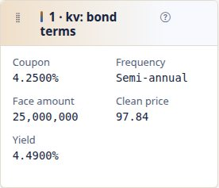

- **Use it when:** One object with named fields. With `rows` naming an object and no `columns`, inference lists up to 16 of its scalar fields.
- **Not when:** A list of similar objects: that is a `table`. Operational states that should be coloured by meaning: `status`.
- **Key options:** `columns` (each `{label, bind, fmt, tone, link}`), `rows` to read another object, or `fields` (the same list as `status`). Every option and its values: [reference](RACHANA_REFERENCE.md#kv).
- **Empty when** every cell is blank or a dash.
- **Masked:** the cell reads `•••` with no tone and no link.
- **No access:** with a `source` the user may not open it shows *No access to curve* (the kind it names) and no values.
- **Live:** re-rendered with the same macro on every change.
- **Phone:** the grid has fewer columns, down to one.
- **CSV:** Field, Value.

From [all-panels-showcase](examples/all-panels-showcase.sutra.yaml):

```yaml
  - id: terms
    kind: kv
    title: "1 · kv: bond terms"
    span: 8
    columns:
      - { label: Coupon, bind: $.terms.coupon, fmt: pct4 }
      - { label: Frequency, bind: $.terms.couponFrequency }
      - { label: Face amount, bind: $.terms.faceAmount, fmt: amount0 }
      - { label: Clean price, bind: $.terms.cleanPrice, fmt: price2 }
      - { label: Yield, bind: $.terms.yield, fmt: pct4 }
```

A `kv` panel when it is empty, error, masked, phone, dark:

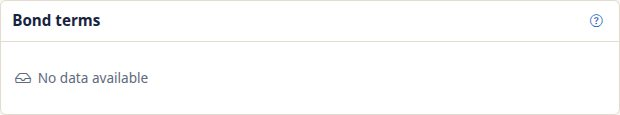

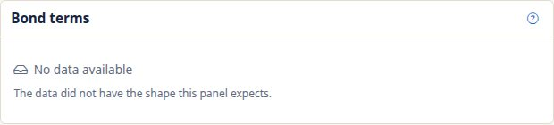

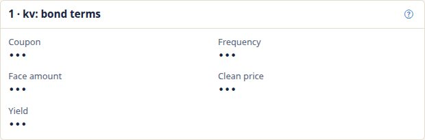

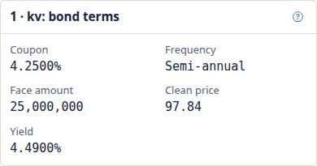

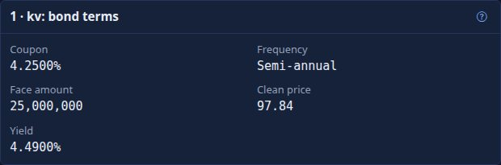

### status

Statuses and flags, each coloured by what it says. Drawn like `kv`; the colour always accompanies the text.

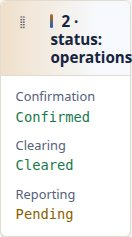

- **Use it when:** Confirmation, clearing, reporting and other operational states.
- **Not when:** Plain facts: `kv`. A state over time: `timeline`.
- **Key options:** `fields`, a list of `{label, bind, fmt, tone}`; with `tone: status` text such as *fail*, *reject*, *dispute* or *breach* is bad, *pending*, *unmatched* or *warn* is warn, anything else ok. Every option and its values: [reference](RACHANA_REFERENCE.md#status).
- **Empty when** every cell is blank or a dash.
- **Masked:** the cell reads `•••` with no tone, so a masked state is never coloured.
- **No access:** with a `source` the user may not open it shows *No access to curve* (the kind it names) and no values.
- **Live:** re-rendered on every change.
- **Phone:** the grid has fewer columns, down to one.
- **CSV:** Field, Value.

From [all-panels-showcase](examples/all-panels-showcase.sutra.yaml):

```yaml
  - id: ops
    kind: status
    title: "2 · status: operations"
    span: 4
    fields:
      - { label: Confirmation, bind: $.confirmation.status, tone: status }
      - { label: Clearing, bind: $.clearing.status, tone: status }
      - { label: Reporting, bind: $.regulatory.reportingStatus, tone: status }
```

### provenance

*How this view was built*: the layout label (`Sutra irs-fixfloat v1 + inference`), the shape fingerprint, and the source with its generation. It describes the view rather than reading the entity, so it takes no options and no `source`.

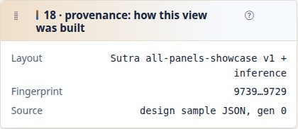

- **Use it when:** Every view that people will question: it answers *where did this come from*.
- **Not when:** As a place for data of your own: it has none. For the full story (why this Sutra, which others were tried, empty panels, freshness and health) press `?`: [About this page](USER_GUIDE.md#about-this-page).
- **Key options:** none (the common keys only). Every option and its values: [reference](RACHANA_REFERENCE.md#provenance).
- **Empty when** never empty.
- **Masked:** nothing in it comes from the document, so there is nothing to mask.
- **No access:** not applicable: it reads no other entity.
- **Live:** re-rendered as the generation changes.
- **Phone:** a single column.
- **CSV:** not offered.

From [all-panels-showcase](examples/all-panels-showcase.sutra.yaml):

```yaml
  - { id: built, kind: provenance, title: "18 · provenance: how this view was built" }
```

### metric

One big headline figure, a KPI tile: the value formatted and toned, with an optional small change beside it, a unit and a caption under it. The panel is a named group for assistive technology, so the figure, its unit and its change are read together.

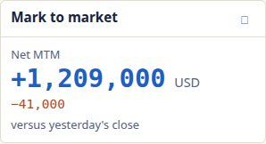

- **Use it when:** The one number a screen is about: mark to market, VaR, limit use. Several tiles with `span: 3` make a row of headline figures.
- **Not when:** One number against a maximum: `gauge`. Many labelled values: `kv`. A figure whose history matters: `line`.
- **Key options:** `value` (required), `label`, `fmt`, `tone`, `delta` (an expression: the change), `deltaFmt`, `deltaTone` (default `sign`), `unit`, `caption` (may hold `${...}`). Every option and its values: [reference](RACHANA_REFERENCE.md#metric).
- **Empty when** the value is missing or not shown (a dash); a missing `delta` is simply not drawn, never an error.
- **Masked:** the figure and the change read `•••` with no tone.
- **No access:** with a `source` the user may not open it shows *No access to curve* (the kind it names) and no values.
- **Live:** the whole tile is replaced, so the new figure and its change appear together.
- **Phone:** the figure shrinks from 2.2 to 1.8 rem and the unit and change wrap beneath it.
- **CSV:** Label, Value, Change, Unit, Caption.

From [metric](examples/metric.sutra.yaml):

```yaml
  - { id: mtm, kind: metric, title: Mark to market, span: 3, value: $.mtm, fmt: signed0, tone: sign, label: Net MTM,
      unit: USD, delta: "$.mtm - $.mtmYesterday", deltaFmt: signed0, caption: "versus yesterday's close" }
```

The states of a tile, and the same panel in the dark theme and at phone width:


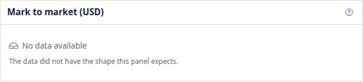


A tile is built end to end in [PANEL_DEVELOPER_GUIDE.md](PANEL_DEVELOPER_GUIDE.md).

## Tables

### table

A list of similar rows. The server formats each cell; a total row adds the `total: true` columns over **all** rows (including those beyond `limit`) and a *N more* line counts the rest. A column bound to a field ending in `Id` or `Ref` links automatically. With `children` the rows nest (a tree table); with `pivot: true` the table gets a **Table | Pivot** switch.

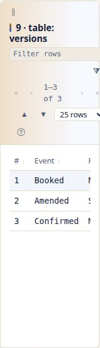

- **Use it when:** Rows you want to read, sort, filter and page: member trades, versions, an org tree.
- **Not when:** Fewer than five rows where one matters most: `ladder`. Two to four objects with their own fields: `tabs`. Totals by one field across another: `pivot`.
- **Key options:** `rows` (required), `columns` (inferred when absent), `limit`, `moreLabel`, `totalLabel`, `search`, `children`, `expand`, `pivot`. Every option and its values: [reference](RACHANA_REFERENCE.md#table).
- **Empty when** there are no rows (and an object in `rows` is one row, a text is none).
- **Masked:** a masked cell reads `•••`; a column with a masked value is never added up, its total reads `•••`.
- **No access:** with a `source` the user may not open it shows *No access to curve* (the kind it names) and no values.
- **Live:** re-rendered on every change; the sort, filter and page survive.
- **Phone:** the table scrolls sideways inside its panel; its filter and paging stay.
- **CSV:** the table's columns, then the total row (a tree lists every row, each followed by its children).

The tree-table example (`docs/guides/examples/tree-table.sutra.yaml`) and the showcase's `9b` panel show `children`.

From [all-panels-showcase](examples/all-panels-showcase.sutra.yaml):

```yaml
  - id: versions
    kind: table
    title: "9 · table: versions"
    span: 5
    rows: $.lifecycle.events
    columns:
      - { label: "#", bind: "@.version" }
      - { label: Event, bind: "@.event" }
      - { label: Reason, bind: "@.reason" }
      - { label: By, bind: "@.by" }
```

A `table` panel when it is empty, error, masked, phone, dark:

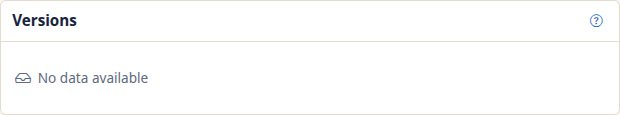

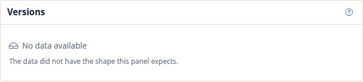

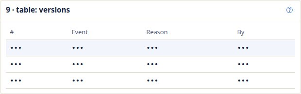

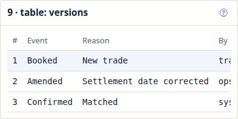

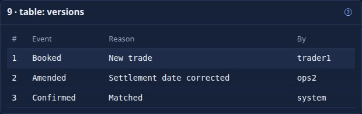

### ladder

A table that shows every row and lights the one that matters: a coupon schedule with the next payment highlighted. `highlight` is an expression per row (`@`, `#index`).

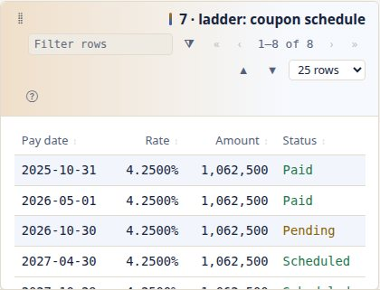

- **Use it when:** A schedule or sequence in which a position in it is the point.
- **Not when:** A long list to filter and page: `table`. It takes no `limit` or `moreLabel` (`DRS-2023`): a ladder never hides a row.
- **Key options:** `rows` (required), `columns`, `highlight`, `totalLabel`, `search`, `children`, `expand`, `pivot`. Every option and its values: [reference](RACHANA_REFERENCE.md#ladder).
- **Empty when** there are no rows.
- **Masked:** as `table`: `•••`, never added up.
- **No access:** with a `source` the user may not open it shows *No access to curve* (the kind it names) and no values.
- **Live:** re-rendered; the highlighted row moves when `highlight` does.
- **Phone:** scrolls sideways inside its panel.
- **CSV:** the columns, then the total row.

From [all-panels-showcase](examples/all-panels-showcase.sutra.yaml):

```yaml
  - id: coupons
    kind: ladder
    title: "7 · ladder: coupon schedule"
    height: 8
    rows: $.schedule
    highlight: "#index == $.nextIndex"
    columns:
      - { label: Pay date, bind: "@.date", fmt: date }
      - { label: Rate, bind: "@.rate", fmt: pct4 }
      - { label: Amount, bind: "@.amount", fmt: amount0, total: true }
      - { label: Status, bind: "@.status", tone: status }
```

### tabs

Two to four similar objects, each in its own tab with the fields of a body panel (`kind: kv`) evaluated per element. `layout: columns` puts them side by side instead.

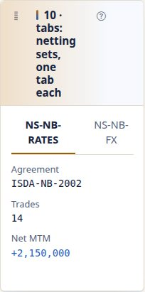

- **Use it when:** Legs, tranches, netting sets: a few objects with the same fields.
- **Not when:** More than about four: `table`. The `body` takes the size of its panel (`span` there is `DRS-2030`).
- **Key options:** `each` (required), `tabTitle` (an expression per element), `layout` (`tabs` or `columns`), and the `body`. Every option and its values: [reference](RACHANA_REFERENCE.md#tabs).
- **Empty when** there are no elements, or every tab is blank.
- **Masked:** a masked cell in a tab reads `•••`.
- **No access:** with a `source` the user may not open it shows *No access to curve* (the kind it names) and no values.
- **Live:** re-rendered; the selected tab survives.
- **Phone:** tabs wrap onto lines and `columns` stack.
- **CSV:** Tab, Field, Value.

From [all-panels-showcase](examples/all-panels-showcase.sutra.yaml):

```yaml
  - id: sets
    kind: tabs
    title: "10 · tabs: netting sets, one tab each"
    span: 6
    each: $.nettingSets
    tabTitle: "@.id"
    body:
      kind: kv
      columns:
        - { label: Agreement, bind: "@.agreement" }
        - { label: Trades, bind: "@.trades" }
        - { label: Net MTM, bind: "@.netMtm", fmt: signed0, tone: sign }
```

### pivot

A two-dimensional aggregate of the rows: one row group per `by` field value (a list gives nested groups with subtotals), one column per `across` value, totals, and an optional heat scale. Not to be confused with the **Pivot tab** of a table (`pivot:` on a `table`), which re-slices the rows in the browser.

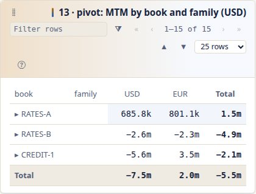

- **Use it when:** Totals by one field across another: MTM by book and currency.
- **Not when:** Rows you want to read one by one: `table`.
- **Key options:** `rows`, `by`, `across` (all required), `value`, `agg` (`sum`, `count`, `avg`, `min`, `max`), `fmt`, `tone`, `heat`, `totals`, `expand`. Every option and its values: [reference](RACHANA_REFERENCE.md#pivot).
- **Empty when** there is no row with a number (or no row at all, for a count).
- **Masked:** the groups stay, every value and total reads `•••`, nothing is added up.
- **No access:** with a `source` the user may not open it shows *No access to curve* (the kind it names) and no values.
- **Live:** re-rendered.
- **Phone:** scrolls sideways inside its panel.
- **CSV:** the `by` field, one column per column key, Total; then the Total row.

The two pivots are told apart in [the reference](RACHANA_REFERENCE.md#pivot-a-pivot-tab-on-a-table-or-ladder) (the table option) and [here](RACHANA_REFERENCE.md#pivot) (the kind).

From [all-panels-showcase](examples/all-panels-showcase.sutra.yaml):

```yaml
  - { id: grid, kind: pivot, title: "13 · pivot: MTM by book and family (USD)", rows: $.positions, by: [book, family], across: currency,
      value: mtm, fmt: compact, tone: sign }
```

## Series

### line

Points along an axis: a curve by tenor, P&L by date. With `source` the points are read from a linked entity's document (a discount curve), fetched with the same business date and masks.

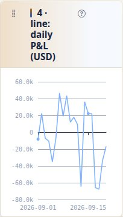

- **Use it when:** Order along an axis matters.
- **Not when:** Several bands against a limit: `area`. Labelled amounts: `hbar`.
- **Key options:** `rows`, `x`, `y`, `source`, `mark`, `fmt`, `unit`, `footer`. For `line`, `area` and `hbar` a field of each row is a bare name. Every option and its values: [reference](RACHANA_REFERENCE.md#line).
- **Empty when** there are no x values, or no finite number.
- **Masked:** a masked number is not drawn: a line over a masked measure comes out empty.
- **No access:** with a `source` the user may not open it shows *No access to curve* (the kind it names) and no values.
- **Live:** the new data moves the existing chart without redrawing the panel.
- **Phone:** the chart resizes to the width; a collapsed **Data** table sits under it.
- **CSV:** x, then one column per series.

From [all-panels-showcase](examples/all-panels-showcase.sutra.yaml):

```yaml
  - { id: pnl, kind: line, title: "4 · line: daily P&L (USD)", span: 6, height: 9, rows: $.pnlHistory, x: date, y: pnl, fmt: signed0 }
```

A `line` panel when it is empty, error, phone:

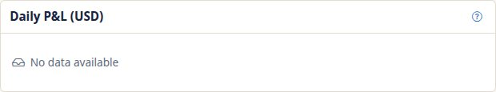

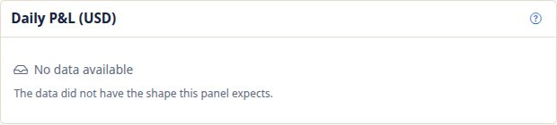

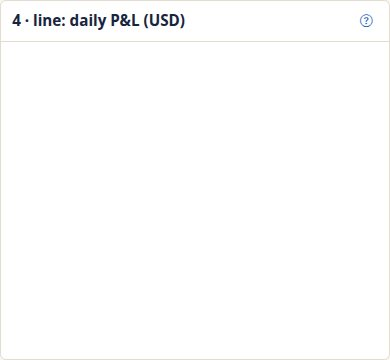

### area

Several bands over one axis against a limit: an exposure profile (EE, PFE 95) under the credit limit, which is drawn dashed.

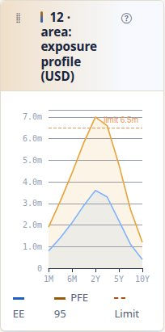

- **Use it when:** Profiles over time against a ceiling.
- **Not when:** One curve: `line`.
- **Key options:** `rows` (required), `x`, `series` (a list of `{label, value, tone}`), `limit` (an expression), `limitLabel`, `unit`. Every option and its values: [reference](RACHANA_REFERENCE.md#area).
- **Empty when** there are no x values, or no finite number in any series.
- **Masked:** masked numbers are not drawn.
- **No access:** with a `source` the user may not open it shows *No access to curve* (the kind it names) and no values.
- **Live:** the new data moves the existing chart.
- **Phone:** resizes; **Data** table beneath.
- **CSV:** x, then one column per series.

From [all-panels-showcase](examples/all-panels-showcase.sutra.yaml):

```yaml
  - { id: exposure, kind: area, title: "12 · area: exposure profile (USD)", span: 6,
      rows: $.profile, x: tenor, limit: $.limit,
      series: [ { label: EE, value: ee, tone: link }, { label: PFE 95, value: pfe, tone: accent } ] }
```

### hbar

Horizontal bars for a few labelled amounts, scaled to the largest absolute value; without a `tone`, negative bars are tinted as losses. Drawn as HTML (the widths are set from `data-w` because the content security policy forbids inline styles).

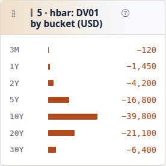

- **Use it when:** DV01 by bucket, MTM by book.
- **Not when:** Amounts that add up to a total: `waterfall`. Order along an axis: `line`.
- **Key options:** `rows` (required), `label`, `value`, `fmt`, `tone`. Every option and its values: [reference](RACHANA_REFERENCE.md#hbar).
- **Empty when** there is no bar with a finite number.
- **Masked:** a masked amount reads `•••` and has no bar.
- **No access:** with a `source` the user may not open it shows *No access to curve* (the kind it names) and no values.
- **Live:** re-rendered.
- **Phone:** bars shrink to the width.
- **CSV:** Label, Value.

From [all-panels-showcase](examples/all-panels-showcase.sutra.yaml):

```yaml
  - { id: dv01, kind: hbar, title: "5 · hbar: DV01 by bucket (USD)", span: 8, rows: $.sensitivities, label: bucket, value: dv01, fmt: signed0, tone: sign }
```

### gauge

One number against a maximum, as a filled bar with its percentage.

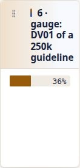

- **Use it when:** Utilisation of a limit or guideline.
- **Not when:** A figure with no maximum: `metric`.
- **Key options:** `value` (required, an expression), `max` (an expression, default 1), `fmt` (applied to value divided by max, default `pct0`), `label`. Every option and its values: [reference](RACHANA_REFERENCE.md#gauge).
- **Empty when** the value is not a number.
- **Masked:** the bar is empty and the text reads `•••` (so is the panel).
- **No access:** with a `source` the user may not open it shows *No access to curve* (the kind it names) and no values.
- **Live:** re-rendered.
- **Phone:** the bar fills the width.
- **CSV:** Label, Value, Limit.

From [all-panels-showcase](examples/all-panels-showcase.sutra.yaml):

```yaml
  - { id: dv01use, kind: gauge, title: "6 · gauge: DV01 of a 250k guideline", span: 4, value: "abs($.risk.dv01)", max: "250000" }
```

## Market

### surface

A grid of values over two axes already in the document: a volatility smile by expiry and delta, a correlation matrix. A heatmap, or 3D on request (the ECharts GL build is loaded only when **3D** is pressed, and falls back to the heatmap without WebGL).

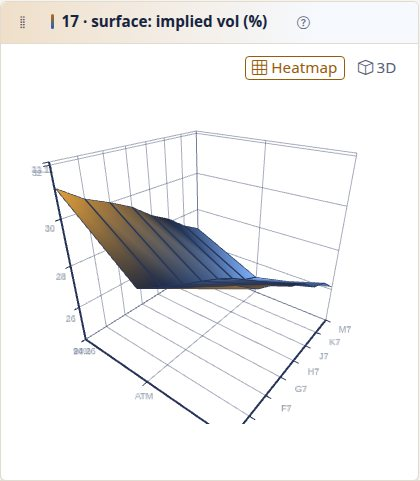

- **Use it when:** A matrix you want to see as a surface.
- **Not when:** Rows to be aggregated into a grid: `pivot`.
- **Key options:** `rows`, `y` (both required), `columns` (one per x point), `fmt`, `unit`, `view` (`heatmap` or `3d`). Every option and its values: [reference](RACHANA_REFERENCE.md#surface).
- **Empty when** there is no finite cell.
- **Masked:** masked cells are not drawn.
- **No access:** with a `source` the user may not open it shows *No access to curve* (the kind it names) and no values.
- **Live:** re-rendered and redrawn.
- **Phone:** the heatmap fits the width; use the heatmap rather than 3D.
- **CSV:** y, then one column per x.

From [all-panels-showcase](examples/all-panels-showcase.sutra.yaml):

```yaml
  - { id: smile, kind: surface, title: "17 · surface: implied vol (%)", height: 12, view: 3d, rows: $.grid, y: month,
      columns: [ { label: 90%, bind: "@.m90" }, { label: ATM, bind: "@.m100" }, { label: 110%, bind: "@.m110" } ] }
```

### candlestick

Open, high, low and close by date, with optional volume bars; up days and down days differ by shape as well as colour.

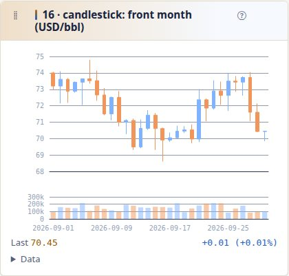

- **Use it when:** Price history where each day's range matters.
- **Not when:** Only the close: `line`.
- **Key options:** `rows` (required), `x`, `open`, `high`, `low`, `close`, `volume`, `fmt`, `unit`. Every option and its values: [reference](RACHANA_REFERENCE.md#candlestick).
- **Empty when** there is no bar with all four prices.
- **Masked:** masked prices are not drawn.
- **No access:** with a `source` the user may not open it shows *No access to curve* (the kind it names) and no values.
- **Live:** re-rendered and redrawn.
- **Phone:** resizes; **Data** table beneath.
- **CSV:** Date, Open, High, Low, Close, Volume.

From [all-panels-showcase](examples/all-panels-showcase.sutra.yaml):

```yaml
  - { id: bars, kind: candlestick, title: "16 · candlestick: front month (USD/bbl)", height: 10, rows: $.ohlc, volume: volume, fmt: price2 }
```

## Risk

### histogram

The distribution of many numbers, binned on the server, with optional marker lines (VaR, ES, mean) read from the document.

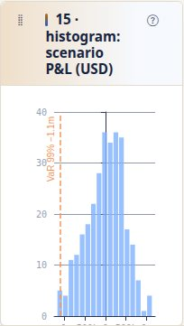

- **Use it when:** Scenario P&L, residuals: spread matters, order does not.
- **Not when:** Order matters: `line`. Two measures per row: `scatter`.
- **Key options:** `rows` (required), `value`, `bins` (1 to 200), `markers` (`{label, value, tone}`), `fmt`, `unit`. Every option and its values: [reference](RACHANA_REFERENCE.md#histogram).
- **Empty when** there is no number to bin.
- **Masked:** masked numbers are not binned.
- **No access:** with a `source` the user may not open it shows *No access to curve* (the kind it names) and no values.
- **Live:** re-rendered and redrawn.
- **Phone:** resizes; **Data** table beneath.
- **CSV:** From, To, Count.

From [all-panels-showcase](examples/all-panels-showcase.sutra.yaml):

```yaml
  - { id: scenarios, kind: histogram, title: "15 · histogram: scenario P&L (USD)", span: 6, height: 9, rows: $.scenarioPnl, fmt: compact,
      markers: [ { label: VaR 99%, value: "-$.var99", tone: neg } ] }
```

### scatter

Two measures per row as points (risk against return), optionally sized and grouped (coloured).

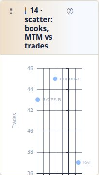

- **Use it when:** Compare two measures across many entities.
- **Not when:** One measure by name: `hbar`.
- **Key options:** `rows`, `x`, `y` (required), `size`, `label`, `group`, `fmt`, `xFmt`, `xLabel`, `yLabel`. Every option and its values: [reference](RACHANA_REFERENCE.md#scatter).
- **Empty when** there is no row with both measures.
- **Masked:** a masked measure is not drawn; a masked group still shows.
- **No access:** with a `source` the user may not open it shows *No access to curve* (the kind it names) and no values.
- **Live:** re-rendered and redrawn.
- **Phone:** resizes; **Data** table beneath.
- **CSV:** Label, Group, x label, y label, Size.

From [all-panels-showcase](examples/all-panels-showcase.sutra.yaml):

```yaml
  - { id: books, kind: scatter, title: "14 · scatter: books, MTM vs trades", span: 6, height: 9,
      rows: $.books, x: mtm, y: trades, label: id, xFmt: compact, xLabel: MTM (USD), yLabel: Trades }
```

## P&L

### waterfall

Ordered signed steps as floating bars: opening level, moves, closing level (P&L attribution). Rises and falls differ by colour **and** by the signed text on each bar; totals are neutral.

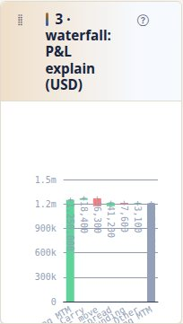

- **Use it when:** Amounts that add up to something.
- **Not when:** Independent amounts: `hbar`.
- **Key options:** `rows` (required), `label`, `value`, `total`, `sum` (a closing total bar), `fmt`, `unit`, `colors` (`gain-loss` or `theme`). Every option and its values: [reference](RACHANA_REFERENCE.md#waterfall).
- **Empty when** there is no step with a number.
- **Masked:** a masked step is skipped and never added to the running total; the closing total reads `•••`.
- **No access:** with a `source` the user may not open it shows *No access to curve* (the kind it names) and no values.
- **Live:** re-rendered and redrawn.
- **Phone:** resizes; labels rotate beyond six steps.
- **CSV:** Step, Amount, Total.

From [all-panels-showcase](examples/all-panels-showcase.sutra.yaml):

```yaml
  - { id: explain, kind: waterfall, title: "3 · waterfall: P&L explain (USD)", span: 6, height: 9,
      rows: $.pnlExplain, label: step, value: pnl, sum: Closing MTM, fmt: signed0 }
```

## Relationships

### graph

Entities and the relations between them (a legal-entity hierarchy); a node that names an entity opens it.

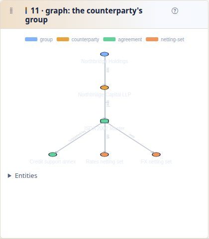

- **Use it when:** Structure: who owns whom, which set holds which trade.
- **Not when:** A plain list of references: `links`.
- **Key options:** `nodes` (required), `edges`, `label`, `group`, `layout` (`tree` or `force`). Every option and its values: [reference](RACHANA_REFERENCE.md#graph).
- **Empty when** there is no node with an id.
- **Masked:** a masked label shows the mask.
- **No access:** with a `source` the user may not open it shows *No access to curve* (the kind it names) and no values.
- **Live:** re-rendered and redrawn.
- **Phone:** resizes; **Entities** list beneath.
- **CSV:** Type, Id or from, To, Label, Group.

From [all-panels-showcase](examples/all-panels-showcase.sutra.yaml):

```yaml
  - { id: group, kind: graph, title: "11 · graph: the counterparty's group", height: 12, nodes: $.hierarchy.nodes, edges: $.hierarchy.edges }
```

### links

The entities this one refers to, discovered from the document by the packs' links; a view shows them without a Sutra. No options.

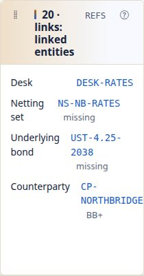

- **Use it when:** Navigation to related entities.
- **Not when:** Structure between entities: `graph`.
- **Key options:** none (the common keys only); it takes no `source`. Every option and its values: [reference](RACHANA_REFERENCE.md#links-panel).
- **Empty when** the entity links to nothing (*No linked entities*).
- **Masked:** a link to an entity the user may not open is not offered.
- **No access:** not applicable: it reads no other entity.
- **Live:** re-rendered.
- **Phone:** a single column.
- **CSV:** Link, Entity, Kind, Summary.

From [all-panels-showcase](examples/all-panels-showcase.sutra.yaml):

```yaml
  - { id: refs, kind: links, title: "20 · links: linked entities", code: REFS, area: right, height: 10 }
```

## Operations

### timeline

Dated events in order, each with a status tone and a short description, sorted by date on the server.

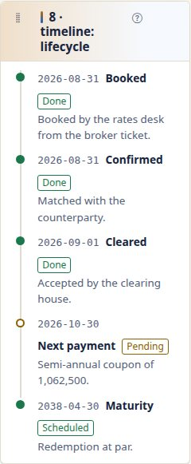

- **Use it when:** A lifecycle: confirmed, amended, settled.
- **Not when:** A schedule with a current row: `ladder`.
- **Key options:** `rows` (required), `date`, `label`, `detail`, `status`, `tone`. Every option and its values: [reference](RACHANA_REFERENCE.md#timeline).
- **Empty when** there is no event with a date or a label.
- **Masked:** a masked detail reads `•••`.
- **No access:** with a `source` the user may not open it shows *No access to curve* (the kind it names) and no values.
- **Live:** re-rendered.
- **Phone:** a single column.
- **CSV:** Date, Event, Status, Detail.

From [all-panels-showcase](examples/all-panels-showcase.sutra.yaml):

```yaml
  - { id: life, kind: timeline, title: "8 · timeline: lifecycle", span: 7, rows: $.lifecycle.timeline, label: event, detail: description }
```

### markdown

A note for the reader. Text may hold `${...}` templates over the document, so it can say things about this entity.

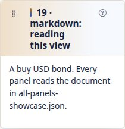

- **Use it when:** Say what a screen is for, or what to do next.
- **Not when:** Data: the other kinds format it for you.
- **Key options:** `text` (required). Every option and its values: [reference](RACHANA_REFERENCE.md#markdown).
- **Empty when** the text is blank.
- **Masked:** a masked value inside `${...}` reads `•••`.
- **No access:** with a `source` the user may not open it shows *No access to curve* (the kind it names) and no values.
- **Live:** re-rendered.
- **Phone:** a single column.
- **CSV:** not offered.

From [all-panels-showcase](examples/all-panels-showcase.sutra.yaml):

```yaml
  - id: note
    kind: markdown
    title: "19 · markdown: reading this view"
    area: right
    text: "A ${lower($.direction)} ${$.currency} bond. Every panel reads the document in all-panels-showcase.json."
```

## Common mistakes and their problem codes

| Mistake | What you see | Fix |
|---|---|---|
| `kind: chart`, `kind: bar` | `DRS-2021 unknown panel kind 'chart'; expected one of kv, table, …` | use one of the twenty-one |
| a scatter without `y`, a metric without `value` | `DRS-2022 'scatter' panel 'rr' needs option 'y'` | add it |
| `rows:` on a `graph` or on a `metric` | `DRS-2023 option 'rows' is not valid for 'graph' panels` | a graph takes `nodes` and `edges`; a metric takes `value` |
| `limit:` on a `ladder`, `search:` on a chart | `DRS-2023 option 'limit' is not valid for 'ladder' panels` | remove it, or use a `table` |
| `agg: median`, `bins: 0`, `layout: circle`, `caption: [x, y]` | `DRS-2029 option … must be one of …` | a value the message lists |
| `rows: "$.legs[0"`, `value: "$.a +* 2"` | `DRS-2101 expected ']' …` at load | fix the expression |
| two panels with one id, a key used twice | `DRS-2024`, `DRS-2025` | rename, or pick another key |
| `span: 13`, `height: 30`, `span` on a `tabs` body | `DRS-2030` | a whole number in range, on the panel |
| `pivot: yes`, or `pivot:` on a `kv` | `DRS-2031`, `DRS-2023` | `pivot: true` on a `table` or `ladder` |
| `label: "@.bucket"` on an `hbar` | bars without labels (no error) | `label: bucket`: `line`, `area` and `hbar` fields are bare names |
| a waterfall whose total rows have no flag | the opening amount is drawn as a move from zero | mark the level rows `total: true` |
| a histogram marker `value: $.var99` when VaR is stored positive | the line falls in the right tail | `value: "-$.var99"` |
| a title such as `MTM by book and currency` with a key | the key bar reads *F3 MTM by* | put the subject first: `MTM grid (by book and currency)` |

Every code is listed with its message in the [reference](RACHANA_REFERENCE.md#problem-codes); the workbench's Problems tab shows them as you type.

