<!--
  Project Drishti · Any data. Any domain. One grammar.

  Copyright (c) 2026 Ashutosh Sinha <ajsinha@gmail.com>.
  All rights reserved.

  PROPRIETARY AND CONFIDENTIAL.

  This file is the confidential and proprietary property of Ashutosh Sinha.
  Unauthorised copying, use, modification, distribution or disclosure of this
  file, via any medium, is strictly prohibited except with the express prior
  written permission of the copyright holder.

  See the LICENSE file in the root of this repository for the full terms.
-->
# Schema to pack: generate a pack from JSON Schema

You have **JSON Schema files** (one per kind of thing you hold: trades, counterparties, books ...), and perhaps a **folder of JSON Lines**
with real documents. Drishti turns them into a **pack**: a screen (Sutra) per kind, with the right labels, formats, links and help text,
tests, and a bundle you can deploy. It does it two ways with the same rules:

- **The page**: **Build → New pack** (`/build/pack/new`). Five steps, a preview of every Sutra, a download or a deploy.
- **The command line**: `drishti.py sutra design --schema ...` and `drishti.py pack make --schema ...` ([CLI guide](CLI_GUIDE.md)).

```text
schemas (JSON Schema, JSON or YAML)  +  JSON Lines (optional)
        │  plan: kind, key, links, labels, match column, date, strip, mnemonic          (this guide: "The rules")
        ▼
sample documents: real ones first, then the schema's examples, then synthetic ones
        │  the server's auto-designer drafts a Sutra from each group of samples
        ▼
the draft is labelled from the schema (titles, descriptions, formats, links, strip)
        ▼
pack folder: pack.yaml, sutras/, tests/, samples/, config/about.yaml, README.md   →  bundle (.tar.gz + .sha256)  →  deploy
```

> **Real data wins.** A schema says what a document *may* be; real documents say what it *is*. Where both are given the key must be unique in
> the data, the business date is found in the data, a field the schema does not know is reported, and every Sutra is tested on real
> documents. The schema then adds what data cannot: names, descriptions, units, links, enumerations and the shape of variants.

## Contents

1. [Quick start](#quick-start)
2. [The rules, one by one](#the-rules-one-by-one)
3. [Annotations: `x-drishti-*`](#annotations-x-drishti-)
4. [What is read from a schema](#what-is-read-from-a-schema)
5. [Samples and tests: real, example, synthetic](#samples-and-tests-real-example-synthetic)
6. [The New pack page, step by step](#the-new-pack-page-step-by-step)
7. [The command line](#the-command-line)
8. [The pack that comes out](#the-pack-that-comes-out)
9. [Limits and settings](#limits-and-settings)
10. [Troubleshooting](#troubleshooting)
11. [Not yet, and what this leaves for later](#not-yet-and-what-this-leaves-for-later)

## Quick start

The example schemas of this guide are in `docs/guides/examples/schemas/`: `trade`, `counterparty`, `book` and `instrument`, with small JSON
Lines files under `data/`.

```bash
# schemas alone: samples are synthetic, every Sutra is checked, one folder comes out
python3 tools/drishti.py pack make --schema docs/guides/examples/schemas --name desk-pack --yes

# schemas plus real documents: real samples win, the schemas add labels, descriptions and links
python3 tools/drishti.py pack make --schema docs/guides/examples/schemas docs/guides/examples/schemas/data --name desk-pack --store files --yes
```

Or open **Build → New pack**, choose the four schema files and the `data` folder, and press Next five times.

## The rules, one by one

Every decision below is made by `drishti-console/core/schemakit/plan.py`, shown with its reason in the page's cards and in the command
line's summary, and can be changed there (page) or with a flag or an annotation (anywhere).

### The kind

The **kind** is the name of the thing a document describes (`trade`). In this order:

1. `x-drishti-kind` at the top of the schema;
2. the schema's `title`, when it is at most three words (`"Netting Set"` becomes `netting-set`; `"TradeConfirmation"` becomes `trade-confirmation`);
3. the last segment of the schema's `$id` (`https://example.com/schemas/ledger-entry.json` becomes `ledger-entry`);
4. the file name (`my-thing.schema.json` becomes `my-thing`).

Kinds are letters, digits and `. _ -` (up to 64). Two schemas that give the same kind get `-2`, and a warning. A JSON Lines file with no schema becomes
a kind named after its file (`trades.jsonl` is first matched to a schema kind: `trade`, `trades` and `Trades` all fit).

> A kind belongs to one pack. If the server already runs a pack that defines the kind, the page says so (step 2) and refuses to go on (step 3)
> until you rename it, unless the new pack **is** that pack (a new version keeps its own kinds and mnemonics).

### The key

The key is the field whose value names one document (`tradeId`). It becomes the id in the title and in the pick lists.

1. A property with `x-drishti-role: key` (or `x-drishti-key: true`).
2. Otherwise the candidates are the top-level string or integer properties named `id`, `_id`, `*Id`, `*_id`, `*Key`, `uuid`, or with `format: uuid`;
   **required** ones first, and, when real documents are given, only those that are **unique** in them.
3. Of the candidates, in order: one named `id`; one named `<kind>Id` or `<kind>_id`; the **only** one that does not refer to another kind of the batch.
4. If several remain, the key is **ambiguous**: the first is used, a warning names them all, the page marks the card amber and the command line
   **asks** (when it runs in a terminal; `--yes` takes the first). Choose with `x-drishti-role: key`, `--key kind=FIELD`, or the card.
5. No candidate at all: no key. The page will not go on; `pack make` stops and says `--key`.

### Links

A link makes a field a way to open another kind (the *Linked entities* panel; `link()` in the details). A field is a link when:

- it has `x-drishti-link: <kind>` (or the card says so), or
- it is a string (or an array of strings) named `<kind>Id`, `<kind>_id`, `<kind>Ids`, `<kind>Key`, `<kind>Ref` ... where `<kind>` (singular or plural, or the
  kind's name before you renamed it) is **another kind of the batch**, or is named exactly like one (`book`, `counterparty`), or
- real documents are given and **at least 90% of its distinct values (three or more) are keys of another kind**.

Links go into `pack.yaml` under `graph.fields`. **A link field name means one kind everywhere**: if another loaded pack uses `bookId` for a different
kind the server refuses to start, so the page and the command line warn when the same name is used twice for different kinds in one pack.

### Labels, panel titles and descriptions

| Where | From |
|---|---|
| A field's label | `x-drishti-label`, else `title`, else the name made readable (`tradeDate` → *Trade date*, `counterparty_id` → *Counterparty ID*, `mtm` → *MTM*, `dv01` → *DV01*), plus ` (unit)` from `x-drishti-unit` |
| A panel's title (a table, a group) | the title of the array or object field (`legs` with `"title": "Legs"`) |
| The Sutra's `description` | the kind's description, or the variant's |
| *About this page*, the sentence | the kind's `description`: `${$.tradeId}: A bilateral derivative trade ...` (it is a template over the document) |
| *About this page*, the glossary | every field the Sutra shows: `title` as the term, `description` as the meaning, `x-drishti-unit`, `x-drishti-values` for the meaning of each enum value |

A field with no description gets `TODO: what this field means.` so the pack's coverage check (`DRS-2045` to `2047`) names it. Fix it in the schema and
generate again: the schema stays the one source of the words.

### Formats

| Schema | Format in the Sutra |
|---|---|
| `x-drishti-format: <name>` | that named format, always (`money` is `amount2`, `percent` is `pct2`; any name from the [Sutra guide](SUTRA_DEVELOPER_GUIDE.md) such as `signed0`, `compact`, `bp1`) |
| `format: date`, `date-time` | `date` |
| number between 0 and 1 (`minimum`/`maximum`), or unit `%` | `pct2` |
| other numbers | a guess from the name (`pnl`, `mtm`, `delta` → `signed0`; `price`, `rate`, `amount`, `notional` → `amount2`; else `amount0`); integers `amount0` except years, versions and counts |

Only the first three **override** the auto-designer's own choice (which looks at the values); a guess from the name does not.

### Enumerations and statuses

A property with `enum` is a **dimension** (a category). One whose name is `status`, `state`, `stage`, `phase` or `lifecycle` is a **status**: first in the strip, coloured by
the status tone. Every enumerated top-level field is also listed as a **dropdown control suggestion** in the plan and in `MANIFEST.json`
(`controls`): *a hook for the controls feature, nothing is written to a Sutra for it yet* (see [Not yet](#not-yet-and-what-this-leaves-for-later)).
`x-drishti-control: radio|dropdown|text` records another suggestion.

### Arrays, nested objects and maps

The auto-designer decides the panel kinds from the shape of the samples; the schema makes sure the samples have that shape:

- an **array of objects** (`legs`) gets 2 or 3 rows in every sample, so it becomes a **table**, a ladder or tabs by the inference rules ([Panel kinds](PANEL_KINDS.md));
- a **nested object** (`terms`) becomes a group of fields; its numbers can reach the strip (`terms.spread`);
- a **map of numbers** (`additionalProperties: {type: number}`, a curve by tenor) gets keys from `propertyNames.enum` or `x-drishti-keys`, else the tenors
  `1M 3M 6M 1Y 2Y 5Y 10Y`, so it can become a curve or bars;
- an **array of numbers** gets three values.

### The strip

The strip is the row of figures across the top of a view. Up to six (`--strip N`, the page's *Figures in the strip*):

1. the first **status** field;
2. numbers, most important first: **required and described** first, then required, then described, then the rest; ties by how shallow the field is, then schema order;
3. one required **date**.

A property can say `x-drishti-strip: true` (always in) or `false` (never), and `x-drishti-importance: N` adds to its weight. References, years and
versions are not figures. The first figure is emphasised.

### Splitting a kind into several Sutras

**One Sutra per variant or per value**, each with its own `match.where` and its own samples, plus a catch-all `<kind>-default` at priority 1 (a document
of a value you did not think of still opens).

- **`oneOf` / `anyOf` of objects with a discriminator**: the `discriminator.propertyName` (OpenAPI style), `x-drishti-discriminator`, or a property
  every branch fixes to a different `const` (or one-value `enum`), preferring `type`, `kind`, `productType`, `category`. One Sutra per branch
  (`instrument-bond`, `instrument-equity`), each tested on documents of its own branch (a bond has a `coupon` and no `ticker`).
- **A match column**: a property with `x-drishti-match: true`, or the one you choose on the card (*Split into Sutras by*, with the number of Sutras it makes) or with
  `--match`. One Sutra per enum value, or per value found in the data. Two columns make the cross product (up to 40).
- Otherwise **one Sutra** per kind, named `<kind>-default`.

A match column with many values makes many Sutras: the page refuses more than `builder.pack_max_sutras` (200).

### The business date

Used to partition real data by day (a dated store). From `x-drishti-role: date`; else a date field named like a business date (`businessDate`, `asOf`,
`reportingDate`, `date`, `valuationDate`, `tradeDate`); else the one required date field. With several candidates and none named like a date the card asks. No date: no
dated store, the pack serves its samples.

### Mnemonic, connectors and the pack

The **mnemonic** (`TRD <GO>`) is the initials of a multi-word kind or its first three letters, made unique within the batch and **against the packs already on
the server**. **Connectors**: a pack names its sources by a **logical connector name** only, never by a host or a path; those are the connector's own settings on the
server. A kind with real, dated data gets a `file` or `delta` connector named `<pack>-store` (change it per kind); a kind without data needs none and serves its samples. *(The connector
file model, with credentials and TLS per logical name, is described by the connectors guides; a `CONNECTOR_FILES.md` is not part of this release yet, so the generated
`pack.yaml` carries the inline connector the way `pack make` always has.)*

### What is reported rather than decided

Unresolved `$ref`s (open object, warning), a schema file that is not JSON or YAML (named, others carry on), kinds with the same name, an ambiguous key, a link to a kind that is not in the batch,
fields in real documents that the schema does not describe, fields with no description, Sutras tested on synthetic samples only.

## Annotations: `x-drishti-*`

Put these on a property (or the top of the schema). Both spellings work: `"x-drishti-role": "key"` and `"x-drishti": {"role": "key"}` (the form `sutra shape`
already writes). Unknown ones are ignored.

| Annotation | On | Meaning |
|---|---|---|
| `x-drishti-kind` | top | the kind's name |
| `x-drishti-role` | property | `key` (the id), `date` (the business date), `match` (a split column) |
| `x-drishti-key` | property | `true`: the key |
| `x-drishti-link` | property | the kind this field refers to |
| `x-drishti-match` | property | `true`: split the kind by this field's values |
| `x-drishti-discriminator` | `oneOf` | the property that tells the branches apart |
| `x-drishti-label` | property | the label (overrides `title`) |
| `x-drishti-unit` | property | the unit, shown in the label and the glossary (`USD`, `bp`, `%`) |
| `x-drishti-format` | property | a named Sutra format, always applied (`money`, `percent`, `amount2`, `signed0` ...) |
| `x-drishti-hidden` | property | `true`: leave it out of the Sutra and the glossary |
| `x-drishti-strip` | property | `true` always in the strip, `false` never |
| `x-drishti-importance` | property | an integer added to the field's weight when ordering the strip |
| `x-drishti-keys` | map | the keys of a numeric map in synthetic samples (`["1M", "3M", "1Y"]`) |
| `x-drishti-values` | enum | `{value: meaning}` for the glossary |
| `x-drishti-control` | enum | the suggested control: `dropdown`, `radio` or `text` |

Example (the example `trade` schema, shortened):

```json
{
  "title": "Trade",
  "description": "A bilateral derivative trade between the bank and a counterparty, booked in one book.",
  "required": ["tradeId", "counterpartyId", "bookId", "status", "notional", "currency", "tradeDate"],
  "properties": {
    "tradeId":        {"type": "string", "description": "The trade identifier."},
    "counterpartyId": {"type": "string", "description": "The counterparty the trade is with."},
    "status":         {"type": "string", "enum": ["PENDING", "LIVE", "MATURED", "CANCELLED"]},
    "productType":    {"type": "string", "enum": ["IRS", "FXS", "FUT"], "x-drishti-match": true},
    "notional":       {"$ref": "#/$defs/money", "title": "Notional", "x-drishti-unit": "USD"},
    "curve":          {"type": "object", "additionalProperties": {"type": "number"}, "x-drishti-keys": ["1M", "3M", "1Y", "5Y"]}
  }
}
```

## What is read from a schema

| Keyword | Used for |
|---|---|
| `title`, `description`, `$id` | kind, labels, descriptions, About text |
| `type` (also a list with `"null"`), `format`, `pattern`, `minimum`, `maximum`, `minLength` | types, formats, valid synthetic values |
| `properties`, `required` | the fields; what is required |
| `$ref` to `#/$defs/x`, `#/definitions/x`, `#`, another file of the batch (by file name or `$id`) | followed; a recursive `$ref` stops at an open object |
| `allOf` | merged (properties and requirements added) |
| `oneOf`, `anyOf` | objects: variants (above); `[X, null]`: X; consts: an enum; other mixes: the first branch |
| `enum`, `const` | enumerations, discriminators, synthetic values |
| `items`, `prefixItems` (first) | the rows of an array |
| `additionalProperties`, `patternProperties`, `propertyNames.enum` | maps |
| `examples`, `example`, `default` | synthetic values; whole-document `examples` become tests |
| `discriminator.propertyName` | the branch discriminator |
| `if/then`, `not`, `dependentSchemas`, `unevaluatedProperties`, remote `$ref` | ignored (a remote `$ref` is a warning) |

## Samples and tests: real, example, synthetic

Each Sutra has its own samples, in this order, up to the count you choose (5 by default):

1. **Real** documents of that Sutra (those matching its `where`), spread over the key. Prefix `sample-N.json`.
2. The schema's own whole-document `examples` that match it. Prefix `sample-example-N.json`.
3. **Synthetic** documents made from the schema, only to make up the count (always at least two for a Sutra with no real match). `sample-synthetic-N.json`.

Synthetic documents are **deterministic** (the same schema gives the same documents), valid against the schema's types, enums, ranges, patterns
(`^[A-Z]{3}$` gives `ABC`) and formats, and their keys and links **agree across the kinds** (`TRA-0001` links to `COU-0001`, which exists in the pack's `samples/`), so the preview's links
resolve. A variant's samples carry only that variant's fields. They are **marked synthetic** everywhere: in the file name, in the page's list and preview, in the pack's
`README.md`, in `MANIFEST.json` (`syntheticSutras`) and in the catalogue's subtitle. They prove a Sutra renders; they say nothing about your data.

Each Sutra's `tests/<sutra>/expect.yaml` is `noErrors: true`, plus `nonEmpty: [details]` for a specific Sutra.

## The New pack page, step by step

Open **Build → New pack**. It needs the **author** power to download and an administrator to deploy; anyone can plan and preview. The steps are buttons you can also press;
you cannot leave a step that would fail (the message says why).

### 1. Sources

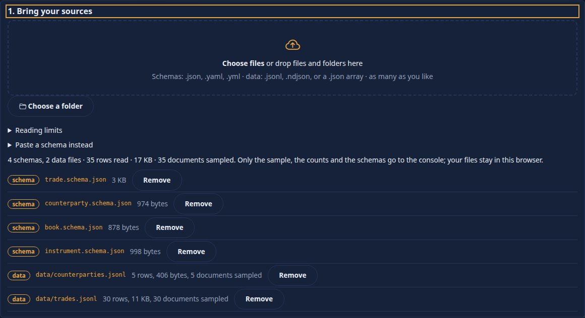

Choose or drop files and folders: schemas (`.json`, `.yaml`, `.yml`) and data (`.jsonl`, `.ndjson`, or a `.json` array). A `.json` file that has `$schema`, or `properties`
with a `type`, or `$defs`, is taken as a schema, any other as data. **The files are read in your browser.** A JSON Lines file is streamed a line at a time and a
**reservoir sample** (200 documents, same file same sample) is kept; the page shows each file's progress, rows, size and bad lines, and the totals. Only the schemas, the
sample and the counts are sent: **never the whole folder**. *Reading limits* sets the rows per file, the MB per file and the sample size (up to the console's ceilings); a file
stopped at a cap says so. *Paste a schema instead* takes text. **Resume a draft** appears when you have one.

### 2. Kinds

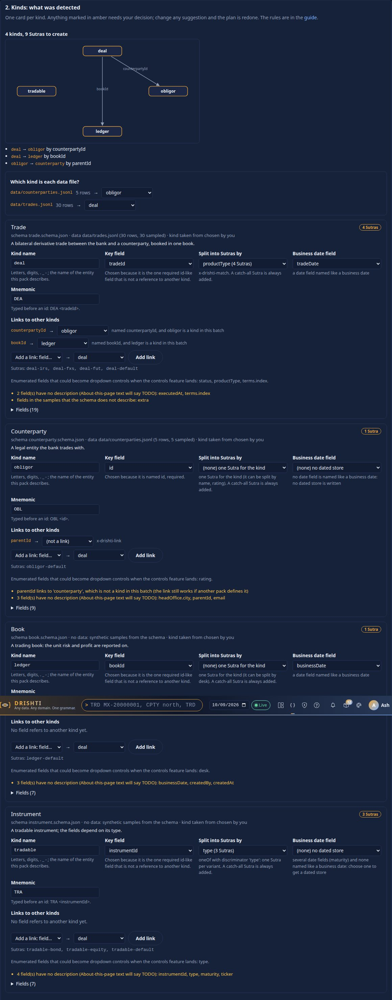

A graph of the kinds and their links, the data files with the kind each was matched to (change it), and **one card per kind**:

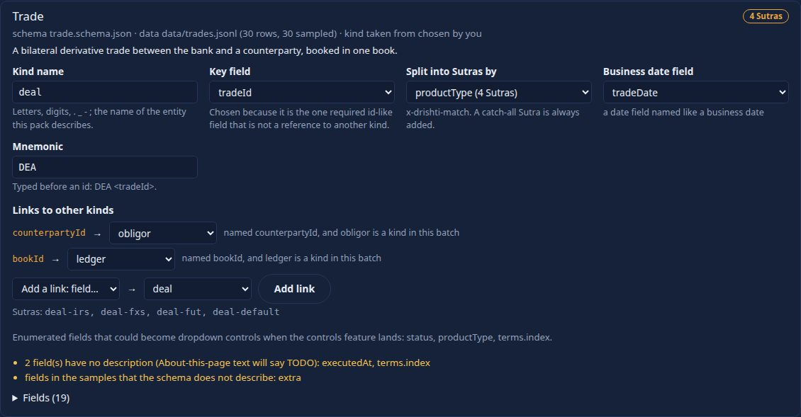

*Kind name* (rename it), *Key field* (with why, amber when ambiguous), *Split into Sutras by* (the match column, each with the number of Sutras it makes), *Business date field*,
*Mnemonic*, *Links to other kinds* (change a target, remove one, add one), the Sutra names, the enumerated fields offered as dropdown controls, the card's warnings and every field
with its label, type, format and description. Every change redoes the plan. A kind the server already defines in another pack is flagged:

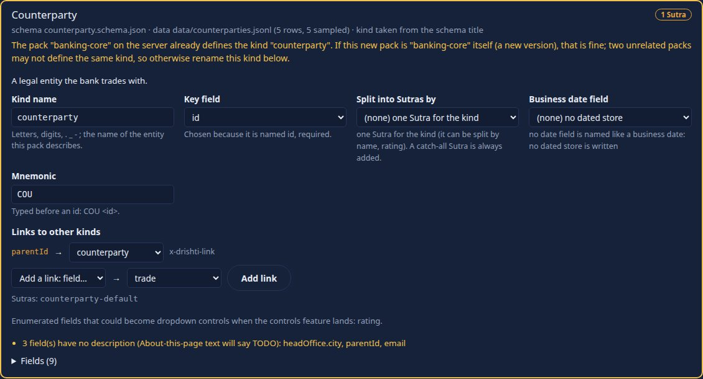

### 3. Pack

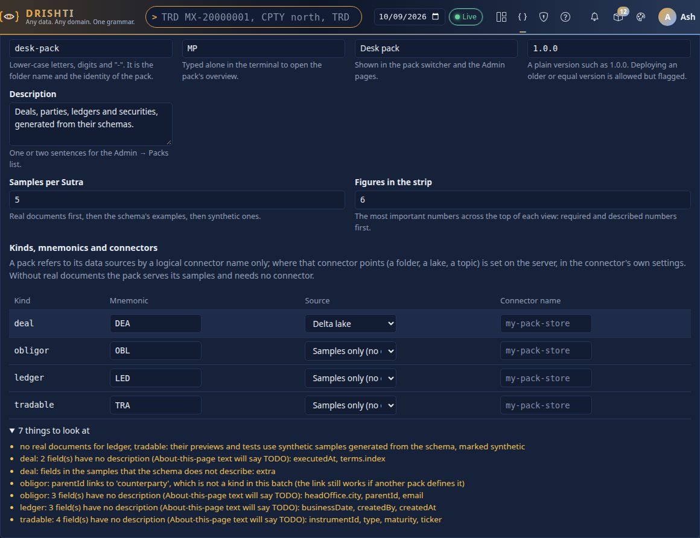

Name (letters, digits, `-`), code, title, version, description. *Samples per Sutra* and *Figures in the strip*. A table of the kinds with their **mnemonic** (checked against the
packs on the server), the **source** (samples only, the File connector, or a Delta lake) and the **logical connector name**. A pack name that exists says that deploying makes a new version.

### 4. Preview

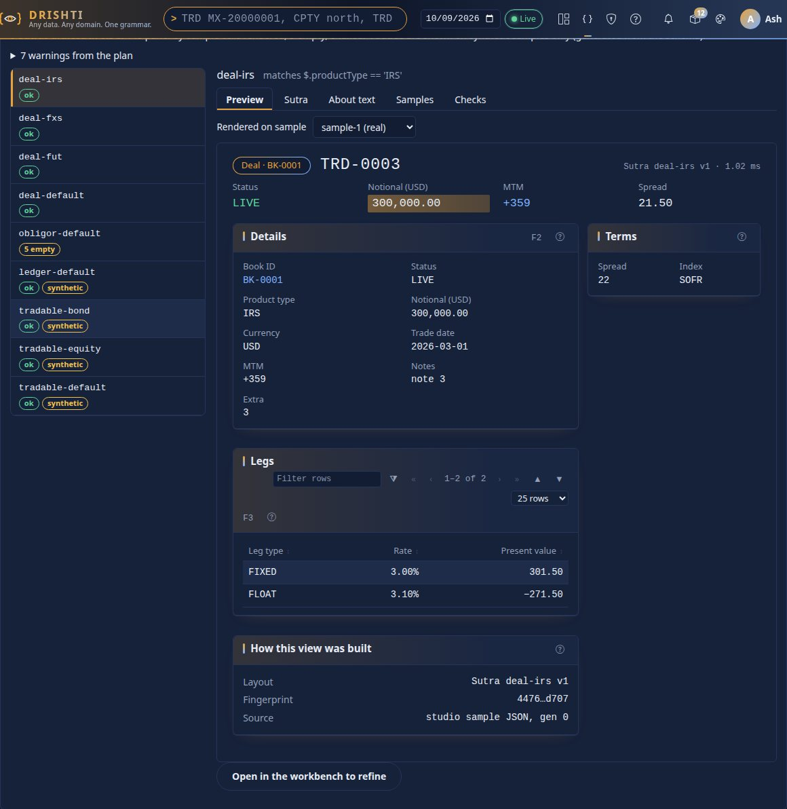

The server drafts every Sutra as a **background job** (one request per Sutra, a few at once): a progress bar, **Cancel**, and the Sutras drafted so far are kept when you cancel. Then a list of the Sutras
with badges (*ok*, empty or failed cells, *synthetic*) and, for the one you choose, five tabs: **Preview** (the server's own rendering on a sample you pick, real, example or synthetic), **Sutra** (the
YAML), **About text** (what the *About this page* drawer will say, TODO entries marked), **Samples** (each labelled by source) and **Checks** (every panel against every sample). *Open in the workbench to refine* makes a design with
the Sutra and its samples and gives you the link; the preview does not change when you edit there, so refine and then copy the YAML into the pack, or edit the schema and generate again.

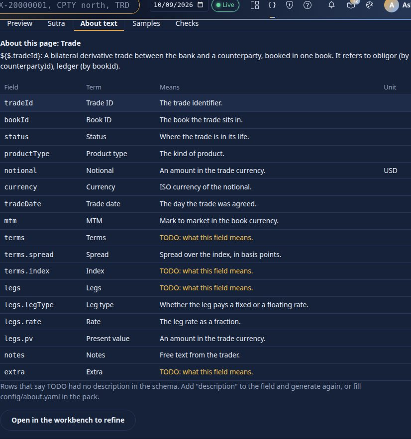

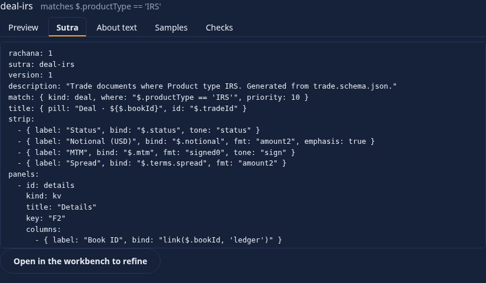

### 5. Output

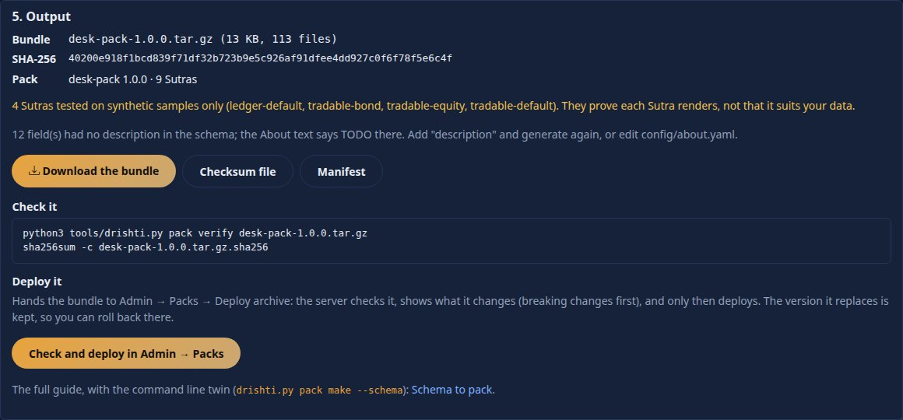

The **bundle** (`<name>-<version>.tar.gz`, with `.sha256` and the manifest) in **exactly the format of `drishti.py pack bundle`**: verify it with `drishti.py pack verify`. Anything synthetic or without a
description is listed. **Deploy** hands the bundle to Admin → Packs → Deploy archive:

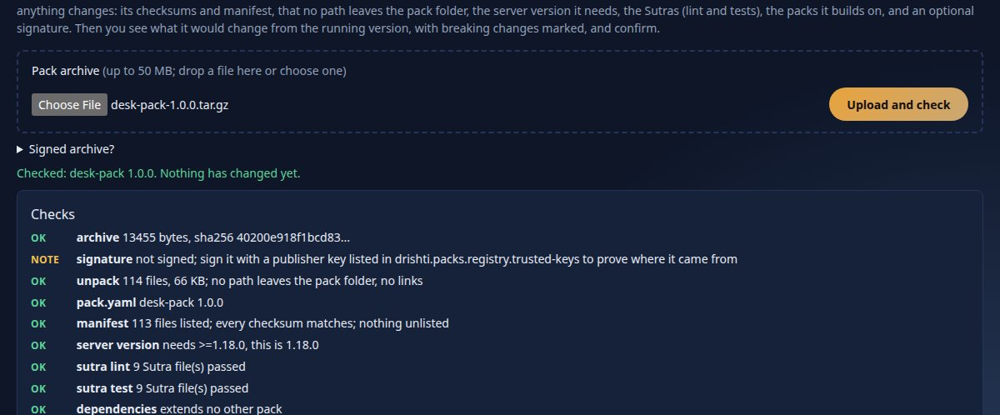

The server checks the archive (checksums, `pack.yaml`, server version, `sutra lint` and `sutra test`), shows what changes (breaking changes first, which you must acknowledge), and only on your
confirmation deploys. The version it replaces is kept: **roll back** there ([OPERATIONALISING §17](OPERATIONALISING.md#17-deploy-from-admin--packs-change-a-data-source-history-and-roll-back)).

### Drafts, keyboard, phone, themes

**Save draft** keeps the state (the schemas, your choices, the file names and counts, not the data) as a design named `New pack: <name>` in *My designs*; it is saved when you move between steps and resumed from the
page. Data files are chosen again after a resume. Every control is a native button, field or select: Tab through, Enter or Space to press; the Sutra list takes Up and Down, the tabs Left and Right. In the light and dark themes colours come from the console's tokens
and every state has a word as well as a colour. At phone width the columns stack and every control is 44 px:

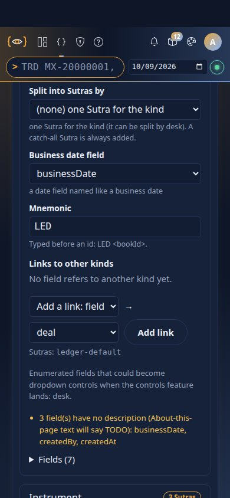

## The command line

`sutra design --schema` and `pack make --schema` (see [CLI guide](CLI_GUIDE.md#sutra-design---schema-and-pack-make---schema)) run the same rules.

| Option | Meaning |
|---|---|
| `--schema FILE\|DIR ...` | the schemas; a folder takes its `*.schema.json` / `*.schema.yaml`, else every `.json` / `.yaml` in it. A `.jsonl` file or folder written after it is data |
| `INPUT ...` | JSON Lines files or folders (`pack make`; for `sutra design`, the positional paths) |
| `--kind K` | rename the kind of **one** schema (several: use `x-drishti-kind`) |
| `--key`, `--date`, `--match` | `FIELD` for every kind or `kind=FIELD,kind2=FIELD2` (`--match` as `kind=a,b;kind2=c`); `--match none` makes one Sutra per kind |
| `--mnemonic` | `kind=MN,kind2=M2` |
| `--count N` / `--samples N` | samples per Sutra (`sutra design` / `pack make`), default 5 |
| `--strip N` | figures in the strip, default 6 |
| `--store delta\|files`, `--connector NAME`, `--code`, `--description`, `--title`, `--version`, `--out`, `--force` | as in `pack make` |
| `--yes` | never ask which field is the key |

### One Sutra, printed

```text
$ python3 tools/drishti.py sutra design --schema docs/guides/examples/schemas/instrument.schema.json --yes
instrument: key instrumentId (named <kind>Id, required); date (none); match type; 3 Sutra(s); synthetic samples
  warning: no real documents for instrument: their previews and tests use synthetic samples generated from the schema, marked synthetic
  warning: instrument: 4 field(s) have no description (About-this-page text will say TODO): instrumentId, type, maturity, ticker
drafting 3 Sutra(s) with one `sutra design --each` run ...
```

stdout is the Sutras, one after another, separated by `---`. The first (`instrument-bond`, one of three, for the `BOND` branch of the `oneOf`):

```yaml
rachana: 1
sutra: instrument-bond
version: 1
description: "Instrument documents where Type BOND. Generated from instrument.schema.json."
match: { kind: instrument, where: "$.type == 'BOND'", priority: 10 }
title: { pill: "Instrument · ${$.type}", id: "$.instrumentId" }
strip:
  - { label: "Coupon", bind: "$.coupon", fmt: "pct2", emphasis: true }
panels:
  - id: details
    kind: kv
    title: "Details"
    key: "F2"
    columns:
      - { label: "Name", bind: "$.name" }
      - { label: "Type", bind: "$.type" }
      - { label: "Coupon", bind: "$.coupon", fmt: "pct2" }
      - { label: "Maturity", bind: "$.maturity", fmt: "date" }
  - id: built
    kind: provenance
    title: "How this view was built"
  - id: coupon
    kind: metric
    title: "Coupon"
    area: right
    value: "$.coupon"
    fmt: "pct4"
  ...
```

Its strip holds the bond's own figure (`coupon`, formatted `pct2` because the schema says so); the equity branch has `dividendYield` and `ticker` and no `coupon`. With
`--out DIR` the Sutras are written under `DIR/<kind>/` and their samples under `DIR/tests/<sutra>/`, and `sutra lint` runs on the result.

### A whole pack, schemas and real documents

```text
$ python3 tools/drishti.py pack make --schema docs/guides/examples/schemas docs/guides/examples/schemas/data \
      --name desk-pack --store files --yes
book: key bookId (named <kind>Id, required); date businessDate; match (none); 1 Sutra(s); synthetic samples
counterparty: key id (named id, required); date (none); match (none); 1 Sutra(s); links parentId->counterparty; real samples: 5
instrument: key instrumentId (named <kind>Id, required); date (none); match type; 3 Sutra(s); synthetic samples
trade: key tradeId (named <kind>Id, required); date tradeDate; match productType; 4 Sutra(s); links counterpartyId->counterparty, bookId->book; real samples: 30
  warning: no real documents for book, instrument: their previews and tests use synthetic samples generated from the schema, marked synthetic
  warning: book: 3 field(s) have no description (About-this-page text will say TODO): businessDate, createdBy, createdAt
  warning: counterparty: 3 field(s) have no description (About-this-page text will say TODO): headOffice.city, parentId, email
  warning: instrument: 4 field(s) have no description (About-this-page text will say TODO): instrumentId, type, maturity, ticker
  warning: trade: 2 field(s) have no description (About-this-page text will say TODO): executedAt, terms.index
  warning: trade: fields in the samples that the schema does not describe: extra
drafting 9 Sutra(s) with one `sutra design --each` run ...
  trade 2026-03-01: 10 rows -> build/desk-pack-1.0.0/data/files/desk-pack/2026-03-01/trade.jsonl
  trade 2026-03-02: 10 rows -> build/desk-pack-1.0.0/data/files/desk-pack/2026-03-02/trade.jsonl
  trade 2026-03-03: 10 rows -> build/desk-pack-1.0.0/data/files/desk-pack/2026-03-03/trade.jsonl
kind                business date        rows
trade               2026-03-01             10
trade               2026-03-02             10
trade               2026-03-03             10
total rows: 30

== pack check
== desk-pack: sutra lint: exit 0
== desk-pack: sutra test: exit 0

== pack bundle
bundled desk-pack 1.0.0: 113 files
  build/desk-pack-1.0.0/bundle/desk-pack-1.0.0.tar.gz
  sha256 ab5f2248408fdc6e5d66fd4aa932affffe13629a15ba2c8f9aca35a48cbb0cc0

== pack verify
verify build/desk-pack-1.0.0/bundle/desk-pack-1.0.0.tar.gz: desk-pack 1.0.0
  checksums ok
  schema    ok
  server    ok
  sutra     ok
verified

pack make: build/desk-pack-1.0.0
  9 Sutra(s) for 4 kind(s) (4 tested on synthetic samples only); pack check passed, pack verify passed
next: read build/desk-pack-1.0.0/README.txt, then  DRISHTI_JAR=<exec jar> DRISHTI_PORT=18480 build/desk-pack-1.0.0/run-server.sh
```

`trade` and `counterparty` had real documents (30 and 5), so their Sutras were tested on those; `book` and `instrument` had none, so they were tested on synthetic samples, and the run
says so. The `extra` field of `trades.jsonl` is not in the schema: it is reported, shown in the Sutra and given a `TODO` glossary entry. Exit codes are those of `pack make`: 0, 1
(made but a check failed), 2 (usage: no key, a missing file, the folder exists without `--force`).


## The pack that comes out

The folder is the one `pack make` writes ([CLI guide](CLI_GUIDE.md#quickest-path-pack-make)): `README.txt`, `pack/<name>/`, `data/` (only when real, dated documents were given), `bundle/`, `config/`,
`run-server.sh`, `run-server.ps1`, `MANIFEST.json`. In the pack:

```text
pack/desk-pack/
├── pack.yaml                 kinds, mnemonics, columns, graph.fields (the links); connectors, routes, ingest when real dated data was given
├── sutras/<kind>/<sutra>.v1.sutra.yaml
├── tests/<sutra>/            sample-N.json / sample-example-N.json / sample-synthetic-N.json and expect.yaml
├── samples/                  documents per kind and catalog.json, so the pack opens before any data source
├── config/about.yaml         About this page: a sentence per kind, a glossary entry per shown field
└── README.md                 what was generated, which Sutras are synthetic, next steps
```

`pack.yaml` (the start; real output):

```yaml
# Generated by drishti schemakit (docs/guides/SCHEMA_TO_PACK.md); now yours to edit.
# book: key $.bookId, business date $.businessDate
# counterparty: key $.id
# instrument: key $.instrumentId
# trade: key $.tradeId, business date $.tradeDate
pack: desk-pack
version: 1.0.0
code: DP
title: Desk pack
description: 'Generated from schemas: Book, Counterparty, Instrument, Trade.'
kinds:
- book
- counterparty
- instrument
- trade
sutras: sutras
samples: samples
mnemonics:
  BOO:
    kind: book
    label: Book
  COU:
    kind: counterparty
    label: Counterparty
  INS:
    kind: instrument
    label: Instrument
  TRA:
```

`config/about.yaml` (the start; real output), the words coming from the schema's descriptions and `TODO` where there were none:

```yaml
about: 1
kinds:
  book:
    title: Book
    about: '${$.bookId}: A trading book: the unit risk and profit are reported on.'
    glossary:
      bookId:
        term: Book ID
        means: Book code.
      desk:
        term: Desk
        means: The desk the book belongs to.
      tradeCount:
        term: Trade count
        means: Number of live trades.
      dv01:
        term: DV01
        means: Rate sensitivity per basis point.
      businessDate:
        term: Business date
        means: 'TODO: what this field means.'
      createdBy:
        term: Created by
        means: 'TODO: what this field means.'
      createdAt:
        term: Created at
        means: 'TODO: what this field means.'
```

`MANIFEST.json` records, per kind, the key and why, the date, the match fields, the number of Sutras and the links (with why); `controls` (the dropdown suggestions), `syntheticSutras`, the
warnings, the bundle's checksum and `checks` (`packCheck`, `packVerify`).


## Limits and settings

| Setting | Default | |
|---|---|---|
| `builder.pack_sample_docs` | 200 | documents kept per data file and sent |
| `builder.pack_read_max_rows`, `builder.pack_read_max_mb` | 500000, 1024 | the most the page may be told to read per file |
| `builder.pack_max_files`, `builder.pack_max_docs`, `builder.pack_max_schema_kb`, `builder.pack_max_sutras` | 200, 5000, 512, 200 | refused with `413 DRS-5005` |
| `builder.pack_jobs_per_user`, `builder.pack_job_ttl_min`, `builder.pack_draft_concurrency` | 3, 60, 4 | preview jobs |
| `builder.tools_dir` | `../tools` | where `packbundle.py` is |

All are in [CONFIGURATION.md](../admin/CONFIGURATION.md).

## Troubleshooting

| You see | Meaning |
|---|---|
| *Another pack on the server already defines the kind* | rename the kind on its card, or name the pack as the one that defines it (a new version) |
| *no key could be chosen* | no field looks like an id: mark one with `x-drishti-role: key`, `--key`, or the card |
| a card in amber, *ambiguous key* | several fields look like ids; choose |
| *no date field ... no dated store* | none named like a business date; choose one on the card to get a dated store |
| *no real documents ... synthetic* | no data was given for that kind; the Sutra is tested on documents made from the schema |
| *fields in the samples that the schema does not describe* | the schema is behind the data; they appear in the Sutra with a `TODO` entry |
| *$ref points at a schema that is not in this batch* | add that file to the batch |
| a Sutra *refused by the server* | the Sutra tab shows the located problems; usually a field name that is not a valid path |
| *501 packbundle.py is not available* | the console cannot find `tools/` (`builder.tools_dir`); the page still plans and previews |
| *429 DRS-5005* | too many preview jobs running: cancel one |

## Not yet, and what this leaves for later

- **Controls.** Enumerated fields are listed as dropdown suggestions (plan and `MANIFEST.json`); the design of controls is in progress (RUPAKA, the BI design note, section 8, has none yet), so nothing is written to a Sutra.
- **Connector files.** Packs here carry the inline connector they always did; a per-logical-name connector file model is not on this branch.
- **Editing the generated Sutras in place.** Open one in the workbench to refine it; to keep the schema as the source, change the schema and generate again (`pack regenerate` merges later changes).
