<!--
  Project Drishti · Any data. Any domain. One grammar.

  Copyright (c) 2026 Ashutosh Sinha <ajsinha@gmail.com>.
  All rights reserved.

  PROPRIETARY AND CONFIDENTIAL.

  This file is the confidential and proprietary property of Ashutosh Sinha.
  Unauthorised copying, use, modification, distribution or disclosure of this
  file, via any medium, is strictly prohibited except with the express prior
  written permission of the copyright holder.

  See the LICENSE file in the root of this repository for the full terms.
-->
# Screen designer: from JSON files to a screen, without writing YAML

You have JSON documents (trades, shipments, patients, sensor readings) and you want a screen for them. The **workbench** (*Build → New screen*, then the design's page) is where you make it: bring your files, let Drishti draft a first screen, then **drag panels and fields onto the real screen**, size them on the grid, fill their options in a form, and watch every sample of your data against it while you work. The result is an ordinary Sutra (the layout file Drishti reads), and the YAML is one tab away when you want it.

This guide goes step by step, with a picture of each step. The pictures are made by a script (`tools/docs/screenshots.py`), so they match the screen you have.

- [1. Start: bring data](#1-start-bring-data)
- [2. The workbench at a glance](#2-the-workbench-at-a-glance)
- [3. The Data pane: samples, shape, palette](#3-the-data-pane-samples-shape-palette)
- [4. The canvas and the grid](#4-the-canvas-and-the-grid)
- [5. Add a panel](#5-add-a-panel)
- [6. Drop a field: suggestions and binding](#6-drop-a-field-suggestions-and-binding)
- [7. Auto-design and its alternatives](#7-auto-design-and-its-alternatives)
- [8. The inspector](#8-the-inspector)
- [9. The YAML tab, the split view and the Summary](#9-the-yaml-tab-the-split-view-and-the-summary)
- [10. Problems](#10-problems)
- [11. Tests as you type](#11-tests-as-you-type)
- [12. Preview with a file](#12-preview-with-a-file)
- [13. Undo, redo and revisions](#13-undo-redo-and-revisions)
- [14. Phone width and themes](#14-phone-width-and-themes)
- [15. Keyboard reference](#15-keyboard-reference)
- [16. Worked examples, one per panel family](#16-worked-examples-one-per-panel-family)
- [17. Troubleshooting](#17-troubleshooting)
- [18. Limits](#18-limits)

## 1. Start: bring data

Open **Build → New screen**. The page asks two things: *what data do you have?* and *where should the design start?*

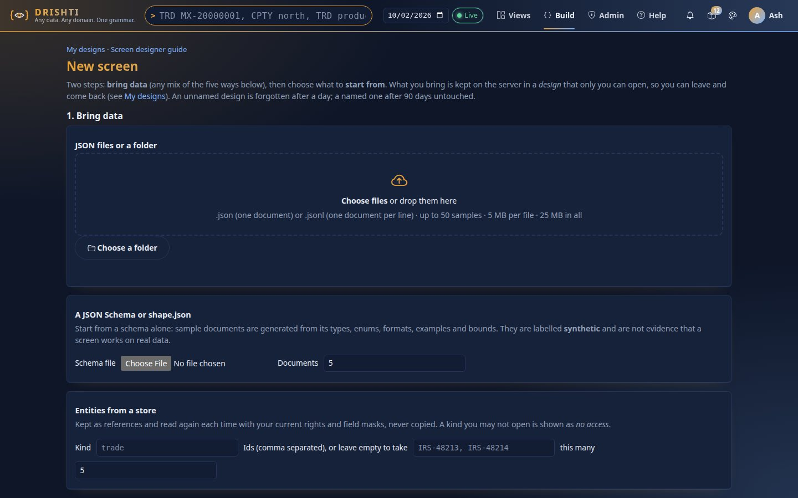

**Bring data** (any mix, in one go):

| You have | What happens |
|---|---|
| JSON or JSONL files, or a whole folder | Each file is a **sample** (a `.jsonl` file gives one sample per line). Drishti merges them into one *shape*. |
| A `shape.json` from an earlier design, or any plain **JSON Schema** (draft 2020-12 or 07) | Sample documents are generated from the schema's types, enums, formats and examples. They are marked *synthetic*: good for building, not proof that a screen works on real data. |
| Entities from a store (a kind and a count, or ids) | The design keeps a **reference**, not a copy: it is read again each time with *your* rights and masks. |
| One of the **examples** | The design opens as **your own copy** of it: the example's Sutra, its JSON as a sample, its notes. The files in `docs/guides/examples/` are never changed. |
| An existing **Sutra** (from the registry, or a `.yaml` file) | The design edits a copy; the original is untouched until you propose the change. |

**Start from**: *auto-design* (the default when there are samples: a first screen drafted for you, section 7), *an existing Sutra*, or *an empty Sutra* for the kind.

Open the workbench with nothing at all and you get an unnamed **scratch design** on the all-panels showcase; it is forgotten after a day. Name it in **My designs** to keep it (named designs are kept 90 days after you last touch them). Every example in *Help → Examples* has an **Open in the workbench** link that makes the same kind of copy.

## 2. The workbench at a glance

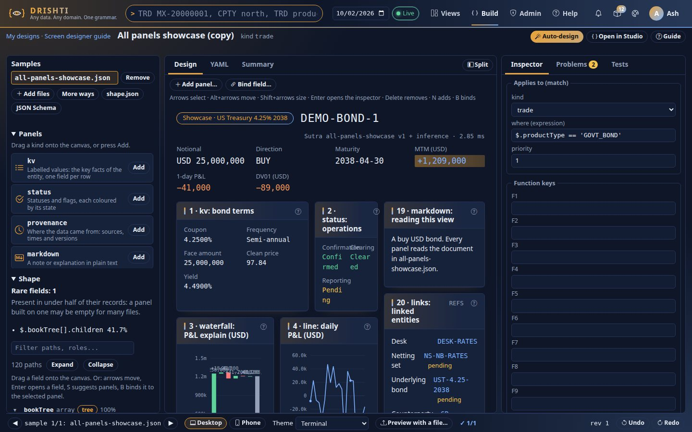

| Where | What it holds |
|---|---|
| **Left: Data** | The samples (add, remove, choose the previewed one), the **palette** of the 20 panel kinds, and the **shape**: every field of your data with its role. |
| **Centre** | Tabs **Design** (the real screen with an editing layer), **YAML** (the Sutra text) and **Summary** (the Sutra read back as a page). **Split** shows Design and YAML side by side. |
| **Right** | Tabs **Inspector** (a form for what is selected), **Problems** and **Tests**. |
| **Status bar** | `◀ sample 2/12 ▶`, Desktop or Phone width, Theme, **Preview with a file…**, the check result `✓ 12/12`, the revision, Undo and Redo. |

Everything you do is an **operation** on the design (add a panel, move it, set an option…). The server applies it to the Sutra text, keeps your comments and the order of your keys, and sends back the screen. That is why the Design tab shows what users will see, not a mock-up, and why Undo can take back any step.

## 3. The Data pane: samples, shape, palette

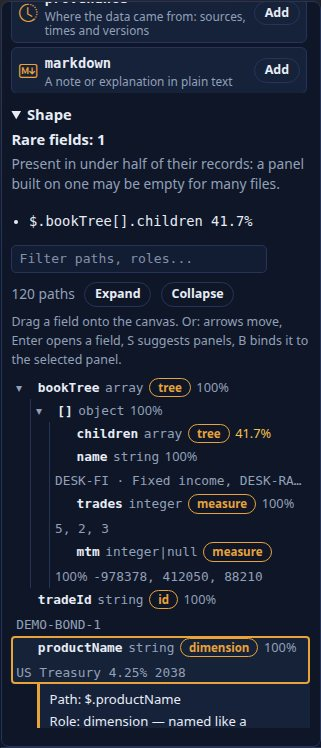

**Samples.** Click a sample's name to preview the design with it (the status bar's ◀ ▶ do the same). *Add files* adds more; *Remove* takes one out. A sample marked *stored entity* is a reference; *synthetic* was generated from a schema. *shape.json* and *JSON Schema* download what Drishti inferred.

**Shape.** The tree lists every path in your samples with its type, its **role** and how many records have it:

| Role | Meaning |
|---|---|
| `id`, `link` | Names an entity, or points at another (a link opens it). |
| `dimension`, `status` | Something to group by (a book, a currency), and a dimension whose values are states. |
| `measure` | A number to add up or chart. |
| `date`, `series`, `events` | A date; values over dates or tenors; things that happened on dates (a timeline). |
| `ohlc`, `distribution`, `grid`, `steps` | Open/high/low/close rows; a list of numbers; a table of numbers on one axis (a surface); signed steps that sum to a total (a waterfall). |
| `graph`, `tree`, `text` | Nodes and edges; rows that hold rows of the same shape; long text. |

Conflicts (the same field with different types in different files) and rare fields (in fewer than half of the records) are listed above the tree: a panel built on a rare field is empty for many samples. Filter by path or role; arrows move, Right and Left open and close, **Enter** shows a field's reason, examples and files. Each opened field has two buttons, **Suggest panels…** and **Bind to selected panel** (also the keys `S` and `B`), and every field can be **dragged** onto the canvas (section 6).

**Palette.** The 20 panel kinds, each with an icon and a line on what it shows. Drag one onto the canvas, or press its **Add** button (section 5).

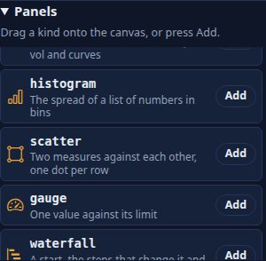

## 4. The canvas and the grid

The Design tab draws your screen exactly as users see it, then lets you point at it. Each column of the screen (the **main** column on the left, the **side** column on the right) is a **12-column grid**. A panel has three placement settings: its **area** (main or side), its **span** (1 to 12 columns wide; the default is the whole column) and its **height** (1 to 24 rows of 2.5 rem; the default is as tall as its content). Panels with a span below 12 sit side by side.

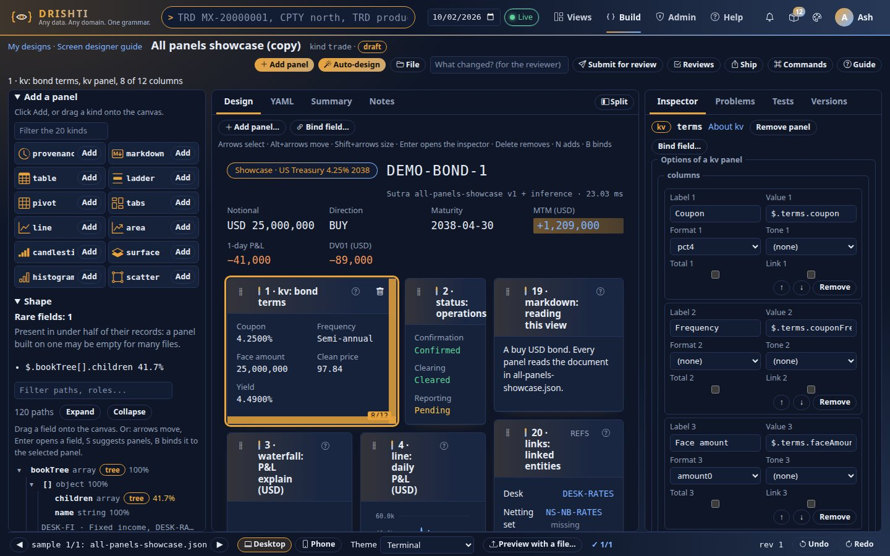

- **Hover** outlines the panel under the pointer. **Click** selects a panel (or the title line, or the strip of key figures); the inspector shows its form.
- **Move**: drag a panel by its heading. A bar shows where it will land: between two stacked panels, or beside a panel in the same row. Drop it in the other column to change its area. Esc cancels the drag.
- **Resize**: drag the right edge to change the span (a badge shows `8/12`), the bottom edge to change the height; double-click the bottom edge for "as tall as the content".
- **Delete** removes the selected panel (Undo brings it back).

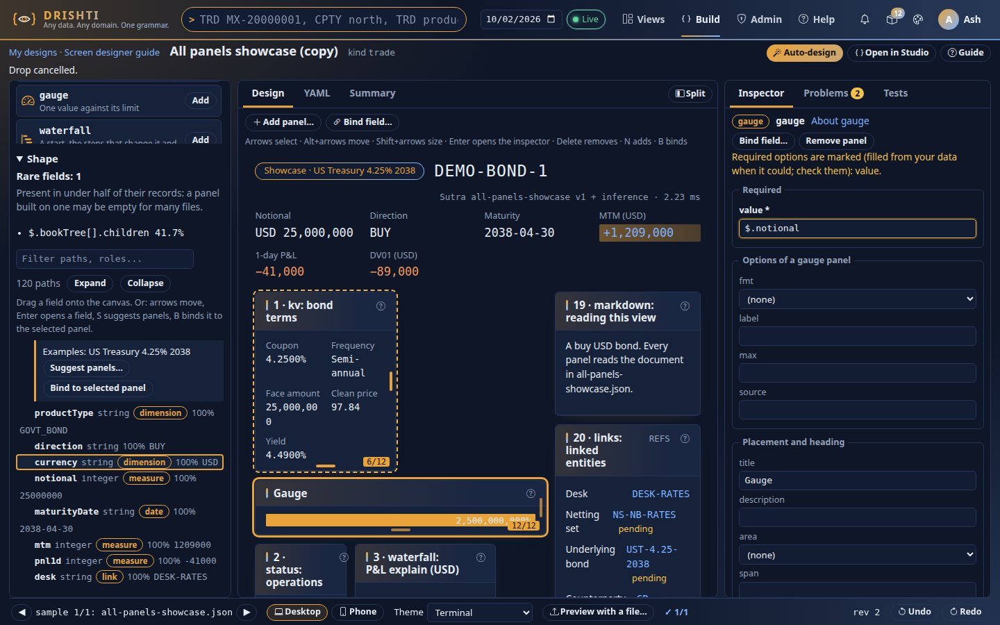

Every one of these is a single operation, sent with the revision you built on. If the design has changed somewhere else in the meantime (another tab), the answer is refused, the design is reloaded and the status line says so; make the change again (section 13).

## 5. Add a panel

Three ways, all producing the same operation:

1. **Drag a kind** from the palette onto the canvas. The bar shows where it will go; drop it.
2. Press a kind's **Add** button: it goes after the selected panel (or at the end of the main column).
3. **Add panel…** (or the key `N` on the canvas): type a few letters of the kind, Enter.

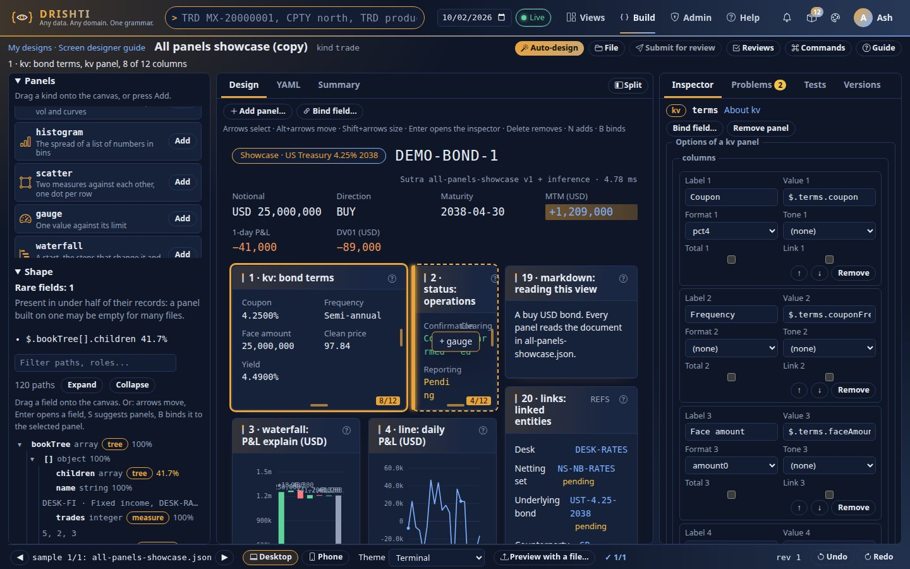

The new panel is selected and the inspector opens on it. The options a kind cannot go without (`rows` for a table, `value` for a gauge…) are filled from your data where possible (the first list in your samples, its first number…) and **marked as required** so you check them; the panel draws something at once.

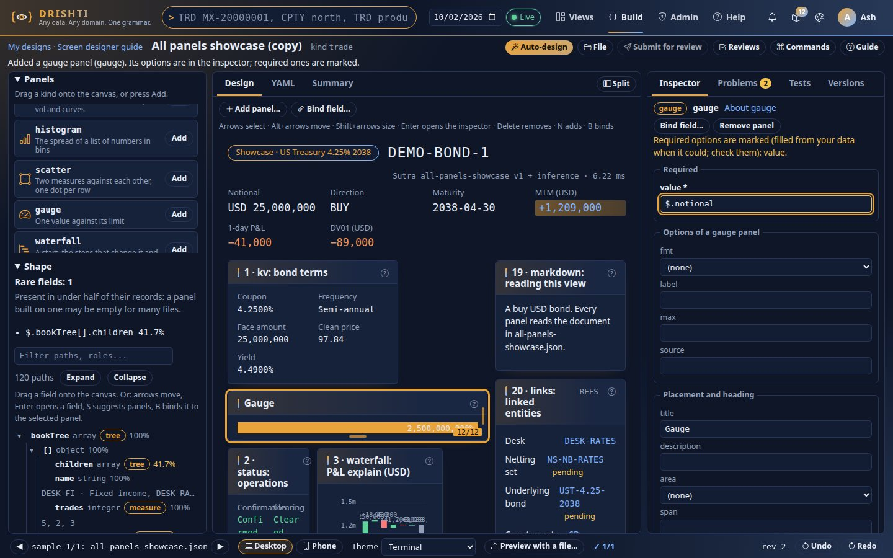

## 6. Drop a field: suggestions and binding

A field of the shape is dragged onto the canvas:

- **Onto the rim of a panel, between panels, or onto empty space in a column**: Drishti ranks the panel kinds that suit the field (a `series` becomes a line, a `measure` a gauge or a bar, a list of rows a table…), each with its options already filled and **a reason**. Pick one with the mouse or Up/Down and Enter; it is added at the place you dropped, with its inspector open.

  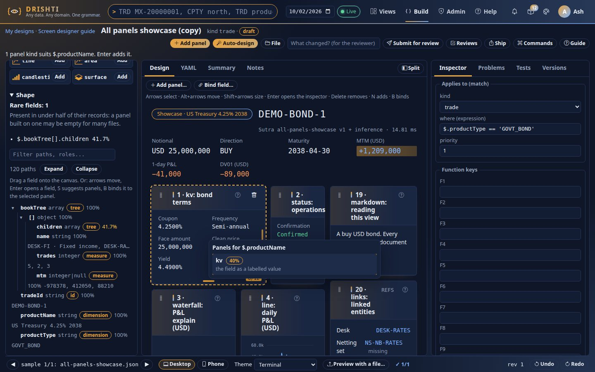

- **Onto the middle of a panel**: the field is **bound** to it, into the option the kind accepts next (a column of a table, a field of a key/value panel, a series of a line chart…). The panel outlines in green while you hover.

  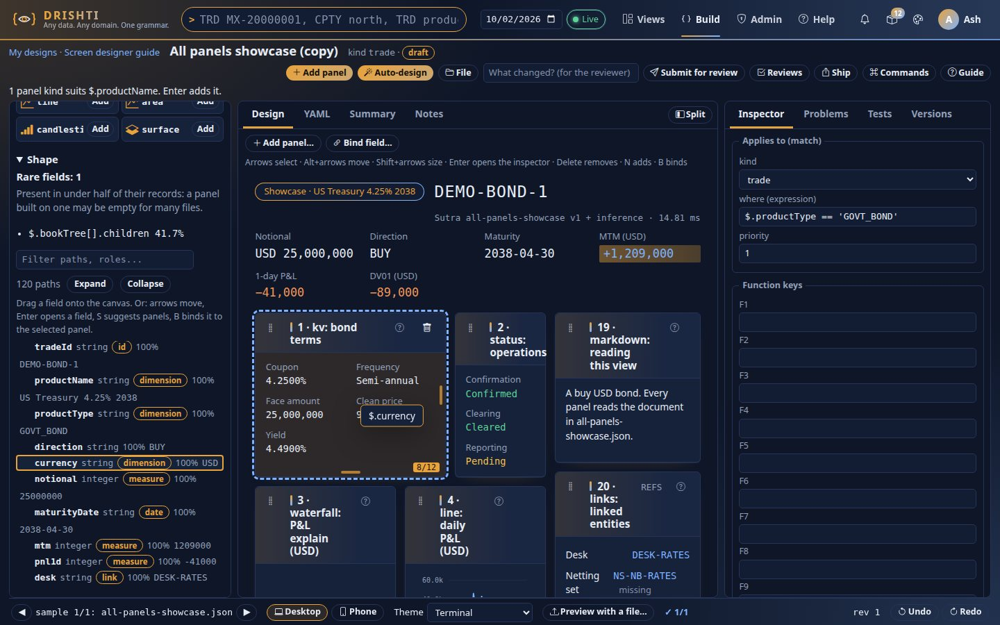

- **Onto the strip** of key figures: a new figure is added (up to eight).
- If the panel cannot take the field, nothing changes and the status line says why, for example *'markdown' panels bind no data (DRS-5022)*. The same message is in the Problems tab.

The keyboard way is the **Bind field…** button (or `B` on a selected panel): type part of the path, Enter. In the shape tree, `S` opens the suggestions for the focused field.

## 7. Auto-design and its alternatives

**Auto-design** (top right) drafts a complete Sutra from your samples and makes it the design's next revision. It looks at the roles of your fields, at how often each field is present, at how long each list is and at how varied its values are, and it **previews the draft against every sample**: a panel that comes out empty or broken for many of them is left out or demoted.

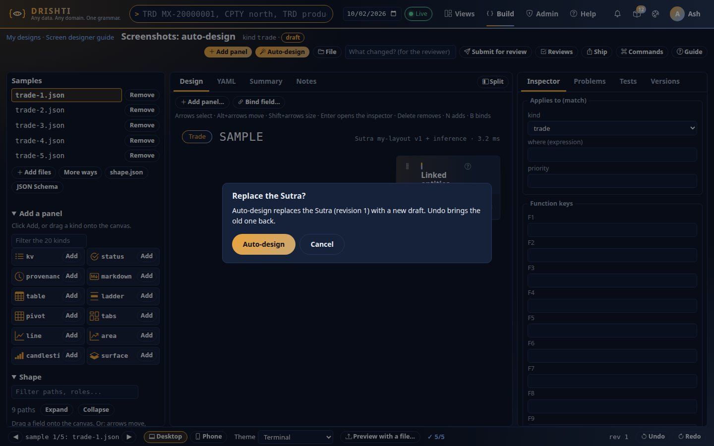

Above the canvas it shows **what it left out and why**, and for every panel **the reason for the choice and the runner-up kinds** with their reasons, so you can swap one in (drop the field again and pick the alternative). Auto-design only produces the first draft: everything after it is yours. If you have already worked on the design, it asks first; **Undo** brings your previous Sutra back.

## 8. The inspector

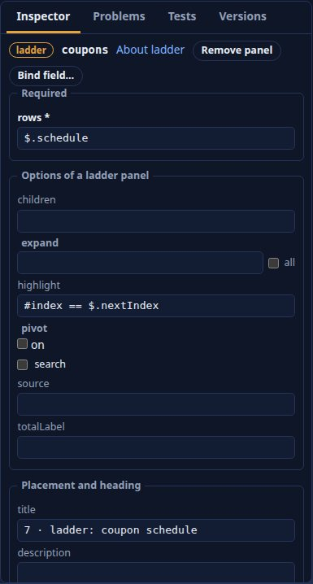

The form is generated from the same schema the YAML editor completes from, so it always offers exactly what the panel's kind accepts.

- **Required** options come first, marked with `*`. Then the **options of the kind**, then **placement and heading** (title, description, area, span, height, function key, code).
- A choice from a fixed list (a format, a tone, an area) is a **select**; true/false is a **switch**; a count is a **number field**; everything else is text.
- **Expression fields** (rows, value, bind, source, highlight…) complete as you type: after `$` the paths of your shape, after `@` the fields of the panel's rows, and function names. Up/Down choose, Enter or Tab take, Esc closes, Ctrl+Space asks.

  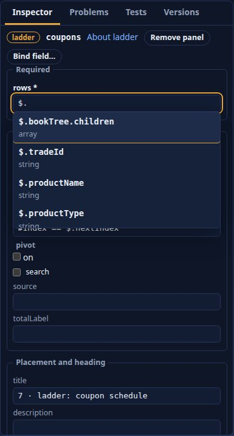

- **Lists** (columns, fields, series, the strip) have *Add*, *Remove* and **↑ ↓** to reorder each item.
- Click the **title line** to edit the title (id, pill, with), the **strip** to edit the key figures; with nothing selected the inspector shows the screen's own settings: what it **applies to** (`match`) and the **function keys**.

Each change is an operation about 0.4 s after you stop typing (or when you leave the field). If you are unsure of a value, the server tells you in the Problems tab and the status line.

## 9. The YAML tab, the split view and the Summary

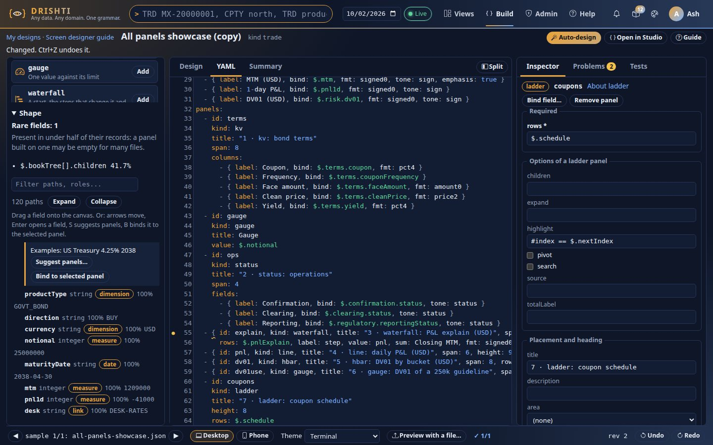

The YAML tab is Studio's editor on the design's Sutra: completion of keys and values, expression paths from your sample, field help, and a light check that underlines mistakes. **Typing is an operation like any other**: a moment after you stop, your text is sent as a *Text* operation, so Undo and the revision cover it. If the server refuses it (a bad kind, an unknown option), your text stays exactly as you typed it, the design keeps its last good Sutra, and the Problems tab shows the DRS code with the line.

**Split** shows Design and YAML side by side: move a panel and watch the YAML change, comments and key order kept.

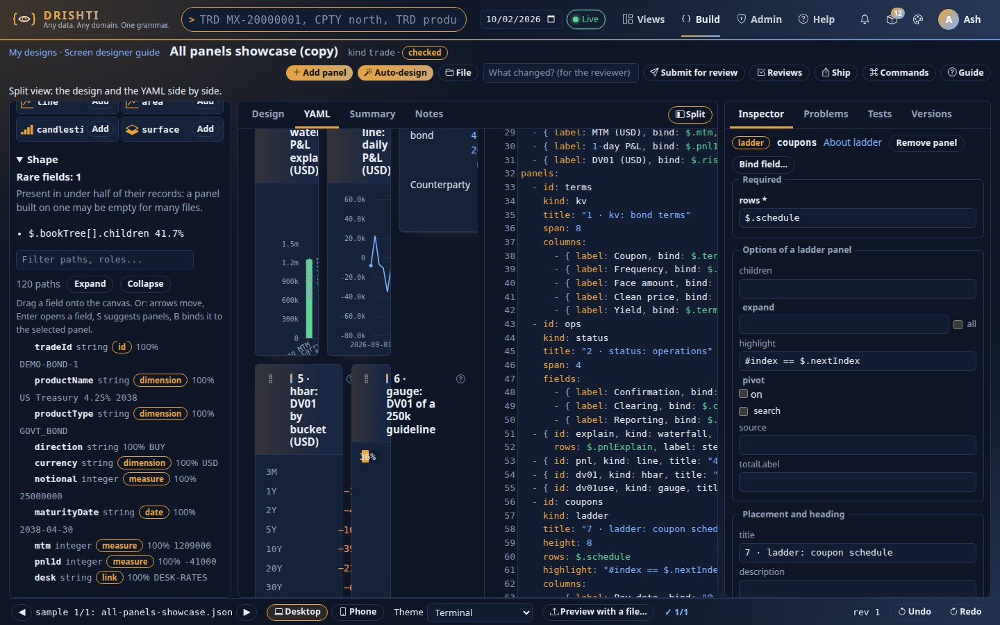

**Summary** reads the Sutra back as a page: what it applies to, the strip, each panel with its columns.

## 10. Problems

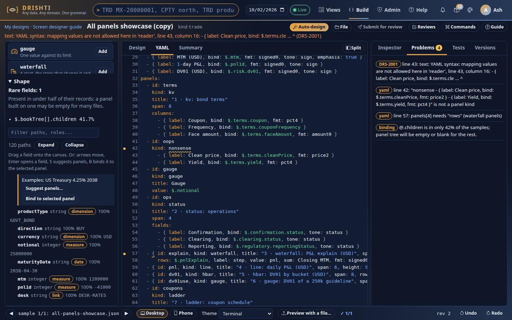

One list, each item a button that takes you there:

| Kind | Source | Click goes to |
|---|---|---|
| **yaml** | the editor's light check | the line in the YAML tab |
| **operation** (DRS-502x) | what the server refused of your last operations | the line, or the panel |
| **binding** | a field the Sutra reads that your samples rarely have (under half of them) or that has two types | the panel that reads it |
| **check** | a panel that fails on a sample | the panel, with that sample previewed |

The tab's badge counts them.

## 11. Tests as you type

A moment after your last change (about 0.8 s) every sample is checked against the Sutra by the same checker Studio and auto-design use. A newer change cancels a run that is no longer current.

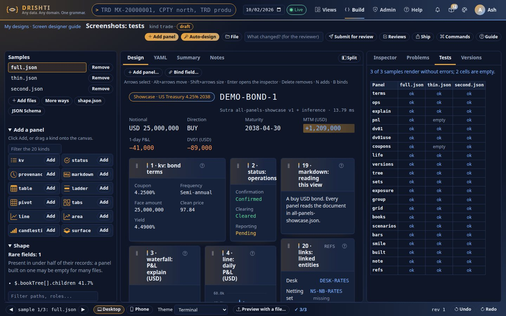

The **matrix** has a row per panel and a column per sample; each cell says **ok**, **empty** (the sample has no data for the panel), **error** (the panel failed; hover for the message) or **no access** (a stored entity you may not open). **Click a cell**: that sample is previewed and the panel selected. The status bar shows the total, `✓ 12/12` when every sample renders without errors, `✗ 9/12` otherwise. Empty cells are not errors but are worth reading: they are the places a panel needs a field the sample does not have.

## 12. Preview with a file

**Preview with a file…** in the status bar takes any JSON file (or the first line of a JSONL file) and draws the current design against it at once. The file is **not added** to the design; the status bar shows its name with a *Back to the samples* button. Edit the design meanwhile and the file preview follows.

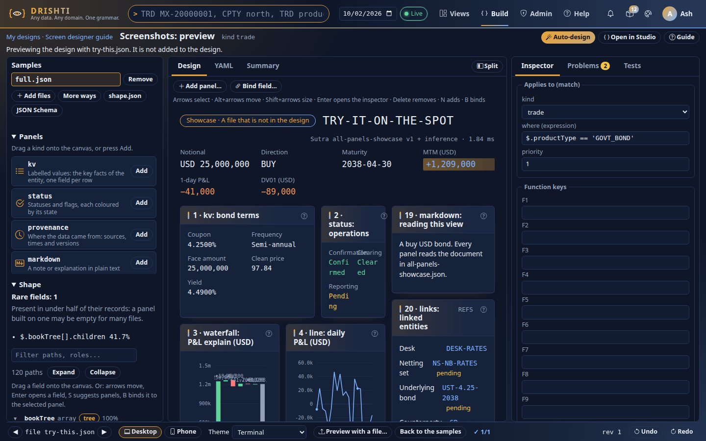

## 13. Undo, redo and revisions

Undo and Redo (the status bar, or Ctrl+Z and Ctrl+Shift+Z outside text fields) walk the design's log: every canvas move, inspector change, typed YAML edit and auto-design is a step (the last 100 are kept). Each move is a new **revision** (`rev 7` in the status bar).

If you edit the same design in two tabs, the older tab's next change is answered **409 (DRS-5007)**: nothing is applied twice or lost silently; the tab reloads the design at its current revision and says so.

## 14. Phone width and themes

**Phone** narrows the canvas to a phone's width so you can see how the screen stacks; **Desktop** goes back. **Theme** previews the design in each of the console's themes.

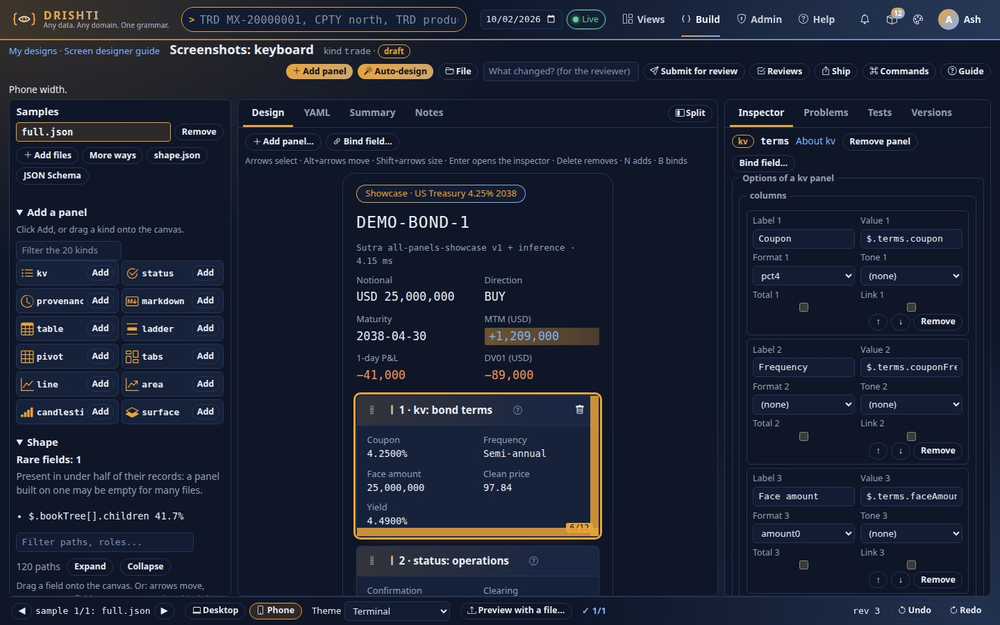

## 15. Keyboard reference

Everything the mouse does has a key. Changes are announced in a live region for screen readers.

**On the canvas** (focus a panel: Tab into the canvas, or click one)

| Key | Does |
|---|---|
| Arrow keys | Select the previous/next panel (Up, Down), or the first panel of the main/side column (Left, Right); the title and the strip come first. |
| Home, End | First, last. |
| Alt + Up/Down | Move the panel one place up/down its column. |
| Alt + Left/Right | Move it to the main/side column. |
| Shift + Left/Right | Narrower/wider by one column (also `-` and `+`). |
| Shift + Up/Down | Shorter/taller by one row; `A` back to the content's height. |
| Enter (or double-click) | Open the inspector on it. |
| `N` | **Add panel…** after the selected one. |
| `B` | **Bind field…** to the selected panel. |
| Delete or Backspace | Remove the panel. |
| Esc | Deselect. |

**Elsewhere**

| Key | Does |
|---|---|
| Ctrl+Z, Ctrl+Shift+Z (Ctrl+Y) | Undo, redo (inside a text field or the YAML editor the field's own undo is kept). |
| Shape tree: arrows, Enter, `S`, `B` | Move, show a field's reason, suggest panels for it, bind it to the selected panel. |
| Menus (Add panel…, Bind field…, suggestions) | Type to filter; Up/Down; Enter picks; Esc closes. |
| Expression fields | Up/Down, Enter or Tab take a suggestion; Esc closes; Ctrl+Space asks. |
| Tabs | Left/Right, Home, End move between tabs. |
| F1 | This guide. |

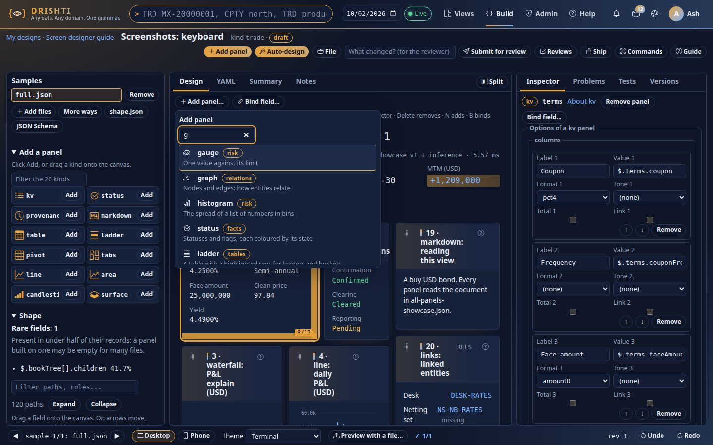

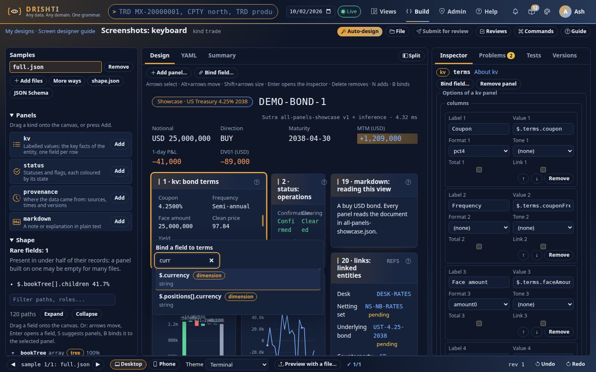

## 16. Worked examples, one per panel family

Each example in `docs/guides/examples/` opens as your own copy (*Build → Examples*, or the **Open in the workbench** link on *Help → Examples*). Each has a note on what to look for and which lines to copy. For each family below: open the copy, click the panel named, look at its inspector, then try the exercise.

### Key figures, key/value and status: [all-panels-showcase](examples/all-panels-showcase.md)

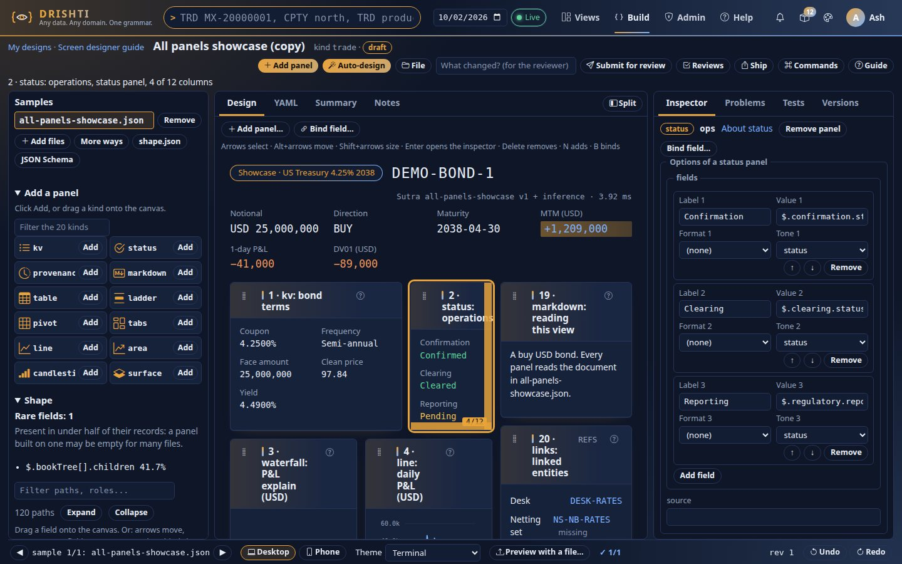

Select **terms** (a `kv`) and **ops** (a `status`). Exercise: drag the field `currency` onto **terms** and watch a new line appear; click the **title line** and change the pill; click the **strip** and add a figure by dropping `maturityDate` on it.

### Tables, the tree table and pivot row groups: [tree-table](examples/tree-table.md), [pivot-row-groups](examples/pivot-row-groups.md)

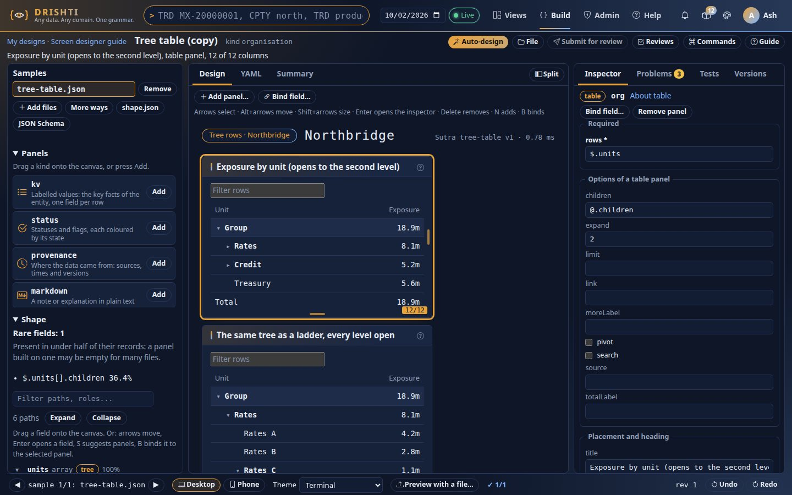

The tree table has `children` and `expand` options; the shape tree marks the list with the `tree` role. Exercise: change `expand` to `all` in the inspector; add a column with the **Add column** button.

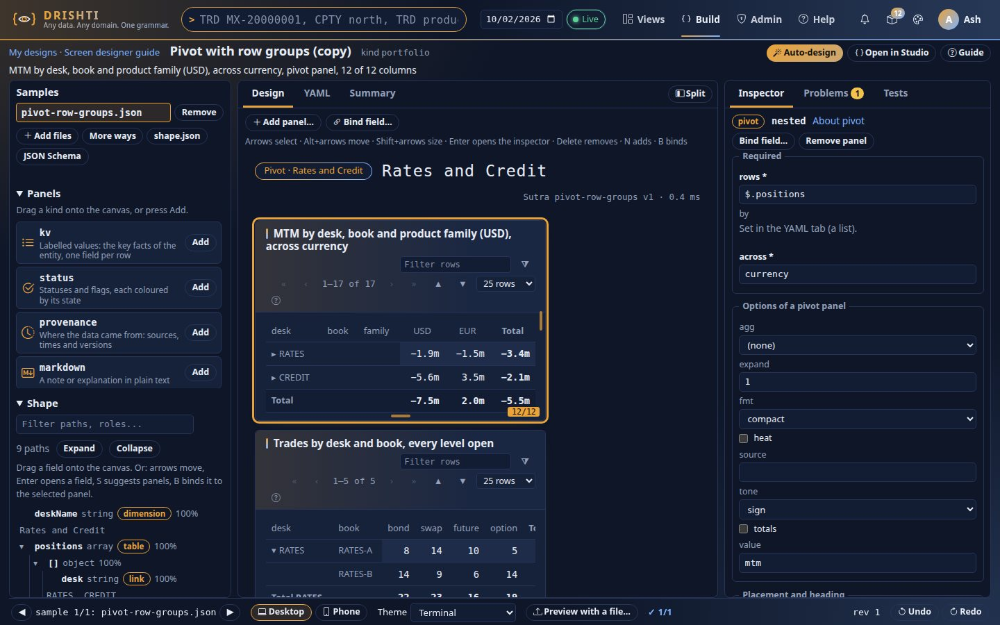

In the pivot, `by` lists the row groups, `across` the columns. Exercise: reorder the entries of `by` and watch the subtotals regroup.

### Time series, line and area: [exposure-profile](examples/exposure-profile.md)

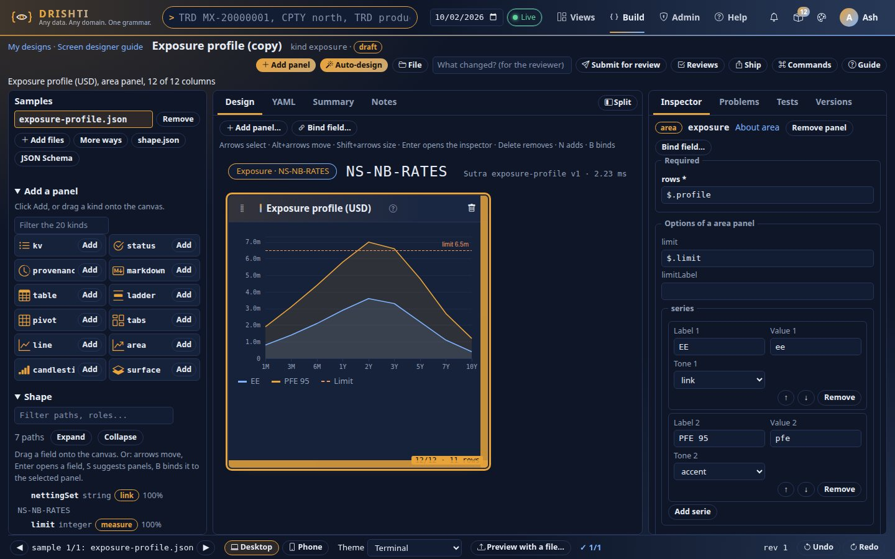

Drop a `series` field on empty canvas: the first suggestion is a line chart with `x` and `y` filled. Exercise: set `limit` to an expression such as `$.limit` to draw the limit line.

### Market data, candlestick and surface: [market-charts](examples/market-charts.md)

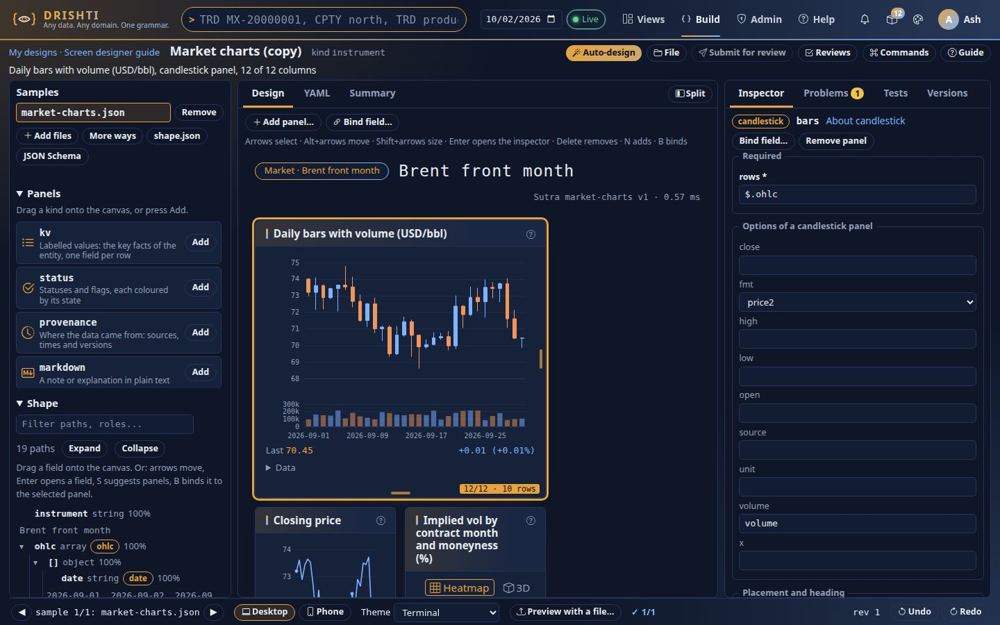

The candlestick needs `open`, `high`, `low` and `close`; the surface needs `rows` and `y` (the other axis). Exercise: bind a different field to `close` and see the Tests matrix flag the samples that lack it.

### Risk, histogram, scatter and gauge: [risk-distribution](examples/risk-distribution.md)

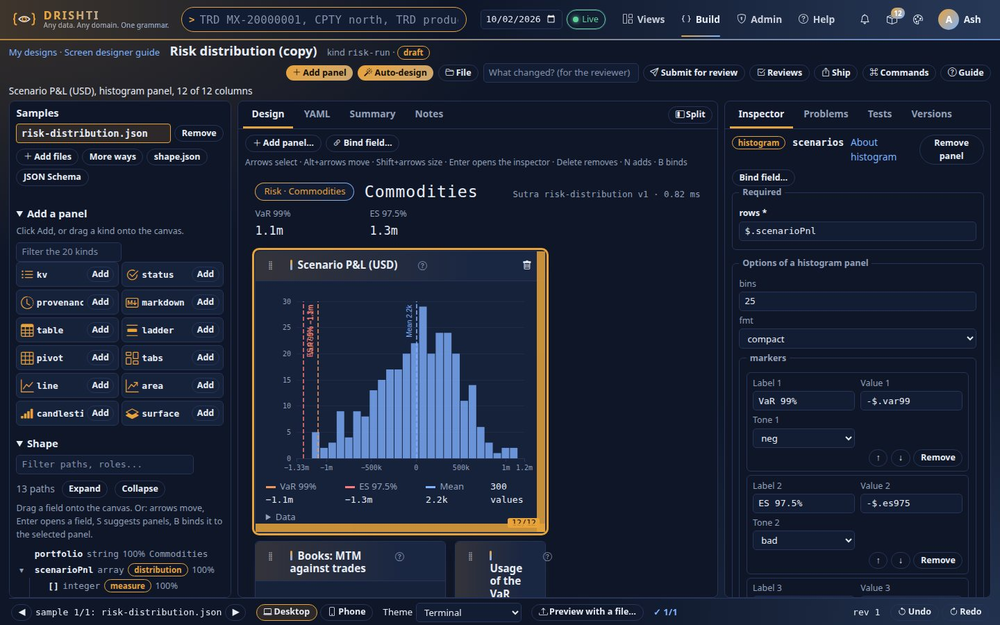

Exercise: change the histogram's `bins`; drag the gauge's right edge to make it narrower and watch the others reflow.

### P&L, waterfall and horizontal bars: [pnl-explain](examples/pnl-explain.md)

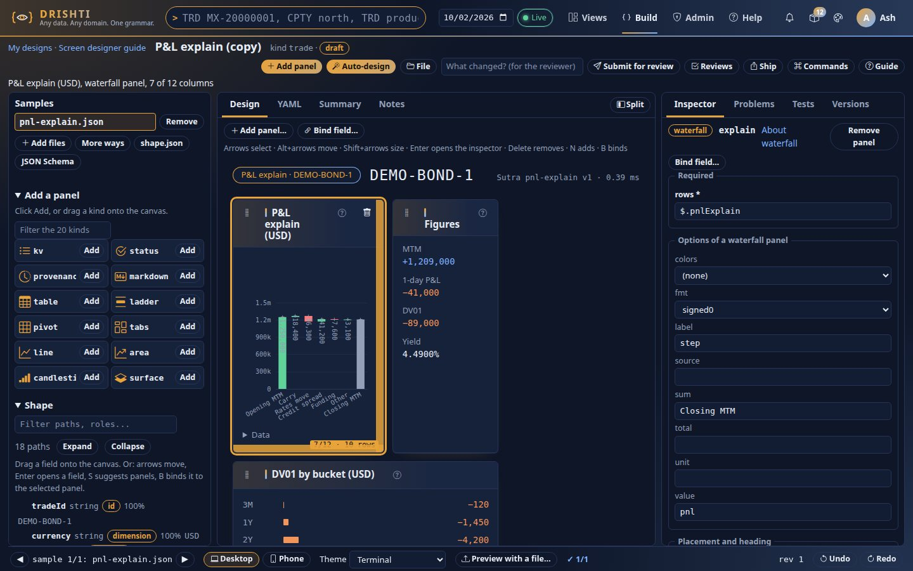

The `waterfall`'s `sum` names the step that is the total; the `hbar` panel draws a bar per row. Exercise: change `fmt` to see signed numbers; set `tone` to `sign` on the bars.

### Relationships, graph, tabs and links: [relationships](examples/relationships.md)

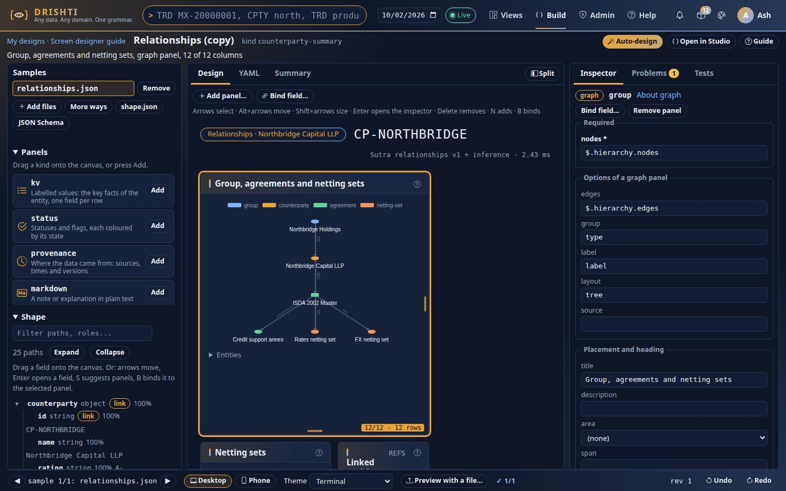

`tabs` makes one tab per element of `each`; its body is a panel of its own (edit it in the YAML tab: a panel inside a tabs body is not a canvas target). Exercise: change `tabTitle` to another expression.

### Operations, timeline and ladder: [operations-status](examples/operations-status.md)

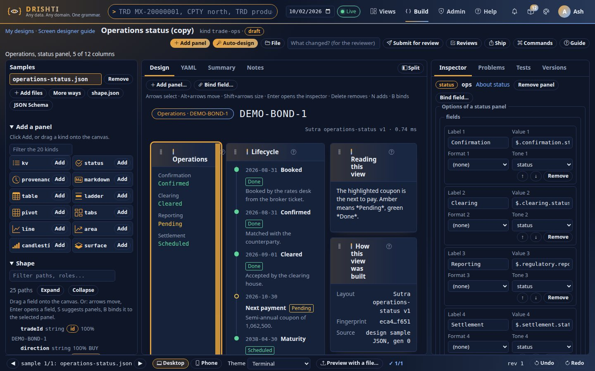

The ladder highlights the row its `highlight` expression is true for. Exercise: change the expression and watch the highlight move.

## 17. Troubleshooting

| You see | Why | What to do |
|---|---|---|
| *The design changed somewhere else (another tab?)* (DRS-5007) | Another tab or session edited the design after this tab loaded it. | The tab has reloaded; make your change again. |
| A drop did nothing; the status line says *Dropped outside the columns* | The pointer was not over a column. | Drop inside the main or side column. |
| *'markdown' panels bind no data* (DRS-5022), or another DRS-502x line | The panel kind cannot take that field or option. | Read the code in the [Rachana reference](RACHANA_REFERENCE.md); pick another panel or use **Suggest panels…**. |
| *panels inside a tabs body cannot be edited* (DRS-5024) | Only the panels of the top-level `panels:` list are canvas targets. | Edit that part in the YAML tab. |
| The YAML tab shows red marks and the screen does not change | A refused edit: the design keeps its last good Sutra and your text. | Fix it using the line in the Problems tab. |
| A panel says *No data available* | The sample has no value for the field it reads. | Open the Tests tab: an **empty** cell says which sample; pick a field the samples have. |
| A cell is **error** | The panel failed on that sample; hover for the message. | Click the cell: the panel and the sample are selected. |
| A cell is **no access** | The sample is a stored entity of a kind you may not open. | Ask for access, or replace it with a file. |
| Charts look squashed | The panel is short for its content. | Drag its bottom edge, or double-click it for the natural height. |
| The check shows `? not checked` | The check could not run (no samples, or the server did not answer). | Add a sample; reload. |
| Fields I dropped are bound to the wrong option | A drop binds the next unfilled option of the kind. | Fix the option in the inspector, or Undo. |

## 18. Limits

| Limit | Value | Where it is set |
|---|---|---|
| Samples in a design | 50 | `drishti.builder.designs.max-samples` |
| Size of one file / of a whole design / of all your designs | 5 MB / 25 MB / 250 MB | `drishti.builder.max-file-mb`, `drishti.builder.designs.max-mb`, `drishti.builder.designs.max-user-mb` |
| Designs per person | 50 | `drishti.builder.designs.max-per-user` |
| How long a design is kept | scratch: 1 day; named: 90 days after you last touched it (warning at 75) | `drishti.builder.designs.*` |
| Steps Undo can walk back | 100 | `drishti.builder.designs.max-ops` |
| A panel's span / height | 1 to 12 columns / 1 to 24 rows | the Rachana language |
| Figures in the strip | 8 | the Rachana language |
| Edited on the canvas | the panels of the top-level `panels:` list, written as a block or as one flow map each | other shapes are edited in the YAML tab (DRS-5024) |

Sample contents are never logged. **Propose, export and the review of a design** arrive with the next steps of the workbench ([BUILD_WORKBENCH.md](../architecture/BUILD_WORKBENCH.md)); until then, **Open in Studio** carries the design's Sutra to Studio's save and review.

See also: [Screen Builder design](../architecture/SCREEN_BUILDER.md), [the examples](examples/README.md), [the Rachana reference](RACHANA_REFERENCE.md), [panels in depth](PANELS.md).
