<!--
  Project Drishti · Any data. Any domain. One grammar.

  Copyright (c) 2026 Ashutosh Sinha <ajsinha@gmail.com>.
  All rights reserved.

  PROPRIETARY AND CONFIDENTIAL.

  This file is the confidential and proprietary property of Ashutosh Sinha.
  Unauthorised copying, use, modification, distribution or disclosure of this
  file, via any medium, is strictly prohibited except with the express prior
  written permission of the copyright holder.

  See the LICENSE file in the root of this repository for the full terms.
-->
New to the workbench? Follow [the step-by-step tutorial](BUILD_WORKBENCH_TUTORIAL.md): four complete projects, a picture of almost every step.

# Screen designer: from JSON files to a screen, without writing YAML

You have JSON documents (trades, shipments, patients, sensor readings) and you want a screen for them. The **workbench** (*Build → New screen*, then the design's page) is where you make it: bring your files, let Drishti draft a first screen, then **drag panels and fields onto the real screen**, size them on the grid, fill their options in a form, and watch every sample of your data against it while you work. The result is an ordinary Sutra (the layout file Drishti reads), and the YAML is one tab away when you want it.

This guide goes step by step, with a picture of each step. The pictures are made by a script (`tools/docs/screenshots.py`), so they match the screen you have.

- [1. Start: bring data](#1-start-bring-data)
- [2. The workbench at a glance](#2-the-workbench-at-a-glance)
- [3. The Data pane: samples, shape, palette](#3-the-data-pane-samples-shape-palette)
- [4. The canvas and the grid](#4-the-canvas-and-the-grid)
- [5. Add a panel](#5-add-a-panel)
- [6. Drop a field: suggestions and binding](#6-drop-a-field-suggestions-and-binding)
- [7. Auto-design and its alternatives](#7-auto-design-and-its-alternatives)
- [8. The inspector](#8-the-inspector)
- [9. The YAML tab, the split view and the Summary](#9-the-yaml-tab-the-split-view-and-the-summary)
- [10. Problems](#10-problems)
- [11. Tests as you type](#11-tests-as-you-type)
- [12. Preview with a file](#12-preview-with-a-file)
- [13. Undo, redo and revisions](#13-undo-redo-and-revisions)
- [14. Phone width and themes](#14-phone-width-and-themes)
- [15. Keyboard reference](#15-keyboard-reference)
- [16. Worked examples, one per panel family](#16-worked-examples-one-per-panel-family)
- [17. Troubleshooting](#17-troubleshooting)
- [18. Limits](#18-limits)
- [19. Studio users: where things went](#19-studio-users-where-things-went)
- [20. The command palette](#20-the-command-palette)
- [21. Diff and versions](#21-diff-and-versions)
- [22. Saving and proposing](#22-saving-and-proposing)
- [23. End to end: from a folder of JSON to a live screen](#23-end-to-end-from-a-folder-of-json-to-a-live-screen)
- [24. Pack fragments: export and import](#24-pack-fragments-export-and-import)
- [25. Sharing a design read-only](#25-sharing-a-design-read-only)
- [26. The command line and CI](#26-the-command-line-and-ci)
- [27. Binding a design to a file (development servers)](#27-binding-a-design-to-a-file-development-servers)
- [28. Troubleshooting shipping](#28-troubleshooting-shipping)
- [29. Limits of shipping](#29-limits-of-shipping)
- [30. Keyboard reference for shipping](#30-keyboard-reference-for-shipping)

## 1. Start: bring data

Open **Build → New screen**. The page asks two things: *what data do you have?* and *where should the design start?*


**Bring data** (any mix, in one go):

| You have | What happens |
|---|---|
| JSON or JSONL files, or a whole folder | Each file is a **sample** (a `.jsonl` file gives one sample per line). Drishti merges them into one *shape*. |
| A `shape.json` from an earlier design, or any plain **JSON Schema** (draft 2020-12 or 07) | Sample documents are generated from the schema's types, enums, formats and examples. They are marked *synthetic*: good for building, not proof that a screen works on real data. |
| Entities from a store (a kind and a count, or ids) | The design keeps a **reference**, not a copy: it is read again each time with *your* rights and masks. |
| One of the **examples** | The design opens as **your own copy** of it: the example's Sutra, its JSON as a sample, its notes. The files in `docs/guides/examples/` are never changed. |
| An existing **Sutra** (from the registry, or a `.yaml` file) | The design edits a copy; the original is untouched until you propose the change. |

**Start from**: *auto-design* (the default when there are samples: a first screen drafted for you, section 7), *an existing Sutra*, or *an empty Sutra* for the kind.

Open the workbench with nothing at all and you get an unnamed **scratch design** on the all-panels showcase; it is forgotten after a day. Name it in **My designs** to keep it (named designs are kept 90 days after you last touch them). Every example in *Help → Examples* has an **Open in the workbench** link that makes the same kind of copy.

## 2. The workbench at a glance


| Where | What it holds |
|---|---|
| **Left: Data** | The samples (add, remove, choose the previewed one), the **palette** of the 21 panel kinds, and the **shape**: every field of your data with its role. |
| **Centre** | Tabs **Design** (the real screen with an editing layer), **YAML** (the Sutra text), **Summary** (the Sutra read back as a page) and **Notes** (the design's notes in markdown, with a preview; they travel to the reviewer). **Split** shows Design and YAML side by side. |
| **Right** | Tabs **Inspector** (a form for what is selected), **Problems**, **Tests** and **Versions**. |
| **Status bar** | `◀ sample 2/12 ▶`, Desktop or Phone width, Theme, **Preview with a file…**, the check result `✓ 12/12`, the revision, Undo and Redo. |

The **Notes** tab holds what the screen is for, in markdown, with a live preview beside the text. It saves when you leave the box, and the reviewer reads it with your proposal. An example's own README arrives there with its licence comment removed.

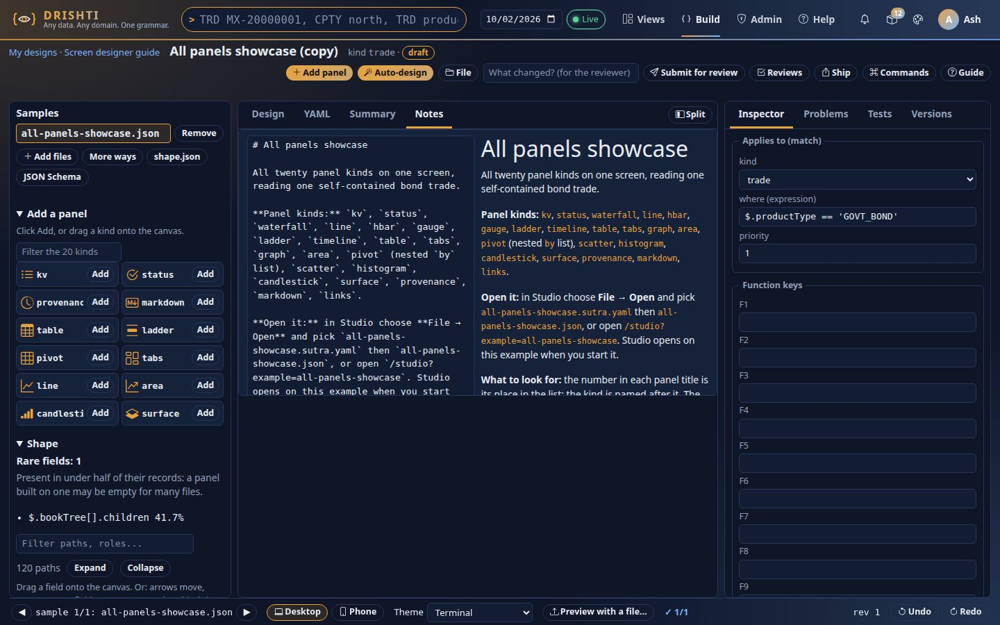

Everything you do is an **operation** on the design (add a panel, move it, set an option…). The server applies it to the Sutra text, keeps your comments and the order of your keys, and sends back the screen. That is why the Design tab shows what users will see, not a mock-up, and why Undo can take back any step.

## 3. The Data pane: samples, shape, palette


**Samples.** Click a sample's name to preview the design with it (the status bar's ◀ ▶ do the same). *Add files* adds more; *Remove* takes one out. A sample marked *stored entity* is a reference; *synthetic* was generated from a schema. *shape.json* and *JSON Schema* download what Drishti inferred.

**Shape.** The tree lists every path in your samples with its type, its **role** and how many records have it:

| Role | Meaning |
|---|---|
| `id`, `link` | Names an entity, or points at another (a link opens it). |
| `dimension`, `status` | Something to group by (a book, a currency), and a dimension whose values are states. |
| `measure` | A number to add up or chart. |
| `date`, `series`, `events` | A date; values over dates or tenors; things that happened on dates (a timeline). |
| `ohlc`, `distribution`, `grid`, `steps` | Open/high/low/close rows; a list of numbers; a table of numbers on one axis (a surface); signed steps that sum to a total (a waterfall). |
| `graph`, `tree`, `text` | Nodes and edges; rows that hold rows of the same shape; long text. |

Conflicts (the same field with different types in different files) and rare fields (in fewer than half of the records) are listed above the tree: a panel built on a rare field is empty for many samples. Filter by path or role; arrows move, Right and Left open and close, **Enter** shows a field's reason, examples and files. Each opened field has two buttons, **Suggest panels…** and **Bind to selected panel** (also the keys `S` and `B`), and every field can be **dragged** onto the canvas (section 6).

**Palette.** The 21 panel kinds, each with an icon and a line on what it shows. Drag one onto the canvas, or press its **Add** button (section 5).


## 4. The canvas and the grid

The Design tab draws your screen exactly as users see it, then lets you point at it. Each column of the screen (the **main** column on the left, the **side** column on the right) is a **12-column grid**. A panel has three placement settings: its **area** (main or side), its **span** (1 to 12 columns wide; the default is the whole column) and its **height** (1 to 24 rows of 2.5 rem; the default is as tall as its content). Panels with a span below 12 sit side by side.


- **Hover** outlines the panel under the pointer. **Click** selects a panel (or the title line, or the strip of key figures); the inspector shows its form.
- **Move**: drag a panel by its heading. A bar shows where it will land: between two stacked panels, or beside a panel in the same row. Drop it in the other column to change its area. Esc cancels the drag.
- **Resize**: drag the right edge to change the span (a badge shows `8/12`), the bottom edge to change the height; double-click the bottom edge for "as tall as the content".
- **Delete** removes the selected panel (Undo brings it back).


Every one of these is a single operation, sent with the revision you built on. If the design has changed somewhere else in the meantime (another tab), the answer is refused, the design is reloaded and the status line says so; make the change again (section 13).

## 5. Add a panel

Four ways, all producing the same operation, and the first is always in sight:

1. **+ Add panel** in the bar above the screen, on every tab and at phone width. A chooser lists all 20 kinds with an icon and a line each; type to filter, Up/Down, Enter. Whatever tab you were on, the workbench switches to **Design**, selects the new panel, scrolls it into view, flashes it and opens the inspector.
2. **Drag a kind** from the palette (**Add a panel**, a filterable grid of the 20 kinds) onto the canvas. The bar shows where it will go; drop it.
3. Press a kind's **Add** button in the palette: it goes after the selected panel (or at the end of the main column).
4. The key `N` on the canvas, or the command palette's **Add panel…**.

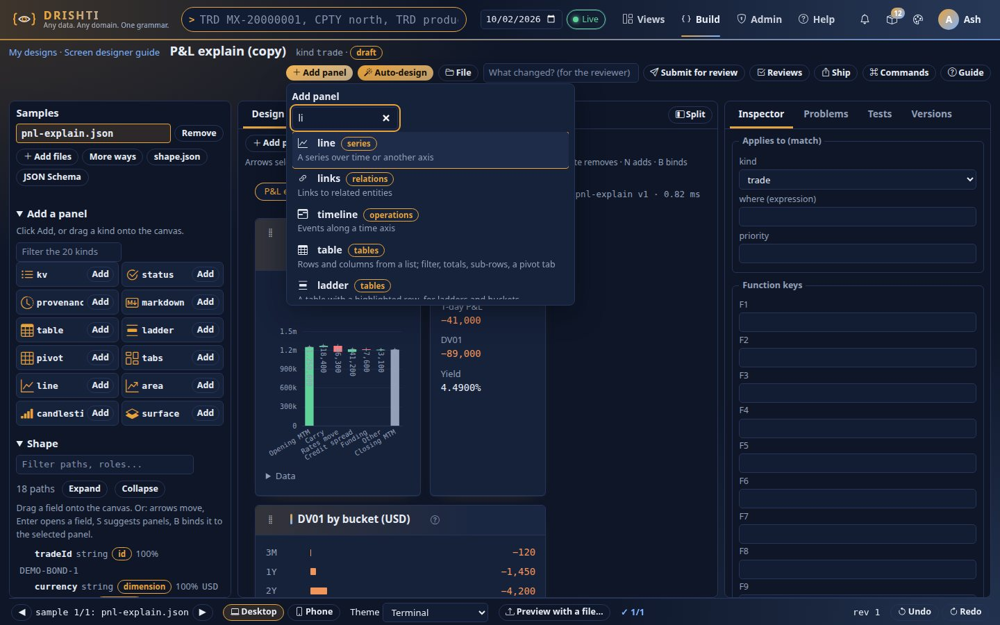

A design with no Sutra yet shows a large **Add your first panel** on the canvas. Every panel has a grip (⋮) in its heading and a tooltip *Drag to move · drag the edges to resize*; the selected panel shows resize handles on its right and bottom edges, and a newly added panel is draggable and resizable at once. Studio addresses and Help links open with the screen and the YAML side by side, so the canvas is always in sight.


The new panel is selected and the inspector opens on it. The options a kind cannot go without (`rows` for a table, `value` for a gauge…) are filled from your data where possible (the first list in your samples, its first number…) and **marked as required** so you check them; the panel draws something at once.


### Removing a panel

Removing is one operation and **Undo brings the panel back in its place**, so nothing asks "are you sure". Any of these:

- the **trash button** in the panel's heading (shown when you point at the panel, and always on the selected one; its name is *Remove panel <title>*);
- **Remove panel** at the top of the inspector, next to the panel's kind;
- a **right click** on the panel: Move up, Move down, Duplicate, Remove panel;
- the command palette's **Remove panel** (the selected panel), or `Delete` / `Backspace` on a selected panel.

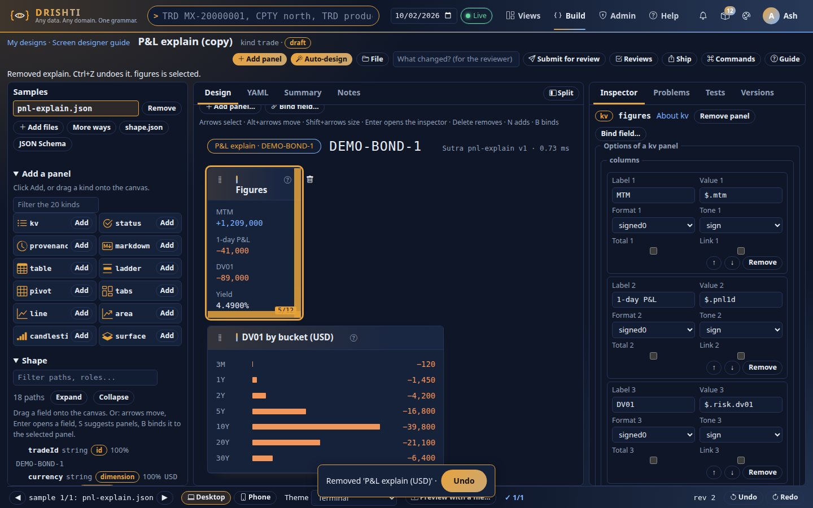

A toast *Removed 'Title' · Undo* stays for eight seconds and is announced to screen readers; its Undo button (or Ctrl+Z) restores the panel. The YAML loses exactly that panel; every other comment stays.

## 6. Drop a field: suggestions and binding

A field of the shape is dragged onto the canvas:

- **Onto the rim of a panel, between panels, or onto empty space in a column**: Drishti ranks the panel kinds that suit the field (a `series` becomes a line, a `measure` a gauge or a bar, a list of rows a table…), each with its options already filled and **a reason**. Pick one with the mouse or Up/Down and Enter; it is added at the place you dropped, with its inspector open.

  

- **Onto the middle of a panel**: the field is **bound** to it, into the option the kind accepts next (a column of a table, a field of a key/value panel, a series of a line chart…). The panel outlines in green while you hover.

  

- **Onto the strip** of key figures: a new figure is added (up to eight).
- If the panel cannot take the field, nothing changes and the status line says why, for example *'markdown' panels bind no data (DRS-5022)*. The same message is in the Problems tab.

The keyboard way is the **Bind field…** button (or `B` on a selected panel): type part of the path, Enter. In the shape tree, `S` opens the suggestions for the focused field.

## 7. Auto-design and its alternatives

**Auto-design** (top right) drafts a complete Sutra from your samples and makes it the design's next revision. It looks at the roles of your fields, at how often each field is present, at how long each list is and at how varied its values are, and it **previews the draft against every sample**: a panel that comes out empty or broken for many of them is left out or demoted.


Above the canvas it shows **what it left out and why**, and for every panel **the reason for the choice and the runner-up kinds** with their reasons, so you can swap one in (drop the field again and pick the alternative). Auto-design only produces the first draft: everything after it is yours. If you have already worked on the design, it asks first; **Undo** brings your previous Sutra back.

## 8. The inspector


The form is generated from the same schema the YAML editor completes from, so it always offers exactly what the panel's kind accepts.

- **Required** options come first, marked with `*`. Then the **options of the kind**, then **placement and heading** (title, description, area, span, height, function key, code).
- A choice from a fixed list (a format, a tone, an area, a graph's layout) is a **select**; true/false is a **switch**; a count (`limit`, `span`, `bins`) is a **number field**, and `expand` takes a number or **all**; lists such as `columns`, `fields`, `series`, histogram `markers` and a pivot's `by` have add, remove and reorder buttons; the table's `pivot` is a switch with its fields below it, and a tabs panel's `body` has its kind and columns; everything else is text.
- **Expression fields** (rows, value, bind, source, highlight…) complete as you type: after `$` the paths of your shape, after `@` the fields of the panel's rows, and function names. Up/Down choose, Enter or Tab take, Esc closes, Ctrl+Space asks.

  

- **Lists** (columns, fields, series, the strip) have *Add*, *Remove* and **↑ ↓** to reorder each item.
- Click the **title line** to edit the title (id, pill, with), the **strip** to edit the key figures; with nothing selected the inspector shows the screen's own settings: what it **applies to** (`match`) and the **function keys**.

Each change is an operation about 0.4 s after you stop typing (or when you leave the field). If you are unsure of a value, the server tells you in the Problems tab and the status line.

## 9. The YAML tab, the split view and the Summary


The YAML tab is Studio's editor on the design's Sutra: completion of keys and values, expression paths from your sample, field help, and a light check that underlines mistakes. **Typing is an operation like any other**: a moment after you stop, your text is sent as a *Text* operation, so Undo and the revision cover it. If the server refuses it (a bad kind, an unknown option), your text stays exactly as you typed it, the design keeps its last good Sutra, and the Problems tab shows the DRS code with the line.

**Split** shows Design and YAML side by side: move a panel and watch the YAML change, comments and key order kept.


**Summary** reads the Sutra back as a page: what it applies to, the strip, each panel with its columns.

**About text.** The Sutra's `description` and each panel's `description` (YAML tab) are what the *About this page* drawer says about your screen, so write them for the person who will press `?`. A design preview already has the drawer's data; the sentence with the entity's own numbers is written in the pack's `config/about.yaml` ([About text and glossary](PACK_DEVELOPER_GUIDE.md#about-text-and-glossary)). An **About** tab in the workbench, to write that file beside the Sutra, preview it over your samples and export it with the pack fragment, is stage 7 of the design ([CONTEXT_HELP.md](../architecture/CONTEXT_HELP.md#build-workbench-integration)) and is not in the workbench yet.

## 10. Problems


A wrong expression (for example `rows: '$.legs[?'`) is listed here with the panel, the option, its line and its DRS code once; the Sutra is not accepted as a whole by the server, so the canvas draws the other panels and says which one it left out, and the Tests tab says the check cannot run until the problem is fixed.

One list, each item a button that takes you there:

| Kind | Source | Click goes to |
|---|---|---|
| **yaml** | the editor's light check | the line in the YAML tab |
| **operation** (DRS-502x) | what the server refused of your last operations | the line, or the panel |
| **binding** | a field the Sutra reads that your samples rarely have (under half of them) or that has two types | the panel that reads it |
| **check** | a panel that fails on a sample | the panel, with that sample previewed |

The tab's badge counts them.

## 11. Tests as you type

A moment after your last change (about 0.8 s) every sample is checked against the Sutra by the same checker Studio and auto-design use. A newer change cancels a run that is no longer current.


The **matrix** has a row per panel and a column per sample; each cell says **ok**, **empty** (the sample has no data for the panel), **error** (the panel failed; hover for the message) or **no access** (a stored entity you may not open). **Click a cell**: that sample is previewed and the panel selected. The status bar shows the total, `✓ 12/12` when every sample renders without errors, `✗ 9/12` otherwise. Empty cells are not errors but are worth reading: they are the places a panel needs a field the sample does not have.

## 12. Preview with a file

**Preview with a file…** in the status bar takes any JSON file (or the first line of a JSONL file) and draws the current design against it at once. The file is **not added** to the design; the status bar shows its name with a *Back to the samples* button. Edit the design meanwhile and the file preview follows.


## 13. Undo, redo and revisions

Undo and Redo (the status bar, or Ctrl+Z and Ctrl+Shift+Z outside text fields) walk the design's log: every canvas move, inspector change, typed YAML edit and auto-design is a step (the last 100 are kept). Each move is a new **revision** (`rev 7` in the status bar).


If you edit the same design in two tabs, the older tab's next change is answered **409 (DRS-5007)**: nothing is applied twice or lost silently; the tab reloads the design at its current revision and says so.

## 14. Phone width and themes

**Phone** narrows the canvas to a phone's width so you can see how the screen stacks; **Desktop** goes back. **Theme** previews the design in each of the console's themes.


## 15. Keyboard reference

Everything the mouse does has a key. Changes are announced in a live region for screen readers.

**Getting to the canvas.** The first Tab stop is *Skip to the screen* (it focuses the canvas, so you do not tab through the palette and the shape first). From anywhere that is not a text field, press `G` then `C`, or choose **Go to canvas** in the command palette. `Esc` in the inspector puts the focus back on the selected panel. `Delete` or `Backspace` on a selected panel removes it (Undo brings it back).

**On the canvas** (focus a panel: Tab into the canvas, or click one)

| Key | Does |
|---|---|
| Arrow keys | Select the previous/next panel (Up, Down), or the first panel of the main/side column (Left, Right); the title and the strip come first. |
| Home, End | First, last. |
| Alt + Up/Down | Move the panel one place up/down its column. |
| Alt + Left/Right | Move it to the main/side column. |
| Shift + Left/Right | Narrower/wider by one column (also `-` and `+`). |
| Shift + Up/Down | Shorter/taller by one row; `A` back to the content's height. |
| Enter (or double-click) | Open the inspector on it. |
| `N` | **Add panel…** after the selected one. |
| `B` | **Bind field…** to the selected panel. |
| Delete or Backspace | Remove the panel. |
| Esc | Deselect. |

**Elsewhere**

| Key | Does |
|---|---|
| Ctrl+Z, Ctrl+Shift+Z (Ctrl+Y) | Undo, redo (inside a text field or the YAML editor the field's own undo is kept). |
| Ctrl+K | The command palette: add a panel, go to a panel, next sample, run the check, switch tab, undo, save, open the guide (section 20). |
| Ctrl+S | Save to the registry, or propose it for review; says why when you may not (section 22). Never opens the browser's save dialog. |
| Ctrl+Enter | Preview: sends what you typed, draws the screen again. Works in the YAML editor too. |
| Shape tree: arrows, Enter, `S`, `B` | Move, show a field's reason, suggest panels for it, bind it to the selected panel. |
| Menus (Add panel…, Bind field…, suggestions) | Type to filter; Up/Down; Enter picks; Esc closes. |
| Expression fields | Up/Down, Enter or Tab take a suggestion; Esc closes; Ctrl+Space asks. |
| Tabs | Left/Right, Home, End move between tabs. |
| F1 | This guide. |


## 16. Worked examples, one per panel family

Each example in `docs/guides/examples/` opens as your own copy (*Build → Examples*, or the **Open in the workbench** link on *Help → Examples*). Each has a note on what to look for and which lines to copy. For each family below: open the copy, click the panel named, look at its inspector, then try the exercise.

### Key figures, key/value and status: [all-panels-showcase](examples/all-panels-showcase.md)


Select **terms** (a `kv`) and **ops** (a `status`). Exercise: drag the field `currency` onto **terms** and watch a new line appear; click the **title line** and change the pill; click the **strip** and add a figure by dropping `maturityDate` on it.

### Tables, the tree table and pivot row groups: [tree-table](examples/tree-table.md), [pivot-row-groups](examples/pivot-row-groups.md)


The tree table has `children` and `expand` options; the shape tree marks the list with the `tree` role. Exercise: change `expand` to `all` in the inspector; add a column with the **Add column** button.


In the pivot, `by` lists the row groups, `across` the columns. Exercise: reorder the entries of `by` and watch the subtotals regroup.

### Time series, line and area: [exposure-profile](examples/exposure-profile.md)


Drop a `series` field on empty canvas: the first suggestion is a line chart with `x` and `y` filled. Exercise: set `limit` to an expression such as `$.limit` to draw the limit line.

### Market data, candlestick and surface: [market-charts](examples/market-charts.md)


The candlestick needs `open`, `high`, `low` and `close`; the surface needs `rows` and `y` (the other axis). Exercise: bind a different field to `close` and see the Tests matrix flag the samples that lack it.

### Risk, histogram, scatter and gauge: [risk-distribution](examples/risk-distribution.md)


Exercise: change the histogram's `bins`; drag the gauge's right edge to make it narrower and watch the others reflow.

### P&L, waterfall and horizontal bars: [pnl-explain](examples/pnl-explain.md)


The `waterfall`'s `sum` names the step that is the total; the `hbar` panel draws a bar per row. Exercise: change `fmt` to see signed numbers; set `tone` to `sign` on the bars.

### Relationships, graph, tabs and links: [relationships](examples/relationships.md)


`tabs` makes one tab per element of `each`; its body is a panel of its own (edit it in the YAML tab: a panel inside a tabs body is not a canvas target). Exercise: change `tabTitle` to another expression.

### Operations, timeline and ladder: [operations-status](examples/operations-status.md)


The ladder highlights the row its `highlight` expression is true for. Exercise: change the expression and watch the highlight move.

## 17. Troubleshooting

| You see | Why | What to do |
|---|---|---|
| *The design changed somewhere else (another tab?)* (DRS-5007) | Another tab or session edited the design after this tab loaded it. | The tab has reloaded; make your change again. |
| A drop did nothing; the status line says *Dropped outside the columns* | The pointer was not over a column. | Drop inside the main or side column. |
| *'markdown' panels bind no data* (DRS-5022), or another DRS-502x line | The panel kind cannot take that field or option. | Read the code in the [Rachana reference](RACHANA_REFERENCE.md); pick another panel or use **Suggest panels…**. |
| *panels inside a tabs body cannot be edited* (DRS-5024) | Only the panels of the top-level `panels:` list are canvas targets. | Edit that part in the YAML tab. |
| The YAML tab shows red marks and the screen does not change | A refused edit: the design keeps its last good Sutra and your text. | Fix it using the line in the Problems tab. |
| A panel says *No data available* | The sample has no value for the field it reads. | Open the Tests tab: an **empty** cell says which sample; pick a field the samples have. |
| A cell is **error** | The panel failed on that sample; hover for the message. | Click the cell: the panel and the sample are selected. |
| A cell is **no access** | The sample is a stored entity of a kind you may not open. | Ask for access, or replace it with a file. |
| Charts look squashed | The panel is short for its content. | Drag its bottom edge, or double-click it for the natural height. |
| The check shows `? not checked` | The check could not run (no samples, or the server did not answer). | Add a sample; reload. |
| Fields I dropped are bound to the wrong option | A drop binds the next unfilled option of the kind. | Fix the option in the inspector, or Undo. |

## 18. Limits

| Limit | Value | Where it is set |
|---|---|---|
| Samples in a design | 50 | `drishti.builder.designs.max-samples` |
| Size of one file / of a whole design / of all your designs | 5 MB / 25 MB / 250 MB | `drishti.builder.max-file-mb`, `drishti.builder.designs.max-mb`, `drishti.builder.designs.max-user-mb` |
| Designs per person | 50 | `drishti.builder.designs.max-per-user` |
| How long a design is kept | scratch: 1 day; named: 90 days after you last touched it (warning at 75) | `drishti.builder.designs.*` |
| Steps Undo can walk back | 100 | `drishti.builder.designs.max-ops` |
| A panel's span / height | 1 to 12 columns / 1 to 24 rows | the Rachana language |
| Figures in the strip | 8 | the Rachana language |
| Edited on the canvas | the panels of the top-level `panels:` list, written as a block or as one flow map each | other shapes are edited in the YAML tab (DRS-5024) |

Sample contents are never logged.

## 19. Studio users: where things went

**Sutra Studio no longer has a page of its own.** Everything it did is in the workbench, and every address you may have bookmarked still works: it sends you (a redirect) to the equivalent workbench screen, starting a design for you when it needs one.

| You used to open | You land on |
|---|---|
| `/studio` | A new unnamed **scratch design** (forgotten after a day) on the all-panels showcase, on its **YAML** tab. The showcase is the one named by `ui.studio_example`. |
| `/studio?example=tree-table` | A new design that is a **copy** of that example (its Sutra, its JSON as a sample, its notes), on the YAML tab. |
| `/studio?sutra=irs-vanilla@3` | A new design that **edits that Sutra** (shown as *edits irs-vanilla@3*, with a base to compare with: section 21). The entities you kept as that Sutra's *test entities* in Studio are brought along as **stored-entity samples**. |
| `/studio?kind=trade&id=T-1` | A new design for that kind with a starter Sutra and that **stored entity** as its sample. |
| `/studio?design=ID&sample=NAME` | That design (if it is yours), with that sample selected. |
| `/studio?build=1` (with any of the above) | The same, on the **Design** tab instead of the YAML. |
| `/studio/reviews`, `/studio/reviews/P-000042` | **Build → Govern → Reviews** (`/build/reviews`). The review pages moved there, unchanged. |

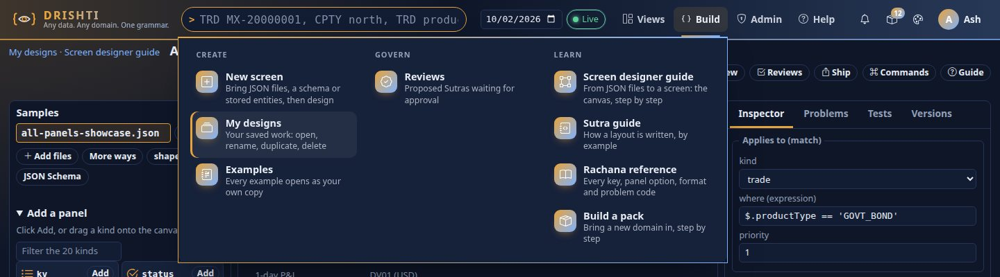

What Studio had, and where it is now:

| In Studio | In the workbench |
|---|---|
| The YAML editor with completion and the light check | The **YAML** tab (the same editor). |
| Summary tab | The **Summary** tab. |
| Preview (Ctrl+Enter) | **Ctrl+Enter** previews: it sends what you typed, then draws the screen again (section 22). |
| Save (Ctrl+S) | **Ctrl+S**, and the *Save* / *Submit for review* button (section 22). |
| File → Open… and File → Examples | The **File** button above the screen: *Open…* takes a `.yaml` (replaces the Sutra; Undo brings it back) or `.json` documents (added as samples); each example opens as a new copy. |
| The entity kind and id boxes, *Load entity JSON*, *Preview against this JSON* | **Samples**: add the entity as a sample (*More ways*), or **Preview with a file…**. Samples are listed, and you move between them with ◀ ▶. |
| *Test entities* and *Run all* | The **Tests** tab checks **every sample** against the design as you type. |
| *Start from inference* | **Auto-design** (section 7) drafts a complete Sutra from the samples. |
| The Sutra picker (*New Sutra…*) | **Build → New screen → an existing Sutra**, or `/studio?sutra=name@version` as above. |
| Reviews, with the pending count | **Build → Govern → Reviews** and the *Reviews* button beside *Submit for review*. |

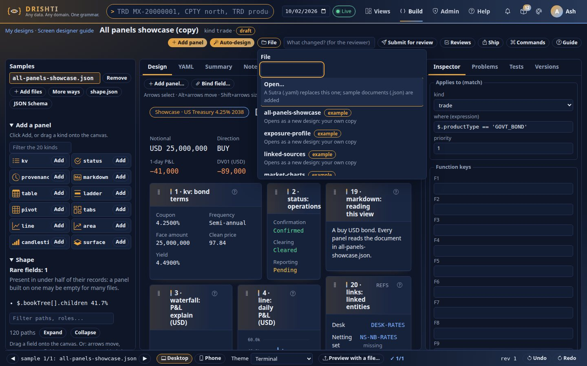

The JSON addresses Studio's own scripts used (`/studio/preview`, `/studio/summary`, `/studio/schema`, `/studio/save` and others) are unchanged, so existing notebooks and tests that call them keep working.

## 20. The command palette

Press **Ctrl+K** (Cmd+K on a Mac) anywhere on the workbench, or press **Commands** above the screen. A list opens with a filter box; type a few letters, move with Up and Down, press Enter, and the command runs. Esc, or Ctrl+K again, closes it and puts the focus back where it was.

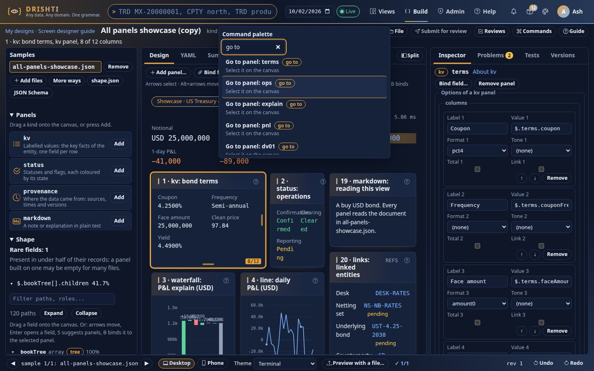

| Type | Does |
|---|---|
| `add` / `Add panel…` | Choose a kind and add it after the selected panel. `Add panel: gauge` adds that kind straight away. |
| `go to panel: terms` | Selects that panel on the canvas and puts the focus on it. |
| `next sample`, `previous sample`, `go to sample: name` | Preview the design with another sample. |
| `run check` | Opens the Tests tab and checks every sample now. |
| `switch to yaml` (or design, summary, inspector, problems, tests, versions) | Shows that tab. |
| `undo`, `redo` | The same as the status bar's buttons. |
| `preview` | Sends what you typed and draws again (Ctrl+Enter). |
| `save`, `propose` | *Save to the registry* or *Propose: submit for review*; the list says when you may not. |
| `compare` | Opens the Versions tab (section 21). |
| `open a file` | The File → Open… chooser. |
| `guide` | This guide (F1 does the same). |

It is the same keyboard menu as *Add panel…*: the filter box is a labelled combobox and the choices a listbox, so a screen reader hears each command as you move, and the status line says what ran. The panels and samples listed are the design's current ones, and *Undo* says when there is nothing to undo.

## 21. Diff and versions

The **Versions** tab (right-hand side, next to Tests) answers *what did I change?* in two ways:

- **against the base**: the live Sutra the design came from (a design made with *edits irs-vanilla@3* has one). You see exactly what a proposal of this design would change.
- **against an earlier version**: every step in the design's log (the last 100) is a version: *Version 0: as it started*, *Version 3: after move, setOption*. Pick one to see what has changed since.

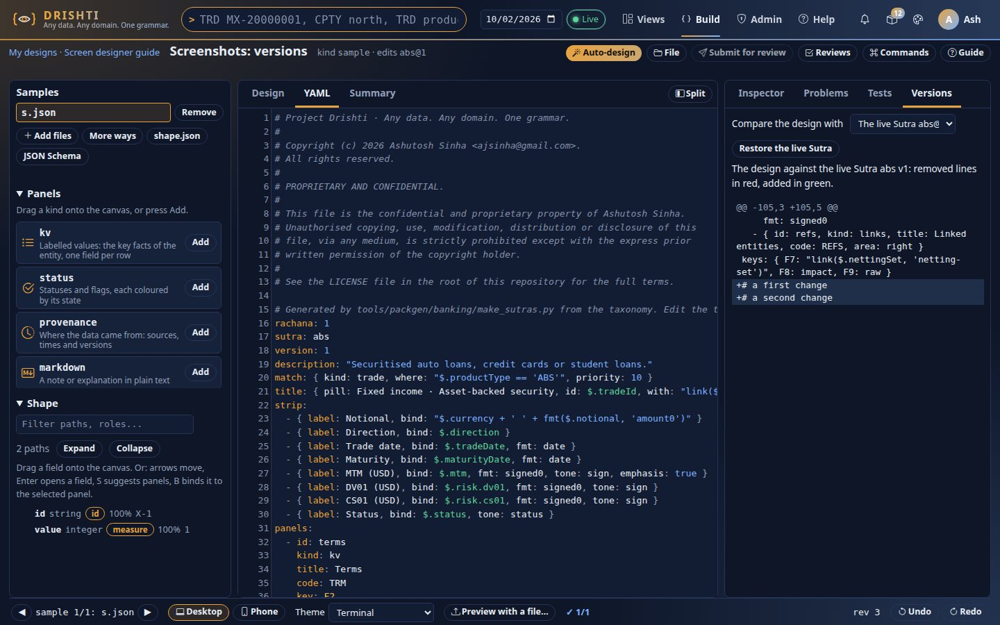

The diff is the one the reviewers see: panels that only **moved** are named in words (so a reordering does not drown the edits), then the line diff, with removed lines in red and added in green. The tab says so when there is no difference.

**Restore** puts the version you picked back **as an operation**: it is a new step in the log, so it is in the revision history, Undo takes it back, and nothing is lost. Restoring the base replaces the design's Sutra with the live one. A design that was not made from a Sutra has no base; its earlier versions are still there.

## 22. Saving and proposing

Designing is open to everyone: the design is yours, kept by the server, and you need no right to make or edit one. **Saving to the registry** is the author right with Studio saving switched on (`DRISHTI_STUDIO_SAVE`), and where governance is on, saving is a **proposal** an approver must approve.

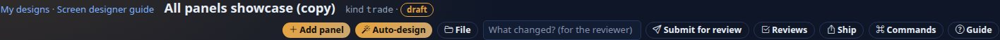

| Your situation | The button says | What it does |
|---|---|---|
| You may not save (no author right, or saving is off on this server) | *Save* (dimmed) | Ctrl+S and the button say *Designing is open to everyone; saving needs the author right*. Nothing is lost: the design is in *My designs*. |
| You may save, no review | *Save* | Writes the design's Sutra to the registry; views use it now. The message names the Sutra and its new version. |
| You may save, review is on | *Submit for review* | Sends a **proposal** with your note (the *What changed?* box is for the reviewer); an approver makes it live, and never you alone when four eyes are on. The message links the review. |

Typed YAML is sent first, so what is saved is what you see. A Sutra the server refuses (a located problem) is answered with the line, and nothing is saved. **Build → Govern → Reviews** lists what is waiting (the menu shows how many) and shows each proposal with the diff; approvers approve or reject there, and authors withdraw their own.

## 23. End to end: from a folder of JSON to a live screen

This is the whole road in one go. It assumes you have the author right and Studio saving is on (`DRISHTI_STUDIO_SAVE=true`); a colleague with the approve right does the last step. Without those, steps 1 to 4 still work and the design waits in *My designs*.

1. **Folder.** *Build → New screen → Choose a folder* (section 1). Drishti reads every `.json` and `.jsonl` in it as samples. Start from **Auto-design** and give the design a name, so it is kept for 90 days.
2. **Design.** The workbench opens on a first screen drawn from your data (sections 2 to 8). Drag a panel from the palette, drop a field onto it, size it on the grid, fill its options in the inspector. Everything is an undoable step.
3. **Check.** The *Tests* tab and the status bar (`✓ 38/40`) run every sample against the design as you type (section 11). Fix the red cells: an *empty* panel is a field some sample does not have; an *error* names the reason. Switch samples with the arrows in the status bar to see why.
4. **Propose.** Type what changed in the box beside the button and press **Submit for review** (Ctrl+S). The server runs the check again, then sends the proposal **with its evidence**: the panel-by-sample matrix, the names of the samples (not their contents), your notes and the design's identity. The status next to the title becomes *proposed P-000042*.

   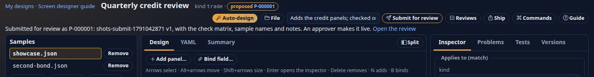

5. **Review.** The approver opens **Build → Govern → Reviews**, then the proposal. Under the diff of the Sutra they see the same matrix you saw, which samples were used (and which were generated from a schema, so are not real data) and your notes. With four eyes on, you cannot approve your own proposal.

   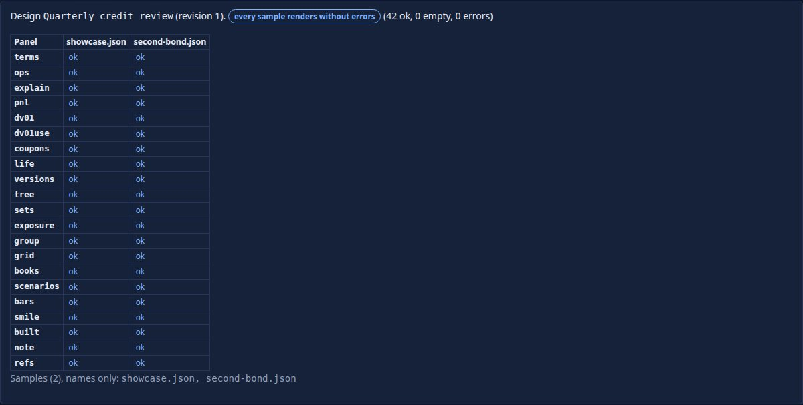

6. **Approve.** *Approve and publish* writes the Sutra to the registry as the next version. Your design's status becomes **live v1** (the version number), on the workbench and on *My designs*. Views of that kind use it from the next request. *Reject* needs a reason, the design returns to *draft*, and the reviewer's comment is on the proposal.

   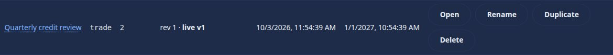

7. **Change it later.** Open the live Sutra in the workbench (*Build → New screen → An existing Sutra*): the new design remembers its **base**, the *Versions* tab (section 21) shows your changes against it, and the next proposal is a new version. If someone else changed the live Sutra meanwhile, the proposal says *stale* and must be made again from the live version.

A design that is edited after it was proposed or approved goes back to *draft*: the status always describes the revision you are looking at.

## 24. Pack fragments: export and import

A design can leave the workbench as a **pack fragment**, a zip you can put in a pack, and a pack (or a folder of Sutras) can come back as designs.

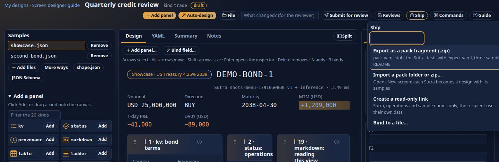

**Export** (*Ship → Export as a pack fragment*) downloads `fragment-<design id>.zip` (the design id is in the address bar, `/build/d/<id>`):

```
my-view/
  pack.yaml                         a stub: the kind, a mnemonic suggestion, an id pattern, the id field of your samples
  sutras/<domain>/my-view.v1.sutra.yaml
  tests/my-view/<sample>.json       every kept sample (up to 20) ...
  tests/my-view/expect.yaml         ... and what `sutra test` checks: noErrors, and the panels that were fine on every sample
  samples/<kind>/<sample>.json      three samples to try the view on
  README.md                         what is in it and how to load it
```

Stored-entity samples are references, not data, so they are not exported; synthetic ones are, and are labelled as such by their names. Put the folder under the server's `packs/`, list it in `DRISHTI_PACKS` (or load it from **Admin → Packs**), and change the stub's title, version and mnemonic first. The exported tests pass `sutra test` unchanged (section 26).

**Import** (*New screen → Or import a pack*) takes a **zip** or a **folder**. Each `*.sutra.yaml` becomes a design of its own, named after the Sutra, with the documents of `tests/<sutra>/` and `samples/<kind>/` as its samples and the README as its notes. A Sutra that does not check yet is imported anyway, with a note, so you can fix it in the workbench. Nothing is loaded into the server; this only makes designs, so it is open to everyone.

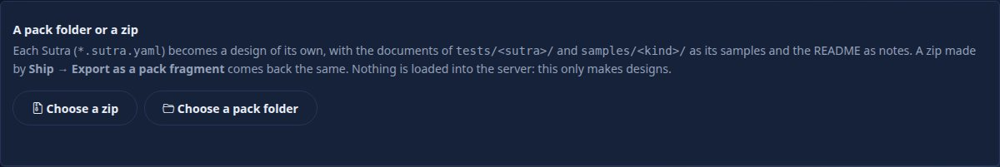

## 25. Sharing a design read-only

For pairing and review without sending files around: *Ship → Create a read-only link*. The link is `/build/d/{id}?share=...`.

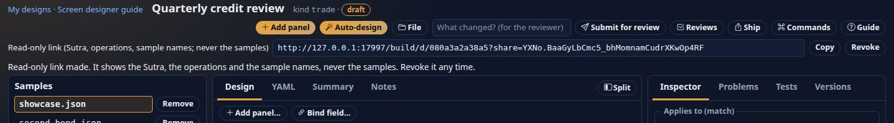

What the person who opens it sees (they must be signed in): the **Sutra**, the **operations** you made (what changed, in order) and the **names** of the samples. They do **not** see your sample contents, your notes, your tests or the other designs. They can **copy the Sutra**, and **preview it against data of their own**: a JSON file from their computer, or a stored entity they are allowed to open (the usual kind rights and field masks apply to them, not to you).

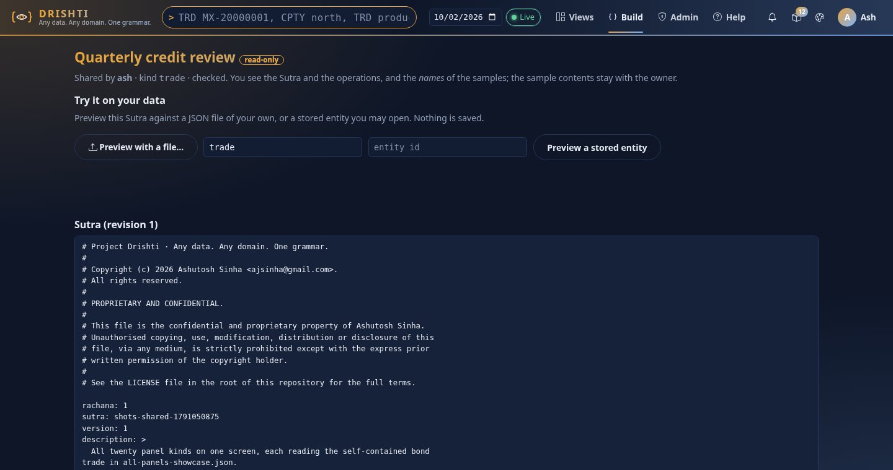

The link is a secret: anyone who has it can read the Sutra and the operations. **Revoke** stops it at once (so does *Renew*, which makes a new one and kills the old). Only a hash of the secret is kept; it cannot be shown again, which is why the box is empty after a reload until you renew it.

## 26. The command line and CI

Pack authors run the same checks without a browser. The server jar has a `sutra` command that starts no web server and opens no port:

```sh
java -jar drishti-server-<version>-exec.jar sutra lint  packs/my-pack
java -jar drishti-server-<version>-exec.jar sutra test  packs/my-pack --junit target/sutra-tests.xml
java -jar drishti-server-<version>-exec.jar sutra preview packs/my-pack --out target/snapshots
java -jar drishti-server-<version>-exec.jar sutra shape  samples/*.json --out target/shape
java -jar drishti-server-<version>-exec.jar sutra design samples/*.json --kind deal --out target/draft
```

`test` uses the **same checker as the Tests tab**, with the `packs/<pack>/tests/<sutra>/*.json` + `expect.yaml` convention that the pack fragment export writes. Exit codes: `0` ok, `1` problems, `2` usage. `--junit` writes JUnit XML for your CI's report step; `--out` writes HTML snapshots. The Maven build of this repository runs `sutra test` over every shipped pack that has tests and over the ten documented examples. All the details and a CI example are in [the Sutra command guide](SUTRA_DEVELOPER_GUIDE.md#15-testing-expectyaml-sutra-linttestpreview-ci).

## 27. Binding a design to a file (development servers)

If you edit Sutras in an IDE and keep them in git, bind the design to a file so the workbench and the IDE work on the same text. This is **off by default**: set `drishti.builder.file-binding: true` on a development server (and `drishti.rachana.studio-save`; you need the author right).

**The dev workflow, and why it cannot bypass review.** Binding works in your own **development folder** (`drishti.builder.dev-dir`, one subfolder per user, outside the Sutra directories the server loads). *Save to file* writes there and **never makes anything live**: the server does not read that folder as Sutras. Going live is always the normal road: *Ship → Propose*, an approver, a new version. So the loop is: edit in the workbench or the IDE, *Save to file* / sync to keep the two in step, check against your samples, and when it is right *Propose* it with its evidence. Copy the approved file into your pack folder in git as you do today; the design is `live(vN)` after approval.

*Ship → Bind to a file…* asks for a path **in your development folder** (the dialog shows its name, never a server path), for example `market/my-view.v1.sutra.yaml`.

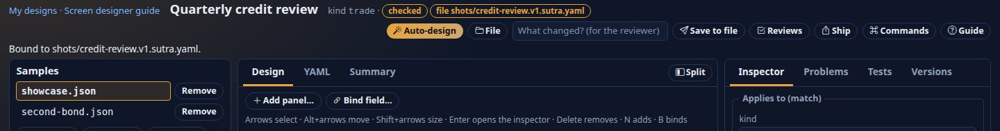

- If the file exists its text becomes the design's Sutra (a step you can undo); if not, the first save creates it.
- **Save** (Ctrl+S) now says *Save to file*: it checks the Sutra and writes the file in your folder. Nothing is proposed and nothing is live.
- **An edit made in the IDE comes back**: the workbench asks the server to read the file every few seconds and when the window gains focus (`POST .../sync`: it changes the design, so it is never a GET), and loads a change as a new step (the message says so; Ctrl+Z brings your version back).
- If **both** sides changed, saving is refused with `409 DRS-5007` rather than overwrite the IDE's file: load the file's version first (or unbind), then redo your change.
- Paths outside your folder (`..`, absolute paths, other extensions, very long names), and any name that is, or goes through, a symbolic link, are refused with a plain message. *Ship → Unbind* ends the binding. On a server without the setting the item is not offered and the API answers `403`.

## 28. Troubleshooting shipping

| You see | Why | What to do |
|---|---|---|
| *Designing is open to everyone; saving needs the author right* | No author right, or `drishti.rachana.studio-save` is off | Ask for the author role; your design is safe in *My designs* |
| *X is already live exactly as proposed* | The live Sutra already has this exact text | Change something, or you are done |
| Proposal says *stale* and cannot be approved | The live Sutra changed after you proposed | Reject it (or withdraw), open the live Sutra as a new design, redo, propose again |
| The review shows *no check was attached* | The design had no samples when it was proposed | Add samples, check, and propose again |
| The evidence says *some samples fail* | A panel is in error on a sample | The reviewer can still decide; better fix it first (section 11) |
| Status stays *proposed* after approval | The design was edited after proposing, so its status is *draft* | Nothing is wrong; the approval is on the proposal |
| *This link is not valid* | Revoked, renewed, mistyped, or the design was deleted or expired | Ask the owner for a new link |
| *binding a design to a file is off on this server* | `drishti.builder.file-binding` is false | Only for development servers; set it there |
| *changed on disk after the design last read it* (409) | Both the design and the file changed | Unbind, or load the file's version (open the design again) and redo your change |
| Import says *no Sutra (*.sutra.yaml) was found* | The zip holds no file named `*.sutra.yaml` | Rename the Sutra files, or zip the pack folder (not a parent of many) |
| `sutra test` exit `2` | An unknown key in `expect.yaml` or a path that does not exist | Fix the key; the message names it |

## 29. Limits of shipping

- One proposal carries the check of the revision you submit; it holds names and counts, never sample contents. The design's notes travel in full; the reviewer note beside the button is 300 characters.
- A fragment exports up to 20 samples as tests and 3 as samples; stored-entity samples are not exported.
- An import takes at most 1000 files and the unpacked size is bounded by `drishti.builder.max-total-mb` (25 MB by default); the quotas of *My designs* (50 designs, 50 samples each) apply to what it creates.
- A share link shows one revision at a time (the current one); it does not show versions, notes or tests, and it cannot be limited to certain people: anyone signed in who has it can read it. Treat it as a secret and revoke it when the review is over.
- File binding is for development servers: one file per design, text only, no merge (a clash is refused, never merged), and only under the configured Sutra directories.
- The command line runs one process per command, without hot reload; Sutras that read other entities need the packs that hold them enabled for the run.

## 30. Keyboard reference for shipping

| Keys | What |
|---|---|
| Ctrl+S | Submit for review / Save / Save to file, whichever the button says |
| Ctrl+K | Command palette: *Ship: export, share or bind…* opens the Ship menu |
| Tab to *Ship*, Enter | Open the Ship menu; type to filter, Up/Down, Enter to choose, Esc to close |
| Tab to *Copy* or *Revoke* | In the link box under the title (it appears once a link exists) |
| Tab through the review table | The reviewer's matrix is an ordinary table with row and column headers |

The shared page has no editing keys: the *Preview with a file…*, *Preview a stored entity* and *Copy the Sutra* controls are real buttons and fields in reading order.

See also: [the Sutra command](SUTRA_DEVELOPER_GUIDE.md#15-testing-expectyaml-sutra-linttestpreview-ci), [Screen Builder design](../architecture/SCREEN_BUILDER.md), [the examples](examples/README.md), [the Rachana reference](RACHANA_REFERENCE.md), [panels in depth](PANEL_KINDS.md).
