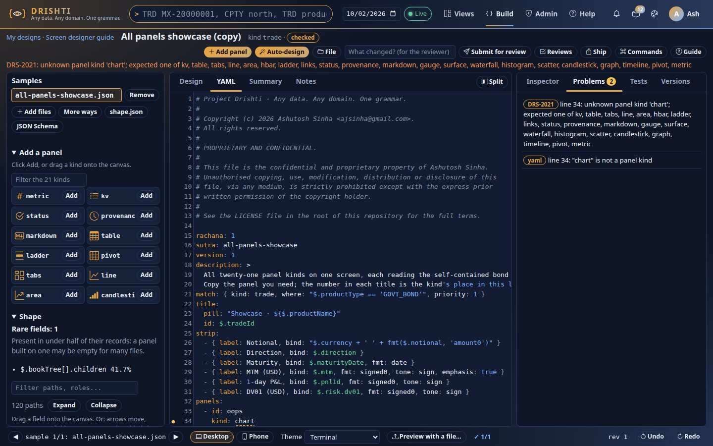
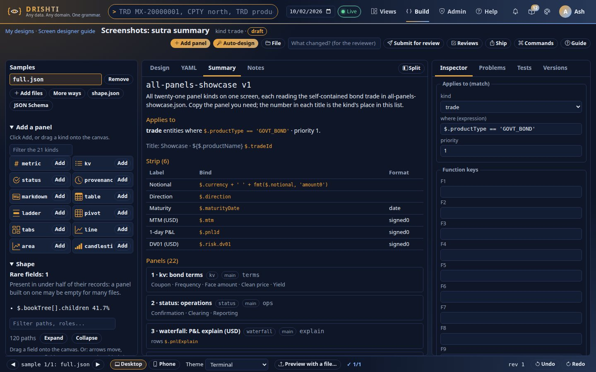
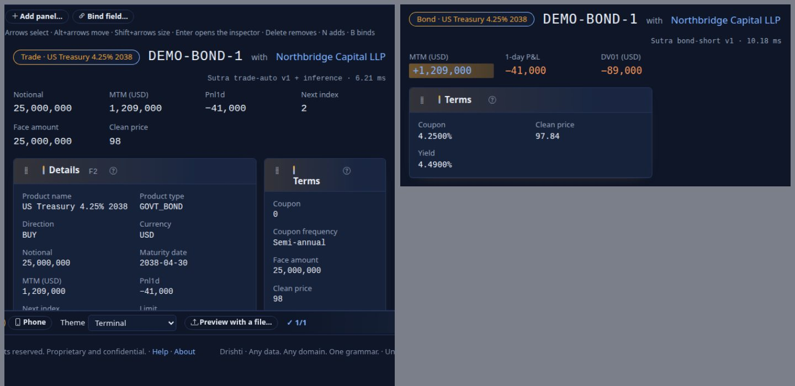
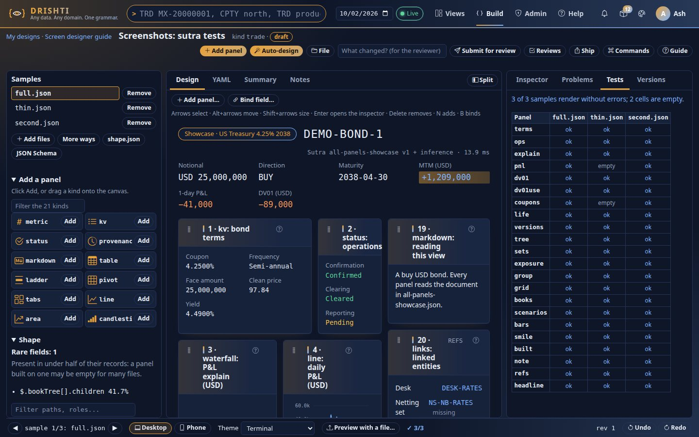
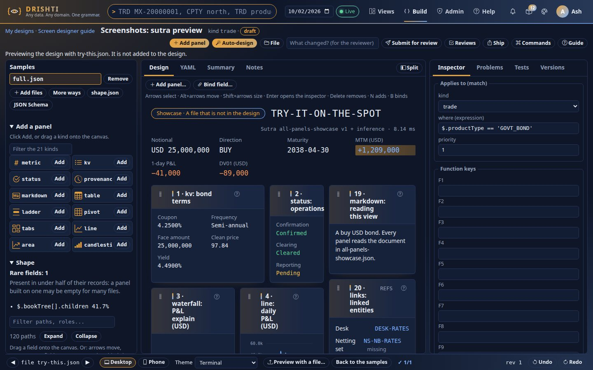

<!--
  Project Drishti · Any data. Any domain. One grammar.

  Copyright (c) 2026 Ashutosh Sinha <ajsinha@gmail.com>.
  All rights reserved.

  PROPRIETARY AND CONFIDENTIAL.

  This file is the confidential and proprietary property of Ashutosh Sinha.
  Unauthorised copying, use, modification, distribution or disclosure of this
  file, via any medium, is strictly prohibited except with the express prior
  written permission of the copyright holder.

  See the LICENSE file in the root of this repository for the full terms.
-->
# Sutra developer guide: writing Sutras, from your first panel to a tested, shipped screen

This guide teaches you to write **Sutras**, the layouts of Drishti's screen grammar Rachana, by doing. You start with a
gene from the genomics pack, write a Sutra one step at a time, preview each step, and finish with a complete trade
view. Then it covers what a working author needs next: how a Sutra is chosen among several, labels and taxonomies,
reading other entities with `source:`, expandable row groups, dates and live data, how inference and a Sutra share a
screen, testing in CI, and the Build workbench. It ends with a checklist and the mistakes everyone makes once, with
their problem codes. Every example on this page parses and validates as written, and every figure was read from the
running sample server.

**What this guide does not repeat.** One place owns each topic and this guide links to it:

| For | Go to |
|---|---|
| every key, option, format, tone, function and problem code | [Rachana reference](RACHANA_REFERENCE.md) |
| each of the 21 panel kinds: when to use it, its options, what it does when empty, masked or live | [Panel kinds](PANEL_KINDS.md) |
| the Build workbench: canvas, inspector, YAML tab, tests, proposing | [Screen designer](SCREEN_DESIGNER.md) |
| what Drishti does with no Sutra, and how inference fills a Sutra's gaps | [Inference](../architecture/INFERENCE.md) |
| how a view keeps itself up to date | [Live updates](../architecture/LIVE.md) |
| adding a new panel kind | [Panel developer guide](PANEL_DEVELOPER_GUIDE.md) |
| shipping Sutras in a pack | [Pack developer guide](PACK_DEVELOPER_GUIDE.md) |

Ten small working Sutras, each with a self-contained JSON document and a note, are in [examples](examples/README.md):
together they use all 21 panel kinds, nested pivot groups and tree rows. In the workbench every example opens as
**your own copy** (Build → New screen → Examples), and **File → Open** loads any `.yaml` or `.json` of your own.

**What you need**

- the server on `http://localhost:18480` and the console on `http://localhost:17480` (see
  [GETTING_STARTED.md](GETTING_STARTED.md)), started with the banking packs and the genomics pack, for example
  `DRISHTI_PACKS=market-risk,counterparty-risk,liquidity-risk,climate-risk,operational-risk,retail-banking,genomics,politics-society,economics`
  (a pack's parents load with it, so this brings `banking-core`, `market-data` and `trading` too);
- `curl` and `python3` for the read-only checks;
- a browser for the Build workbench (**Build → New screen**).

The `curl` commands assume security is off. With security on, add `-H "Authorization: Bearer <token>"`.

**Contents**

1. [What a Sutra is, and when one applies](#1-what-a-sutra-is-and-when-one-applies)
2. [Your first Sutra: a gene](#2-your-first-sutra-a-gene)
3. [Rachana-EL step by step](#3-rachana-el-step-by-step): paths, filters, functions, formats and tones
4. [A trade view, built step by step](#4-a-trade-view-built-step-by-step)
5. [Matching several Sutras](#5-matching-several-sutras): `match`, `where`, `priority`, and how one is chosen
6. [Saving: the workbench and governance](#6-saving-the-workbench-and-governance)
7. [How packs ship Sutras](#7-how-packs-ship-sutras)
8. [Things to know before you write many Sutras](#8-things-to-know-before-you-write-many-sutras): labels and taxonomies
9. [Common mistakes and their messages](#9-common-mistakes-and-their-messages)
10. [The panel kinds](#10-the-panel-kinds): links into the catalogue
11. [Reading other entities: `source:`](#11-reading-other-entities-source)
12. [Expandable row groups: pivot `by` lists and tree tables](#12-expandable-row-groups-pivot-by-lists-and-tree-tables)
13. [Dates, live data and imperfect data](#13-dates-live-data-and-imperfect-data)
14. [Sutra and inference together](#14-sutra-and-inference-together)
15. [Testing: `expect.yaml`, `sutra lint|test|preview`, CI](#15-testing-expectyaml-sutra-linttestpreview-ci)
16. [The Build workbench](#16-the-build-workbench)
17. [Checklist](#17-checklist)


## 1. What a Sutra is, and when one applies

A **Sutra** is one YAML file, `<name>.v<N>.sutra.yaml`, that holds one layout: which panels to draw, in which
order, bound to which parts of a JSON document. Its first key is always `rachana: 1`, the version of the Rachana
language it is written in. It says nothing about pixels or code. One Sutra lays out a whole *family* of entities,
for example every gene, or every fixed/float swap.

Because a Sutra is ordinary YAML, ordinary YAML tools work on it: any editor that reads JSON Schema can complete and
check it against the schema the server publishes (`GET /api/v1/rachana/schema`, see
[Editing outside the workbench](#editing-outside-the-workbench)), and linters and diff tools need nothing special.

When you open an entity (`GENE GENE-BRCA1 <GO>` in the terminal), Drishti:

1. fetches its document;
2. looks for a Sutra whose `match.kind` is the entity's kind and whose `where` condition holds, highest
   `priority` first;
3. if it finds one, lays out the view by it, and lets **inference** fill only what it leaves out; if it finds
   none, lays out the whole view by inference (from the shape of the data; see [INFERENCE.md](../architecture/INFERENCE.md)).

The bottom panel of every view, *How this view was built*, tells you which case applied. So does the API:

```bash
curl -s http://localhost:18480/api/v1/views/gene/GENE-BRCA1 | python3 -c "import json,sys; print(json.load(sys.stdin)['provenance']['layout'])"
```

You should see `Sutra gene v1 + inference`: the genomics pack's Sutra `gene`, version 1, completed by inference
(its *Identifiers* panel lists no fields, so inference supplies them, and its *Linked entities* are always found
at view time).

You write a Sutra when inference is not good enough: when the identifier, the headline figures, the formats or
the choice of chart should be what a person who knows the domain would choose.

### Anatomy at a glance

A whole Sutra, with every part it can have. Sections 2 and 4 build each part up; this is the map to come back to.

```yaml
rachana: 1                           # the language version, always first
sutra: irs-fixfloat                  # name: lower-case kebab
version: 1
description: Exchanges fixed for floating RFR-compounded payments.
match: { kind: trade, where: "$.productType == 'IRS_FIXFLOAT'", priority: 10 }
title: { pill: "Rates · Interest rate swap (fixed/float)", id: $.tradeId,
         with: "link($.counterparty.id, 'counterparty', $.counterparty.name)" }
strip: [ ... up to eight header figures ... ]
panels: [ ... the panels, in reading order ... ]
keys: { F7: "link($.nettingSet, 'netting-set')", F8: impact, F9: raw }
```

| Part | What it does |
|---|---|
| `rachana` | The Rachana language version: `1`. Without it, or with one this server does not read, the file is refused (`DRS-2009`). |
| `sutra`, `version` | The identity, `name@version`, unique. Keep old versions: saved views and history reproduce with the version they used. |
| `description`, `notes` | Plain text for people (not Markdown): one paragraph, and longer notes for the next author and the reviewer. Never change the view. |
| `match` | Which documents this Sutra lays out: a `kind`, an optional `where` over the document, and a `priority` ([section 5](#5-matching-several-sutras)). |
| `title` | The title line: a `pill`, the identifier (`id`), and `with` (usually the counterparty, as a link). |
| `strip` | The header figures, at most eight. `emphasis: true` highlights the one the desk watches. |
| `panels` | The body. Each has an `id`, a `kind` and the options of that kind; `area: right` puts one in the side column. |
| `keys` | Function keys: `F2`-`F12` go to panels (a panel's own `key:`), links (`link(...)`), `impact` (F8) or `raw` (F9). |

A Sutra lives in `sutras/<domain>/<name>.v<N>.sutra.yaml`, in a pack or a site directory. Problems report the file's own
line and column. Every key and its default is in the [reference](RACHANA_REFERENCE.md#top-level).

## 2. Your first Sutra: a gene

### Step 1: look at the data

Always start from the document itself:

```bash
curl -s http://localhost:18480/api/v1/entities/gene/GENE-BRCA1/raw | python3 -m json.tool
```

You should see the provenance and, under `data` (expression shortened):

```json
{
  "geneId": "GENE-BRCA1",
  "symbol": "BRCA1",
  "name": "BRCA1 DNA repair associated",
  "location": "chr17:43,044,295-43,125,483",
  "chromosome": "17",
  "start": 43044295,
  "end": 43125483,
  "length": 81189,
  "strand": "-",
  "transcripts": 38,
  "expression": [
    { "tissue": "Brain", "tpm": 14.34 },
    { "tissue": "Lung", "tpm": 2.64 },
    …
    { "tissue": "Pancreas", "tpm": 15.39 }
  ],
  "variants": [
    { "id": "VRNT-BRCA1-185DELAG", "protein": "p.Glu23fs", "significance": "Pathogenic" }
  ],
  "identifiers": { "assembly": "GRCh38.p14", "hgncSymbol": "BRCA1", "uniprot": "P38398", "biotype": "protein coding" },
  "protein": "PROT-P38398",
  "pathway": "PWY-HR"
}
```

Read it the way a Sutra will: `$` is this whole document, `$.symbol` is `BRCA1`, `$.identifiers.uniprot` is
`P38398`, `$.expression` is a list of eight objects, and `$.expression[0].tissue` is `Brain`.

### Step 2: the smallest Sutra that works

A Sutra needs four things: the language version (`rachana: 1`), a name (`sutra:`), a version, and a `match`
with a `kind`. Here is the smallest useful one, with a single panel:

```yaml
rachana: 1
sutra: gene-mine
version: 1
match: { kind: gene, priority: 20 }
panels:
  - id: basics
    kind: kv
    title: Basics
    columns:
      - { label: Symbol, bind: $.symbol }
      - { label: Location, bind: $.location }
```

- `rachana: 1` comes first in every Sutra. It names the version of the language, so that a later version of
  Rachana can change the grammar without misreading today's files. Leave it out and you get
  `DRS-2009 missing 'rachana: 1' (the Rachana language version) at the top`.
- `sutra: gene-mine` is the name: lower-case letters, digits and hyphens, starting with a letter.
- `version: 1` is a plain integer. Later you publish `version: 2` and keep version 1 on disk.
- `match: { kind: gene, priority: 20 }` applies it to every gene, ahead of the pack's `gene` Sutra (priority 10).
- `kind: kv` is a label/value grid; each column's `bind` says where its value comes from.

### Step 3: preview it in the workbench

1. Open **Build → New screen**, bring `GENE-BRCA1` as a stored entity (kind `gene`, id `GENE-BRCA1`: see
   [SCREEN_DESIGNER §1](SCREEN_DESIGNER.md#1-start-bring-data)) and choose *an empty Sutra* as the start. The workbench
   opens with that gene as its sample.
2. Open the **YAML** tab and replace its text with the YAML above.
3. Press **Ctrl+Enter**.

You should see, in the **Design** tab, a view titled `GENE-BRCA1` with one panel, *Basics*, showing
`Symbol BRCA1` and `Location chr17:43,044,295-43,125,483`. Nothing has been saved: a preview always uses the text in
the editor, whatever its `match` says, and writes no file.



If the text has a problem, the **Problems** tab lists each one with its code, line and reason, for example
`DRS-2010 line 7: missing 'kind'`; click one to jump to the line, and the design keeps its last good Sutra. The
[mistakes section](#9-common-mistakes-and-their-messages) lists the usual ones.


### Step 4: a title

The title line is `[pill] ID with <something>`. Without a `title:`, the identifier is `$.id` and, when the document
has no `id`, the entity's own id. Make it explicit:

```yaml
title: { pill: "Gene · ${$.symbol}", id: $.geneId }
```

`pill` is a **template**: text in which `${…}` is replaced by the value of an expression. You should see the
title `[Gene · BRCA1] GENE-BRCA1`.

### Step 4b: say what it is for: `description` and `notes`

A Sutra carries its own explanation in two optional plain-text keys, so the file is the whole story and nothing
else needs to be kept in step with it:

```yaml
description: Genes for the research desk.
notes: |
  Where the gene is, where it is expressed, and its known variants.
  Priority 20 puts it ahead of the genomics pack's own gene Sutra (priority 10).
```

- `description` is one paragraph: what the layout shows and for which entities. The workbench and the catalogue show it, and so does
  the *About this page* drawer on every view this Sutra draws (it is shown as written, never evaluated). Text that has to change
  with the entity, such as "VAR-EQD is 70% of its limit", is written in the pack's `config/about.yaml`, not here
  ([About text and glossary](PACK_DEVELOPER_GUIDE.md#about-text-and-glossary)).
- `notes` is longer text for the next author and for reviewers: why the panels are in this order, what was
  tried and dropped. Write it as a YAML block (`notes: |` and the lines indented under it); the line breaks are
  kept. It is plain text, not Markdown.
- A panel can have its own `description` too (`- { id: basics, kind: kv, description: The gene at a glance, … }`)
  to say what that one panel is for.

None of these change the view. They must be text: `notes: 3` is `DRS-2012 'notes' is plain text`.

### Step 5: a strip of headline figures

The strip is the row of up to eight figures under the title:

```yaml
strip:
  - { label: Symbol, bind: $.symbol, emphasis: true }
  - { label: Location, bind: $.location }
  - { label: Length (bp), bind: $.length, fmt: amount0 }
  - { label: Strand, bind: "$.strand == '-' ? 'Reverse' : 'Forward'" }
  - { label: Transcripts, bind: $.transcripts }
```

You should see `Symbol BRCA1` (highlighted), `Location chr17:43,044,295-43,125,483`, `Length (bp) 81,189`,
`Strand Reverse` and `Transcripts 38`.

Three things just happened:

- `fmt: amount0` formatted `81189` with a thousands separator. Formats are named; the core set is `amount0`,
  `amount2`, `signed0`, `signed2`, `pct0`, `pct2`, `price2`, `compact`, `date`, `dmy` and `text`, and the packs add
  more (`pct4`, `bp1`, …).
- `"$.strand == '-' ? 'Reverse' : 'Forward'"` is a Rachana-EL expression: *if the strand is `-`, show `Reverse`,
  otherwise `Forward`*. It is in double quotes for YAML; the text inside the expression uses single quotes.
- `emphasis: true` highlights one figure. Use it once.

### Step 6: key/value panels, written and inferred

Replace *Basics* with two kv panels:

```yaml
  - id: position
    kind: kv
    title: Position on GRCh38
    key: F2
    columns:
      - { label: Chromosome, bind: $.chromosome }
      - { label: Start, bind: $.start, fmt: amount0 }
      - { label: End, bind: $.end, fmt: amount0 }
      - { label: Span, bind: "$.end - $.start + 1", fmt: amount0 }
  - id: identifiers
    kind: kv
    title: Identifiers
    area: right
    rows: $.identifiers
```

You should see *Position on GRCh38* with `Chromosome 17`, `Start 43,044,295`, `End 43,125,483` and
`Span 81,189` (arithmetic works on numbers), and on the right *Identifiers* with `Assembly GRCh38.p14`,
`Hgnc symbol BRCA1`, `Uniprot P38398`, `Biotype protein coding`.

The second panel lists no columns. `rows: $.identifiers` points it at an object, and inference fills in one field
per scalar in that object, labelled from the field names. That is quick, and it picks up new fields when the
source adds them; list columns when you want to choose the labels and the order (*HGNC symbol*, not *Hgnc symbol*).

`key: F2` binds the F2 key to the panel: pressing it scrolls there. `area: right` puts the panel in the side column.
Each column is a grid of 12 columns: `span: 6` would make a panel half as wide, so two such panels share a row, and
`height: 8` would give it a fixed height of 8 rows (it scrolls inside). Both are optional; users may also arrange a view
for themselves in layout mode (`Alt+L`), which never changes the Sutra ([reference](RACHANA_REFERENCE.md#keys-every-panel-takes)).

### Step 7: a table over a nested array, with links

```yaml
  - id: variants
    kind: table
    title: "Known variants (${size($.variants)})"
    key: F3
    rows: $.variants
    columns:
      - { label: Variant, bind: "@.id", link: true }
      - { label: Protein change, bind: "@.protein" }
      - { label: Significance, bind: "@.significance" }
```

Inside a table, `@` is the current row: `@.protein` is the row's `protein`. You should see the title
`Known variants (1)` and one row, `VRNT-BRCA1-185DELAG · p.Glu23fs · Pathogenic`, with the variant id as a link
that opens `VRNT VRNT-BRCA1-185DELAG`.

`link: true` made the id a link: the genomics pack declares that ids starting with `VRNT-` are variants. A column
whose field name ends in `Id`, `Ref` or `_id` (`@.variantId`) would be linked without it; `@.id` is too short a
name for that rule, so it needs `link: true`.

A table can also offer its rows as an interactive pivot. Add one line, `pivot: true`, and the panel gets a
**Table | Pivot** switch: under **Pivot**, a reader drags the table's columns into rows, columns, values and filters,
with totals, a chart and a drill-down to the rows under any cell
([USER_GUIDE.md](USER_GUIDE.md#the-pivot-tab-slice-a-table-your-way)). To choose the fields and how it opens:

```yaml
    pivot:
      fields: [significance, protein, id]      # row paths; they need not be columns
      rows: [significance]
      values: [{ field: id, agg: count }]
```

Without `pivot:` there is no switch: a Sutra decides where a pivot helps
([reference](RACHANA_REFERENCE.md#pivot-a-pivot-tab-on-a-table-or-ladder)).

### Step 8: a chart

Expression by tissue is a label and a number per row, which is what horizontal bars are for:

```yaml
  - id: expression
    kind: hbar
    title: Tissue expression (TPM)
    key: F4
    rows: $.expression
    label: tissue
    value: tpm
    fmt: price2
```

For an `hbar`, `label` and `value` are **field names** of each row (not expressions, so no `@.`). You should see
eight bars, the longest `Colon 45.92`, the shortest `Blood 1.23`.

The key bar shows `F4 Tissue expression`: a panel key is labelled with the first two words of the title, cut at
` (` or ` · `. Write titles whose first words make sense on their own (*Expression by tissue* would read
*Expression by*).

### Step 9: linked entities, provenance and keys

```yaml
  - { id: refs, kind: links, title: Linked entities, code: REFS, area: right }
  - { id: built, kind: provenance, title: How this view was built }
keys: { F7: "link($.protein, 'protein')", F8: impact, F9: raw }
```

- `links` lists every entity the document refers to, found from the packs' reference fields: you should see
  `Protein PROT-P38398` and `Pathway PWY-HR`, both links.
- `provenance` says how the view was built.
- `keys` adds function keys that are not panels: `F7` opens the protein (`link(id, kind)`), `F8` the impact view,
  `F9` the raw JSON. Panel keys and these keys share F1–F12; F1 is the console's help.

### The whole gene Sutra

```yaml
rachana: 1
sutra: gene-mine
version: 1
description: Genes for the research desk.
match: { kind: gene, priority: 20 }
title: { pill: "Gene · ${$.symbol}", id: $.geneId }
strip:
  - { label: Symbol, bind: $.symbol, emphasis: true }
  - { label: Location, bind: $.location }
  - { label: Length (bp), bind: $.length, fmt: amount0 }
  - { label: Strand, bind: "$.strand == '-' ? 'Reverse' : 'Forward'" }
  - { label: Transcripts, bind: $.transcripts }
  - { label: Expressed in, bind: "size($.expression[?@.tpm > 10]) + ' of ' + size($.expression) + ' tissues'" }
panels:
  - id: position
    kind: kv
    title: Position on GRCh38
    key: F2
    columns:
      - { label: Chromosome, bind: $.chromosome }
      - { label: Start, bind: $.start, fmt: amount0 }
      - { label: End, bind: $.end, fmt: amount0 }
      - { label: Span, bind: "$.end - $.start + 1", fmt: amount0 }
  - id: variants
    kind: table
    title: "Known variants (${size($.variants)})"
    key: F3
    rows: $.variants
    columns:
      - { label: Variant, bind: "@.id", link: true }
      - { label: Protein change, bind: "@.protein" }
      - { label: Significance, bind: "@.significance" }
  - { id: built, kind: provenance, title: How this view was built }
  - id: expression
    kind: hbar
    title: Tissue expression (TPM)
    key: F4
    area: right
    rows: $.expression
    label: tissue
    value: tpm
    fmt: price2
  - { id: refs, kind: links, title: Linked entities, code: REFS, area: right }
  - id: identifiers
    kind: kv
    title: Identifiers
    area: right
    rows: $.identifiers
keys: { F7: "link($.protein, 'protein')", F8: impact, F9: raw }
notes: |
  Where the gene is, where it is expressed, and its known variants.
  Priority 20 puts it ahead of the genomics pack's own gene Sutra (priority 10).
```

You should see the strip end with `Expressed in 5 of 8 tissues` (Brain, Liver, Colon, Breast and Pancreas are
above 10 TPM), and the key bar `F2 Position on`, `F3 Known variants`, `F4 Tissue expression`, `F7 Protein`,
`F8 Impact`, `F9 Raw JSON`. Preview it against `GENE-TP53` too (change the id box): the same layout serves every
gene, and you should see `Known variants (1)` with `VRNT-TP53-R175H`.

## 3. Rachana-EL step by step

Every `bind`, `rows`, `where` and `highlight` is a Rachana-EL expression. This section builds them up with
before/after pairs against the swap `MX-20000001` (look at it with
`curl -s http://localhost:18480/api/v1/entities/trade/MX-20000001/raw | python3 -m json.tool`).

### Paths

| You write | You get | Why |
|---|---|---|
| `$.notional` | `242000000` | a field of the document |
| `$.counterparty.name` | `Meridian Reinsurance Ltd` | `.` walks into objects |
| `$.legs[0].label` | `Receive fixed 4.0829%` | `[0]` is the first element |
| `$.legs[-1].label` | `Pay AONIA compounded` | `[-1]` is the last |
| `$.notionl` | *(empty)* | a misspelt field is empty, never an error: check spelling in the preview |
| `$['day-count']` | | a field whose name has a hyphen needs brackets; `$.day-count` would subtract |

### Rows: `@` and `#index`

Inside `rows:`, `each:` or a filter, `@` is the current element and `#index` its position (from 0).

| Before | After |
|---|---|
| `bind: $.schedule[0].amount` — always the first row | `bind: "@.amount"` — each row's own amount |
| `highlight: "#index == 0"` — the first row lit | `highlight: "#index == $.nextIndex"` — the row the document says is next |
| `tabTitle: "'Leg ' + #index"` — `Leg 0`, `Leg 1` | `tabTitle: "'Leg ' + (#index + 1)"` — `Leg 1`, `Leg 2` |

### Filters

`[?condition]` keeps the elements of a list for which the condition holds, with `@` set to each.

| Expression | Result for `MX-20000001` |
|---|---|
| `size($.schedule)` | `35` |
| `size($.schedule[?@.status != 'Settled'])` | `29` |
| `size($.schedule[?@.leg == 1])` | the fixed leg's flows |
| `first($.legs[?@.payer]).label` | `Pay AONIA compounded` |

A filter gives a list, so `$.legs[?@.payer].label` is empty; take an element first (`first(...)`, `[0]`).

### Functions

| Before | After | Shows |
|---|---|---|
| `bind: $.notional, fmt: amount0` | `bind: "$.currency + ' ' + fmt($.notional, 'amount0')"` | `AUD 242,000,000` |
| `bind: $.risk.dv01` | `bind: "abs($.risk.dv01)", fmt: amount0` | `155,245` |
| `bind: "$.terms.spread"` (missing: empty) | `bind: "coalesce($.terms.spread, 0)", fmt: bp1` | `0.0 bp` |
| `bind: "$.legs[0].pv + $.legs[1].pv", fmt: signed0` | `bind: "sum($.legs, 'pv')", fmt: signed0` | `+1,875,863` |
| `where: "$.status == 'live'"` (never true: case matters) | `where: "lower($.status) == 'live'"` | matches `Live` |
| `where: "$.productName == 'swap'"` | `where: "contains($.productName, 'swap')"` | `contains` and `startsWith` ignore case |

The whole set is `link`, `size`, `sum`, `fmt`, `coalesce`, `first`, `last`, `abs`, `min`, `max`, `upper`, `lower`,
`contains` and `startsWith`; there is no other function. See the
[reference](RACHANA_REFERENCE.md#functions) for each.

### Formats and tones

`fmt:` decides how a value reads; `tone:` decides its colour.

| Value | `fmt` | `tone` | Shows |
|---|---|---|---|
| `1875863` | none | none | `1875863` |
| `1875863` | `amount0` | none | `1,875,863` |
| `1875863` | `signed0` | `sign` | `+1,875,863`, positive colour |
| `-155245` | `signed0` | `sign` | `−155,245`, negative colour (a true minus sign) |
| `0.040829` | `pct4` | | `4.0829%` |
| `0.83` | `pct0` | | `83%` |
| `46000000` | `compact` | | `46.0m` |
| `Confirmed` | | `status` | `Confirmed`, `ok` colour |
| `Pending` | | `status` | `Pending`, `warn` colour |

`tone: status` reads the words: *fail*, *reject*, *dispute*, *breach* are bad; *pending*, *unmatched*, *warn* are a
warning; anything else is fine. So it suits confirmation and settlement statuses, but not every status: a variant's
`Pathogenic` would show in the *fine* colour. Leave such fields untoned.

### Conditions

Conditions combine with `&&`, `||` and `!`, and choose with `? :`:

```yaml
where: "$.productType == 'IRS_FIXFLOAT' && $.status != 'Matured'"
bind: "@.payer ? 'Pay' : 'Receive'"
bind: "@.type == 'FIXED' ? fmt(@.rate, 'pct4') : @.index + ' + ' + fmt(@.spread, 'pct4')"
```

Two traps:

- `<`, `>`, `<=`, `>=` compare **numbers** only. `@.payDate > '2026-09-30'` is always false, because text that is not
  a number cannot be ordered. Compare dates with `==`, or use a field the data provides (`$.nextIndex`, a status).
- `||` gives `true` or `false`, not a value: `$.nick || 'n/a'` shows `true`. For a default, use `coalesce($.nick, 'n/a')`.

## 4. A trade view, built step by step

Now a bigger layout: the swap `MX-20000001`. Open the
workbench on it (Build → New screen, the stored entity `trade` `MX-20000001`, an empty Sutra: see
[Step 3](#step-3-preview-it-in-the-workbench)) and grow the Sutra one block at a time in the YAML tab, previewing each.

### 4.1 Identity, title and strip

```yaml
rachana: 1
sutra: swap-desk
version: 1
description: Fixed/float swaps for the rates desk.
match:
  kind: trade
  where: "$.productType == 'IRS_FIXFLOAT'"
  priority: 20
title:
  pill: "${$.assetClass} · ${$.productName}"
  id: $.tradeId
  with: "link($.counterparty.id, 'counterparty', $.counterparty.name)"
strip:
  - { label: Notional, bind: "$.currency + ' ' + fmt($.notional, 'amount0')" }
  - { label: Direction, bind: $.direction }
  - { label: Maturity, bind: $.maturityDate, fmt: date }
  - { label: MTM (USD), bind: $.mtm, fmt: signed0, tone: sign, emphasis: true }
  - { label: 1-day P&L, bind: $.pnl1d, fmt: signed0, tone: sign }
  - { label: DV01 (USD), bind: $.risk.dv01, fmt: signed0, tone: sign }
  - { label: Status, bind: $.status, tone: status }
  - { label: Book, bind: "link($.book, 'book')" }
panels: []
```

You should see `[Rates · Interest rate swap (fixed/float)] MX-20000001 with Meridian Reinsurance Ltd` and the strip
`Notional AUD 242,000,000 · Direction Receive fixed · Maturity 2032-06-25 · MTM (USD) +1,875,863 · 1-day P&L +126,986 ·
DV01 (USD) −155,245 · Status Live · Book BOOK-RATES-3`. `with` and `Book` are links. `panels: []` is valid: a Sutra
may have no panels.

### 4.2 Terms, and legs as tabs

Replace `panels: []` with:

```yaml
panels:
  - id: terms
    kind: kv
    title: Terms
    code: TRM
    key: F2
    columns:
      - { label: Fixed rate, bind: $.terms.fixedRate, fmt: pct4 }
      - { label: Pay frequency, bind: $.terms.payFrequency }
      - { label: Day count, bind: $.terms.dayCount }
      - { label: Effective, bind: $.effectiveDate, fmt: date }
      - { label: Discount curve, bind: "link($.discountCurve, 'ir-curve')" }
  - id: legs
    kind: tabs
    title: Legs
    key: F3
    each: $.legs
    layout: columns
    tabTitle: "'Leg ' + @.leg + ' · ' + @.label"
    body:
      kind: kv
      columns:
        - { label: Pay or receive, bind: "@.payer ? 'Pay' : 'Receive'" }
        - { label: Rate, bind: "@.type == 'FIXED' ? fmt(@.rate, 'pct4') : @.index + ' + ' + fmt(@.spread, 'pct4')" }
        - { label: Day count, bind: "@.dayCount" }
        - { label: PV, bind: "@.pv", fmt: signed0, tone: sign }
```

You should see *Terms* (`Fixed rate 4.0829%`, `Day count ACT/365F`, the curve as a link) and two boxes side by side,
`Leg 1 · Receive fixed 4.0829%` (`Rate 4.0829%`, `PV +52,387,405`) and `Leg 2 · Pay AONIA compounded`
(`Rate AONIA + 0.0000%`, `PV −50,511,542`). With `layout: tabs` (the default) they would be tabs instead. The
`body` is a panel without an `id`; only its columns are used, and it must be a `kv`.

### 4.3 Cashflows with totals and "more"

```yaml
  - id: cashflows
    kind: table
    title: "Cashflows · ${$.legs[0].label}"
    key: F4
    rows: $.legs[0].cashflows
    limit: 5
    moreLabel: "(size($.legs[0].cashflows) - 5) + ' later cashflows'"
    totalLabel: Total
    columns:
      - { label: "#", bind: "@.n" }
      - { label: Pay date, bind: "@.payDate", fmt: date }
      - { label: Amount, bind: "@.amount", fmt: signed2, tone: sign, total: true }
      - { label: DF, bind: "@.df", fmt: df4 }
      - { label: PV, bind: "@.pv", fmt: signed2, tone: sign, total: true }
      - { label: Status, bind: "@.status", tone: status }
```

You should see five of the seven fixed cashflows, a total row `Total · +68,325,150.22 · … · +52,387,404.92` (the
totals cover all seven rows, not just the five shown; the label sits in the column just before the first total),
and `2 later cashflows` under the table. Numeric columns (those with a format other than `date`) are right-aligned.

### 4.4 A ladder that lights the next payment

```yaml
  - id: schedule
    kind: ladder
    title: Payment schedule
    code: CF
    rows: $.schedule
    highlight: "#index == $.nextIndex"
    columns:
      - { label: Pay date, bind: "@.payDate", fmt: date }
      - { label: Leg, bind: "@.leg == 1 ? 'Fixed' : 'Float'" }
      - { label: Amount, bind: "@.amount", fmt: signed0, tone: sign }
      - { label: PV, bind: "@.pv", fmt: signed0, tone: sign, total: true }
```

You should see all 35 flows with the seventh (`2026-12-30`, Float, `−2,253,620`) highlighted, and a total PV of
`+1,875,863`. A ladder always shows every row (it takes no `limit`); use a table when you need to cut.

### 4.5 Charts: the trade's own data and another entity's

```yaml
  - id: pnl
    kind: line
    title: Daily P&L (USD)
    area: right
    rows: $.pnlHistory
    x: date
    y: pnl
    fmt: signed0
  - id: curve
    kind: line
    title: Discount curve
    code: CRV
    key: F5
    area: right
    source: "link($.discountCurve, 'ir-curve')"
    rows: $.points
    x: tenor
    y: zeroRate
    mark: "'5Y'"
    fmt: price2
    unit: "%"
  - id: dv01
    kind: hbar
    title: DV01 by bucket (USD)
    code: SENS
    area: right
    rows: $.sensitivities
    label: bucket
    value: dv01
    fmt: signed0
    tone: sign
```

You should see on the right: twenty days of P&L ending `2026-09-30`; the AUD OIS curve from `1M` to `30Y` with the
`5Y` point marked and `5Y point 4.03%` under it, beside a `CRV-AUD-OIS` link; and seven DV01 bars from `3M −5,544` to
`7Y −38,811`.

`source:` is what makes the second chart special: Drishti fetches the curve entity (with the same business date),
and inside that panel `$` is the **curve's** document, so `rows: $.points` reads the curve's points. `mark` is
evaluated against the trade.

### 4.6 Operations, a gauge, links and keys

```yaml
  - id: operations
    kind: status
    title: Confirmation and clearing
    code: OPS
    fields:
      - { label: Confirmation, bind: $.confirmation.status, tone: status }
      - { label: Platform, bind: "$.confirmation.method + ' · ' + $.confirmation.platformId" }
      - { label: Clearing, bind: "$.clearing.status + ' at ' + $.clearing.ccp", tone: status }
      - { label: Reporting, bind: $.regulatory.reportingStatus, tone: status }
  - { id: built, kind: provenance, title: How this view was built }
  - id: dv01use
    kind: gauge
    title: DV01 used of the 250k guideline
    area: right
    value: "abs($.risk.dv01)"
    max: "250000"
  - { id: refs, kind: links, title: Linked entities, code: REFS, area: right }
keys:
  F7: "link($.nettingSet, 'netting-set')"
  F8: impact
  F9: raw
```

You should see `Confirmation Confirmed`, `Clearing Cleared at LCH SwapClear` and `Reporting Accepted` in the *fine*
colour; a gauge 62% full reading `62%` (the gauge formats value ÷ max, with `pct0` unless you say otherwise); the
linked counterparty (badge `A`), netting set (badge `PFE 46.0m`), book, trader, desk and more; and the key bar
`F2 Terms`, `F3 Legs`, `F4 Cashflows`, `F5 Discount curve`, `F7 Netting set`, `F8 Impact`, `F9 Raw JSON`.

### 4.7 How the P&L moved, and what happened to the trade

Two more questions a trader asks of a trade: *why did the MTM move today*, and *what has happened to it so far*.
The trade's `pnlExplain` lists yesterday's MTM and today's moves by risk factor; `lifecycle.timeline` lists dated
events. A `waterfall` and a `timeline` answer them:

```yaml
  - id: explain
    kind: waterfall
    title: "P&L explain (USD, opening to closing MTM)"
    code: PNLX
    key: F6
    rows: $.pnlExplain          # [{step: Opening MTM, pnl: 1748877, total: true}, {step: Carry, pnl: -11426}, …]
    label: step
    value: pnl
    sum: Closing MTM
    fmt: signed0
  - { id: lifecycle, kind: timeline, title: Lifecycle, code: LIFE, rows: $.lifecycle.timeline, detail: description }
```

You should see eight bars: *Opening MTM +1,748,877* as a full bar, seven floating steps (*Carry −11,426* down,
*Rates delta +132,686* up, …) and *Closing MTM +1,875,863*, which the server adds because of `sum:` and which equals
the strip's MTM. Under it, seven events from *Booked* (2025-07-25) to *Maturity* (2032-06-25), *Next payment* in
amber because its status is *Pending*.

`label`, `value` and `detail` are field names of each row, as for `hbar`. The server does the arithmetic (the running
total, the closing bar, the sort by date), so the console only draws. Five more kinds work the same way:
`histogram` (a VaR scenario vector with VaR and ES lines), `scatter` (books' VaR against P&L), `candlestick` (daily
bars), `graph` (a counterparty's group, agreement and netting sets) and `pivot` (MTM by book and currency, with
totals). [Section 10](#10-the-panel-kinds) links to the entry of each of the 21 kinds in [PANEL_KINDS.md](PANEL_KINDS.md), which
explains every kind: its options, what the server computes and what it does when empty, masked or live.

Put the blocks of 4.2 to 4.7 together under one `panels:` and you have a complete trade view. The
[reference's annotated example](RACHANA_REFERENCE.md#a-complete-example-annotated) is the same layout with every line
commented, and the trading pack's `packs/trading/sutras/rates/irs-fixfloat.v1.sutra.yaml` is the one the server uses.

## 5. Matching several Sutras

Many Sutras can apply to one kind. The engine takes the latest version of each Sutra of that kind, tries them by
`priority` (highest first, then by name), and uses the first whose `where` holds.

### Specific before general

There is no automatic "most specific wins": a longer `where` does not win by itself. Give the special case a
higher priority:

```yaml
# irs-matured.v1.sutra.yaml: matured swaps get a short layout
match: { kind: trade, where: "$.productType == 'IRS_FIXFLOAT' && $.status == 'Matured'", priority: 30 }

# swap-desk.v1.sutra.yaml: every other fixed/float swap
match: { kind: trade, where: "$.productType == 'IRS_FIXFLOAT'", priority: 20 }

# trade-fallback.v1.sutra.yaml: any trade at all
match: { kind: trade, priority: 0 }
```

`MX-20000001` is `Live`, so `irs-matured` does not hold; `swap-desk` does. A trade of another product falls to
`trade-fallback` (no `where` always holds). Without a fallback, it falls to the product's own pack Sutra if one
matches, and to inference otherwise.

Good conditions are cheap and read stable fields: the product type, an asset class, a flag. They run for every
view and on every live tick.

### Checking which Sutra applies

```bash
curl -s http://localhost:18480/api/v1/sutras | python3 -c "
import json, sys
for s in json.load(sys.stdin):
    if s['kind'] == 'gene': print(s['priority'], s['name'], s['where'])"
```

You should see `10 gene None`: one Sutra for genes, applying to all of them. After you save `gene-mine` with priority
20, it appears above, and every gene's *How this view was built* says `Sutra gene-mine v1`.

### How one Sutra is chosen, worked through

The three Sutras above, tried against four trades (the rule is the matcher's: the latest version of each Sutra of that
kind, highest `priority` first, equal priorities in name order, the first whose `where` is true; the
[reference](RACHANA_REFERENCE.md#matching-choosing-a-sutra-for-a-document) states it in full):

| Document | `irs-matured` (30) | `swap-desk` (20) | `trade-fallback` (0) | Chosen |
|---|---|---|---|---|
| `IRS_FIXFLOAT`, `Live` | `where` false | `where` true | not reached | `swap-desk` |
| `IRS_FIXFLOAT`, `Matured` | `where` true | not reached | not reached | `irs-matured` |
| `FX_OPTION` | false | false | no `where`: true | `trade-fallback` |
| a `trade` with no `productType` | false (the missing field compares false, never an error) | false | true | `trade-fallback` |

Two habits keep this predictable. Give every kind a catch-all with a low priority, so a document with an unexpected
shape still gets a layout you chose rather than a purely inferred one. And read the winner off the screen: the last
panel of every view, *How this view was built*, names it (`Sutra swap-desk v1 + inference`).



In the workbench the **Summary** tab states what the Sutra *applies to* (kind, `where`, priority) before you save it.
A preview ignores `match`, so to see a Sutra win against its siblings, publish it (or have it approved) and open
entities in the terminal, or read `GET /api/v1/sutras` as above.


### Versions

`name@version` identifies a Sutra. To change a published Sutra, publish the next version
(`swap-desk.v2.sutra.yaml` with `version: 2`); keep version 1 on disk. Matching uses only the **latest** version of
each name; the older one stays readable (`GET /api/v1/sutras/swap-desk/1/source`), so you can compare or roll back
by removing version 2. Two files may not define the same `name@version` (`DRS-2028`).

## 6. Saving: the workbench and governance

Designing is open to everyone; **saving to the registry** is the author right with studio saving on
(`drishti.rachana.studio-save: true`), and with governance on a save is a **proposal**. On this sample server both
are on:

```bash
curl -s http://localhost:18480/api/v1/studio/settings
```

You should see `{"save":true,"review":true,"approve":true}` (`approve` is whether *you* may approve).

1. In the workbench, type a note for the reviewer (*What changed?*) and press **Submit for review** (or **Ctrl+S**).
   The Sutra is checked as it stands; if it has problems they are listed and nothing is submitted. Otherwise the
   status line says `Submitted gene-mine v1 for review as <id>`. What the button says in each situation is in
   [SCREEN_DESIGNER §22](SCREEN_DESIGNER.md#22-saving-and-proposing).
2. An approver opens **Build → Govern → Reviews** (`/build/reviews`), sees the proposal with a diff against the live
   version (empty for a new Sutra), and approves or rejects it (a rejection needs a reason). Panel blocks that only
   changed place are listed as moves (*moved: Legs from position 1 to 2 (main → side)*), with the remaining edits as
   a line diff; **Full line diff** opens the plain diff.
3. With security on and `drishti.governance.four-eyes: true` (the default), the author cannot approve their own
   proposal (`DRS-2007`). If someone changed the live Sutra after you proposed, approval is refused (`DRS-2006`):
   propose again from the live version (the workbench's *base moved* flow does this, SCREEN_DESIGNER §21).
4. On approval the file is written to `<first site Sutra directory>/<domain>/<name>.v<N>.sutra.yaml` (here
   `./sutras/studio/gene-mine.v1.sutra.yaml`, unless the Sutra says `domain:`) and goes live at once.

Every step is recorded in the audit log. With governance off, the button reads **Save** and publishes directly. The
governance rules in full are in the [reference](RACHANA_REFERENCE.md#governance).

You can also skip the workbench: put the file in a Sutra directory (`drishti.rachana.dirs`, `./sutras` by default). The
server notices within a quarter of a second and loads it; an invalid file is reported and, if it had a valid
version before, that version stays live:

```bash
curl -s http://localhost:18480/api/v1/sutras/problems
```

You should see `{}` when everything loaded.

Only files named `*.sutra.yaml` are Sutras. Any other `.yaml` or `.yml` file in a Sutra directory, and any old
Markdown Sutra (`*.sutra.md`, the format before Drishti 1.11), is reported as `DRS-2004` with the fix: rename the
YAML file, or convert the Markdown one, which keeps its comments and turns its prose into `notes:`:

```bash
python3 tools/rachana/md_to_yaml.py sutras/ --delete
```

`--delete` removes each `.sutra.md` once its `.sutra.yaml` is written; leave it out to keep both and compare first
(the `.md` is still reported until you remove it).

### Editing outside the workbench


Any editor that reads JSON Schema can complete and check a Sutra as you type. The server publishes the schema of
the language, with this server's entity kinds and format names filled in:

```bash
curl -s http://localhost:18480/api/v1/rachana/schema | python3 -c "
import json, sys
s = json.load(sys.stdin)
print(s['title']); print(s['required']); print(len(s['properties']['match']['properties']['kind']['enum']), 'kinds')"
```

You should see `Rachana Sutra, language 1`, `['rachana', 'sutra', 'version', 'match']` and the number of kinds the
enabled packs serve. With the YAML extension of VS Code, for example, a first line

```text
# yaml-language-server: $schema=http://localhost:18480/api/v1/rachana/schema
```

gives completion of keys, panel kinds, options, formats and kinds, and marks unknown keys before you save. The
schema is generated from the grammar, so it never disagrees with the parser, but the server's checks (expressions,
duplicate ids and keys) remain the final word: `GET /api/v1/sutras/problems` after you save.

## 7. How packs ship Sutras

A pack is a folder under `packs/` with a `pack.yaml`. Its Sutras live in `sutras/` (or the folder its `sutras:` key
names), one sub-folder per domain:

```text
packs/genomics/
  pack.yaml                         # kinds, mnemonics, id patterns, links, badges, roles
  config/semantics.yaml             # optional: inference hints (roles, acronyms, labels)
  config/formats.yaml               # optional: named formats
  sutras/genomics-and-biology/
    gene.v1.sutra.yaml
    variant.v1.sutra.yaml
    …
  samples/gene/GENE-BRCA1.json      # sample documents for the demo source
```

- A pack's Sutras load when the pack is enabled (`drishti.packs.enabled`, env `DRISHTI_PACKS`), alongside the site's.
- A pack that `extends:` another may redefine one of its parent's Sutras with the same `name@version`; the more
  specific pack wins. A site file with the same `name@version` as a pack's keeps the site's and reports the pack's as
  `DRS-2028`; to change a pack's layout for your site, prefer a new name with a higher priority, or a higher version.
- Some packs are generated (`packs/genomics/pack.yaml` begins `Generated by tools/packgen/genomics/make.py`): change
  the generator, not the generated Sutras, or your edit is lost at the next generation.
- Packs can also add formats (`config/formats.yaml`) that their Sutras use, such as `pct4` and `bp1`.

See [PACKS.md](PACKS.md) for writing a pack.

## 8. Things to know before you write many Sutras

- **Labels you leave out are filled in.** `{ bind: $.notional, fmt: amount0 }` reads *Notional*; pack vocabularies
  spell acronyms (`dv01ByTenor` → *DV01 by tenor*).
- **A field missing from one document is not an error.** The cell is empty; a panel whose data is missing says
  *No data available*. One Sutra can serve documents with optional parts.
- **A markdown panel shows plain text.** `**bold**` is not rendered inside a panel. Explanations for the people
  who maintain the layout belong in `description` and `notes`, not in a panel.
- **Sizes are not fixed.** `highlight: "#index == size($.history) - 1"` lights the last row of any length;
  `#index == 19` lights row 20 only.
- **Options that are field names take no `@.`:** `x: tenor`, `label: bucket`, `value: dv01`. Options that are
  expressions take full paths: `rows: $.points`.


### Labels: name what you must, the rest names itself

Every strip item and column may have a `label`. Leave it out and the label is the name of the field it reads, in
words: `bind: "@.payDate"` reads as **Pay date**. Where a label comes from, first match wins:

1. `label:` in the Sutra;
2. the **pack taxonomy**: `labels:` in the pack's `config/semantics.yaml` (`mtm: MTM (USD)`, `tradeId: Trade`);
3. the **global taxonomy**: `labels:` in the core semantics, or the site's replacement file;
4. the field name in words, with the packs' `acronyms:` spelled right: `uti` → **UTI**, `dv01ByTenor` → **DV01 by tenor**.

So a pack teaches Drishti its vocabulary once, and every Sutra and every inferred screen in that pack uses it. The
practical rule: write a `label:` only where this layout needs different words from the rest of the pack; fix a label
that is wrong everywhere in the taxonomy, not in thirty Sutras. How to add `labels:` and `acronyms:` to a pack is in
[INFERENCE.md](../architecture/INFERENCE.md#adding-hints-for-your-pack); the label rules are in the
[reference](RACHANA_REFERENCE.md#labels).


## 9. Common mistakes and their messages

All the problems of a file are reported at once. The workbench lists them as `<code> line <n>: <message>`; the server log
and `GET /api/v1/sutras/problems` give `<file>:<line>:<column> <code> <message>`.

| You wrote | You see | Fix |
|---|---|---|
| `bind: @.amount` (unquoted) | `DRS-2001 YAML syntax: while scanning for the next token found character '@' that cannot start any token. (Do not use @ for indentation) …` | quote it: `bind: "@.amount"` |
| `highlight: #index == 0` | no error, and no row is highlighted (`#` starts a YAML comment, so the option is empty) | `highlight: "#index == 0"` |
| `version: "2"` | `DRS-2020 version must be a positive integer` | `version: 2` |
| `sutra: Gene_Mine` | `DRS-2020 name 'Gene_Mine' must be lower-case kebab, 2-64 characters` | `sutra: gene-mine` |
| no `match:` | `DRS-2010 missing 'match' mapping with at least 'kind'` | `match: { kind: gene }` |
| `pannels:` | `DRS-2011 unknown key 'pannels' in top level` | `panels:` |
| `kind: chart` | `DRS-2021 unknown panel kind 'chart'; expected one of kv, table, tabs, line, area, hbar, ladder, links, status, provenance, markdown, gauge, surface, waterfall, histogram, scatter, candlestick, graph, timeline, pivot, metric` | `kind: line` |
| a `table` without `rows` | `DRS-2022 'table' panel 'variants' needs option 'rows'` | add `rows: $.variants` |
| `limit: 5` on a `ladder` | `DRS-2023 option 'limit' is not valid for 'ladder' panels` | use a `table`, or drop `limit` |
| `body:` on a `kv` | `DRS-2023 only 'tabs' panels take a 'body'` | make it `kind: tabs` with `each:` |
| two panels with `id: legs` | `DRS-2024 duplicate panel id 'legs'` | rename one |
| `key: F3` twice, or in `keys:` too | `DRS-2025 function key F3 is used twice` | one key per action |
| `key: F13` | `DRS-2025 'F13' is not a function key (F1-F12)` | `F2`–`F12` |
| nine strip items | `DRS-2026 the strip holds at most 8 figures, found 9` | move some into a `kv` panel |
| `area: left` | `DRS-2027 area must be 'main' or 'right'` | `area: right` |
| `span: 13` | `DRS-2030 span must be a whole number from 1 to 12 (columns of the 12-column grid), not '13'` | `span: 12` (or leave it out) |
| `pivot: { rows: [desk] }` with no field `desk` | `DRS-2031 pivot rows name 'desk', which is not one of its fields (…)` | use one of the names the message lists, or add the field to `fields` |
| `{ id: group, kind: graph, title: Group, agreements and netting sets }` | `DRS-2023 option 'agreements and netting sets' is not valid for 'graph' panels` (in `{ }` a comma ends the value) | quote it: `title: "Group, agreements and netting sets"` |
| saving `gene@1` from the workbench | `DRS-2028 gene@1 is already defined in …/packs/genomics/…/gene.v1.sutra.yaml` | new name, or `version: 2` |
| no `rachana:` line | `DRS-2009 missing 'rachana: 1' (the Rachana language version) at the top` | add `rachana: 1` as the first key |
| `rachana: 2` | `DRS-2009 'rachana: 2' is not a language version this server reads (it reads 1)` | `rachana: 1` |
| `notes:` followed by a list | `DRS-2012 'notes' is plain text` | `notes: \|` and indented text |
| `gene-mine.v1.sutra.md` (an old Markdown Sutra) | `DRS-2004 Markdown Sutras are no longer read (Sutras are YAML since 1.11): convert it with python3 tools/rachana/md_to_yaml.py … --delete` | run the converter |
| `gene-mine.yaml` in a Sutra folder | `DRS-2004 a Sutra file is named <name>.v<N>.sutra.yaml; rename gene-mine.yaml` | `gene-mine.v1.sutra.yaml` |
| `bind: "size($.legs, 'pv')"` | `DRS-2101 expression 'size($.legs, 'pv')': DRS-2101 size takes 1 argument(s), got 2 at 0` | `sum($.legs, 'pv')` |
| `bind: "round($.mtm)"` | `DRS-2101 expression 'round($.mtm)': DRS-2101 unknown function 'round'; known: abs, coalesce, contains, … at 0` | `fmt: amount0` does the rounding |
| `title: "Legs ${size($.legs)"` | `DRS-2101 template 'Legs ${size($.legs)': DRS-2101 unclosed '${' at 5` | close the brace |
| `bind: $.notionl` | no error; the cell is empty | fix the field name; preview catches these |
| `where: "$.status == 'live'"` | no error; the Sutra never matches (`Live` ≠ `live`) | `lower($.status) == 'live'` |
| `fmt: compact` on a gauge | the gauge reads `0.6` | leave `fmt` out (the gauge shows value ÷ max as `62%`) |
| a status field without `label` | the label reads `null` | give every status field a `label` |


## 10. The panel kinds

There are 21 panel kinds. Each has one catalogue entry in [PANEL_KINDS.md](PANEL_KINDS.md): what it shows, when to use
it, its key options, what it does when its data is empty, in error, masked or live, a complete YAML and a screenshot.
The exhaustive option tables are in the [Rachana reference](RACHANA_REFERENCE.md#panel-kinds). This guide does not
repeat either; pick a kind by what you need to show.

| You want to show | Kind | You want to show | Kind |
|---|---|---|---|
| fields as label/value pairs | [`kv`](PANEL_KINDS.md#kv) | one number against a maximum | [`gauge`](PANEL_KINDS.md#gauge) |
| one big figure with its change | [`metric`](PANEL_KINDS.md#metric) | a grid over two axes | [`surface`](PANEL_KINDS.md#surface) |
| rows, with totals and "N more" | [`table`](PANEL_KINDS.md#table) | steps from a start to an end | [`waterfall`](PANEL_KINDS.md#waterfall) |
| a dated schedule, the next row lit | [`ladder`](PANEL_KINDS.md#ladder) | a distribution with marker lines | [`histogram`](PANEL_KINDS.md#histogram) |
| one layout per element, as tabs | [`tabs`](PANEL_KINDS.md#tabs) | two measures per row | [`scatter`](PANEL_KINDS.md#scatter) |
| a curve over an axis | [`line`](PANEL_KINDS.md#line) | daily bars with volume | [`candlestick`](PANEL_KINDS.md#candlestick) |
| bands against a limit | [`area`](PANEL_KINDS.md#area) | entities and their relations | [`graph`](PANEL_KINDS.md#graph) |
| bars scaled to the largest | [`hbar`](PANEL_KINDS.md#hbar) | dated events in order | [`timeline`](PANEL_KINDS.md#timeline) |
| the entities the document points to | [`links`](PANEL_KINDS.md#links) | a total by one field across another | [`pivot`](PANEL_KINDS.md#pivot) |
| states coloured by meaning | [`status`](PANEL_KINDS.md#status) | a note with values in it | [`markdown`](PANEL_KINDS.md#markdown) |
| how the view was built | [`provenance`](PANEL_KINDS.md#provenance) | | |

To see the kinds working together, open an [example](examples/README.md) in the workbench: the all-panels showcase
uses every kind on one bond trade, and the layout keys (`area`, `span`, `height`) that arrange them are in the
[reference](RACHANA_REFERENCE.md#keys-every-panel-takes).

## 11. Reading other entities: `source:`

A document usually points at others: a trade at its discount curve, a counterparty at its netting sets, a book at its
desk. `source:` lets a panel read the **linked** entity's document instead of this one, so `$` inside that panel's
options is the other entity. Every kind that reads data takes it; the reference table of the key is in
[Keys every panel takes](RACHANA_REFERENCE.md#keys-every-panel-takes).

```yaml
panels:
  # a curve that lives on another entity: the trade only holds its id
  - id: curve
    kind: line
    title: Discount curve
    source: "link($.discountCurve, 'ir-curve')"
    rows: $.points
    x: tenor
    y: rate
    fmt: pct4

  # tabs: one tab per netting set, read from the counterparty
  - id: sets
    kind: tabs
    title: The counterparty's netting sets
    source: "link($.counterparty.id, 'counterparty')"
    each: $.nettingSets
    tabTitle: "@.id"
    body:
      kind: kv
      columns:
        - { label: Agreement, bind: "@.agreement", link: true }
        - { label: Net MTM, bind: "@.netMtm", fmt: signed0, tone: sign }

  # a pivot over a desk's positions, again from a link
  - id: grid
    kind: pivot
    title: "The desk's MTM by book and family"
    source: "link($.desk, 'desk')"
    rows: $.positions
    by: book
    across: family
    value: mtm
    heat: true
    fmt: compact
    tone: sign
```

The worked, runnable version of the last two is the [linked-sources example](examples/linked-sources.md).

What to know, in the order you will meet it:

- `source` is an expression that gives a `link(id, kind)`. After that, write `rows`, `each` and the other options as if
  the linked document were the page's own; `@` is still the row.
- The linked entity is read through the **same sources, business date and field masks** as the page, so the panel
  never shows a value the viewer may not see. A kind the viewer may not open is not fetched at all: the panel says
  *no access to <kind>*.
- The title line still reads this entity; only the panel's data moves.
- A missing link (the field is empty, or the entity does not exist) leaves the panel empty with a reason, not a broken
  view. If the linked document is slow, the other panels draw first.
- A `line` with a `source` also refreshes live when the linked entity changes; other kinds refresh with the view.
- `links`, `provenance` and `markdown` do not take `source`.
- Entities of a pack that is not enabled cannot be read: `sutra test` needs the same `DRISHTI_PACKS` as the server
  (section 15).

## 12. Expandable row groups: pivot `by` lists and tree tables

Two features let rows hold rows. Both are opt-in in the Sutra; both open one level at a time with a ▸/▾ toggle, and the
number of levels shown at first is `expand`.

**Row groups of a pivot.** `by` takes one field, or a **list** (at most six) for nested groups: a row for each desk,
carrying the subtotal of everything in it, and under it a row for each of its books.

```yaml
  - id: nested
    kind: pivot
    title: MTM by desk, book and product family (USD), across currency
    rows: $.positions
    by: [desk, book, family]      # three levels: desk, then its books, then their families
    across: currency
    value: mtm
    fmt: compact
    tone: sign
    expand: 1                     # only the desks, closed; 2 opens one level; all opens every level
```

You should see one row per desk with its subtotal, and each opens to its books. The group rows are aggregates of the
underlying rows (an `avg` subtotal is the average of all its rows, not of its sub-groups). Heat shading is not drawn
on nested pivots; use a flat pivot (`by: book`) when you want it. A string `by` keeps working; a number, an empty
list or a list of non-names is `DRS-2029`.

**A tree table.** When each row *carries its own children*, say which with `children`, an expression over the row:

```yaml
  - id: org
    kind: table
    title: Exposure by unit (opens to the second level)
    rows: $.units
    children: "@.children"        # the rows nested under this one, to any depth (limit 12)
    expand: 2
    columns:
      - { label: Unit, bind: "@.name" }
      - { label: Exposure, bind: "@.exposure", fmt: compact, total: true }
```

`total: true` sums only the rows **without** children, so nothing counts twice. A tree table is not sorted, paged or
given per-column filters, and its filter keeps the ancestors of the rows that match. `ladder` takes the same two keys.

Which to use: a pivot **aggregates** rows by fields you name (the data is flat and you group it); a tree table
**shows** a hierarchy the document already has. Both are runnable: [pivot-row-groups](examples/pivot-row-groups.md) and
[tree-table](examples/tree-table.md). The options and limits are in the reference
([`table`](RACHANA_REFERENCE.md#table), [`pivot`](RACHANA_REFERENCE.md#pivot)); do not confuse the **`pivot` panel
kind** with the **`pivot:` option** that gives a table a user-driven Pivot tab ([the option](RACHANA_REFERENCE.md#pivot-a-pivot-tab-on-a-table-or-ladder)).

For documents that are trees all the way down (legs holding cashflows holding fixings), the
[nested documents tutorial](../../drishti-console/web/guides/nested-data.md) shows how paths, tables and tabs go as deep as the data.

## 13. Dates, live data and imperfect data

Most of this is **nothing to write**, and that is the design.

- **Business dates.** The top bar's date applies to every read. A Sutra never mentions dates: the same layout shows
  today's live data or any past business day's snapshot, and the footer says which. Dates *in* the document are data like
  any other: format them with `fmt: date`, and do not compare them with `<` or `>` (those compare numbers only, section 3).
- **Live.** When the source streams, strip figures and table cells update in place; nothing to declare. After a Sutra
  changes on disk every cached layout is dropped, so the next live tick uses the new one. How ticks travel is in
  [LIVE.md](../architecture/LIVE.md).
- **Imperfect data.** A missing field shows a dash; a panel with no data says *No data available*; a value of the wrong
  type is shown as text. A Sutra never breaks a screen, which is also why a misspelt path is silent: preview against a
  thin document and a rich one, and read the Tests tab's *empty* cells (section 16).

## 14. Sutra and inference together

A Sutra says what matters; inference fills in only what it leaves out:

- a `table` or `ladder` with `rows:` and no `columns:` gets columns from the data;
- a `kv` with `rows:` and no `columns:` gets the fields of the object;
- the body of a `tabs` panel with no columns gets the fields of the first element;
- a label nobody wrote reads as the field's name in words (section 8).

Inference never adds to columns you wrote: list one column and the panel shows exactly what you listed. The *How this
view was built* panel says `Sutra irs-fixfloat v1 + inference` whenever inference helped and an *inferred* tag on a panel
says why; a document no Sutra matches is laid out entirely by inference. The rules, their scoring and the worked
examples are in [INFERENCE.md](../architecture/INFERENCE.md#sutra-and-inference-together); to start a Sutra from what
inference made, use the workbench's **auto-design** ([SCREEN_DESIGNER §7](SCREEN_DESIGNER.md#7-auto-design-and-its-alternatives)).



*Left: what inference makes of the document (the auto-design draft): every figure present, none chosen, the coupon shown
as `0` and the clean price as `98`. Right: a 17-line Sutra on the same document: the strip leads with MTM, P&L and DV01 in
signed colours, and the terms read `4.2500%` and `97.84`. The Sutra decides what matters; inference would still fill any
panel of it that listed no columns.*

## 15. Testing: `expect.yaml`, `sutra lint|test|preview`, CI

The workbench checks a screen against your sample files as you type. The `sutra` command runs **exactly the same
engine** (the Sutra checker, the sample checker behind the Tests tab, the shape extractor, auto-design and the view
pipeline) without a browser and without a web server, so a pack author gets the same answer in CI.

```
java -jar drishti-server-<version>-exec.jar sutra <command> <path>... [options]
```

| Command | Takes | Does |
|---|---|---|
| `lint` | a pack folder, a folder of Sutras or one `.sutra.yaml` | parses and checks every Sutra; problems print with file, line and DRS code |
| `test` | the same | renders each Sutra against its samples and checks `expect.yaml` |
| `preview` | the same | renders the samples; with `--out dir` writes one HTML snapshot per Sutra and sample |
| `shape` | JSON sample files or a folder | infers the JSON Schema with roles (to the console, or `--out dir/shape.json`) |
| `design` | JSON sample files or a folder | drafts a Sutra with auto-design (`--kind deal` names it; `--out dir` writes `deal.sutra.yaml`) |

Options: `--junit file` writes a JUnit XML report (on every path, including a usage error, so a CI report step always
finds the file); `--out dir`; `--samples path` (repeatable) to use those JSON files instead of the Sutra's own samples;
`--kind name` for a drafted Sutra. **Exit codes:** `0` everything passed (a Sutra without samples is reported as skipped);
`1` problems (a Sutra that does not parse, a panel in error, an expectation not met, an unreadable or invalid sample,
which is a failed test case and never a pass); `2` usage (an unknown command or option, a path that does not exist, an
unknown key in `expect.yaml`).

What it prints (a Sutra with a mistake, then a pack's own tests):

```text
$ java -jar drishti-server-exec.jar sutra lint gene-mine/
PROBLEM gene-mine/gene-mine.v1.sutra.yaml
gene-mine/gene-mine.v1.sutra.yaml:7 DRS-2021 unknown panel kind 'chart'; expected one of kv, table, tabs, line, area, hbar, ladder, links, status, provenance, markdown, gauge, surface, waterfall, histogram, scatter, candlestick, graph, timeline, pivot, metric
$ echo $?
1

$ DRISHTI_PACKS=market-risk java -jar drishti-server-exec.jar sutra test packs/market-risk
skip packs/market-risk/sutras/market-risk/frtb-sensitivity.v1.sutra.yaml (no samples)
skip packs/market-risk/sutras/market-risk/pnl-explain.v1.sutra.yaml (no samples)
ok   packs/market-risk/sutras/market-risk/var.v1.sutra.yaml (2 samples)
```

### The tests convention

```
packs/<pack>/
  sutras/.../var.v1.sutra.yaml
  tests/var/                  <- one folder per Sutra, named by the Sutra's name (the `sutra:` line)
    VAR-COMM.json             <- plain entity documents; the kind comes from the Sutra's `match.kind`
    VAR-FX.json
    expect.yaml               <- optional
```

`.json` files hold one document, `.jsonl` files one per line (reported as `file.jsonl:1`, `file.jsonl:2`...). Without a
`tests/<sutra>/` folder, a Sutra file is tested against the `.json` beside it with the same name (that is how the
documented examples work). `expect.yaml`:

```yaml
noErrors: true            # no panel in an error state on any sample (the default)
nonEmpty: [pnl, limits]   # these panels must render with data on every sample
samples:                  # optional: more expectations for one sample file
  VAR-COMM.json: { nonEmpty: [backtest] }
```

Any other key is a usage error (exit 2), so a typo cannot silently pass. The workbench's *pack fragment export* writes this
layout, so an exported fragment passes `sutra test` unchanged. Choose samples like a tester: a rich document, a thin one
that lacks the optional parts, and one with an empty list; `nonEmpty` then names the panels that must never silently vanish.

### In CI

```sh
java -jar drishti-server-exec.jar sutra lint packs/my-pack
java -jar drishti-server-exec.jar sutra test packs/my-pack --junit target/sutra-tests.xml
java -jar drishti-server-exec.jar sutra preview packs/my-pack --out target/snapshots   # attach as build artifacts
```

Publish `sutra-tests.xml` with your CI's JUnit report step. A Sutra whose panels read other entities with `source:`
(section 11) needs those entities' packs enabled for the run: set `DRISHTI_PACKS=market-risk,counterparty-risk` (the same
setting as the server) in the job. The command keeps nothing: its identity, governance and design data live in a
temporary folder that is removed when it ends, and no port is opened.

`sutra test docs/guides/examples` needs the QUICKSTART packs (the examples link to banking entities); without them the
failure line says `NS-SUMMIT-NY not found`, which means the pack holding that entity is not enabled. `sutra test packs/<pack>`
reports `skip (no samples)` for a Sutra with no `tests/<sutra>/` folder; that is not a failure.

**Limits.** The CLI keeps the server's input limits: a file over `drishti.builder.max-file-mb` (5 MB by default) is refused
with one line that names it, text that is not UTF-8 says so, an engine that cannot start (for example a pack that is not
found: set `DRISHTI_PACKS_DIR`) ends with `sutra: ...` and exit `1`, never a stack trace. `--kind` is a name (letters,
digits, `.`, `_`, `-`, up to 64), not a path. `test` looks for `tests/<sutra>/` only inside the paths you gave it.

**In this repository**, `SutraCliTest` runs `sutra test` over every shipped pack that has a `tests/` folder and over the
documented examples, so the Maven build fails when a Sutra change breaks a pack's own tests. Add a `tests/<sutra>/` folder
with one or two sample documents and an `expect.yaml` to any pack to put its Sutra under the same guard.

## 16. The Build workbench

You can write every Sutra in this guide in a text editor. The **Build workbench** (**Build → New screen**) is the same
language with the engine in the loop: the screen you see is the real one, every edit is an operation the server applies
to the Sutra text (your comments and key order are kept), and the checks run as you type. Its full manual is
[SCREEN_DESIGNER.md](SCREEN_DESIGNER.md); for a guided build of four complete screens, follow the
[Build workbench tutorial](BUILD_WORKBENCH_TUTORIAL.md). What matters for a Sutra author:

| You are doing | In the workbench | Section |
|---|---|---|
| starting from data, a schema, an example or an existing Sutra | **Build → New screen** | [§1](SCREEN_DESIGNER.md#1-start-bring-data) |
| writing the YAML by hand, with completion and a check as you type | the **YAML** tab (or **Split**, with the screen beside it) | [§9](SCREEN_DESIGNER.md#9-the-yaml-tab-the-split-view-and-the-summary) |
| seeing what is wrong, with the code and the line | the **Problems** tab | [§10](SCREEN_DESIGNER.md#10-problems) |
| checking every panel against every sample | the **Tests** tab: ok / empty / error / no access | [§11](SCREEN_DESIGNER.md#11-tests-as-you-type) |
| trying a layout on a document that is not a sample | **Preview with a file…** | [§12](SCREEN_DESIGNER.md#12-preview-with-a-file) |
| reading what the Sutra applies to, its strip and panels | the **Summary** tab | [§9](SCREEN_DESIGNER.md#9-the-yaml-tab-the-split-view-and-the-summary) |
| comparing with the live version, rebasing when it moved | **Versions** | [§21](SCREEN_DESIGNER.md#21-diff-and-versions) |
| going live | **Submit for review**, then an approver | [§22](SCREEN_DESIGNER.md#22-saving-and-proposing) |





Two things the workbench does not do for you. A preview ignores `match`, so it never tells you whether this Sutra wins
(section 5). And a green Tests tab means your *samples* render, not that every real document will: keep a thin sample.
The same checks run headless as `sutra lint` and `sutra test` (section 15), which is how you keep them true after the
design leaves the workbench.

The workbench and the old Studio addresses: `/studio` no longer has a page; every old address redirects into the
workbench ([SCREEN_DESIGNER §19](SCREEN_DESIGNER.md#19-studio-users-where-things-went)).

## 17. Checklist

Before you propose a Sutra:

- `match.where` is specific enough, and `priority` is higher than any general Sutra for the kind; a low-priority
  catch-all exists.
- The strip leads with what the reader checks first, and has at most eight figures.
- Every panel a user reaches often has a `key` (F2–F6); F7 opens the parent entity, F8 impact, F9 raw JSON.
- Money has `fmt: signed0` or `amount0`, and `tone: sign` where the sign matters.
- Labels are left to the taxonomy unless the Sutra needs different words.
- `source:` expressions give a `link(id, kind)`, and the packs of those kinds are enabled where the Sutra runs.
- `description` says what the layout is for; `notes` say why it is what it is.
- It previews against a thin document and a rich one; the Tests tab has no *error* and every `nonEmpty` panel is *ok*.
- `tests/<sutra>/` has samples and an `expect.yaml`, and `sutra lint` and `sutra test` pass.
- Problems is empty (`GET /api/v1/sutras/problems` returns `{}` after the file is live).

**Problem codes you will meet** (the full list is in the [reference](RACHANA_REFERENCE.md#problem-codes)): `DRS-2001`
YAML syntax; `DRS-2004` a file in a Sutra folder that is not a `*.sutra.yaml`; `DRS-2009` missing or unknown `rachana:`
version; `DRS-2010` missing key; `DRS-2011` unknown key; `DRS-2012` wrong type; `DRS-2020` bad name or version;
`DRS-2021` unknown panel kind; `DRS-2022`/`DRS-2023` a missing or invalid panel option; `DRS-2024` duplicate panel id;
`DRS-2025` function-key clash; `DRS-2026` strip longer than 8; `DRS-2027` bad area; `DRS-2028` `name@version` defined
twice; `DRS-2029` an option value of the wrong kind; `DRS-2030` bad `span`; `DRS-2031` a `pivot` the Pivot tab cannot use;
`DRS-2101` an expression that does not compile.

## Where next

- [RACHANA_REFERENCE.md](RACHANA_REFERENCE.md): every key, panel kind, format, function and problem code.
- [PANEL_KINDS.md](PANEL_KINDS.md): the 21 panel kinds, one entry each.
- [SCREEN_DESIGNER.md](SCREEN_DESIGNER.md) and the [Build workbench tutorial](BUILD_WORKBENCH_TUTORIAL.md): build screens visually.
- [INFERENCE.md](../architecture/INFERENCE.md): what Drishti does without a Sutra, and how to start a Sutra from inference.
- [LIVE.md](../architecture/LIVE.md): how a view you laid out keeps itself up to date.
- [PACK_DEVELOPER_GUIDE.md](PACK_DEVELOPER_GUIDE.md): packaging Sutras with mnemonics, links, formats and samples.
- [PANEL_DEVELOPER_GUIDE.md](PANEL_DEVELOPER_GUIDE.md): adding a panel kind of your own.
